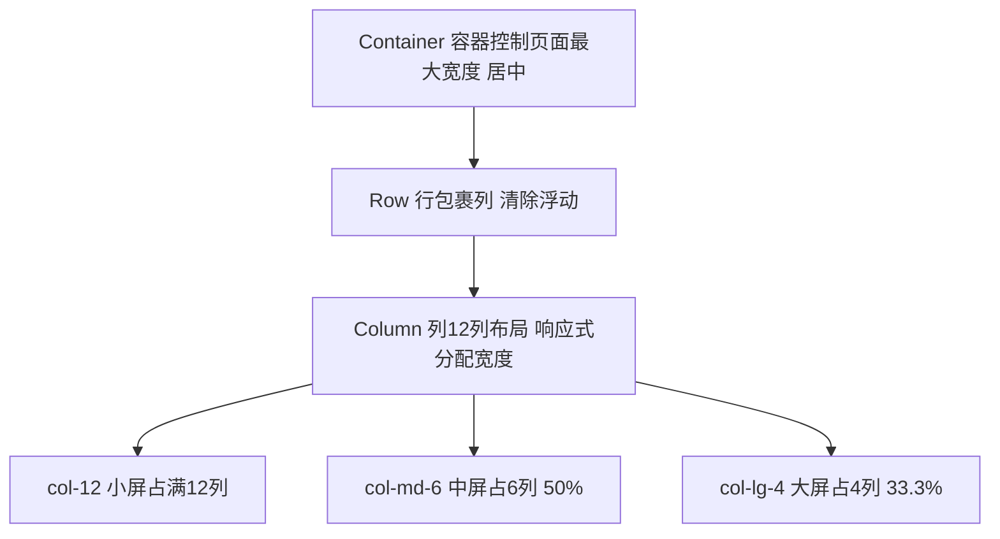

## 一、核心基础：快速开始

### 1.1 版本选择与引入

推荐使用 **Bootstrap 5.x**，相比4.x版本更轻量、原生支持ES6+，不再依赖jQuery。

#### 最简引入方式（CDN）

直接在HTML文件中引入，无需本地安装，适合快速原型开发：

```html
<!DOCTYPE html>
<html lang="zh-CN">
<head>
  <meta charset="UTF-8">
  <meta name="viewport" content="width=device-width, initial-scale=1.0">
  <title>Bootstrap快速入门</title>
  <!-- 引入Bootstrap CSS -->
  <link href="https://cdn.jsdelivr.net/npm/bootstrap@5.3.0/dist/css/bootstrap.min.css" rel="stylesheet">
</head>
<body>
  <!-- 页面内容 -->

  <!-- 引入Bootstrap JS（包含Popper.js，用于下拉、模态框等交互） -->
  <script src="https://cdn.jsdelivr.net/npm/bootstrap@5.3.0/dist/js/bootstrap.bundle.min.js"></script>
</body>
</html>
```

### 1.2 核心设计理念

Bootstrap的一切基于「**移动优先（Mobile First）**」的响应式设计，默认先适配小屏幕，再通过断点逐步适配大屏幕。

## 二、栅格系统（Grid System）：Bootstrap的核心灵魂

栅格系统是Bootstrap的布局核心，通过「**容器（Container）→ 行（Row）→ 列（Column）**」三层结构，将页面宽度划分为**12等份**，实现任意比例的响应式布局。

### 2.1 三层结构可视化


### 2.2 核心概念详解

#### 1. 容器（Container）

布局的最外层，控制页面的最大宽度和居中对齐，分为两类：

- `container`：**固定宽度容器**，在不同断点下有固定最大宽度，内容居中（最常用）

- `container-fluid`：**全屏宽度容器**，宽度始终为100%，适合通栏布局

#### 2. 行（Row）

必须包裹在容器内，直接子元素只能是列（`col-*`），作用是清除浮动、管理列的水平间距。

#### 3. 列（Column）

通过类名`col-{断点}-{列数}`定义，核心规则：

- 一行的列数总和**必须≤12**，超过会自动换行

- 省略断点时（如`col-6`），默认从最小屏幕（xs）生效，且向上覆盖

- 仅写`col`时，列会自动平均分配剩余宽度

### 2.3 响应式断点

Bootstrap 5定义了6个响应式断点，覆盖从手机到超大屏显示器：

|断点缩写|屏幕宽度范围|设备类型|常用场景|
|---|---|---|---|
|（无，默认xs）|<576px|竖屏手机|基础布局|
|`sm`|≥576px|横屏手机|小屏调整|
|`md`|≥768px|平板|主流适配（最常用）|
|`lg`|≥992px|小屏笔记本|大屏优化|
|`xl`|≥1200px|桌面显示器|精细调整|
|`xxl`|≥1400px|超大屏显示器|极端场景|
### 2.4 栅格高频用法示例

#### 1. 基础响应式布局

```html

<div class="container">
  <div class="row">
    <!-- 小屏占12列（满行），中屏占6列（50%），大屏占4列（33.3%） -->
    <div class="col-12 col-md-6 col-lg-4">内容1</div>
    <div class="col-12 col-md-6 col-lg-4">内容2</div>
    <div class="col-12 col-md-12 col-lg-4">内容3</div>
  </div>
</div>
```

#### 2. 列的偏移与排序

- `offset-{断点}-{列数}`：列向右偏移指定列数

- `order-{断点}-{序号}`：控制列的显示顺序（序号越小越靠前）

```html

<div class="container">
  <div class="row">
    <!-- 中屏以上：占6列，向右偏移3列（居中） -->
    <div class="col-md-6 offset-md-3">居中内容</div>
  </div>
  <div class="row">
    <!-- 小屏顺序2-1，中屏以上顺序1-2 -->
    <div class="col-6 order-2 order-md-1">内容1</div>
    <div class="col-6 order-1 order-md-2">内容2</div>
  </div>
</div>
```

## 三、工具类（Utility Classes）：减少90%自定义CSS的利器

Bootstrap提供了大量**原子化工具类**，无需手写CSS即可快速调整间距、颜色、显示、文本等，是开发中最高频的功能。

### 3.1 间距工具类（Margin/Padding）

通过类名`{属性}{方向}-{断点}-{尺寸}`快速设置间距，是最常用的工具类。

#### 命名规则

- **属性**：`m`（Margin，外边距）、`p`（Padding，内边距）

- **方向**：`t`（上）、`b`（下）、`l`（左）、`r`（右）、`x`（左右）、`y`（上下）、（空，四个方向）

- **尺寸**：`0`（0）、`1`（0.25rem）、`2`（0.5rem）、`3`（1rem）、`4`（1.5rem）、`5`（3rem）、`auto`（自动，常用于水平居中）

#### 示例

```html

<div class="mt-3 mb-5">上下外边距</div>
<div class="px-4 py-2">左右内边距4，上下内边距2</div>
<div class="mx-auto" style="width: 200px;">水平居中</div>
<!-- 响应式间距：小屏mt-2，中屏以上mt-5 -->
<div class="mt-2 mt-md-5">响应式外边距</div>
```

### 3.2 显示与隐藏工具类

通过`d-{断点}-{值}`控制元素的显示状态，实现响应式显示/隐藏。

#### 核心取值

- `d-none`：隐藏

- `d-block`/`d-inline`/`d-inline-block`：显示为块级/行内/行内块元素

- `d-flex`：显示为Flex容器（配合Flex工具类使用，布局神器）

#### 示例

```html

<!-- 仅在小屏显示，中屏以上隐藏 -->
<div class="d-block d-md-none">仅手机可见</div>
<!-- 仅在中屏以上显示，小屏隐藏 -->
<div class="d-none d-md-block">平板及以上可见</div>
```

### 3.3 文本与颜色工具类

#### 文本工具类

- 对齐：`text-start`（左）、`text-center`（中）、`text-end`（右）

- 粗细：`fw-bold`（粗）、`fw-normal`（正常）、`fw-light`（细）

- 换行：`text-wrap`（换行）、`text-nowrap`（不换行）

- 大小写：`text-uppercase`（大写）、`text-lowercase`（小写）、`text-capitalize`（首字母大写）

#### 颜色工具类

Bootstrap定义了6种语义化颜色，可用于文本和背景：

- `primary`（主色，蓝）、`secondary`（次要，灰）、`success`（成功，绿）

- `danger`（危险，红）、`warning`（警告，黄）、`info`（信息，青）

示例：

```html

<p class="text-center text-primary fw-bold">居中、蓝色、粗体文本</p>
<div class="bg-success text-white p-3">绿色背景、白色文本、内边距3</div>
```

### 3.4 边框与圆角工具类

- 边框：`border`（全边框）、`border-0`（无边框）、`border-primary`（主色边框）

- 圆角：`rounded`（默认圆角）、`rounded-0`（无圆角）、`rounded-circle`（圆形）、`rounded-pill`（胶囊形）

## 四、高频常用组件：拿来即用的UI模块

Bootstrap预制了大量美观的交互组件，只需复制HTML结构即可使用，无需手写复杂的CSS和JS。

### 4.1 导航栏（Navbar）：页面头部核心

最常用的组件之一，支持响应式折叠、品牌logo、导航链接、下拉菜单等。

#### 核心代码示例

```html

<nav class="navbar navbar-expand-md navbar-light bg-light">
  <div class="container">
    <!-- 品牌Logo/名称 -->
    <a class="navbar-brand" href="#">我的网站</a>
    <!-- 折叠按钮（小屏显示） -->
    <button class="navbar-toggler" type="button" data-bs-toggle="collapse" data-bs-target="#navbarNav">
      <span class="navbar-toggler-icon"></span>
    </button>
    <!-- 导航内容（可折叠） -->
    <div class="collapse navbar-collapse" id="navbarNav">
      <ul class="navbar-nav ms-auto">
        <li class="nav-item">
          <a class="nav-link active" aria-current="page" href="#">首页</a>
        </li>
        <li class="nav-item">
          <a class="nav-link" href="#">关于</a>
        </li>
        <!-- 下拉菜单 -->
        <li class="nav-item dropdown">
          <a class="nav-link dropdown-toggle" href="#" role="button" data-bs-toggle="dropdown">更多</a>
          <ul class="dropdown-menu">
            <li><a class="dropdown-item" href="#">服务</a></li>
            <li><a class="dropdown-item" href="#">联系</a></li>
          </ul>
        </li>
      </ul>
    </div>
  </div>
</nav>
```

核心类名说明：`navbar-expand-md`（中屏以上展开，小屏折叠）、`ms-auto`（导航项右对齐）、`data-bs-*`（Bootstrap 5的交互属性，替代4.x的`data-*`）。

### 4.2 按钮（Buttons）：交互核心

支持多种样式、尺寸、状态，可作为按钮、链接、表单提交使用。

#### 核心用法

```html

<!-- 语义化按钮 -->
<button class="btn btn-primary">主按钮</button>
<button class="btn btn-success">成功按钮</button>
<button class="btn btn-danger">危险按钮</button>
<!-- 轮廓按钮（透明背景，仅边框） -->
<button class="btn btn-outline-primary">轮廓主按钮</button>
<!-- 尺寸 -->
<button class="btn btn-primary btn-lg">大按钮</button>
<button class="btn btn-primary btn-sm">小按钮</button>
<!-- 禁用状态 -->
<button class="btn btn-primary" disabled>禁用按钮</button>
<!-- 按钮组 -->
<div class="btn-group" role="group">
  <button class="btn btn-secondary">左</button>
  <button class="btn btn-secondary">中</button>
  <button class="btn btn-secondary">右</button>
</div>
```

### 4.3 卡片（Cards）：内容展示神器

用于展示文章、产品、用户信息等，是最灵活的组件之一，支持图片、标题、文本、按钮的任意组合。

#### 核心代码示例

```html

<div class="card" style="width: 18rem;">
  
  <div class="card-body">
    <h5 class="card-title">卡片标题</h5>
    <p class="card-text">卡片内容描述，简洁说明卡片的核心信息。</p>
    <a href="#" class="btn btn-primary">了解更多</a>
  </div>
  <!-- 卡片底部 -->
  <div class="card-footer text-muted">2024-01-01</div>
</div>
```

### 4.4 表单（Forms）：快速搭建美观表单

Bootstrap对原生表单元素进行了美化，支持栅格布局、验证状态等。

#### 核心代码示例

```html

<div class="container">
  <form>
    <!-- 文本输入框 -->
    <div class="mb-3">
      <label for="username" class="form-label">用户名</label>
      <input type="text" class="form-control" id="username" placeholder="请输入用户名">
    </div>
    <!-- 密码输入框 -->
    <div class="mb-3">
      <label for="password" class="form-label">密码</label>
      <input type="password" class="form-control" id="password" placeholder="请输入密码">
    </div>
    <!-- 下拉选择框 -->
    <div class="mb-3">
      <label for="city" class="form-label">城市</label>
      <select class="form-select" id="city">
        <option selected>请选择</option>
        <option value="1">苏州</option>
        <option value="2">杭州</option>
      </select>
    </div>
    <!-- 复选框 -->
    <div class="form-check mb-3">
      <input type="checkbox" class="form-check-input" id="agree">
      <label class="form-check-label" for="agree">我已阅读并同意协议</label>
    </div>
    <!-- 提交按钮 -->
    <button type="submit" class="btn btn-primary">提交</button>
  </form>
</div>
```

核心类名：`form-control`（美化输入框）、`form-select`（美化下拉框）、`form-check`（美化复选框/单选框）、`mb-3`（底部间距，分隔表单项）。

### 4.5 模态框（Modal）：弹窗交互核心

用于展示详情、确认操作、表单等，无需跳转页面即可完成交互。

#### 核心代码示例

```html

<!-- 触发按钮 -->
<button type="button" class="btn btn-primary" data-bs-toggle="modal" data-bs-target="#exampleModal">
  打开模态框
</button>

<!-- 模态框 -->
<div class="modal fade" id="exampleModal" tabindex="-1">
  <div class="modal-dialog">
    <div class="modal-content">
      <!-- 模态框头部 -->
      <div class="modal-header">
        <h5 class="modal-title">模态框标题</h5>
        <button type="button" class="btn-close" data-bs-dismiss="modal"></button>
      </div>
      <!-- 模态框内容 -->
      <div class="modal-body">
        模态框的核心内容，可以是文本、表单、图片等。
      </div>
      <!-- 模态框底部 -->
      <div class="modal-footer">
        <button type="button" class="btn btn-secondary" data-bs-dismiss="modal">关闭</button>
        <button type="button" class="btn btn-primary">保存</button>
      </div>
    </div>
  </div>
</div>
```

## 五、最佳实践与高频避坑

### 5.1 最佳实践

1. **优先使用工具类**：能用工具类实现的效果，绝不手写自定义CSS，减少代码量和维护成本

2. **合理嵌套栅格**：栅格最多嵌套2-3层，过度嵌套会导致代码冗余和性能问题

3. **移动优先开发**：先写小屏布局，再通过断点逐步适配大屏幕，符合Bootstrap的设计理念

4. **组件复用**：将常用组件（如导航栏、页脚）封装为模板，减少重复代码

5. **自定义主题**：通过修改Bootstrap的CSS变量（如`--bs-primary`）快速定制主题颜色，无需覆盖大量样式

### 5.2 高频避坑指南

1. **版本属性混淆**：Bootstrap 5的交互属性是`data-bs-*`（如`data-bs-toggle`），4.x是`data-*`，混用会导致交互失效

2. **栅格结构错误**：Row的直接子元素必须是Col，不能直接放内容；Col必须包裹在Row内

3. **容器嵌套错误**：不要在`container`内再嵌套`container`，会导致宽度计算异常

4. **过度依赖组件**：Bootstrap组件是通用型的，复杂场景下需结合自定义CSS调整，不要强行堆砌类名

5. **忽略无障碍**：给图片加`alt`、表单控件加`label`、交互元素加`aria-*`属性，提升可访问性

## 结尾

Bootstrap的核心价值在于「**快速落地**」，通过栅格系统、工具类和预制组件，能让你在短时间内搭建出专业级的响应式网页。

本文汇总了Bootstrap 99%开发场景下的核心知识点，建议结合官方文档一起使用，先从复制组件开始，再逐步掌握栅格和工具类的灵活运用，在实战中积累经验，最终形成自己的开发节奏。