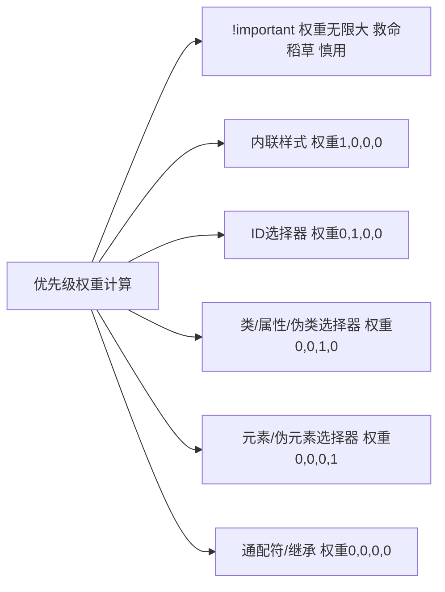
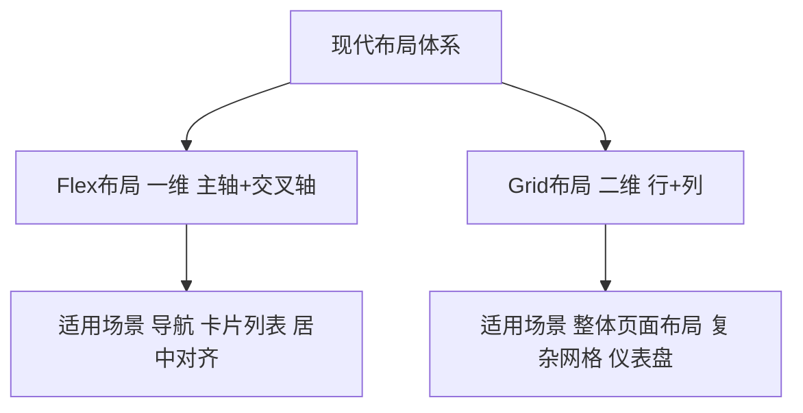

## 一、核心基石：层叠、优先级与引入方式

CSS的“Cascading（层叠）”是其灵魂，理解层叠规则是避免样式冲突的核心。

### 1.1 样式引入的“工程化思维”

三种引入方式对应不同场景，核心原则是**结构与样式分离**：

- **内联样式**：`style="color: red"`，仅用于临时调试或极个别特殊场景（破坏分离，不推荐）

- **内部样式表**：`<style>`标签写在`<head>`内，适合单页面小项目

- **外部样式表**：`<link rel="stylesheet" href="style.css">`，**最佳实践**，实现样式复用与缓存，符合工程化思想

### 1.2 层叠优先级：“计算规则胜过感觉”

样式冲突时，通过**特异性（Specificity）** 计算优先级，无需死记硬背，用“四位数权重法”即可快速判断：


**核心避坑思想**：

- 禁止滥用`!important`，它会破坏层叠规则，导致后续维护噩梦（如同代码中的“全局变量污染”）

- 优先用**类选择器**控制样式，保持权重扁平，避免`div ul li a`这种过度嵌套的选择器（低耦合思想）

## 二、布局思维：从“堆砌”到“系统设计”

布局是CSS的核心难点，现代布局已从“浮动+定位”的“hack时代”，进入**Flex（一维）+ Grid（二维）** 的“系统时代”。

### 2.1 布局的“黄金搭档”：Flex + Grid


#### Flex布局：“一维布局的瑞士军刀”

核心是“**容器+项目**”，通过容器属性控制项目排列：

- **容器属性**：

    - `display: flex`：开启Flex布局

    - `flex-direction`：主轴方向（`row`水平/`column`垂直）

    - `justify-content`：主轴对齐（`center`居中/`space-between`两端对齐/`space-around`均匀分布）

    - `align-items`：交叉轴对齐（`center`居中/`stretch`拉伸）

- **项目属性**：

    - `flex: 1`：项目自动填充剩余空间（经典“圣杯布局”核心）

**实战场景：垂直居中（再也不用定位+transform了）**

```css

/* 父容器 */
.container {
  display: flex;
  justify-content: center; /* 水平居中 */
  align-items: center; /* 垂直居中 */
  height: 100vh; /* 视口高度，让容器占满全屏 */
}
```

#### Grid布局：“二维布局的王者”

核心是“**划格子**”，将页面划分为行和列，精准控制元素位置：

- **容器属性**：

    - `display: grid`：开启Grid布局

    - `grid-template-columns: repeat(3, 1fr)`：划分3列，每列等宽（`fr`是Grid专用单位，代表“剩余空间比例”）

    - `grid-template-rows: auto 1fr auto`：划分3行，中间行自动填充

    - `gap: 20px`：网格间距（替代margin，避免塌陷问题）

- **项目属性**：

    - `grid-column: 1 / 3`：项目从第1列线到第3列线（跨2列）

**实战场景：经典圣杯布局（头部+侧边栏+内容+底部）**

```css
.layout {
  display: grid;
  grid-template-rows: auto 1fr auto; /* 头、内容、底 */
  grid-template-columns: 200px 1fr; /* 侧边栏、内容 */
  gap: 20px;
  height: 100vh;
}
.header { grid-column: 1 / -1; } /* 跨所有列 */
.sidebar { grid-column: 1 / 2; }
.content { grid-column: 2 / 3; }
.footer { grid-column: 1 / -1; }
```

### 2.2 盒模型：“布局的省心丸”

`box-sizing`是布局的基石，两种模式体现“约定优于配置”思想：

- `content-box`（默认）：宽高仅包含内容，padding/border会撑大元素（需手动计算，反人类）

- `border-box`（推荐）：宽高包含内容+padding+border，元素尺寸不会被撑大（布局首选）

**全局设置，一劳永逸**：

```css

*, *::before, *::after {
  box-sizing: border-box; /* 所有元素统一用border-box */
}
```

### 2.3 BFC：“解决margin塌陷的秘密武器”

BFC（Block Formatting Context，块级格式化上下文）是一个独立的渲染区域，内部元素不会影响外部。

- **触发BFC的常用方式**：`overflow: hidden`、`display: flex/grid`、`position: absolute/fixed`

- **核心用途**：解决margin塌陷、清除浮动、阻止元素被浮动覆盖

## 三、选择器哲学：“语义化+效率”的平衡

选择器不仅是“选元素”，更是“表达语义”，优秀的选择器像代码注释一样清晰。

### 3.1 高频实用选择器

|选择器类型|示例|核心用途|编程思想|
|---|---|---|---|
|**伪类选择器**|`:hover`、`:focus`、`:nth-child(odd)`|交互状态、列表奇偶行|状态驱动样式|
|**伪元素选择器**|`::before`、`::after`|插入装饰性内容（无需额外HTML）|结构与样式分离|
|**属性选择器**|`input[type="text"]`、`a[href^="https"]`|按属性筛选元素|精准匹配|
|**相邻兄弟选择器**|`.item + .item`|选中前一个元素后的同级元素|列表间距优化|
### 3.2 创意用法：伪元素的“魔法”

`::before`和`::after`可以在不增加HTML标签的情况下，实现装饰、图标、提示框等，体现“**用CSS解决CSS问题**”的思想。

**实战：纯CSS实现 tooltip 提示框**

```html

<button class="tooltip-btn" data-tooltip="点击复制">复制</button>
```

```css

.tooltip-btn {
  position: relative;
}
/* 提示框主体 */
.tooltip-btn::after {
  content: attr(data-tooltip); /* 读取HTML的data属性作为内容 */
  position: absolute;
  bottom: 120%;
  left: 50%;
  transform: translateX(-50%);
  background: #333;
  color: #fff;
  padding: 4px 8px;
  border-radius: 4px;
  font-size: 12px;
  opacity: 0;
  transition: opacity 0.3s;
  pointer-events: none; /* 让鼠标穿透提示框 */
}
/* 鼠标悬浮显示 */
.tooltip-btn:hover::after {
  opacity: 1;
}
```

## 四、响应式设计：“移动优先+渐进增强”

响应式的核心不是“适配所有屏幕”，而是“**在不同设备上提供合适的体验**”，遵循“移动优先（Mobile First）”思想。

### 4.1 响应式单位：从“固定”到“流动”

- `rem`：基于根元素`html`的字体大小（默认16px），适合全局缩放（如`html { font-size: 62.5%; }`，则1rem=10px，方便计算）

- `vw/vh`：视口宽度/高度的1%，适合全屏元素（如`height: 100vh`）

- `%`：相对于父元素的比例，适合流体布局

### 4.2 媒体查询：“断点设计”

媒体查询是响应式的核心，通过`@media`根据屏幕宽度应用不同样式，**移动优先用** **`min-width`**（从小屏到大屏渐进增强）。

**经典断点设计**：

```css

/* 基础样式：小屏（手机）默认样式 */
.container { padding: 10px; }

/* 中屏（平板≥768px） */
@media (min-width: 768px) {
  .container { padding: 20px; }
}

/* 大屏（桌面≥992px） */
@media (min-width: 992px) {
  .container { 
    padding: 30px; 
    max-width: 1200px;
    margin: 0 auto;
  }
}
```

## 五、动画与交互：“性能优先+体验加分”

CSS动画是提升用户体验的利器，但需遵循“**性能优先**”原则，避免触发重排（Reflow）和重绘（Repaint）。

### 5.1 性能友好的动画属性

- **推荐用**：`transform`（位移、旋转、缩放）、`opacity`（透明度）—— 这两个属性由GPU渲染，不触发重排重绘

- **避免用**：`top`、`left`、`width`、`height`—— 会触发重排，性能差

### 5.2 高频动画技巧

#### 1. Transition（过渡：简单状态变化）

用于元素从一个状态到另一个状态的平滑过渡，比如悬浮效果：

```css

.btn {
  background: #007bff;
  transition: all 0.3s ease; /* 所有属性变化，0.3秒，缓动效果 */
}
.btn:hover {
  background: #0056b3;
  transform: translateY(-2px); /* 向上移动2px，增加悬浮感 */
}
```

#### 2. Animation（关键帧：复杂动画）

用于自定义多阶段动画，通过`@keyframes`定义关键帧：

```css

/* 定义关键帧：从下往上淡入 */
@keyframes fadeInUp {
  from {
    opacity: 0;
    transform: translateY(30px);
  }
  to {
    opacity: 1;
    transform: translateY(0);
  }
}
/* 应用动画 */
.element {
  animation: fadeInUp 0.6s ease forwards; /* forwards保持动画结束状态 */
}
```

## 六、最佳实践与创意思想

### 6.1 工程化思想：DRY与CSS变量

DRY（Don't Repeat Yourself）是编程核心思想，CSS变量（Custom Properties）是实现DRY的利器：

```css

/* 根元素定义变量（全局） */
:root {
  --primary-color: #007bff; /* 主色 */
  --secondary-color: #6c757d; /* 次要色 */
  --spacing: 16px; /* 基础间距 */
  --border-radius: 8px; /* 圆角 */
}

/* 使用变量 */
.btn {
  background: var(--primary-color);
  padding: var(--spacing);
  border-radius: var(--border-radius);
}

/* 主题切换：修改变量即可 */
.dark-theme {
  --primary-color: #4dabf7;
  --secondary-color: #adb5bd;
}
```

### 6.2 创意技巧：打破常规

CSS不仅能做“常规样式”，还能实现很多创意效果：

- **形状裁剪**：`clip-path: polygon(50% 0%, 100% 50%, 50% 100%, 0% 50%)`—— 裁剪出菱形

- **混合模式**：`mix-blend-mode: multiply`—— 让元素与背景混合，实现滤镜效果

- **玻璃拟态**：`backdrop-filter: blur(10px)`+ 半透明背景 —— 实现毛玻璃效果

## 结尾

CSS的学习不是“背属性”，而是“**建立布局思维、理解设计系统、追求优雅代码**”。从理解层叠规则，到掌握Flex/Grid布局，再到用CSS变量实现工程化，每一步都是从“样式”到“思想”的进阶。

建议你从一个小项目开始，尝试用本文的思想重构代码，比如用Grid做布局、用CSS变量定义主题、用伪元素做装饰，在实践中体会CSS的魅力。