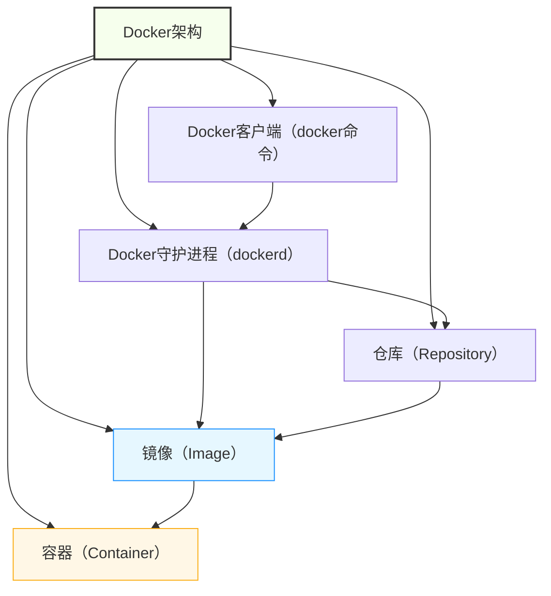
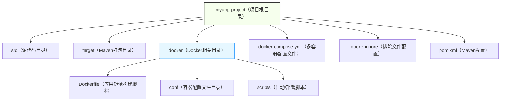

## 一、Docker开发核心定位与必备认知

开发者接触Docker，核心不是“会装Docker”，而是“会用Docker封装应用、规范部署、解决环境问题”，先明确核心认知，避免走弯路。

### 1. 核心定位（开发者视角）

✅ 环境标准化：将应用及依赖（JDK、MySQL、配置文件）打包成容器，实现“一次构建、到处运行”；

✅ 开发效率提升：快速搭建开发环境，避免手动配置依赖、解决版本冲突，节省环境搭建时间；

✅ 隔离与可移植：容器间相互隔离，不影响宿主系统，可轻松迁移到开发、测试、生产等不同环境；

✅ 微服务适配：为微服务架构提供轻量化部署载体，每个微服务独立打包、独立运行，便于迭代和维护。

### 2. 必备基础认知（无需深入底层，够用即可）

- ✅ 核心概念（一句话理清，拒绝复杂）：
  
- **镜像（Image）**：应用的“模板”，包含应用及所有依赖（如JDK镜像、MySQL镜像），只读不可修改；

- **容器（Container）**：镜像的“运行实例”，可启动、停止、删除，是应用实际运行的载体；
  
- **仓库（Repository）**：存储镜像的地方（如Docker Hub、私有仓库），类似“代码仓库”；
  
- **Dockerfile**：构建镜像的“脚本”，定义镜像的构建步骤（核心，开发必写）；
        

-**docker-compose**：批量管理多容器的工具（如同时启动MySQL、Redis、应用服务）。
      

- ✅ 核心关系：**镜像 → 容器**（镜像启动后成为容器）、**Dockerfile → 镜像**（通过Dockerfile构建镜像）；

- ✅ 常用仓库：Docker Hub（官方公共仓库，包含常用镜像）、私有仓库（企业内部使用，存放自定义镜像）；

- ✅ 核心思想：**封装隔离**（应用与依赖、应用与应用之间隔离）、**标准化交付**（统一环境，避免环境不一致）。

### 3. Docker核心架构（极简理解）



极简说明：开发者通过Docker客户端（docker命令）发送指令，Docker守护进程执行指令（构建镜像、启动容器等），从仓库拉取镜像，基于镜像启动容器，完成应用部署。

## 二、Docker开发高频知识点（实战必记，直接套用）

聚焦“开发常用”，剔除运维冷门操作，每个知识点搭配“命令+场景+技巧”，拒绝死记硬背，兼顾实用性和高效性，重点突破Dockerfile和docker-compose（开发核心）。

### （一）核心命令（开发高频，每天必用）

按“镜像操作→容器操作→仓库操作”分类，重点记常用命令，避免冗余，搭配实战场景。

|命令分类|核心命令|核心功能|实战场景|开发技巧|
|---|---|---|---|---|
|镜像操作|**docker pull**|从仓库拉取镜像|获取JDK、MySQL等基础镜像|docker pull java:8（拉取JDK8镜像，指定版本，避免默认最新版）|
||**docker build**|通过Dockerfile构建镜像|打包自己的应用为镜像|docker build -t myapp:v1.0 .（-t指定镜像名和版本，.指定Dockerfile所在目录）|
||**docker images**|查看本地所有镜像|确认镜像是否构建/拉取成功|docker images | grep myapp（过滤查看指定镜像）|
||**docker rmi**|删除本地镜像|删除无用镜像，释放磁盘空间|docker rmi 镜像ID/镜像名:版本（先删除依赖该镜像的容器，再删除镜像）|
|容器操作|**docker run**|启动容器（核心命令）|运行应用容器、基础服务容器|docker run -d -p 8080:8080 --name myapp myapp:v1.0（-d后台运行，-p端口映射，--name指定容器名）|
||**docker ps**|查看运行中的容器|确认容器是否启动成功|docker ps -a（查看所有容器，包括停止的）|
||**docker stop/start/restart**|停止/启动/重启容器|重启应用、停止无用容器|docker stop 容器ID/容器名（停止容器，重启用restart）|
||**docker rm**|删除容器|删除停止的无用容器|docker rm -f 容器ID/容器名（-f强制删除运行中的容器，慎用）|
||**docker logs**|查看容器日志|调试应用，排查容器启动失败原因|docker logs -f 容器ID/容器名（-f实时查看日志，开发调试必用）|
||**docker exec**|进入容器内部|查看容器内文件、执行命令|docker exec -it 容器ID/容器名 /bin/bash（-it交互模式，进入容器终端）|
|仓库操作|**docker tag**|给镜像打标签|标记镜像，便于推送到私有仓库|docker tag myapp:v1.0 私有仓库地址/myapp:v1.0|
||**docker push**|将镜像推送到仓库|共享自定义镜像到团队、部署到生产|docker push 私有仓库地址/myapp:v1.0（推送前需登录仓库）|
### （二）Dockerfile编写（开发核心，必掌握）

Dockerfile是构建镜像的“脚本”，核心是“分层构建、精简镜像”，掌握常用指令，就能编写可复用、高效的Dockerfile，直接套用模板即可。

#### 1. 常用指令（干练必记，拒绝冗余）

- **FROM**：指定基础镜像（必须放在第一行，核心指令）；
        

示例：FROM java:8（基于JDK8镜像构建，开发Java应用必用）、FROM centos:7。
      

- **WORKDIR**：指定容器内的工作目录（后续命令在此目录执行）；
        

示例：WORKDIR /app（后续COPY、RUN命令都在/app目录下执行）。
      

- **COPY**：将宿主机文件/目录复制到容器内；
        

示例：COPY target/myapp.jar /app/myapp.jar（将本地打包好的jar包复制到容器/app目录）。
      

- **RUN**：构建镜像时执行的命令（如安装依赖、配置环境）；
        

示例：RUN yum install -y vim（安装vim工具）、RUN chmod 755 /app/myapp.sh。
      

- **EXPOSE**：声明容器对外暴露的端口（仅声明，不映射，便于文档说明）；
        

示例：EXPOSE 8080（声明容器暴露8080端口，启动时需用-p映射）。
      

- **ENTRYPOINT**：指定容器启动时执行的命令（不可被docker run命令覆盖，核心）；
       

示例：ENTRYPOINT ["java", "-jar", "/app/myapp.jar"]（容器启动时运行Java应用）。
      

- **ENV**：设置环境变量（如JDK路径、配置文件路径）；
        

示例：ENV JAVA_HOME=/usr/lib/jvm/java-1.8.0-openjdk。
      

#### 2. 实战Dockerfile模板（直接复制使用，适配Java应用）

```dockerfile
FROM openjdk:8-jdk-alpine
WORKDIR /app
COPY target/myapp.jar /app/myapp.jar
EXPOSE 8080
ENTRYPOINT ["java", "-jar", "myapp.jar"]
```
#### 3. Dockerfile优化技巧（开发创意，精简镜像）

- ✅ 用精简基础镜像（如alpine版本，体积小，如openjdk:8-jdk-alpine比java:8小50%以上）；

- ✅ 合并RUN命令（用&&连接，减少镜像分层，如RUN yum install -y vim && yum clean all）；

- ✅ 避免复制无用文件（通过.dockerignore文件排除target/*、.git等，减少镜像体积）；

- ✅ 多阶段构建（仅保留运行所需文件，删除构建依赖，如Java应用：构建阶段编译代码，运行阶段仅保留jar包）。

### （三）docker-compose（多容器管理，开发必用）

开发中常需同时启动多个容器（如应用+MySQL+Redis），手动启动繁琐，docker-compose可通过配置文件，一键启动、停止所有容器，核心是“yaml配置文件”。

#### 1. 核心配置（docker-compose.yml，直接套用）

```yaml
version: '3'
services:
  myapp:
    build: . # 基于当前目录的Dockerfile构建镜像
    ports:
      - "8080:8080" # 端口映射（宿主机8080 → 容器8080）
    depends_on:
      - mysql # 依赖mysql容器，先启动mysql再启动应用
      - redis # 依赖redis容器
    environment: # 设置环境变量（应用配置）
      - SPRING_DATASOURCE_URL=jdbc:mysql://mysql:3306/test
      - SPRING_DATASOURCE_USERNAME=root
      - SPRING_DATASOURCE_PASSWORD=123456
    restart: always # 容器异常退出时自动重启
  mysql:
    image: mysql:8.0 # 从仓库拉取MySQL8.0镜像
    ports:
      - "3306:3306"
    environment:
      - MYSQL_ROOT_PASSWORD=123456
      - MYSQL_DATABASE=test # 自动创建test数据库
    volumes:
      - mysql-data:/var/lib/mysql # 数据持久化（避免容器删除后数据丢失）
  redis:
    image: redis:6.2
    ports:
      - "6379:6379"
    volumes:
      - redis-data:/var/lib/redis # 数据持久化
volumes:
  mysql-data:
  redis-data:
```
#### 2. docker-compose核心命令（实战高频）

- docker-compose up -d：一键启动所有容器（-d后台运行）；

- docker-compose down：一键停止并删除所有容器、网络（保留数据卷）；

- docker-compose restart：重启所有容器；

- docker-compose logs -f：实时查看所有容器日志；

- docker-compose build：重新构建应用镜像（修改Dockerfile后执行）。

### （四）数据持久化（避坑关键，避免数据丢失）

容器删除后，内部数据会丢失，开发中必须做好数据持久化，核心两种方式，按需选择：

- **数据卷（Volumes，推荐）**：Docker管理的持久化目录，独立于容器，容器删除后数据保留（如上述docker-compose中的mysql-data）；
        

示例：docker run -d -v mysql-data:/var/lib/mysql mysql:8.0（-v指定数据卷）。
      

- **绑定挂载（Bind Mounts）**：将宿主机目录直接挂载到容器内，适合开发调试（如修改本地代码，容器内实时生效）；
        

示例：docker run -d -v /本地目录:/app myapp:v1.0（本地目录与容器/app目录同步）。
      

### （五）镜像仓库使用（团队协作必备）

开发中，自定义镜像需共享给团队成员、部署到生产环境，核心使用私有仓库（企业常用），步骤简洁：

1. 登录私有仓库：docker login 私有仓库地址（输入用户名和密码）；

2. 给镜像打标签：docker tag 镜像名:版本 私有仓库地址/镜像名:版本；

3. 推送镜像：docker push 私有仓库地址/镜像名:版本；

4. 拉取镜像：docker pull 私有仓库地址/镜像名:版本（团队成员、生产环境使用）。

## 三、Docker工程结构化开发（企业级规范，直接落地）

个人开发可以随意编写Dockerfile，但企业级开发必须「**结构化、规范化**」，降低维护成本、提升可扩展性，核心是“目录规范、配置统一、脚本复用”。

### 1. 工程目录结构（Spring Boot项目示例，规范统一）


#### 2. 各目录核心作用（干练说明）

- docker目录：存放所有Docker相关文件，统一管理，避免混乱；

- docker/Dockerfile：应用镜像构建脚本，单独存放，便于维护和修改；

- docker/conf：存放容器所需的配置文件（如application.yml、nginx.conf），通过COPY指令复制到容器；

- docker/scripts：存放启动、部署脚本（如容器启动脚本、镜像推送脚本），实现自动化部署；

- .dockerignore：排除无用文件（如target/*、.git、.idea），减少镜像体积，避免复制冗余文件。

### 3. 工程化开发规范（必遵循，提升可维护性）

- ✅ 命名规范：
- 镜像名：项目名:版本号（如myapp:v1.0、myapp:v1.1），版本号遵循语义化（主版本.次版本.修订号）；
  
- 容器名：项目名-服务名（如myapp-app、myapp-mysql），便于识别；
  
- 数据卷名：项目名-服务名-data（如myapp-mysql-data），避免与其他项目冲突。
  
- ✅ Dockerfile规范：
  
- 开头必须指定基础镜像，优先使用精简镜像（alpine版本）；
  
- 指令按“FROM → WORKDIR → COPY → RUN → EXPOSE → ENTRYPOINT”顺序编写；
  
- 关键指令添加注释，说明作用（如# 复制配置文件到容器）；
  
- 避免在Dockerfile中编写复杂命令，复杂操作放在脚本中。
      

- ✅ docker-compose规范：
  
- 按“应用容器 → 依赖服务容器（MySQL、Redis）”顺序编写；
  
- 明确容器依赖（depends_on），确保启动顺序正确；

- 所有容器配置环境变量（environment），避免硬编码；
  
- 关键服务（MySQL、Redis）必须配置数据持久化。
      

- ✅ 脚本规范：编写自动化脚本（如deploy.sh），实现“构建镜像→推送镜像→启动容器”一键部署，减少手动操作。

### 4. 实战自动化部署脚本（直接复制使用）

```bash
#!/bin/bash
PROJECT_NAME=myapp
VERSION=v1.0
REGISTRY_URL=xxx.xxx.xxx.xxx:8080
echo "开始打包应用..."
mvn clean package -Dmaven.test.skip=true
echo "开始构建Docker镜像..."
docker build -t $PROJECT_NAME:$VERSION -f docker/Dockerfile .
echo "给镜像打标签..."
docker tag $PROJECT_NAME:$VERSION $REGISTRY_URL/$PROJECT_NAME:$VERSION
echo "推送镜像到私有仓库..."
docker push $REGISTRY_URL/$PROJECT_NAME:$VERSION
echo "启动容器..."
docker-compose down
docker-compose up -d
echo "部署完成！"
echo "应用访问地址：http://localhost:8080"
```

## 四、Docker开发编程思想与开发创意（落地为王）

Docker开发的核心是“标准化、自动化、可复用、可扩展”，结合实战场景，分享实用编程思想和开发创意，帮你提升开发效率，避免重复劳动。

### 1. 核心编程思想

- **标准化思想**：所有应用统一用Docker打包，统一环境配置，实现“一次构建、到处运行”，解决环境不一致问题；

- **分层思想**：利用Docker镜像分层特性，复用基础镜像（如JDK镜像），减少镜像构建时间和存储空间；

- **隔离思想**：应用与依赖、应用与应用之间隔离，避免版本冲突、环境污染，提升系统稳定性；

- **自动化思想**：将镜像构建、容器启动、部署等操作脚本化，一键完成，减少手动操作，降低失误率；

- **可复用思想**：编写通用Dockerfile模板、docker-compose模板，适配不同项目，减少重复开发。

### 2. 开发创意（实战优化，可直接落地）

创意1：自定义基础镜像（提升复用性），基于alpine镜像，预安装常用依赖（如JDK、vim、curl），打造团队专属基础镜像，减少每个项目的Dockerfile代码；

创意2：多阶段构建优化镜像（极致精简），如Java应用：第一阶段用maven镜像编译代码，第二阶段用openjdk-alpine镜像仅复制jar包，镜像体积可减少70%；

创意3：Dockerfile参数化（提高灵活性），通过ARG指令传递参数（如镜像版本、应用端口），无需修改Dockerfile，即可构建不同配置的镜像；

创意4：本地开发调试优化（提升效率），用绑定挂载（Bind Mounts）将本地代码目录挂载到容器，修改代码后无需重新构建镜像，实时生效；

创意5：镜像版本管理（可追溯），结合Git提交记录，将镜像版本与Git分支/标签关联（如v1.0对应Git标签v1.0），便于回滚和追溯；

创意6：批量部署多环境（开发/测试/生产），编写多个docker-compose配置文件（docker-compose.dev.yml、docker-compose.prod.yml），一键切换环境部署。

## 五、Docker开发避坑指南（重点，少走弯路）

- ❌ 避坑1：不做数据持久化（容器删除后数据丢失，尤其是MySQL、Redis等服务，必须用数据卷或绑定挂载）；

- ❌ 避坑2：使用最新版镜像（latest标签），镜像更新后可能出现版本冲突，推荐指定具体版本（如java:8、mysql:8.0）；

- ❌ 避坑3：Dockerfile中复制无用文件（未使用.dockerignore，导致镜像体积过大，部署缓慢）；

- ❌ 避坑4：启动容器时不映射端口（容器内服务无法被宿主机访问，需用-p参数映射端口）；

- ❌ 避坑5：忽视容器依赖顺序（如应用容器先于MySQL启动，导致应用连接MySQL失败，需用depends_on指定依赖）；

- ❌ 避坑6：镜像体积过大（未使用精简基础镜像、未合并RUN命令、未做多阶段构建）；

- ❌ 避坑7：直接在容器内修改配置文件（容器重启后修改失效，应通过挂载配置文件，修改宿主机文件即可生效）；

- ✅ 避坑技巧：开发时先在本地测试Dockerfile和docker-compose配置，确认无误后再推送镜像、部署到测试/生产环境；关键操作记录日志，便于问题排查。

## 六、核心总结（干练收尾，必记重点）

1. 核心定位：Docker是“环境标准化、部署自动化”的工具，核心解决环境不一致、部署繁琐的问题，是后端开发、微服务的必备技能；

2. 知识点重点：核心命令（镜像+容器+仓库）、Dockerfile编写、docker-compose配置、数据持久化，这4点是开发必用，无需深入底层；

3. 工程化关键：目录规范、命名规范、配置统一、脚本自动化，提升可维护性和团队协作效率；

4. 开发创意：自定义基础镜像、多阶段构建、参数化Dockerfile、本地调试优化，这些技巧能大幅提升开发和部署效率；

5. 避坑核心：做好数据持久化、指定镜像版本、精简镜像、重视容器依赖，这4点能避免80%的Docker开发问题；

6. 学习技巧：无需死记所有命令和指令，重点掌握“场景+命令+模板”，多用、多练，结合实际项目调试，很快就能熟练掌握。

Docker的核心价值是“简单、高效、可移植”，掌握其核心知识点和工程化开发规范，能彻底解决环境不一致的痛点，提升开发和部署效率，让开发者从繁琐的环境配置中解放出来，专注于业务开发。坚持实战，Docker会成为你开发中的“高效助手”，助力微服务架构落地和DevOps实践。