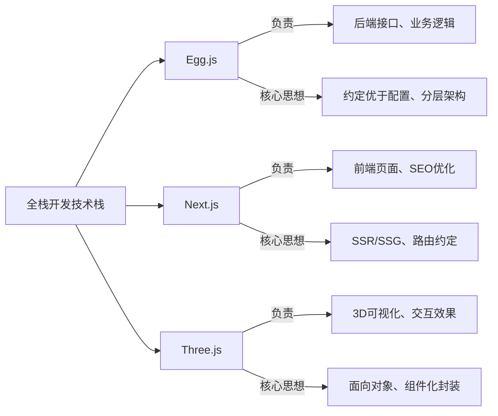
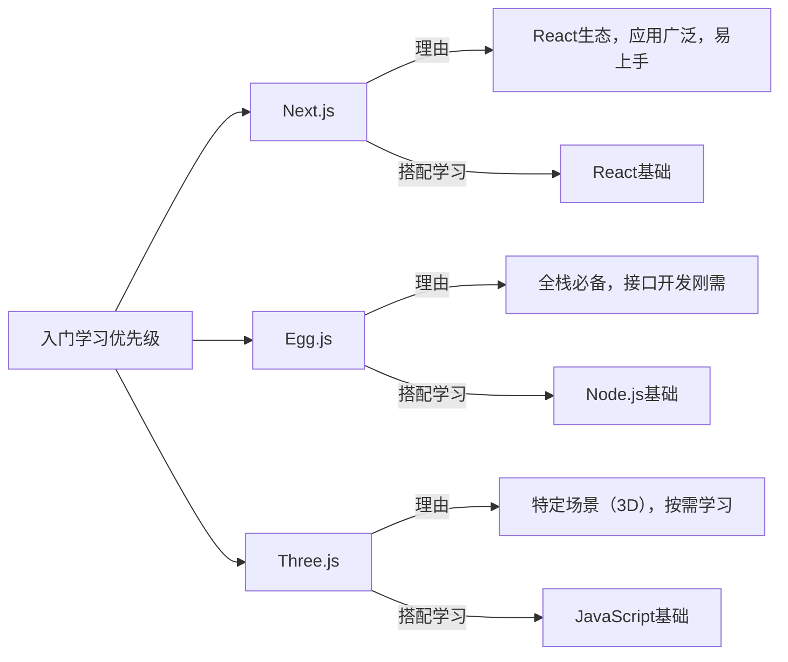

三者不属于同一技术领域，互补性强，先明确定位，避免盲目学习：

|框架|**核心定位**|**核心价值**|**适用场景**|
|---|---|---|---|
|Egg.js|Node.js 后端开发框架|规范后端开发，提升接口开发效率|全栈项目后端、Node.js接口开发|
|Next.js|React 前端框架（支持SSR/SSG）|优化SEO，提升页面加载速度|React项目、官网、博客、中后台|
|Three.js|Web 3D可视化框架|快速实现浏览器3D效果，无需原生WebGL|3D展示、可视化项目、元宇宙相关|
**Mermaid 三大框架定位图解**：



**核心选型思想**：做全栈开发→学Egg.js+Next.js；做3D可视化→学Three.js；做React官网/博客→优先Next.js（解决SEO痛点）。

---

每个框架仅讲「安装+最简示例+核心要点」，示例可直接复制运行，聚焦“入门即能用”。

## 2.1 Egg.js 入门（Node.js后端）

### 2.1.1 核心定位

基于Node.js和Koa的企业级后端框架，核心是**“约定优于配置”**，规范后端开发流程，避免重复造轮子。

### 2.1.2 快速入门（3步上手）

```bash
npm install egg-init -g
egg-init egg-demo --type=simple
cd egg-demo
npm install
npm run dev
```
**最简接口示例**（编写一个GET接口，体现分层思想）：

```javascript
// app/controller/home.js（控制器：接收请求、返回响应）
const { Controller } = require('egg');
class HomeController extends Controller {
  async index() {
    const { ctx } = this;
    // 接收请求参数
    const { name } = ctx.query;
    // 调用服务层逻辑（分层思想：控制器不写业务逻辑）
    const result = await this.service.home.sayHello(name);
    // 返回响应
    ctx.body = result;
  }
}
module.exports = HomeController;

// app/service/home.js（服务层：处理业务逻辑）
const { Service } = require('egg');
class HomeService extends Service {
  async sayHello(name) {
    // 业务逻辑：简单拼接字符串
    return `Hello, ${name || 'Egg.js'}`;
  }
}
module.exports = HomeService;

// app/router.js（路由：映射请求地址）
module.exports = app => {
  const { router, controller } = app;
  // 请求地址 /api/hello 映射到 home控制器的 index方法
  router.get('/api/hello', controller.home.index);
};
```

启动后访问 `http://localhost:7001/api/hello?name=test`，即可看到返回结果，核心是「路由→控制器→服务层」的分层架构。

### 2.1.3 核心编程思想

- **分层思想**：路由（Router）→控制器（Controller）→服务层（Service）→数据层（Model），各司其职，可维护性强（体现单一职责原则）；

- **约定优于配置**：无需手动配置大量参数，框架约定好目录结构（如controller、service目录），直接遵循约定开发即可；

- **依赖注入**：通过 `this.ctx`、`this.service` 自动获取实例，无需手动new，降低耦合。

### 2.1.4 开发创意（入门可用）

封装**统一响应拦截**，避免重复编写响应格式（体现DRY原则）：

```javascript
// app/middleware/response.js（中间件：统一响应格式）
module.exports = () => {
  return async (ctx, next) => {
    await next();
    // 统一响应格式
    if (ctx.body) {
      ctx.body = {
        code: 200,
        message: 'success',
        data: ctx.body
      };
    } else {
      ctx.body = {
        code: 200,
        message: 'success',
        data: null
      };
    }
  };
};

// config/config.default.js（配置中间件）
config.middleware = ['response'];
```

## 2.2 Next.js 入门（React前端框架）

### 2.2.1 核心定位

基于React的前端框架，核心优势是**SSR（服务端渲染）**和**SSG（静态站点生成）**，解决React单页应用（SPA）SEO差、首屏加载慢的痛点。

### 2.2.2 快速入门（3步上手）

```bash
npx create-next-app@latest next-demo
cd next-demo
npm run dev
```
**最简页面与路由示例**（Next.js 路由约定：pages目录下的文件即路由）：

```jsx
// app/page.js（首页，路由：/）
export default function Home() {
  return (
    <div style={{ textAlign: 'center', marginTop: '50px' }}>
      <h1>Next.js 入门示例</h1>
      <p>路由约定：app目录下的文件对应路由</p>
    </div>
  );
}

// app/about/page.js（关于页，路由：/about）
export default function About() {
  return <h1 style={{ textAlign: 'center', marginTop: '50px' }}>关于我们</h1>;
}
```

启动后访问 `http://localhost:3000` 看首页，`http://localhost:3000/about` 看关于页，核心是「文件路由约定」，无需手动配置路由。

### 2.2.3 核心编程思想

- **路由约定优于配置**：通过目录结构自动生成路由，减少路由配置成本，提升开发效率；

- **SSR/SSG 思想**：服务端渲染（SSR）提升首屏加载速度和SEO；静态站点生成（SSG）预渲染页面，适合静态内容（如博客、官网）；

- **组件化复用**：复用React组件化思想，封装通用组件，减少重复代码。

### 2.2.4 开发创意（入门可用）

封装**全局布局组件**，统一页面样式（体现组件化思想）：

```jsx
// app/layout.js（全局布局，所有页面都会继承）
export default function RootLayout({ children }) {
  return (
    <html lang="zh-CN">
      <body style={{ margin: 0, padding: 0, fontFamily: 'sans-serif' }}>
        {/* 公共导航栏 */}
        <nav style={{ padding: '20px', background: '#f5f5f5', borderBottom: '1px solid #eee' }}>
          <a href="/" style={{ marginRight: '20px', textDecoration: 'none', color: '#333' }}>首页</a>
          <a href="/about" style={{ textDecoration: 'none', color: '#333' }}>关于我们</a>
        </nav>
        {/* 页面内容 */}
        {children}
      </body>
    </html>
  );
}
```

## 2.3 Three.js 入门（Web 3D可视化）

### 2.3.1 核心定位

基于WebGL的3D可视化框架，封装了复杂的WebGL API，让开发者无需掌握底层WebGL，即可快速实现浏览器3D效果。

### 2.3.2 快速入门（3步实现简单3D场景）

```bash
npm install three
```
**最简3D场景示例**（渲染一个立方体，体现3D核心要素）：

```javascript
// src/ThreeDemo.jsx（React中使用，Vue中用法类似）
import { useEffect, useRef } from 'react';
import * as THREE from 'three';

export default function ThreeDemo() {
  const containerRef = useRef(null);

  useEffect(() => {
    // 1. 创建场景（Scene：所有3D对象的容器）
    const scene = new THREE.Scene();
    // 2. 创建相机（Camera：决定看到的视角）
    const camera = new THREE.PerspectiveCamera(75, containerRef.current.clientWidth / containerRef.current.clientHeight, 0.1, 1000);
    // 3. 创建渲染器（Renderer：将3D场景渲染到页面）
    const renderer = new THREE.WebGLRenderer();
    renderer.setSize(containerRef.current.clientWidth, containerRef.current.clientHeight);
    containerRef.current.appendChild(renderer.domElement);

    // 4. 创建3D对象（几何体+材质=网格）
    const geometry = new THREE.BoxGeometry(1, 1, 1); // 立方体几何体
    const material = new THREE.MeshBasicMaterial({ color: 0x00ff00, wireframe: true }); // 绿色线框材质
    const cube = new THREE.Mesh(geometry, material); // 网格（几何体+材质）
    scene.add(cube); // 将立方体添加到场景

    // 5. 调整相机位置（否则看不到对象）
    camera.position.z = 5;

    // 6. 渲染循环（让3D场景动起来）
    function animate() {
      requestAnimationFrame(animate);
      cube.rotation.x += 0.01; // 绕x轴旋转
      cube.rotation.y += 0.01; // 绕y轴旋转
      renderer.render(scene, camera); // 渲染场景
    }
    animate();

    // 销毁资源（避免内存泄漏，体现性能优化思想）
    return () => {
      renderer.dispose();
      scene.remove(cube);
    };
  }, []);

  return (
    <div 
      ref={containerRef} 
      style={{ width: '100%', height: '500px', marginTop: '20px' }}
    />
  );
}
```

引入该组件，即可看到一个旋转的绿色立方体，核心是「场景（Scene）+相机（Camera）+渲染器（Renderer）」三大要素。

### 2.3.3 核心编程思想

- **面向对象思想**：Three.js 所有核心对象（Scene、Camera、Mesh等）均为类，通过实例化使用，逻辑清晰；

- **组件化封装**：将3D场景、模型、动画封装为独立组件，便于复用和维护；

- **性能优化思想**：及时销毁无用资源，避免内存泄漏；简化几何体、减少渲染次数，提升3D场景流畅度。

### 2.3.4 开发创意（入门可用）

给3D立方体添加**鼠标交互**（点击立方体切换颜色，体现交互优化思想）：

```javascript
// 在上面的animate函数之前添加
import { Raycaster, Vector2 } from 'three';

// 鼠标交互核心代码
const raycaster = new Raycaster();
const mouse = new Vector2();

// 监听鼠标点击事件
window.addEventListener('click', (event) => {
  // 计算鼠标位置（归一化）
  mouse.x = (event.clientX / window.innerWidth) * 2 - 1;
  mouse.y = -(event.clientY / window.innerHeight) * 2 + 1;
  // 射线检测（判断鼠标是否点击到立方体）
  raycaster.setFromCamera(mouse, camera);
  const intersects = raycaster.intersectObjects(scene.children);
  if (intersects.length > 0) {
    // 点击到立方体，随机切换颜色
    const randomColor = new THREE.Color(Math.random(), Math.random(), Math.random());
    intersects[0].object.material.color = randomColor;
  }
});
```

---

**Mermaid 三大框架学习优先级图解**：




1. **Egg.js**：重点掌握「分层架构」和「约定优于配置」，先实现简单接口，再封装通用中间件；

2. **Next.js**：重点掌握「路由约定」和「SSR/SSG基础」，先搭建页面，再封装全局组件；

3. **Three.js**：重点掌握「三大核心要素」和「简单动画」，先实现基础3D场景，再添加交互效果。

学习建议：先学Next.js（前端）+ Egg.js（后端），掌握全栈基础；有3D需求再学Three.js，循序渐进，避免贪多嚼不烂。