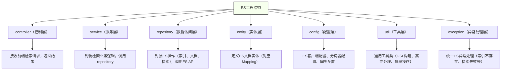

Elasticsearch（简称ES）是**分布式全文搜索引擎**，核心价值是「**高效全文检索、海量数据快速查询**」，弥补了MySQL、MongoDB在全文搜索场景的短板，广泛应用于电商搜索、日志检索、内容检索等场景。本文拒绝冗余，用最干练的方式，汇总ES开发常用知识点、核心API、工程结构化开发规范，搭配实用编程思想和开发创意，全程用MD语法，必要时嵌入规范mermaid图，重点内容高亮凸显，只给能直接落地的有用知识。

## 一、ES核心定位与开发核心职责

先明确ES的核心价值的，避免与MySQL、MongoDB混淆，精准定位其开发职责，这是工程化开发的前提。

### 1. 核心定位（与三大数据库的区别）

✅ MySQL：结构化数据存储+事务一致性（核心是“存”，检索能力弱）；

✅ MongoDB：非结构化数据存储+灵活扩展（核心是“存”，全文检索能力有限）；

✅ Redis：高频数据缓存+快速访问（核心是“缓存”，不适合海量数据检索）；

✅ Elasticsearch：核心是“**检索**”，兼顾海量数据存储，擅长全文搜索、模糊匹配、高亮显示，是搜索场景的首选。

### 2. 开发核心职责

- ✅ 索引设计：根据业务场景设计合理的索引结构（核心，决定检索效率）；

- ✅ 数据同步：实现ES与MySQL/MongoDB的数据同步（保证检索数据的一致性）；

- ✅ 检索实现：编写高效的检索语句（DSL），实现全文搜索、模糊匹配、过滤、排序等需求；

- ✅ 性能优化：优化索引、检索语句、集群配置，提升检索速度和并发能力；

- ✅ 工程化封装：规范ES操作，封装通用工具类、统一异常处理，适配工程化开发。

## 二、ES开发常用知识点（实战高频，必记必用）

重点抓“实战落地”，剔除冷门知识点，聚焦索引设计、核心API、检索语法，拒绝死记硬背，搭配使用技巧。

### （一）核心基础概念（先懂概念，再谈开发）

ES的核心概念与数据库对应关系，一句话理清，避免混淆：

|Elasticsearch|对应数据库（MySQL）|核心说明|
|---|---|---|
|**索引（Index）**|数据库（Database）|存储相似结构的文档集合（如“商品索引”“日志索引”）|
|**类型（Type）**|表（Table）|ES 7.x后已废弃，一个索引对应一种类型，无需单独定义|
|**文档（Document）**|行（Row）|JSON格式，是ES的最小数据单元（如一条商品数据、一条日志）|
|**字段（Field）**|列（Column）|文档中的属性（如商品名称、价格、描述）|
|**映射（Mapping）**|表结构（Schema）|定义文档中每个字段的类型、分词器、是否索引等（核心中的核心）|
### （二）索引设计与Mapping配置（核心重点）

索引设计的好坏，直接决定检索效率和业务适配性，核心是「**合理配置Mapping**」，避免过度索引或索引不足。

#### 1. 高频字段类型（必记）

- **text**：文本类型，支持分词、全文检索（如商品名称、文章内容）；

- **keyword**：关键字类型，不分词，支持精确匹配、排序（如商品ID、标签、状态）；

- **numeric**：数值类型（int、long、double），支持范围查询、排序（如价格、销量）；

- **date**：日期类型，支持范围查询、按时间排序（如创建时间、更新时间）；

- **boolean**：布尔类型，支持精确匹配（如商品是否上架）；

- **array**：数组类型，支持多值匹配（如商品标签、用户爱好）。

#### 2. 分词器（全文检索的核心）

分词器决定文本如何拆分（如“ Elasticsearch实战”拆分为“elasticsearch”“实战”），直接影响检索效果，实战常用2种：

- **IK分词器（推荐）**：中文分词神器，支持细粒度（ik_max_word）和粗粒度（ik_smart）分词；
        
- 细粒度：拆分最细（如“ Elasticsearch实战”拆分为“elasticsearch”“实战”“实”“战”）；
        
- 粗粒度：拆分较粗（如“ Elasticsearch实战”拆分为“elasticsearch”“实战”）。
      

- **standard分词器**：ES默认，中文按单个字拆分（不推荐中文场景使用）。

#### 3. 实战Mapping配置示例（直接复制使用）

```json
// 1. 创建商品索引（goods_index），配置Mapping
PUT /goods_index
{
  "settings": {
    "number_of_shards": 3, // 分片数（分布式部署，推荐3-5个）
    "number_of_replicas": 1, // 副本数（高可用，推荐1个）
    "analysis": {
      "analyzer": {
        "ik_analyzer": { // 自定义IK分词器
          "type": "custom",
          "tokenizer": "ik_max_word", // 细粒度分词
          "filter": ["lowercase"] // 小写转换
        }
      }
    }
  },
  "mappings": {
    "properties": {
      "goodsId": { "type": "keyword" }, // 商品ID，精确匹配，不分词
      "goodsName": { // 商品名称，全文检索
        "type": "text",
        "analyzer": "ik_analyzer", // 使用自定义IK分词器
        "search_analyzer": "ik_analyzer",
        "fields": {
          "keyword": { "type": "keyword" } // 新增keyword子字段，用于排序、精确匹配
        }
      },
      "price": { "type": "double" }, // 价格，范围查询
      "tags": { "type": "keyword" }, // 商品标签，多值精确匹配
      "createTime": { "type": "date", "format": "yyyy-MM-dd HH:mm:ss" }, // 日期
      "description": { "type": "text", "analyzer": "ik_analyzer" }, // 商品描述，全文检索
      "isOnSale": { "type": "boolean" } // 是否上架
    }
  }
}
```

### （三）核心检索语法（DSL，实战高频）

ES检索核心是**DSL（Domain Specific Language）**，JSON格式，实战中重点掌握“全文搜索、过滤、排序、分页”四大场景，以下是高频示例，直接复制使用。

#### 1. 全文搜索（最常用，如商品搜索）

```json
// 搜索商品名称或描述中包含“手机”的商品，高亮显示匹配内容
GET /goods_index/_search
{
  "query": {
    "multi_match": { // 多字段匹配（goodsName和description）
      "query": "手机",
      "fields": ["goodsName^3", "description"], // ^3表示权重（优先级更高）
      "analyzer": "ik_analyzer"
    }
  },
  "highlight": { // 高亮配置
    "fields": {
      "goodsName": {},
      "description": {}
    },
    "pre_tags": ["<em>"], // 高亮前缀
    "post_tags": ["</em>"] // 高亮后缀
  },
  "from": 0, // 分页起始位置（第1页）
  "size": 10 // 每页条数
}
```

#### 2. 条件过滤（如筛选价格、状态）

```json
// 搜索价格在1000-5000元、已上架、标签包含“华为”的商品
GET /goods_index/_search
{
  "query": {
    "bool": { // 布尔查询，组合多个条件
      "must": [ // 必须满足（相当于and）
        {"match": {"goodsName": "华为"}},
        {"range": {"price": {"gte": 1000, "lte": 5000}}} // 价格范围：大于等于1000，小于等于5000
      ],
      "filter": [ // 过滤（不影响评分，性能更高）
        {"term": {"isOnSale": true}}, // 精确匹配：已上架
        {"terms": {"tags": ["华为", "手机"]}} // 多值匹配：标签包含华为或手机
      ]
    }
  },
  "sort": [ // 排序：按价格升序，创建时间降序
    {"price": {"order": "asc"}},
    {"createTime": {"order": "desc"}}
  ]
}
```

#### 3. 核心检索关键词总结（干练好记）

- match：单字段全文搜索（支持分词）；

- multi_match：多字段全文搜索；

- term/terms：精确匹配（keyword类型，不分词）；

- range：范围查询（数值、日期）；

- bool：组合查询（must/should/filter/must_not）；

- highlight：高亮显示匹配内容；

- from/size：分页；sort：排序。

### （四）数据同步（ES与数据库协同，实战必备）

ES的数据多来自MySQL/MongoDB，核心是「**保证数据一致性**」，实战中常用2种同步方式，按需选择：

#### 1. 同步方式对比（干练不冗余）

|同步方式|核心原理|优点|缺点|适用场景|
|---|---|---|---|---|
|**Logstash同步**|通过Logstash的JDBC插件，定时从数据库拉取数据同步到ES|配置简单、无需修改业务代码|有延迟（分钟级）|非实时场景（如日志、历史数据同步）|
|**Canal同步**|监听MySQL binlog，实时捕捉数据变化，同步到ES|实时性高（秒级）、性能好|配置稍复杂|实时场景（如电商商品、用户检索）|
#### 2. 同步核心原则（避坑关键）

- ✅ 新增/修改数据：数据库更新后，同步更新ES（避免ES数据滞后）；

- ✅ 删除数据：推荐“逻辑删除”（如设置isDelete字段），同步更新ES字段，避免物理删除ES文档；

- ✅ 批量同步：大数据量同步时，使用批量API（bulk），提升同步效率。

### （五）性能优化（实战避坑，提升检索速度）

- ✅ 索引优化：
        
- 合理设置分片数（根据数据量，3-5个即可，过多分片会消耗资源）；
        
- 避免过度索引（仅对需要检索的字段设置为text/keyword，无需检索的字段设置为index: false）。
      

- ✅ 检索优化：
        
- 优先使用filter过滤（不影响评分，性能比must高）；
       
- 避免使用通配符开头的查询（如*手机，会导致全索引扫描）；
        
- 大结果集分页用scroll或search_after，避免from过大（如from: 10000，性能极差）。
      

- ✅ 分词优化：中文场景必用IK分词器，避免使用默认standard分词器；

- ✅ 硬件优化：生产环境给ES分配足够内存（建议物理内存的50%-70%），避免内存不足导致检索缓慢。

## 三、ES工程结构化开发（企业级规范，直接落地）

个人开发可以随意写，但企业级开发必须「**结构化、规范化**」，降低维护成本、提升扩展性，核心是“分层封装、统一规范”，以下是标准工程结构和开发规范。

### 1. 工程结构分层（Spring Boot项目，清晰规范）


#### 2. 各层核心代码示例（Spring Data Elasticsearch）

Spring Data Elasticsearch封装了ES API，简化开发，以下是各层核心代码，直接复制使用。

##### （1）entity层（ES文档实体，对应Mapping）

```java
// 商品ES文档实体，对应索引goods_index
@Document(indexName = "goods_index") // 指定索引名
@Data
@NoArgsConstructor
@AllArgsConstructor
public class GoodsEsEntity {
    @Id // 对应文档id（推荐与MySQL商品ID一致，便于同步）
    private String goodsId;
    
    // 商品名称，对应Mapping中的text类型，IK分词
    @Field(type = FieldType.Text, analyzer = "ik_max_word", searchAnalyzer = "ik_max_word")
    private String goodsName;
    
    // 商品名称keyword子字段，用于排序、精确匹配
    @Field(type = FieldType.Keyword, name = "goodsName.keyword")
    private String goodsNameKeyword;
    
    // 价格，double类型
    @Field(type = FieldType.Double)
    private Double price;
    
    // 标签，keyword类型，数组
    @Field(type = FieldType.Keyword)
    private List<String> tags;
    
    // 创建时间，date类型
    @Field(type = FieldType.Date, format = DateFormat.custom, pattern = "yyyy-MM-dd HH:mm:ss")
    private Date createTime;
    
    // 商品描述，text类型
    @Field(type = FieldType.Text, analyzer = "ik_max_word")
    private String description;
    
    // 是否上架，boolean类型
    @Field(type = FieldType.Boolean)
    private Boolean isOnSale;
}
```

##### （2）repository层（数据访问层，封装ES操作）

```java
// 继承ElasticsearchRepository，获得基础CRUD和检索方法
public interface GoodsEsRepository extends ElasticsearchRepository<GoodsEsEntity, String> {
    // 自定义检索方法（Spring Data自动解析方法名，生成DSL）
    // 示例：根据标签和是否上架检索，分页
    Page<GoodsEsEntity> findByTagsInAndIsOnSale(List<String> tags, Boolean isOnSale, Pageable pageable);
    
    // 示例：根据商品名称模糊检索（全文搜索）
    Page<GoodsEsEntity> findByGoodsNameContaining(String goodsName, Pageable pageable);
}
```

##### （3）service层（业务逻辑层，封装检索业务）

```java
@Service
public class GoodsEsService {
    @Autowired
    private GoodsEsRepository goodsEsRepository;
    
    // 1. 商品检索（全文搜索+条件过滤+分页+高亮）
    public PageResult<GoodsEsEntity> searchGoods(GoodsSearchDTO searchDTO) {
        // 构建分页参数
        Pageable pageable = PageRequest.of(searchDTO.getPageNum() - 1, searchDTO.getPageSize(), 
                Sort.by(Sort.Direction.DESC, "createTime"));
        
        // 构建检索条件（布尔查询）
        NativeSearchQueryBuilder queryBuilder = new NativeSearchQueryBuilder();
        BoolQueryBuilder boolQuery = QueryBuilders.boolQuery();
        
        // 全文搜索：商品名称或描述包含关键词
        if (StringUtils.hasText(searchDTO.getKeyword())) {
            boolQuery.must(QueryBuilders.multiMatchQuery(searchDTO.getKeyword(), 
                    "goodsName", "description").analyzer("ik_max_word"));
        }
        
        // 条件过滤：价格范围
        if (searchDTO.getMinPrice() != null && searchDTO.getMaxPrice() != null) {
            boolQuery.filter(QueryBuilders.rangeQuery("price")
                    .gte(searchDTO.getMinPrice())
                    .lte(searchDTO.getMaxPrice()));
        }
        
        // 条件过滤：是否上架
        boolQuery.filter(QueryBuilders.termQuery("isOnSale", true));
        
        // 高亮配置
        queryBuilder.withHighlightFields(
                new HighlightBuilder.Field("goodsName").preTags("<em>").postTags("</em>"),
                new HighlightBuilder.Field("description").preTags("<em>").postTags("</em>")
        );
        
        // 组装查询
        queryBuilder.withQuery(boolQuery);
        queryBuilder.withPageable(pageable);
        
        // 执行查询
        SearchHits<GoodsEsEntity> searchHits = goodsEsRepository.search(queryBuilder.build());
        
        // 处理高亮结果（将高亮内容替换原内容）
        List<GoodsEsEntity> goodsList = searchHits.stream().map(hit -> {
            GoodsEsEntity goods = hit.getContent();
            // 处理商品名称高亮
            if (!hit.getHighlightFields().isEmpty()) {
                HighlightField goodsNameHighlight = hit.getHighlightFields().get("goodsName");
                if (goodsNameHighlight != null && !goodsNameHighlight.getFragments().isEmpty()) {
                    goods.setGoodsName(goodsNameHighlight.getFragments()[0].toString());
                }
                // 处理商品描述高亮
                HighlightField descriptionHighlight = hit.getHighlightFields().get("description");
                if (descriptionHighlight != null && !descriptionHighlight.getFragments().isEmpty()) {
                    goods.setDescription(descriptionHighlight.getFragments()[0].toString());
                }
            }
            return goods;
        }).collect(Collectors.toList());
        
        // 封装分页结果
        Page<GoodsEsEntity> page = new PageImpl<>(goodsList, pageable, searchHits.getTotalHits());
        return new PageResult<>(page.getTotalElements(), page.getContent());
    }
    
    // 2. 批量同步商品数据到ES
    public void batchSyncGoods(List<GoodsEsEntity> goodsList) {
        goodsEsRepository.saveAll(goodsList);
    }
    
    // 3. 根据商品ID删除ES文档
    public void deleteGoodsById(String goodsId) {
        goodsEsRepository.deleteById(goodsId);
    }
}
```

##### （4）config层（ES客户端配置）

```java
@Configuration
@EnableElasticsearchRepositories(basePackages = "com.example.es.repository")
public class ElasticsearchConfig {
    // ES客户端配置（Spring Boot 2.7+ 自动配置，可按需修改）
    @Bean
    public RestHighLevelClient restHighLevelClient() {
        ClientConfiguration clientConfiguration = ClientConfiguration.builder()
                .connectedTo("localhost:9200") // ES地址，集群环境用逗号分隔
                // 用户名密码（如果ES开启了认证）
                .withBasicAuth("elastic", "123456")
                .build();
        return RestClients.create(clientConfiguration).rest();
    }
}
```

### 3. 工程化开发规范（必遵循，提升可维护性）

- ✅ 命名规范：
        
- 索引名：小写字母，用下划线分隔（如goods_index、log_202405）；
        
- 实体类：XXXEsEntity（区分数据库实体）；
        
- 方法名：遵循Spring Data规范，简洁明了（如findByGoodsNameContaining）。
      

- ✅ 异常处理：统一捕获ES相关异常（如IndexNotFoundException、ElasticsearchException），返回友好提示；

- ✅ 日志记录：关键操作（同步数据、检索）记录日志，便于问题排查；

- ✅ 代码复用：封装通用工具类（如DSL构建工具、高亮处理工具、批量操作工具），避免重复代码；

- ✅ 配置分离：ES地址、分词器、分片数等配置，放在application.yml中，便于环境切换。

## 四、编程思想与开发创意（落地为王，提升效率）

结合ES特性和工程化开发需求，融入实用编程思想和开发创意，让代码更高效、更可扩展。

### 1. 核心编程思想

- **单一职责原则**：各层各司其职，controller只接收请求，service只处理业务，repository只操作ES，避免代码耦合；

- **封装思想**：封装ES操作、DSL构建、高亮处理，对外提供简洁接口，降低开发复杂度；

- **按需设计原则**：索引设计、Mapping配置，按需选择字段类型和分词器，避免过度设计（如无需检索的字段不建索引）；

- **协同思想**：ES不单独使用，与MySQL/MongoDB协同，各司其职（数据库存数据，ES做检索）。

### 2. 开发创意（实战优化，可直接落地）

创意1：检索结果缓存（用Redis缓存高频检索结果，如热门商品搜索，设置短期过期时间，减轻ES压力）；

创意2：索引分表（按时间分索引，如日志索引log_202405、log_202406，便于清理历史数据，提升检索效率）；

创意3：自定义分词词典（IK分词器添加业务相关词汇，如“华为Mate60”“iPhone15”，提升检索准确性）；

创意4：检索结果排序优化（结合商品销量、点击率，自定义排序规则，提升用户体验）；

创意5：批量操作优化（大数据量同步/删除时，使用ES的bulk API，分批次处理，避免一次性操作导致ES卡顿）。

## 五、实战避坑指南（重点，少走弯路）

- ❌ 避坑1：将ES当作数据库使用（ES擅长检索，不擅长事务和高频写操作，核心数据仍需存在MySQL）；

- ❌ 避坑2：所有字段都设置为text类型（无需检索的字段设置为index: false，避免浪费资源）；

- ❌ 避坑3：中文场景使用默认standard分词器（导致分词效果差，检索不准确，必用IK分词器）；

- ❌ 避坑4：分页时from过大（如from: 10000，会导致ES扫描大量数据，性能极差，改用scroll或search_after）；

- ❌ 避坑5：忽略数据同步一致性（数据库更新后，未同步ES，导致检索结果与数据库不一致）；

- ✅ 避坑技巧：开发时先设计Mapping，再编写检索语句，最后做性能优化，循序渐进。

## 六、核心总结（干练收尾，必记重点）

1. 核心定位：ES是分布式全文搜索引擎，核心价值是“高效检索”，与MySQL/MongoDB/Redis协同使用，互补共生；

2. 知识点重点：索引设计（Mapping）、分词器（IK）、DSL检索、数据同步、性能优化，这5点是实战核心；

3. 工程化开发：遵循“分层封装、统一规范”，核心是entity→repository→service→controller分层，封装通用工具，提升可维护性；

4. 开发创意：检索缓存、索引分表、自定义分词、批量优化，这些技巧能直接提升项目性能和用户体验；

5. 避坑核心：不要把ES当数据库，不要滥用字段类型，重视数据同步一致性，优化检索语句和索引设计。

ES是后端开发中“检索场景”的必备工具，掌握其核心知识点和工程化开发规范，能轻松应对电商搜索、日志检索等高频场景，提升项目检索性能和用户体验——好的索引设计+规范的工程开发，才能发挥ES的最大价值。