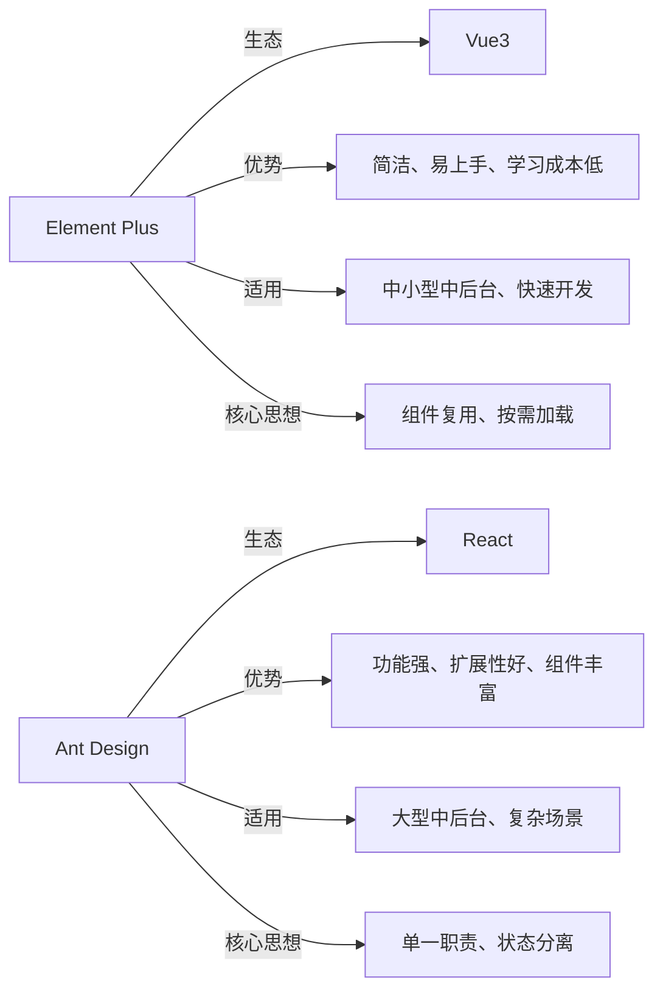

开发前先明确选型逻辑，避免盲目使用，两款组件库的核心定位的差异，决定了其适用场景：

|对比维度|**Element Plus**|**Ant Design**|
|---|---|---|
|核心生态|Vue3（适配Vue2需用Element UI）|React（主流适配React18，也有Vue版本Ant Design Vue）|
|设计风格|简洁、轻量，偏向中后台管理系统，易上手、易定制|严谨、规范，覆盖全场景（中后台、移动端），组件更丰富|
|核心优势|API 简洁，与Vue3语法契合，学习成本低，社区案例多|组件功能强大，扩展性强，支持复杂场景，Pro版本提升开发效率|
|适用场景|中小型中后台系统、快速迭代项目、Vue3技术栈项目|大型中后台系统、复杂交互场景、React技术栈项目|
**核心选型思想**：*技术栈优先，场景适配为辅*——Vue3项目优先选Element Plus，React项目优先选Ant Design；复杂场景（如可视化、多端适配）优先Ant Design，简单快速开发优先Element Plus。

---

聚焦开发中**80%场景常用的20%知识点**，每个知识点仅讲核心用法，搭配最简代码示例，拒绝冗余。

## 2.1 Element Plus 核心知识点（Vue3）

### 2.1.1 基础配置（必做）

```javascript
// 1. 安装（pnpm/npm）
pnpm install element-plus @element-plus/icons-vue

// 2. 全局引入（简单项目，快速开发）
import { createApp } from 'vue'
import ElementPlus from 'element-plus'
import 'element-plus/dist/index.css'
import App from './App.vue'

createApp(App).use(ElementPlus).mount('#app')

// 3. 按需引入（推荐，减小打包体积，体现性能优化思想）
// 安装插件：pnpm install unplugin-vue-components unplugin-auto-import -D
// vite.config.ts 配置（自动导入组件和样式）
import AutoImport from 'unplugin-auto-import/vite'
import Components from 'unplugin-vue-components/vite'
import { ElementPlusResolver } from 'unplugin-vue-components/resolvers'

export default {
  plugins: [
    AutoImport({ resolvers: [ElementPlusResolver()] }),
    Components({ resolvers: [ElementPlusResolver()] })
  ]
}
```

### 2.1.2 高频组件（核心用法）

**1. 表单（Form）—— 中后台高频，核心是数据绑定+验证**

```vue
<template>
  <el-form :model="form" :rules="rules" ref="formRef" label-width="100px">
    <el-form-item label="用户名" prop="username">
      <el-input v-model="form.username" placeholder="请输入用户名" />
    </el-form-item>
    <el-form-item label="密码" prop="password">
      <el-input v-model="form.password" type="password" placeholder="请输入密码" />
    </el-form-item>
    <el-form-item>
      <el-button type="primary" @click="submitForm">提交</el-button>
    </el-form-item>
  </el-form>
</template>

<script setup>
import { ref } from 'vue'
import { ElForm } from 'element-plus'

const formRef = ref<InstanceType<typeof ElForm>>(null)
const form = ref({ username: '', password: '' })
// 验证规则（体现“约定优于配置”思想，统一验证逻辑）
const rules = ref({
  username: [{ required: true, message: '请输入用户名', trigger: 'blur' }],
  password: [{ required: true, message: '请输入密码', trigger: 'blur' }, { min: 6, message: '密码至少6位', trigger: 'blur' }]
})

const submitForm = async () => {
  // 表单验证，体现“严谨性”编程思想
  if (!formRef.value) return
  await formRef.value.validate()
  // 验证通过，提交数据
  console.log('提交数据：', form.value)
}
</script>
```

**2. 表格（Table）—— 数据展示高频，核心是列配置+分页**

```vue
<template>
  <el-table :data="tableData" border style="width: 100%">
    <el-table-column prop="name" label="姓名" align="center" />
    <el-table-column prop="age" label="年龄" align="center" />
    <el-table-column label="操作" align="center">
      <template #default="scope">
        <el-button type="text" @click="handleEdit(scope.row)">编辑</el-button>
      </template>
    </el-table-column>
  </el-table>
  // 分页组件（与表格联动，体现“分层思想”，分离数据展示与分页逻辑）
  <el-pagination 
    @size-change="handleSizeChange" 
    @current-change="handleCurrentChange"
    :current-page="currentPage" 
    :page-sizes="[10, 20, 30]" 
    :page-size="pageSize" 
    :total="total" 
    layout="total, sizes, prev, pager, next, jumper"
    style="margin-top: 10px; text-align: right"
  />
</template>

<script setup>
import { ref } from 'vue'

// 表格数据（模拟接口返回）
const tableData = ref([])
const currentPage = ref(1) // 当前页
const pageSize = ref(10) // 每页条数
const total = ref(100) // 总条数

// 分页回调（统一处理分页逻辑，可复用）
const handleSizeChange = (val) => { pageSize.value = val; getTableData() }
const handleCurrentChange = (val) => { currentPage.value = val; getTableData() }

// 模拟接口请求，体现“数据与视图分离”思想
const getTableData = () => {
  // 实际开发中替换为接口请求，携带分页参数
  tableData.value = Array(pageSize.value).fill(0).map((_, i) => ({
    name: `用户${(currentPage.value-1)*pageSize.value + i + 1}`,
    age: 18 + Math.floor(Math.random() * 10)
  }))
}

// 初始化加载数据
getTableData()
</script>
```

**3. 弹窗（Dialog）—— 交互高频，核心是显隐控制+插槽复用**

```vue
<template>
  <el-button type="primary" @click="dialogVisible = true">打开弹窗</el-button>
  <el-dialog v-model="dialogVisible" title="编辑用户" width="500px">
    <!-- 插槽复用，体现“组件化思想”，可嵌入任意内容 -->
    <div class="dialog-content">
      <el-input v-model="editForm.name" placeholder="请输入姓名" />
    </div>
    <template #footer>
      <el-button @click="dialogVisible = false">取消</el-button>
      <el-button type="primary" @click="handleSave">保存</el-button>
    </template>
  </el-dialog>
</template>

<script setup>
import { ref } from 'vue'
const dialogVisible = ref(false)
const editForm = ref({ name: '' })

const handleSave = () => {
  // 保存逻辑
  console.log('保存数据：', editForm.value)
  dialogVisible.value = false
}
</script>
```

## 2.2 Ant Design 核心知识点（React）

### 2.2.1 基础配置（必做）

```javascript
// 1. 安装（pnpm/npm）
pnpm install antd @ant-design/icons

// 2. 全局引入（简单项目）
import { Button, Table } from 'antd'
import 'antd/dist/reset.css' // 重置样式

// 3. 按需引入（推荐，Ant Design 5+ 已支持自动按需引入，无需额外配置）
// 直接引入单个组件即可，打包时自动tree-shaking，体现性能优化思想
import Button from 'antd/es/button'
import 'antd/es/button/style/css' // 单独引入样式（可选，5+可省略）
```

### 2.2.2 高频组件（核心用法）

**1. 表单（Form）—— 与React Hooks结合，核心是表单联动+验证**

```jsx
import { Form, Input, Button, message } from 'antd'
import { useState } from 'react'

const LoginForm = () => {
  const [form] = Form.useForm() // 表单实例，体现“状态管理”思想

  // 表单提交，体现“严谨性”编程思想
  const onFinish = (values) => {
    console.log('提交数据：', values)
    message.success('提交成功')
  }

  // 表单验证失败回调
  const onFinishFailed = (errorInfo) => {
    console.log('验证失败：', errorInfo)
    message.error('请完善表单信息')
  }

  return (
    <Form
      form={form}
      name="loginForm"
      labelCol={{ span: 6 }}
      wrapperCol={{ span: 16 }}
      onFinish={onFinish}
      onFinishFailed={onFinishFailed}
      autoComplete="off"
      <Form.Item
        label="用户名"
        name="username"
        rules={[{ required: true, message: '请输入用户名！' }]} // 验证规则
        <Input placeholder="请输入用户名" />
      </Form.Item>

      <Form.Item
        label="密码"
        name="password"
        rules={[
          { required: true, message: '请输入密码！' },
          { min: 6, message: '密码至少6位！' }
        ]}
        <Input.Password placeholder="请输入密码" />
      </Form.Item>

      <Form.Item wrapperCol={{ offset: 6, span: 16 }}>
        <Button type="primary" htmlType="submit">
          提交
        </Button>
      </Form.Item>
    </Form>
  )
}

export default LoginForm
```

**2. 表格（Table）—— 复杂场景适配，核心是列配置+数据联动**

```jsx
import { Table, Pagination, Space, Button, message } from 'antd'
import { useState, useEffect } from 'react'

const DataTable = () => {
  const [tableData, setTableData] = useState([])
  const [currentPage, setCurrentPage] = useState(1)
  const [pageSize, setPageSize] = useState(10)
  const [total, setTotal] = useState(100)

  // 模拟接口请求，体现“生命周期管理”思想
  useEffect(() => {
    getTableData()
  }, [currentPage, pageSize])

  const getTableData = () => {
    // 实际开发中替换为接口请求
    const data = Array(pageSize).fill(0).map((_, i) => ({
      key: (currentPage-1)*pageSize + i + 1,
      name: `用户${(currentPage-1)*pageSize + i + 1}`,
      age: 18 + Math.floor(Math.random() * 10)
    }))
    setTableData(data)
  }

  // 操作列，体现“插槽复用”思想
  const columns = [
    { title: '姓名', dataIndex: 'name', key: 'name', align: 'center' },
    { title: '年龄', dataIndex: 'age', key: 'age', align: 'center' },
    {
      title: '操作',
      key: 'operation',
      align: 'center',
      render: (_, record) => (
        <Space size="middle">
          <Button type="text" onClick={() => handleEdit(record)}>编辑</Button>
          <Button type="text" danger onClick={() => handleDelete(record.key)}>删除</Button>
        </Space>
      )
    }
  ]

  const handleEdit = (record) => { console.log('编辑：', record) }
  const handleDelete = (key) => { 
    message.success('删除成功')
    // 重新加载数据
    getTableData()
  }

  return (
    <div>
      <Table 
        columns={columns} 
        dataSource={tableData} 
        bordered 
        pagination={false} // 关闭内置分页，使用自定义分页
        rowKey="key"
      />
      <Pagination
        current={currentPage}
        pageSize={pageSize}
        total={total}
        pageSizeOptions={[10, 20, 30]}
        onChange={(page, size) => { setCurrentPage(page); setPageSize(size) }}
        style={{ marginTop: 10, textAlign: 'right' }}
        showTotal={(total) => `共 ${total} 条数据`}
      />
    </div>
  )
}

export default DataTable
```

**3. 弹窗（Modal）—— 灵活适配，核心是显隐控制+自定义内容**

```jsx
import { Modal, Button, Input, message } from 'antd'
import { useState } from 'react'

const EditModal = () => {
  const [visible, setVisible] = useState(false)
  const [name, setName] = useState('')

  const showModal = () => { setVisible(true) }
  const handleCancel = () => { setVisible(false); setName('') }
  const handleSave = () => {
    if (!name) {
      message.error('请输入姓名')
      return
    }
    console.log('保存姓名：', name)
    message.success('保存成功')
    setVisible(false)
    setName('')
  }

  return (
    <div>
      <Button type="primary" onClick={showModal}>打开弹窗</Button>
      <Modal
        title="编辑姓名"
        open={visible}
        onCancel={handleCancel}
        footer={[
          <Button key="cancel" onClick={handleCancel}>取消</Button>,
          <Button key="save" type="primary" onClick={handleSave}>保存</Button>
        ]}
        <Input 
          placeholder="请输入姓名" 
          value={name} 
          onChange={(e) => setName(e.target.value)}
          style={{ width: '100%' }}
        />
      </Modal>
    </div>
  )
}

export default EditModal
```

---

组件库的使用，不止是“调用组件”，更要结合编程思想，让代码**可复用、可维护、可扩展**，以下4种思想最实用：

## 3.1 组件封装思想（核心，重中之重）

将高频使用的组件（如表格、表单、弹窗）封装为通用组件，减少重复代码，体现**DRY原则（Don't Repeat Yourself）**。

**示例：封装通用表格组件（以Element Plus为例）**

```vue
<!-- src/components/CommonTable.vue -->
<template>
  <div class="common-table">
    <el-table :data="tableData" :border="border" :loading="loading" v-bind="$attrs">
      <slot /> <!-- 插槽，用于自定义列 -->
    </el-table>
    <el-pagination
      v-if="showPagination"
      @size-change="handleSizeChange"
      @current-change="handleCurrentChange"
      :current-page="currentPage"
      :page-sizes="[10, 20, 30]"
      :page-size="pageSize"
      :total="total"
      layout="total, sizes, prev, pager, next, jumper"
      style="margin-top: 10px; text-align: right"
    />
  </div>
</template>

<script setup>
import { defineProps, defineEmits, useSlots } from 'vue'

// 定义props，体现“封装复用”思想，可灵活配置
const props = defineProps({
  tableData: { type: Array, default: () => [] },
  total: { type: Number, default: 0 },
  currentPage: { type: Number, default: 1 },
  pageSize: { type: Number, default: 10 },
  border: { type: Boolean, default: true },
  loading: { type: Boolean, default: false },
  showPagination: { type: Boolean, default: true }
})

// 定义事件，向外传递分页变化
const emit = defineEmits(['size-change', 'current-change'])
const handleSizeChange = (val) => emit('size-change', val)
const handleCurrentChange = (val) => emit('current-change', val)
</script>
```

**使用方式**：在任意页面引入，只需传入数据和配置，无需重复编写分页和表格基础结构，大幅提升开发效率。

## 3.2 按需加载思想（性能优化核心）

- Element Plus：通过 `unplugin-vue-components` 插件，自动导入使用的组件，避免导入整个组件库，减小打包体积；

- Ant Design：5+ 版本默认支持按需引入，无需额外配置，导入单个组件即可，打包时自动tree-shaking；

- **核心思想**：*只加载需要的资源，减少不必要的性能消耗*，尤其适合大型项目。

## 3.3 状态与视图分离思想

组件库的使用中，始终保持“数据（状态）”与“视图”分离：

- 表单：用响应式数据（Vue3 ref/reactive、React useState）绑定表单值，视图仅做渲染，不直接修改数据；

- 表格：数据由接口请求获取，视图仅负责展示，分页、排序等操作修改状态，再由状态驱动视图更新；

- **核心优势**：代码逻辑清晰，便于维护和调试，符合前端开发“单向数据流”的最佳实践。

## 3.4 单一职责思想

每个组件只负责一件事，避免“大而全”的组件：

- 表单组件：只负责表单的渲染和验证，数据提交逻辑单独抽取为方法，甚至封装为api文件；

- 表格组件：只负责数据展示和分页，操作逻辑（编辑、删除）通过事件向外传递，由父组件处理；

- **核心优势**：组件复用性高，修改某一功能时，不会影响其他逻辑，降低维护成本。

---

结合组件库特性，分享3个高频开发创意，解决实际开发中的痛点，让代码更简洁、更优雅。

## 4.1 创意1：自定义主题适配（品牌化需求）

两款组件库都支持自定义主题，可快速适配项目品牌色，体现“个性化适配”思想。

**Element Plus 自定义主题（Vite）**：

```javascript
// 1. 安装sass：pnpm install sass -D
// 2. 创建主题文件：src/styles/element-variables.scss
@forward 'element-plus/theme-chalk/src/common/var.scss' with (
  $colors: (
    primary: (
      base: #1890ff, // 自定义主色
    ),
  ),
);

// 3. vite.config.ts 配置
import { defineConfig } from 'vite'
import vue from '@vitejs/plugin-vue'
import path from 'path'

export default defineConfig({
  plugins: [vue()],
  css: {
    preprocessorOptions: {
      scss: {
        additionalData: `@use "@/styles/element-variables.scss" as *;`,
      },
    },
  },
  resolve: {
    alias: {
      '@': path.resolve(__dirname, 'src'),
    },
  },
})
```

**Ant Design 自定义主题**：

```javascript
// src/App.jsx
import { ConfigProvider } from 'antd'

function App() {
  // 自定义主题配置
  const theme = {
    token: {
      colorPrimary: '#1890ff', // 主色
      borderRadius: 4, // 圆角
    },
  }

  return (
    <ConfigProvider theme={theme}>
      {/* 项目内容 */}
    </ConfigProvider>
  )
}
```

## 4.2 创意2：表单联动技巧（复杂表单场景）

在多字段表单中，通过组件库的表单API，实现字段联动，提升用户体验，体现“交互优化”思想。

**示例（Ant Design）：选择下拉框，联动显示对应输入框**

```jsx
import { Form, Input, Select, Button } from 'antd'
import { useState } from 'react'

const LinkageForm = () => {
  const [form] = Form.useForm()

  // 监听下拉框变化，联动修改表单值
  const handleTypeChange = (value) => {
    if (value === 'other') {
      form.setFieldValue('otherDesc', '') // 重置其他描述
    } else {
      form.setFieldValue('otherDesc', '') // 清空其他描述
    }
  }

  return (
    <Form form={form} name="linkageForm">
      <Form.Item
        label="类型"
        name="type"
        rules={[{ required: true, message: '请选择类型' }]}
        <Select onChange={handleTypeChange}>
          <Select.Option value="1">类型1</Select.Option>
          <Select.Option value="2">类型2</Select.Option>
          <Select.Option value="other">其他</Select.Option>
        </Select>
      </Form.Item>

      {/* 联动显示：只有选择“其他”时，显示该输入框 */}
      <Form.Item
        label="其他描述"
        name="otherDesc"
        rules={[
          { 
            required: form.getFieldValue('type') === 'other', 
            message: '请输入其他描述' 
          }
        ]}
        shouldUpdate={(prevValues, currentValues) => prevValues.type !== currentValues.type}
        <Input placeholder="请输入其他描述" />
      </Form.Item>

      <Form.Item>
        <Button type="primary" htmlType="submit">提交</Button>
      </Form.Item>
    </Form>
  )
}
```

## 4.3 创意3：通用弹窗封装（全局复用）

将弹窗封装为全局组件，通过函数调用的方式打开，无需在每个页面重复编写弹窗代码，体现“封装复用”思想。

**示例（Element Plus）：封装全局弹窗函数**

```javascript
// src/utils/modal.js
import { ElMessageBox, ElMessage } from 'element-plus'

// 封装确认弹窗
export const confirmModal = (content, title = '提示', type = 'warning') => {
  return ElMessageBox.confirm(
    content,
    title,
    {
      confirmButtonText: '确定',
      cancelButtonText: '取消',
      type: type,
    }
  ).then(() => {
    ElMessage.success('操作成功')
    return true
  }).catch(() => {
    ElMessage.info('已取消操作')
    return false
  })
}

// 使用方式（任意页面）
import { confirmModal } from '@/utils/modal'

const handleDelete = async () => {
  const res = await confirmModal('确定要删除这条数据吗？')
  if (res) {
    // 执行删除逻辑
  }
}
```

---

**Mermaid 两款组件库核心逻辑对比图解**：




1. 知识点：聚焦高频组件（表单、表格、弹窗），掌握基础配置和核心用法，足够应对80%的开发场景；

2. 编程思想：融入组件封装、按需加载、状态分离、单一职责，让代码更可维护、可复用；

3. 开发创意：自定义主题、表单联动、全局弹窗封装，解决实际开发痛点，提升开发质感和用户体验。