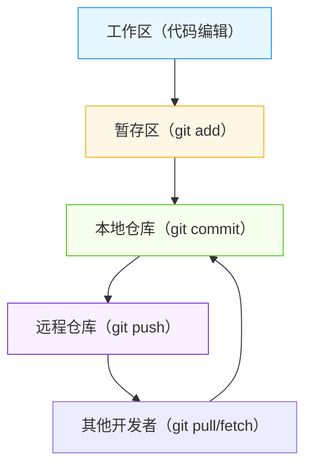

## 一、Git开发核心定位与必备认知

开发者接触Git，核心不是“会提交代码”，而是“会协作、会回滚、会解决冲突、会规范管理版本”。先明确核心认知，避免走弯路。

### 1. 核心定位（开发者视角）

✅ **团队协作核心**：多人并行开发、代码合并、冲突解决的唯一载体；

✅ **版本追溯神器**：记录每一次代码修改，可随时回滚、追溯历史，杜绝“代码丢失”；

✅ **分支管理利器**：通过分支隔离开发、测试、生产环境，保障主分支稳定；

✅ **代码质量保障**：配合Code Review、提交规范，提升团队代码质量。

### 2. 必备基础认知（无需深入底层，够用即可）

- ✅ **核心概念**：

    - **工作区（Working Directory）**：本地实际编辑的代码目录；

    - **暂存区（Staging Area）**：临时存放待提交代码的区域（核心中间层）；

    - **本地仓库（Local Repository）**：本地存储版本历史的目录（.git文件夹）；

    - **远程仓库（Remote Repository）**：远程存储版本历史的目录（如GitHub、GitLab、Gitee）。

- ✅ **核心思想**：**分布式**（每个开发者都有完整仓库，无需依赖中央服务器）、**版本化**（每一次提交都是完整快照）、**分支优先**（用分支解决并行开发问题）。

- ✅ **核心关系**：工作区 → 暂存区 → 本地仓库 → 远程仓库（核心流转流程）。

### 3. Git核心流转图（一目了然）


## 二、Git开发高频知识点（实战必记，直接套用）

聚焦“开发常用”，按“基础配置→代码管理→分支管理→冲突解决→远程协作”分类，每个知识点搭配**命令+场景+技巧**，拒绝死记硬背。

### （一）基础配置（首次使用必做，一劳永逸）

配置是Git的“身份证”，决定提交信息、认证方式，核心配置仅需2步。

|命令|核心功能|实战场景|开发技巧|
|---|---|---|---|
|**git config --global user.name**|设置全局用户名|首次安装Git、更换电脑|配置为团队统一的账号，便于追溯提交人|
|**git config --global user.email**|设置全局邮箱|首次安装Git、更换电脑|配置为与代码托管平台（GitLab/GitHub）绑定的邮箱|
|**git config --list**|查看所有配置|验证配置是否生效|常用命令，确认全局/局部配置是否正确|
|**git config --global core.editor**|设置默认编辑器|需编写复杂提交信息、解决冲突|推荐设置为VS Code：`git config --global core.editor "code --wait"`|
**示例**：

```bash

git config --global user.name "ZhangSan"
git config --global user.email "zhangsan@xxx.com"
git config --list | grep user
```
### （二）代码管理（开发最高频，每天必用）

核心是“工作区与仓库的流转”，掌握这6个命令，覆盖90%的日常代码操作。

#### 1. 代码提交流程（核心）

Git提交分**三步**：工作区→暂存区→本地仓库，每一步都有明确命令，避免直接提交导致混乱。

|命令|核心功能|实战场景|开发技巧|
|---|---|---|---|
|**git add .**|将所有修改文件加入暂存区|日常开发，提交所有修改|谨慎使用！会添加无用文件，推荐精准添加：`git add 文件名/目录`|
|**git add -p**|交互式添加（分块提交）|只提交部分修改、隔离无关修改|开发神器，可按行/按块选择提交内容，避免“一次提交一堆无关代码”|
|**git status**|查看工作区/暂存区状态|确认修改文件、是否已暂存|开发必用，避免误提交、漏提交|
|**git commit -m "提交信息"**|将暂存区代码提交到本地仓库|保存版本历史|**提交信息必须规范**，详见下文“编程思想-提交规范”|
|**git commit --amend**|修改最后一次提交|提交信息写错、遗漏修改|仅修改**未推送**的最后一次提交，不可修改已推送的历史提交|
#### 2. 代码查看与回溯（调试必备）

|命令|核心功能|实战场景|开发技巧|
|---|---|---|---|
|**git log**|查看提交历史|追溯版本、查看修改记录|常用参数：`git log --oneline`（一行显示，简洁）、`git log -p`（显示具体修改内容）|
|**git diff**|查看工作区与暂存区的差异|确认修改内容、避免提交错误代码|常用参数：`git diff 文件名`（查看单个文件差异）、`git diff --cached`（查看暂存区与本地仓库的差异）|
|**git checkout -- 文件名**|丢弃工作区的修改|误修改代码、需要恢复原版本|谨慎使用！**不可恢复**丢弃的修改，建议先commit或stash|
### （（三）分支管理（Git核心价值，团队协作核心）

分支是Git解决“多人并行开发”的核心，**合理的分支策略**能大幅提升团队协作效率。

#### 1. 核心分支概念（必记）

|分支名|核心作用|开发规范|重要性|
|---|---|---|---|
|**main/master**|主分支，存放稳定代码|仅存放可部署的稳定代码，禁止直接提交|🔴 最高（生产环境分支）|
|**develop**|开发分支，存放开发中的代码|所有功能分支合并到该分支|🟡 中高（测试环境分支）|
|**feature/xxx**|功能分支，开发单个功能|从develop拉取，开发完成后合并回develop|🟢 常用（个人开发分支）|
|**bugfix/xxx**|修复分支，修复线上bug|从main拉取，修复后合并回main和develop|🟡 中高（紧急修复分支）|
#### 2. 分支管理核心命令（直接套用）

|命令|核心功能|实战场景|开发技巧|
|---|---|---|---|
|**git branch**|查看/创建/删除分支|查看当前分支、创建新分支|常用参数：`git branch -a`（查看所有分支，含远程分支）、`git branch -D 分支名`（强制删除分支）|
|**git checkout 分支名** / **git switch 分支名**|切换分支|切换到开发分支、切换到主分支|推荐使用`git switch`（更直观），`git checkout`还可用于恢复文件|
|**git checkout -b 分支名** / **git switch -c 分支名**|创建并切换分支|快速创建功能/修复分支|开发常用，一步完成创建+切换|
|**git merge 分支名**|合并分支|合并功能分支到开发分支|详见下文“冲突解决”，合并前需拉取最新代码|
|**git rebase 分支名**|变基，合并提交历史|整理提交记录、保持分支历史整洁|推荐在**个人分支**使用，不要在公共分支（main/develop）使用|
#### 3. 实战分支流程（直接落地）

以“开发新功能”为例，标准流程如下：

```bash

git switch develop
git pull origin develop
git switch -c feature/user-login
git add .
git commit -m "feat: 实现用户登录功能"
git switch develop
git merge feature/user-login
git branch -D feature/user-login
```
### （四）冲突解决（开发必避，核心痛点）

多人协作时，修改同一文件的同一行必然会产生冲突，掌握冲突解决方法，是合格开发者的必备能力。

#### 1. 冲突产生的原因

两个分支修改了**同一文件的同一行代码**，Git无法自动判断保留哪一份，需要人工解决。

#### 2. 冲突解决流程（直接套用）

1. **查看冲突**：执行`git merge`或`git pull`后，Git会提示冲突文件，文件内会出现冲突标记：

    ```plain Text
    
    <<<<<<< HEAD（当前分支代码）
    本地修改的内容
    =======
    合并分支的代码
    ```

2. **解决冲突**：

    - 打开冲突文件，保留需要的代码，删除冲突标记（`<<<<<<<`、`=======`、`>>>>>>>`）；

    - 保存文件。

3. **完成合并**：

    ```bash
    
    git add 冲突文件名
    git merge --continue
    ```
#### 3. 冲突解决技巧（开发创意）

- ✅ **先拉取后合并**：合并前先拉取远程仓库的最新代码，避免“本地分支落后”导致的冲突；

- ✅ **沟通优先**：冲突产生时，先与修改同一代码的同事沟通，确认最终保留的内容，避免主观修改；

- ✅ **使用可视化工具**：推荐使用VS Code、GitKraken等工具，可视化展示冲突，更易解决。

### （五）远程协作（团队协作核心）

远程仓库是团队共享代码的平台，核心命令掌握这5个，覆盖远程协作全流程。

|命令|核心功能|实战场景|开发技巧|
|---|---|---|---|
|**git clone 仓库地址**|克隆远程仓库到本地|首次拉取项目代码|推荐使用SSH地址（无需重复输密码），而非HTTPS地址|
|**git remote -v**|查看远程仓库关联信息|确认本地仓库关联的远程仓库|开发必用，避免关联错远程仓库|
|**git pull 远程仓库名 分支名**|拉取远程仓库的最新代码到本地|同步团队最新代码、避免冲突|等价于`git fetch` + `git merge`，开发必用|
|**git push 远程仓库名 分支名**|将本地代码推送到远程仓库|提交代码到团队仓库、共享代码|推送前需先拉取（git pull），避免冲突|
|**git fetch 远程仓库名 分支名**|拉取远程仓库的最新代码到本地，但不合并|查看远程分支的最新修改、不影响本地代码|适合想先查看再合并的场景|
## 三、Git开发编程思想（落地为王，提升协作效率）

Git的核心价值不仅是“版本管理”，更是“团队协作规范”。结合实战场景，分享3个核心编程思想，让你从“会用Git”升级为“用好Git”。

### 1. 提交规范思想（必遵循，提升代码可追溯性）

**提交信息是版本历史的“说明书”**，混乱的提交信息会让后续维护、回滚变得极其困难。推荐遵循**Conventional Commits**规范，统一团队提交格式。

#### 规范格式

```plain Text

<类型>(<范围>): <描述>

[可选：正文]

[可选：脚注]
```

#### 常用类型（必记）

|类型|含义|适用场景|
|---|---|---|
|**feat**|新功能|开发新功能、新增接口|
|**fix**|修复bug|修复线上bug、修复功能缺陷|
|**docs**|文档修改|修改README、注释、文档|
|**style**|代码风格|格式化代码、调整缩进、修改变量名（不影响代码逻辑）|
|**refactor**|代码重构|优化代码结构、提升性能、不改变功能|
|**test**|测试代码|新增测试用例、修改测试代码|
|**chore**|构建/工具修改|修改配置文件、构建脚本、依赖版本|
#### 示例（直接套用）

```bash

git commit -m "feat(user): 实现用户注册功能，添加手机号验证"
git commit -m "fix(login): 修复密码错误时未提示的问题"
git commit -m "refactor(order): 优化订单处理逻辑，减少代码冗余"
```
### 2. 分支隔离思想（保障代码稳定性）

**分支的核心作用是“隔离环境、隔离开发”**，绝对禁止在main/develop分支直接开发，核心原则：

- ✅ **main分支**：仅存放稳定、可部署的代码，由测试/运维人员合并；

- ✅ **develop分支**：存放开发中的代码，由开发人员合并功能分支；

- ✅ **功能/修复分支**：个人开发的载体，开发完成后通过PR/MR合并到公共分支，禁止直接推送。

### 3. 版本回溯思想（降低开发风险）

开发中难免会出现“代码写错、合并错误”的情况，Git的版本回溯能力能让你“随时回到正轨”，核心命令：

- ✅ **git reset**：回滚到指定版本（可重置暂存区/工作区）；

    - 示例：`git reset --hard HEAD~1`（回滚到上一个版本，丢弃本地修改）；

- ✅ **git revert**：撤销指定提交（保留历史记录，适合公共分支）；

    - 示例：`git revert 提交ID`（撤销指定提交，生成新的提交）；

- ✅ **git stash**：暂存未完成的修改，切换分支时使用；

    - 示例：`git stash`（暂存当前修改）、`git stash pop`（恢复暂存的修改）。

## 四、Git开发避坑指南（重点，少走弯路）

- ❌ **避坑1**：直接在main/develop分支开发、提交，导致分支混乱、冲突频发；

- ❌ **避坑2**：提交信息不规范，如“update”“修改”，导致版本历史无法追溯；

- ❌ **避坑3**：合并前不拉取最新代码，导致冲突、代码覆盖；

- ❌ **避坑4**：使用`git reset --hard`撤销已推送的提交，导致团队代码不一致；

- ❌ **避坑5**：忽略`.gitignore`文件，提交无用文件（如target、.idea、node_modules），增加仓库体积；

- ❌ **避坑6**：多人协作时，不及时同步代码，导致自己的代码落后于远程分支。

### 避坑核心技巧

1. 所有开发都在**个人分支**进行，公共分支仅通过PR/MR合并；

2. 提交前必做：`git status`（查看修改）、`git pull`（拉取最新）；

3. 重要修改前必做：`git stash`（暂存修改）、切换分支；

4. 编写规范的`.gitignore`文件，排除无用文件。

## 五、核心总结（干练收尾，必记重点）

1. **核心定位**：Git是分布式版本控制系统，核心解决“团队协作、版本回溯、代码管理”问题；

2. **核心命令**：掌握`add`、`commit`、`branch`、`merge`、`pull`、`push`这6个命令，覆盖90%的日常开发；

3. **核心规范**：遵循Conventional Commits提交规范、分支隔离规范，提升团队协作效率；

4. **核心能力**：掌握冲突解决、版本回溯能力，能应对开发中的突发问题；

5. **核心思想**：分支隔离、提交规范、版本回溯，是用好Git的关键。