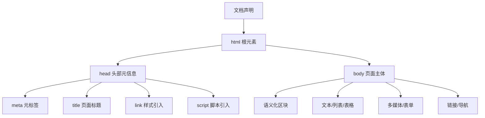
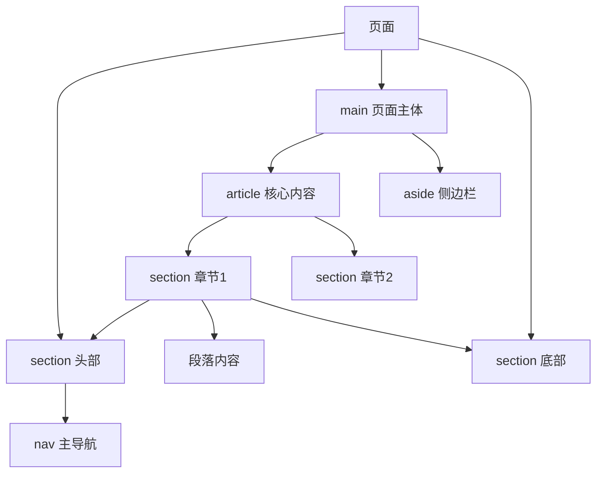

## 一、核心基础概念

先厘清3个最容易混淆的基础定义，这是所有HTML开发的前提：

1. **标签（Tag）**：HTML的基本单元，分为**开始标签**`<tag>`和**结束标签**`</tag>`；自闭合标签无需结束标签，如``、`<input />`

2. **元素（Element）**：「开始标签 + 内容 + 结束标签」组成的完整单元，如`<p>这是一个段落</p>`

3. **属性（Attribute）**：写在开始标签内，给元素附加额外信息，格式为`key="value"`，分为**全局属性**（所有元素通用）和**专有属性**（特定元素可用）

4. **注释**：`<!-- 注释内容 -->`，不会渲染到页面，仅用于代码说明

## 二、HTML5标准文档结构

每个HTML文件必须遵循该标准结构，缺失会导致浏览器解析异常。

### 2.1 最简标准代码

```html

<!-- 声明文档类型为HTML5，必须放在文档第一行 -->
<!DOCTYPE html>
<!-- 根元素，lang属性定义页面语言，SEO与无障碍必备 -->
<html lang="zh-CN">
  <!-- 头部：存放页面元信息，不直接渲染到页面 -->
  <head>
    <!-- 字符编码，必须设置，避免乱码，通用UTF-8 -->
    <meta charset="UTF-8" />
    <!-- 视口设置，移动端适配必备 -->
    <meta name="viewport" content="width=device-width, initial-scale=1.0" />
    <!-- 页面标题，浏览器标签栏显示，SEO核心 -->
    <title>页面标题</title>
  </head>
  <!-- 主体：页面所有可见渲染内容都放在这里 -->
  <body>
    页面核心内容
  </body>
</html>
```

### 2.2 结构层级可视化


### 2.3 核心节点必知要点

- `<!DOCTYPE html>`：**必须放在文档首行**，作用是告诉浏览器以HTML5标准解析文档，缺失会触发怪异模式（Quirks Mode），导致样式渲染异常。

- `<html>`：文档根元素，所有内容必须包裹在其中，`lang`属性是**无障碍与SEO必备**，声明页面语言。

- `<head>`：页面元信息容器，核心子标签：

    - `<meta charset="UTF-8">`：固定写法，避免中文乱码

    - `<meta name="viewport" content="width=device-width, initial-scale=1.0">`：移动端适配必备

    - `<title>`：页面标题，**SEO核心权重标签**，每个页面必须唯一

    - `<link>`：引入外部CSS样式表

    - `<script>`：引入JavaScript脚本，建议放在body底部，避免阻塞页面渲染

- `<body>`：页面可见内容的唯一容器，所有渲染给用户的内容必须放在这里。

## 三、语义化标签：HTML的核心灵魂

语义化核心准则：**用正确的标签做正确的事**，让标签本身具备内容含义，而非单纯的布局容器。

语义化的核心收益：提升代码可维护性、SEO权重、无障碍访问能力，减少CSS冗余。

### 3.1 页面级结构语义标签（HTML5新增）

替代传统`div+class`的无语义布局，是现代HTML开发的标准写法：

|标签|核心用途|注意事项|
|---|---|---|
|`<header>`|页面/区块的头部，存放logo、导航、搜索栏|可多次使用，不仅限于全局头部|
|`<nav>`|页面主导航区块，存放核心导航链接|一个页面建议不超过2个，避免语义泛滥|
|`<main>`|页面主体内容|一个页面**只能有一个**，存放核心内容|
|`<article>`|独立完整的内容单元，如文章、帖子、评论|可嵌套，脱离页面上下文也可独立理解|
|`<section>`|页面主题区块，如文章章节、功能模块|必须有标题，不要当作纯布局容器|
|`<aside>`|页面附属内容，如侧边栏、广告、相关推荐|和主体内容相关性低的辅助信息|
|`<footer>`|页面/区块的底部，存放版权、备案号、联系方式|可多次使用，每个独立区块也可使用|
#### 语义化页面布局结构可视化


### 3.2 内容与文本语义标签

替代无语义的`span`、`b`、`i`，用有语义的标签表达内容含义：

|标签|核心语义|常用场景|
|---|---|---|
|`<h1>`-`<h6>`|标题标签，h1权重最高，h6最低|页面/章节标题，**一个页面建议仅一个h1，层级禁止跳级**|
|`<p>`|段落标签|正文段落，文本最基础的容器|
|`<strong>`|重要性强调，语义权重最高|核心关键词、警告信息、重点内容（替代`<b>`）|
|`<em>`|语气强调，重读|句子中需要重读的内容（替代`<i>`）|
|`<mark>`|标记高亮|搜索结果高亮、重点标记内容|
|`<del>`/`<ins>`|删除/新增的内容|原价/现价、文本修改记录，常搭配使用|
|`<code>`|行内代码|行内代码片段，常和`<pre>`搭配实现多行代码块|
|`<pre>`|预格式化文本|保留空格和换行，用于多行代码展示|
|`<blockquote>`|块级引用|大段引用内容，搭配cite属性标注来源|
|`<q>`|行内引用|短文本引用，浏览器自动添加引号|
|`<figure>`/`<figcaption>`|媒体内容+标题|包裹图片、图表、视频，搭配标题说明|
|`<hr>`|主题分割线|内容主题的语义分隔，而非纯样式分割|
避坑提醒：禁止用多个`<br>`实现段落间距，间距必须用CSS的`margin/padding`实现。

## 四、高频常用标签全解

### 4.1 链接标签`<a>`：超链接核心

网页跳转、锚点、下载的核心标签，高频使用。

#### 核心属性

- `href`：**必填属性**，链接目标地址，支持4类取值：

    - 外部链接：`https://www.xxx.com`

    - 内部链接：`./about.html`

    - 锚点链接：`#id名`，跳转到当前页面指定id的元素

    - 功能性链接：`mailto:xxx@xx.com`（发邮件）、`tel:13xxxxxxxxx`（打电话）

- `target`：链接打开方式，核心取值：

    - `_self`：默认，当前页面打开

    - `_blank`：新标签页打开，**外部链接必须加** **`rel="noopener noreferrer"`**，防止安全风险

- `download`：触发下载而非跳转，取值为下载后的文件名

- `rel`：定义页面与链接的关系，常用`noopener noreferrer`（安全）、`nofollow`（SEO不传递权重）

#### 示例代码

```html

<!-- 外部链接，新标签页安全打开 -->
<a href="https://www.baidu.com" target="_blank" rel="noopener noreferrer">百度</a>
<!-- 锚点链接 -->
<a href="#article-title">跳转到文章标题</a>
<h1 id="article-title">文章标题</h1>
<!-- 下载链接 -->
<a href="./resume.pdf" download="前端开发简历.pdf">下载简历</a>
```

### 4.2 列表标签：结构化内容必备

分为3类，用于结构化列表内容，禁止用`p+br`模拟列表。

#### 1. 无序列表`<ul>`

用于无顺序的列表，如导航、功能列表，**直接子元素只能是** **`<li>`**。

```html

<ul>
  <li>列表项1</li>
  <li>列表项2</li>
  <li>列表项3</li>
</ul>
```

#### 2. 有序列表`<ol>`

用于有顺序的列表，如排名、步骤，核心属性`type`（序号类型）、`start`（起始序号）、`reversed`（倒序）。

```html

<ol start="1" type="1">
  <li>第一步</li>
  <li>第二步</li>
  <li>第三步</li>
</ol>
```

#### 3. 自定义列表`<dl>`

用于「术语/名称+描述」的场景，子元素为`<dt>`（术语）和`<dd>`（描述）。

```html

<dl>
  <dt>HTML</dt>
  <dd>超文本标记语言，网页的骨架</dd>
  <dt>CSS</dt>
  <dd>层叠样式表，负责网页的样式</dd>
</dl>
```

### 4.3 表格标签：二维数据展示

仅用于展示结构化二维数据，**禁止用表格做页面布局**（已淘汰）。

#### 标准结构

```html

<table border="1">
  <!-- 表格标题 -->
  <caption>2024年销售数据统计表</caption>
  <!-- 表头 -->
  <thead>
    <tr>
      <th scope="col">月份</th>
      <th scope="col">销售额</th>
      <th scope="col">目标完成率</th>
    </tr>
  </thead>
  <!-- 表格主体 -->
  <tbody>
    <tr>
      <td>1月</td>
      <td>100万</td>
      <td>90%</td>
    </tr>
    <tr>
      <td>2月</td>
      <td>120万</td>
      <td>100%</td>
    </tr>
  </tbody>
  <!-- 表尾 -->
  <tfoot>
    <tr>
      <td>合计</td>
      <td>220万</td>
      <td>95%</td>
    </tr>
  </tfoot>
</table>
```

#### 核心属性

- `<th>`：表头单元格，`scope`属性定义表头范围（`col`列/`row`行），无障碍必备

- `<td>`：数据单元格，`colspan`（跨列合并）、`rowspan`（跨行合并）

### 4.4 多媒体标签：HTML5原生支持

替代Flash，原生实现音视频、图片展示，是现代网页多媒体的标准。

#### 1. 图片标签``

网页最常用的标签之一，自闭合标签，行内块元素。

**核心必填属性**：

- `src`：图片地址，本地路径/网络地址

- `alt`：图片替代文本，图片加载失败时显示，**SEO与无障碍核心**，必须准确描述图片内容

**高频优化属性**：

- `width`/`height`：图片宽高，建议仅写一个，自动按比例缩放避免变形

- `loading="lazy"`：原生图片懒加载，长列表图片必加，提升页面性能

- `title`：鼠标悬浮提示文本

示例：

```html


  <source src="./music.mp3" type="audio/mpeg">
  <source src="./music.ogg" type="audio/ogg">
  您的浏览器不支持音频播放，请升级浏览器
```

#### 3. 视频标签`<video>`

支持mp4、webm等格式，核心属性与audio一致，额外新增：

- `poster`：视频封面图，播放前显示

- `playsinline`：移动端内联播放，不自动全屏

示例：

```html

<video 
  src="./video.mp4" 
  controls 
  width="800"
  poster="./cover.jpg"
  preload="metadata"
  playsinline
```

## 五、表单核心全解：HTML交互的核心

表单是前端收集用户信息、与后端对接的核心，是开发中最高频的模块之一。

### 5.1 表单容器`<form>`核心属性

```html

<form action="/api/user/register" method="POST" enctype="application/x-www-form-urlencoded">
  <!-- 表单控件 -->
</form>
```

- `action`：表单提交的后端接口地址

- `method`：HTTP提交方法，常用`GET`（查询，参数拼在url）、`POST`（提交数据，参数在请求体）

- `enctype`：数据编码格式，**文件上传必须设置为** **`multipart/form-data`**

- `novalidate`：关闭浏览器原生表单验证

- `target`：提交后接口返回的页面打开方式

### 5.2 核心表单控件

#### 1. `<input>`标签：表单最核心控件

通过`type`属性切换控件类型，**通用必填属性** **`name`**，是后端获取数据的参数名。

##### 通用核心属性

|属性|作用|
|---|---|
|`name`|控件名称，提交给后端的参数名，**必填**|
|`value`|控件的值，提交给后端的参数值|
|`id`|唯一标识，用于和`<label>`绑定|
|`placeholder`|输入框提示文本|
|`disabled`|禁用控件，无法编辑，值不会被提交|
|`readonly`|只读，无法编辑，值会被提交|
|`required`|必填项，浏览器原生验证|
|`pattern`|正则表达式，原生验证输入格式|
##### 高频type类型

|type值|控件类型|核心用途|专属属性|
|---|---|---|---|
|`text`|单行文本框|默认值，输入姓名、地址等普通文本|placeholder、maxlength|
|`password`|密码框|输入密码，内容自动隐藏|同text|
|`number`|数字输入框|仅能输入数字，如年龄、价格|min、max、step（步长）|
|`radio`|单选框|多选一，如性别选择|同一组**name必须相同**，实现互斥；`checked`默认选中|
|`checkbox`|复选框|多选，如爱好选择|同一组name建议相同；`checked`默认选中|
|`email`|邮箱输入框|输入邮箱，原生验证邮箱格式|同text|
|`tel`|手机号输入框|输入手机号，移动端弹出数字键盘|pattern正则验证|
|`date`|日期选择器|选择年月日，原生日期控件|min、max|
|`file`|文件选择器|选择文件上传|accept（限制文件类型，如`image/*`）、multiple（多选）|
|`hidden`|隐藏域|存放无需用户看到的提交数据，如用户id|无界面，仅name和value|
|`submit`|提交按钮|点击触发表单提交|value（按钮文本）|
|`button`|普通按钮|无默认行为，用于JS绑定事件|value（按钮文本）|
#### 2. `<label>`标签：无障碍与体验必备

和表单控件绑定，点击label文本即可触发对应控件的聚焦/选中，**提升用户体验，无障碍必备**。

两种绑定方式：

```html

<!-- 方式1：for绑定控件id，推荐，兼容性最好 -->
<label for="username">用户名：</label>
<input type="text" id="username" name="username">

<!-- 方式2：控件包裹在label内 -->
<label>
  密码：
  <input type="password" name="password">
</label>
```

#### 3. `<textarea>`：多行文本输入框

用于输入大段文本，如备注、留言，**无value属性，默认值写在标签中间**。

```html

<label for="remark">备注：</label>
<textarea 
  id="remark" 
  name="remark" 
  rows="5" 
  cols="30" 
  placeholder="请输入备注信息"
  maxlength="200"
```

#### 4. `<select>`+`<option>`：下拉选择框

用于单选/多选的下拉选项，`<optgroup>`可实现选项分组。

```html

<label for="city">所在城市：</label>
<select id="city" name="city" required>
  <option value="">请选择</option>
  <optgroup label="江苏省">
    <option value="suzhou">苏州</option>
    <option value="nanjing">南京</option>
  </optgroup>
  <optgroup label="浙江省">
    <option value="hangzhou">杭州</option>
    <option value="ningbo">宁波</option>
  </optgroup>
</select>
```

- `<option>`核心属性：`value`（提交的值）、`selected`（默认选中）

#### 5. `<button>`按钮标签

比input按钮更灵活，双标签可嵌套文本、图片，**form内必须显式声明type**。

```html

<button type="submit">提交表单</button>
<button type="button" onclick="handleClick()">自定义按钮</button>
<button type="reset">重置表单</button>
```

高频避坑：form内的button不写type，默认是`submit`，点击会触发表单提交导致页面刷新，必须显式写`type="button"`。

### 5.3 完整表单示例

```html

<form action="/api/user/register" method="POST">
  <!-- 用户名 -->
  <div>
    <label for="username">用户名：</label>
    <input type="text" id="username" name="username" placeholder="请输入用户名" required maxlength="20">
  </div>

  <!-- 密码 -->
  <div>
    <label for="password">密码：</label>
    <input type="password" id="password" name="password" placeholder="请输入6-16位密码" required minlength="6" maxlength="16">
  </div>

  <!-- 性别单选 -->
  <div>
    <span>性别：</span>
    <label for="male">男</label>
    <input type="radio" id="male" name="gender" value="1" checked>
    <label for="female">女</label>
    <input type="radio" id="female" name="gender" value="0">
  </div>

  <!-- 爱好复选 -->
  <div>
    <span>爱好：</span>
    <label for="coding">编程</label>
    <input type="checkbox" id="coding" name="hobby" value="coding">
    <label for="reading">阅读</label>
    <input type="checkbox" id="reading" name="hobby" value="reading">
  </div>

  <!-- 城市下拉 -->
  <div>
    <label for="city">所在城市：</label>
    <select id="city" name="city" required>
      <option value="">请选择</option>
      <option value="suzhou">苏州</option>
      <option value="hangzhou">杭州</option>
    </select>
  </div>

  <!-- 个人简介 -->
  <div>
    <label for="desc">个人简介：</label>
    <textarea id="desc" name="desc" rows="4" cols="30" maxlength="200"></textarea>
  </div>

  <!-- 按钮 -->
  <div>
    <button type="reset">重置</button>
    <button type="submit">注册</button>
  </div>
</form>
```

## 六、核心属性详解

### 6.1 全局属性

所有HTML元素都支持的属性，开发高频使用：

1. `id`：元素唯一标识，一个页面id必须唯一，用于锚点、label绑定、JS/CSS获取元素

2. `class`：元素类名，用于CSS设置样式、JS获取元素，多个类名用空格分隔

3. `style`：行内样式，直接设置CSS，**不推荐大量使用，需遵循结构样式分离**

4. `title`：鼠标悬浮提示文本

5. `hidden`：隐藏元素，相当于`display: none`，元素不渲染、不占空间

6. `tabindex`：控制Tab键聚焦顺序，`0`按文档顺序，`-1`仅支持JS聚焦

7. `contenteditable`：设置元素内容可编辑

8. `data-*`：自定义数据属性，下面单独详解

9. `aria-*`：无障碍属性，用于屏幕阅读器识别内容

### 6.2 自定义数据属性`data-*`

HTML允许给元素添加自定义属性，必须以`data-`开头，用于绑定自定义数据，方便JS获取，不影响元素渲染和语义。

示例：

```html

<div id="user" data-id="123" data-username="zhangsan" data-age="25">张三</div>
```

JS获取方式：

```javascript

const user = document.getElementById('user');
// 方式1：dataset，自动去掉data-，驼峰命名
console.log(user.dataset.id); // 123
console.log(user.dataset.username); // zhangsan
// 方式2：getAttribute
console.log(user.getAttribute('data-age')); // 25
```

## 七、HTML5核心新特性

### 7.1 基础能力增强

1. **语义化标签**：header、nav、main、article等，替代无语义div布局

2. **多媒体原生支持**：audio、video标签，替代Flash

3. **表单增强**：新增email、tel、date等input类型，required、pattern等原生验证属性

4. **矢量图形**：`<svg>`可缩放矢量图形，放大不失真，用于图标、图形绘制

5. **画布**：`<canvas>`提供绘图API，用于可视化、动画、游戏开发

### 7.2 高级Web API

1. **本地存储**：`localStorage`（永久存储）、`sessionStorage`（会话级存储），替代cookie，容量更大（约5M）

2. **WebSocket**：全双工通信协议，实现客户端与服务端实时通信，如聊天、实时数据推送

3. **历史状态管理**：`history.pushState()`、`history.replaceState()`，实现无刷新修改地址栏，是SPA单页应用的核心基础

4. **Web Worker**：开启后台线程，解决JS单线程阻塞问题，处理复杂计算

5. **地理定位API**：`navigator.geolocation`，获取用户地理位置，用于LBS应用

## 八、SEO与可访问性（A11y）优化要点

### 8.1 SEO优化核心

1. **元标签优化**：每个页面有唯一的`<title>`（20-30个汉字）、`description`（80-150个汉字），包含核心关键词

2. **语义化规范**：一个页面仅一个h1，标题层级不跳级，核心内容用main包裹，重要内容放在HTML靠前位置

3. **图片优化**：所有img必须加alt属性，准确描述图片内容

4. **链接优化**：锚文本有意义，外部链接加`rel="nofollow"`，避免权重流失

### 8.2 可访问性优化核心

1. **语义化优先**：用原生标签实现交互，如按钮用`<button>`，不要用div模拟

2. **表单优化**：所有控件必须和label绑定，必填项加required，错误信息和控件关联

3. **键盘可访问**：所有可交互元素支持Tab聚焦，聚焦状态有明显样式

4. **ARIA属性**：原生语义不足时，用aria-label补充描述，装饰性元素加`aria-hidden="true"`

5. **对比度规范**：文本与背景对比度符合WCAG 2.1标准，普通文本≥4.5:1，不用颜色单独传递信息

## 九、开发最佳实践与高频避坑指南

### 9.1 最佳实践

1. **语义化优先**：不用无语义的div/span包裹所有内容，用正确的标签表达内容含义

2. **三层分离**：HTML只负责结构，CSS负责样式，JS负责交互，不大量使用行内样式和行内事件

3. **代码规范**：标签名/属性名小写，属性值用双引号，元素正确闭合，缩进统一，添加必要注释

4. **性能优化**：精简HTML代码，图片加lazy懒加载，脚本放在body底部，减少DOM节点嵌套深度

5. **兼容与安全**：声明DOCTYPE避免怪异模式，新标签页链接加`rel="noopener noreferrer"`

### 9.2 高频避坑指南

1. **标签嵌套错误**：

    - 行内元素禁止嵌套块级元素，`<p>`标签内禁止放块级元素

    - `<ul>/<ol>`的直接子元素只能是`<li>`，`<table>`的直接子元素只能是caption/thead/tbody/tfoot

2. **属性使用错误**：

    - 页面id重复，导致JS/CSS异常

    - 单选框name不相同，无法实现互斥

    - 表单控件无name属性，后端无法获取数据

    - img无alt属性，SEO与无障碍不达标

3. **表单高频坑**：

    - form内的button不写type="button"，默认提交表单

    - 用placeholder替代label，导致无障碍问题

    - 文件上传未设置enctype="multipart/form-data"，后端无法获取文件

    - 混淆disabled和readonly，disabled的值不会被提交

4. **其他常见坑**：

    - 用多个`<br>`做间距，正确做法是用CSS的margin/padding

    - 用table做页面布局，table仅用于二维数据展示

    - 用b/i替代strong/em，无语义化

    - 标题层级跳级，破坏语义结构

## 结尾

HTML是前端开发的基石，看似简单，却决定了页面的底层质量。很多开发者往往忽略HTML的语义化、规范和最佳实践，导致后续维护、SEO、无障碍出现大量问题。

本文汇总了前端开发99%场景下会用到的HTML核心知识点，建议收藏，开发时随时查阅，在实战中不断练习，把规范内化为自己的开发习惯，为后续CSS、JavaScript的学习打下坚实的基础。