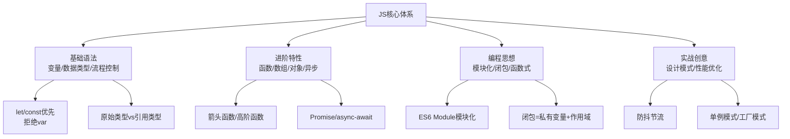
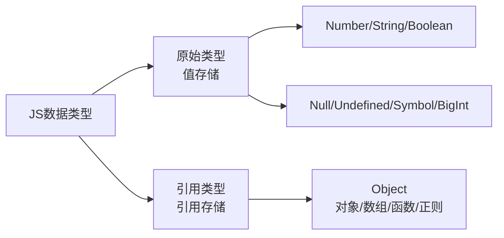

## 一、核心基础：避开坑点，筑牢根基

JS基础看似简单，却藏着很多高频坑点，掌握这些，能避免80%的基础错误，同时传递「**规范编程**」的核心思想。

### 1.1 变量声明：let/const 替代 var（核心规范）

编程思想：**块级作用域+不可变思想**，避免变量污染和提升混乱。

- `var`：函数级作用域，存在变量提升、重复声明、全局污染问题（**禁止使用**）

- `let`：块级作用域，可修改，无变量提升，不允许重复声明（常用）

- `const`：块级作用域，不可修改（指向的引用不可变），必须初始化（优先使用，符合不可变思想）

**避坑示例**：

```javascript

// 错误：var变量提升，打印undefined
console.log(a); 
var a = 10;

// 正确：let/const无提升，报错（更严谨）
console.log(b); 
let b = 10;

// 推荐：优先const，不可变更安全
const PI = 3.14; // 常量用const
let count = 0;   // 需修改的变量用let
```

### 1.2 数据类型：分清“值”与“引用”（高频考点）

JS数据类型分两类，核心区别是「**存储方式**」，这是浅拷贝、深拷贝的根源：


**核心要点**：

- 原始类型：赋值时传递“值”，修改一个不影响另一个

- 引用类型：赋值时传递“引用地址”，修改一个会影响所有指向该地址的变量

**实战坑点**：

```javascript

// 原始类型：互不影响
let a = 10;
let b = a;
b = 20;
console.log(a); // 10（正确）

// 引用类型：互相影响（坑点）
let arr1 = [1,2,3];
let arr2 = arr1;
arr2.push(4);
console.log(arr1); // [1,2,3,4]（意外修改）
```

### 1.3 流程控制：简洁高效，拒绝冗余

编程思想：**简洁性原则**，用更优雅的写法替代冗余代码，提升可读性。

- 三元运算符：替代简单if-else（一行搞定）

    ```javascript
    
    // 冗余
    let result;
    if (score >= 60) {
      result = "及格";
    } else {
      result = "不及格";
    }
    // 简洁
    const result = score >= 60 ? "及格" : "不及格";
    ```

- 短路运算：`&&`（且）、`||`（或），用于默认值和条件执行

    ```javascript
    
    // 取默认值（||：左侧为假，取右侧）
    const name = user.name || "匿名用户";
    // 条件执行（&&：左侧为真，执行右侧）
    isLogin && showUserInfo();
    ```

- for循环优化：优先用`for...of`（数组/类数组）、`for...in`（对象），替代传统for

    ```javascript
    
    // 数组遍历（推荐for...of）
    const arr = [1,2,3];
    for (const item of arr) {
      console.log(item);
    }
    ```

## 二、进阶特性：实战高频，提升效率

这部分是开发中最常用的核心能力，每一个知识点都对应具体场景，搭配「**工程化思想**」，让代码更高效、可维护。

### 2.1 函数：从基础到高阶，优雅封装

函数是JS的核心，掌握这些技巧，实现“一次封装，多次复用”。

#### （1）箭头函数：简化写法，绑定this（高频）

核心优势：简洁、不绑定自身this（继承父级this），避免this指向混乱。

```javascript

// 传统函数
function add(a, b) {
  return a + b;
}
// 箭头函数（简洁版）
const add = (a, b) => a + b;

// 实战场景：解决this指向问题
const obj = {
  name: "JS",
  // 传统函数this指向obj
  say1: function() {
    setTimeout(function() {
      console.log(this.name); // undefined（this指向window）
    }, 1000);
  },
  // 箭头函数this继承父级（obj）
  say2: function() {
    setTimeout(() => {
      console.log(this.name); // JS（正确）
    }, 1000);
  }
};
```

#### （2）高阶函数：函数作为参数/返回值（核心思想）

编程思想：**抽象封装**，将通用逻辑抽离，实现代码复用（如数组方法、防抖节流）。

- 常用高阶函数：`forEach`、`map`、`filter`、`reduce`（数组核心方法，必掌握）

- 实战示例：用`reduce`实现数组求和、去重、扁平化（创意用法）

```javascript

// 1. 求和
const arr = [1,2,3,4];
const sum = arr.reduce((prev, curr) => prev + curr, 0); // 10

// 2. 去重
const uniqueArr = arr.reduce((prev, curr) => {
  return prev.includes(curr) ? prev : [...prev, curr];
}, []);

// 3. 扁平化（多维数组转一维）
const multiArr = [1, [2, [3, 4]]];
const flatArr = multiArr.reduce((prev, curr) => {
  return prev.concat(Array.isArray(curr) ? flatArr(curr) : curr);
}, []);
```

#### （3）闭包：私有变量+作用域延伸（核心难点）

编程思想：**数据私有化**，避免全局污染，实现“模块化”的雏形。

- 定义：函数嵌套函数，内层函数引用外层函数的变量，外层函数返回内层函数。

- 核心用途：实现私有变量、缓存数据、防抖节流。

**实战创意：用闭包实现单例模式（全局唯一实例）**

```javascript

// 闭包实现单例：确保只有一个弹窗实例
const createModal = (() => {
  let modal = null; // 私有变量，仅内层函数可访问
  return () => {
    if (!modal) { // 不存在则创建，存在则直接返回
      modal = document.createElement("div");
      modal.className = "modal";
      document.body.appendChild(modal);
    }
    return modal;
  };
})();

// 多次调用，仅创建一个实例
const modal1 = createModal();
const modal2 = createModal();
console.log(modal1 === modal2); // true（单例生效）
```

### 2.2 数组：高频方法，拒绝冗余循环

数组是JS中最常用的数据结构，掌握这些方法，替代80%的for循环，提升开发效率。

|方法|核心用途|示例|
|---|---|---|
|`map`|数组映射（返回新数组）|`arr.map(item => item * 2)`|
|`filter`|数组过滤（返回符合条件的新数组）|`arr.filter(item => item > 2)`|
|`forEach`|数组遍历（无返回值）|`arr.forEach(item => console.log(item))`|
|`reduce`|数组汇总（求和、去重、扁平化）|见上文示例|
|`find`|查找第一个符合条件的元素|`arr.find(item => item === 3)`|
|`some`/`every`|判断数组是否有/全部符合条件|`arr.some(item => item > 5)`|
创意技巧：链式调用，简化多步操作（如过滤→映射→汇总）

```javascript

const arr = [1,2,3,4,5,6];
// 过滤偶数 → 乘以2 → 求和
const result = arr.filter(item => item % 2 === 0)
                 .map(item => item * 2)
                 .reduce((prev, curr) => prev + curr, 0);
console.log(result); // 2+4+6 → 12 → 乘以2后 24
```

### 2.3 异步编程：从回调地狱到Promise/async-await

异步是JS的核心特性（如接口请求、定时器），掌握这些，彻底解决“回调地狱”，实现优雅异步。

#### （1）回调地狱（问题）

多层嵌套回调，代码混乱、难以维护：

```javascript

// 回调地狱（不推荐）
setTimeout(() => {
  console.log("第一步");
  setTimeout(() => {
    console.log("第二步");
    setTimeout(() => {
      console.log("第三步");
    }, 1000);
  }, 1000);
}, 1000);
```

#### （2）Promise：异步封装（解决回调地狱）

编程思想：**异步标准化**，将异步操作封装为“状态机”，支持链式调用。

- 三个状态：`pending`（等待）、`fulfilled`（成功）、`rejected`（失败）

- 核心方法：`then`（成功回调）、`catch`（失败回调）、`finally`（无论成功失败都执行）

**实战示例：封装接口请求**

```javascript

// 封装Promise版请求
const request = (url) => {
  return new Promise((resolve, reject) => {
    fetch(url)
      .then(res => res.json())
      .then(data => resolve(data)) // 成功，返回数据
      .catch(err => reject(err)); // 失败，返回错误
  });
};

// 链式调用（优雅解决回调地狱）
request("/api/user")
  .then(user => {
    console.log("用户信息：", user);
    return request(`/api/user/${user.id}/orders`); // 链式调用
  })
  .then(orders => console.log("订单信息：", orders))
  .catch(err => console.log("请求失败：", err));
```

#### （3）async-await：异步代码“同步化”（推荐）

编程思想：**简洁化异步**，在Promise基础上，用同步语法写异步代码，可读性拉满。

- 核心：`async`修饰函数（返回Promise），`await`修饰Promise（等待异步完成）

- 注意：`await`必须在`async`函数内，错误用`try-catch`捕获

**优化上面的请求示例**：

```javascript

// async-await写法（更简洁）
const getUserAndOrders = async () => {
  try {
    const user = await request("/api/user"); // 等待请求完成
    const orders = await request(`/api/user/${user.id}/orders`);
    console.log("用户信息：", user);
    console.log("订单信息：", orders);
  } catch (err) {
    console.log("请求失败：", err); // 捕获错误
  }
};

getUserAndOrders();
```

## 三、编程思想：从“会写”到“写好”

JS的精髓不在于语法，而在于背后的编程思想，掌握这些，让你的代码更具可维护性、可扩展性。

### 3.1 模块化思想：ES6 Module（工程化必备）

编程思想：**拆分与复用**，将代码拆分为多个模块，按需导入导出，避免全局污染，是大型项目的基础。

- 核心语法：`export`（导出）、`import`（导入）

- 两种导出方式：

    ```javascript
    
    // 1. 命名导出（多个）
    export const add = (a, b) => a + b;
    export const subtract = (a, b) => a - b;
    
    // 2. 默认导出（一个）
    export default function multiply(a, b) {
      return a * b;
    }
    ```

- 导入方式：

    ```javascript
    
    // 导入命名导出
    import { add, subtract } from "./math.js";
    // 导入默认导出（可自定义名称）
    import multiply from "./math.js";
    // 导入所有（命名为math）
    import * as math from "./math.js";
    ```

### 3.2 函数式编程：纯函数+无副作用

编程思想：**可预测性**，纯函数不依赖外部变量、不修改外部数据，输入相同，输出必相同，便于测试和复用。

- 纯函数条件：

    1. 不依赖外部变量（如全局变量）

    2. 不修改外部数据（如不改变数组、对象）

    3. 输入相同，输出必相同

**示例对比**：

```javascript

// 非纯函数（修改外部数组，有副作用）
let arr = [1,2,3];
function addItem(item) {
  arr.push(item); // 修改外部数组
  return arr;
}

// 纯函数（不修改外部，返回新数组）
function addItemPure(arr, item) {
  return [...arr, item]; // 不修改原数组，返回新数组
}
```

### 3.3 面向对象编程：class与继承（封装复用）

编程思想：**封装与继承**，将属性和方法封装为类，通过继承实现代码复用，适合复杂组件（如React/Vue组件）。

- ES6 class语法（简洁替代传统构造函数）：

```javascript

// 父类：Person
class Person {
  constructor(name, age) {
    this.name = name; // 实例属性
    this.age = age;
  }

  sayHello() { // 实例方法
    console.log(`Hello, I'm ${this.name}`);
  }

  static getSpecies() { // 静态方法（类调用，不实例化）
    return "Human";
  }
}

// 子类：Student（继承Person）
class Student extends Person {
  constructor(name, age, studentId) {
    super(name, age); // 调用父类构造函数
    this.studentId = studentId; // 子类独有属性
  }

  study() { // 子类独有方法
    console.log(`${this.name} is studying`);
  }
}

// 使用
const student = new Student("小明", 18, "2024001");
student.sayHello(); // 继承父类方法
student.study(); // 子类方法
console.log(Student.getSpecies()); // 调用静态方法
```

## 四、开发创意与实战技巧

结合前面的知识点，分享几个高频实战创意，帮你在开发中“举一反三”，提升代码质感。

### 4.1 防抖节流：解决高频触发问题（如搜索、滚动）

创意思想：**性能优化**，限制函数触发频率，避免频繁执行导致页面卡顿。

- 防抖（debounce）：触发后延迟n秒执行，期间再次触发则重置延迟（如搜索输入）

- 节流（throttle）：每隔n秒只执行一次，无论触发多少次（如滚动监听）

**用闭包实现防抖（实战代码）**：

```javascript

// 防抖函数（闭包+定时器）
const debounce = (fn, delay = 300) => {
  let timer = null; // 私有变量，缓存定时器
  return (...args) => {
    clearTimeout(timer); // 再次触发，重置定时器
    timer = setTimeout(() => {
      fn.apply(this, args); // 执行函数
    }, delay);
  };
};

// 使用：搜索输入防抖
const searchInput = document.querySelector("input");
searchInput.addEventListener("input", debounce((e) => {
  console.log("搜索关键词：", e.target.value);
  // 调用搜索接口...
}, 500));
```

### 4.2 深拷贝：彻底解决引用类型修改问题

创意技巧：用递归实现深拷贝，支持数组、对象、嵌套结构（比`JSON.parse(JSON.stringify())`更强大）。

```javascript

const deepClone = (obj) => {
  // 不是对象/数组，直接返回（原始类型）
  if (obj === null || typeof obj !== "object") return obj;
  // 数组：创建新数组，递归拷贝每一项
  if (Array.isArray(obj)) return obj.map(item => deepClone(item));
  // 对象：创建新对象，递归拷贝每一个属性
  const newObj = {};
  for (const key in obj) {
    newObj[key] = deepClone(obj[key]);
  }
  return newObj;
};

// 测试
const obj = { name: "JS", arr: [1, [2, 3]] };
const cloneObj = deepClone(obj);
cloneObj.arr[1].push(4);
console.log(obj.arr); // [1, [2,3]]（原对象未修改）
```

### 4.3 可选链操作符（?.）：简化空值判断（ES6+）

创意思想：**简洁性**，避免大量`if (obj && obj.prop && obj.prop.child)`的冗余判断。

```javascript

// 冗余写法
const userName = obj && obj.user && obj.user.name;

// 简洁写法（可选链）
const userName = obj?.user?.name; // 不存在则返回undefined，不报错

// 搭配空值合并运算符（??），设置默认值
const userName = obj?.user?.name ?? "匿名用户";
```

## 五、最佳实践与避坑指南

### 5.1 最佳实践（提升代码质量）

1. **变量命名**：采用驼峰命名（如`userName`），常量用大写下划线（如`MAX_NUM`），语义化命名（拒绝`a/b/c`）

2. **函数封装**：单一职责原则（一个函数只做一件事），函数长度不超过50行

3. **异步处理**：优先用`async-await`，避免回调地狱，所有异步错误必须捕获（`try-catch`）

4. **代码格式化**：用ESLint+Prettier，统一代码风格（如缩进、分号、引号）

### 5.2 高频避坑指南

1. **this指向混乱**：箭头函数适合回调（继承父级this），普通函数适合类方法（指向实例）

2. **引用类型修改**：避免直接修改数组/对象，优先返回新值（符合不可变思想）

3. **异步代码顺序**：不要在`await`外使用异步结果，避免“先执行后等待”的错误

4. **NaN判断**：`NaN !== NaN`，判断是否为NaN用`Number.isNaN()`

5. **隐式类型转换**：避免`==`，优先用`===`（严格相等，不做类型转换）

## 结尾

JavaScript的学习，从来不是“背语法”，而是“理解思想、灵活运用”。从基础的变量、数据类型，到进阶的异步、闭包，再到模块化、函数式编程，每一步都是对“优雅、可维护”的追求。

本文汇总的知识点，覆盖了开发中99%的高频场景，搭配的编程思想和创意技巧，能帮你跳出“只会写业务代码”的局限，实现从“会写”到“写好”的进阶。

建议你把这些知识点融入日常开发，多思考“为什么这么写”，而不是“这么写能运行”，在实践中积累经验，逐步形成自己的编程风格。