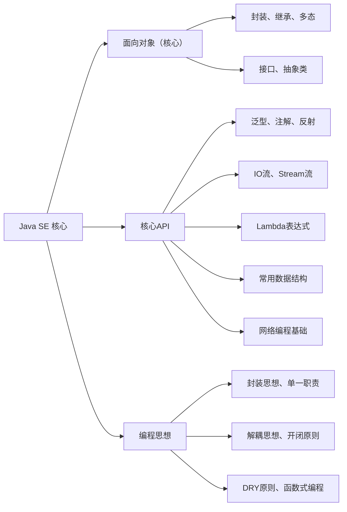
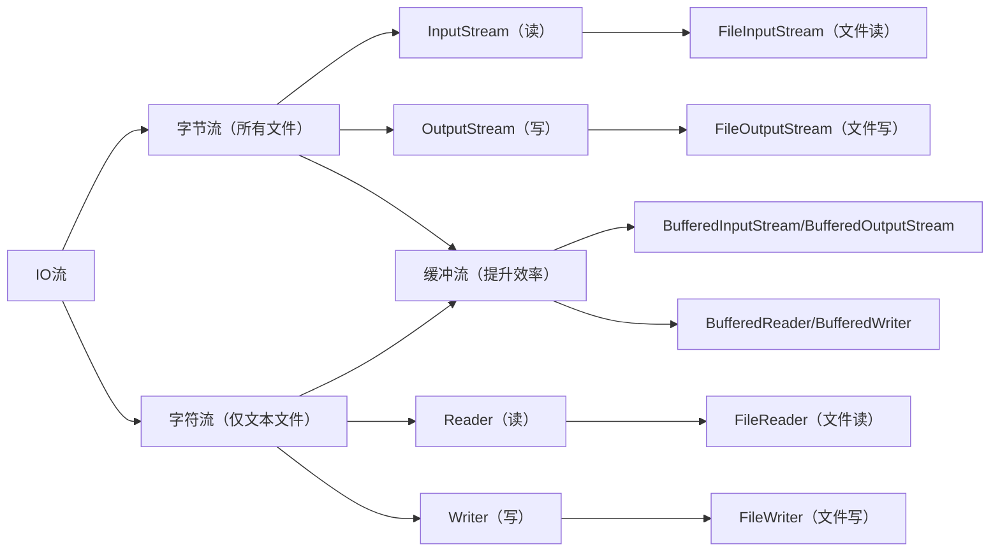

Java SE（Standard Edition）是Java开发的基础，所有Java进阶（EE、Android）都基于此，核心围绕「面向对象」展开，重点掌握“基础语法+核心API+编程思想”，以下汇总的知识点覆盖SE开发80%高频场景，优先掌握不踩坑。

**Mermaid Java SE 核心知识点关联图解**：



---

每个知识点遵循「核心定义→最简示例→编程思想→开发创意」，示例可直接复制运行，重点标注高频考点和避坑点。

## 2.1 面向对象（Java SE 核心，重中之重）

### 核心定义

Java的核心思想，将现实世界的事物抽象为「类」，通过「对象」实例化，核心是 **封装、继承、多态**（三大特性），解决“结构化编程的代码冗余、维护困难”问题。

### 最简示例（三大特性实战）

```java
// 1. 封装（隐藏细节，暴露接口，体现封装思想）
class Person {
    // 私有属性（隐藏细节）
    private String name;
    private int age;

    // 公共接口（暴露操作方式）
    public String getName() { return name; }
    public void setName(String name) {
        // 可添加校验，体现严谨性
        if (name != null && !name.isEmpty()) {
            this.name = name;
        }
    }
}

// 2. 继承（复用代码，体现DRY原则）
class Student extends Person {
    // 新增子类特有属性
    private String studentId;

    // 重写父类方法（体现多态）
    @Override
    public String getName() {
        return "学生：" + super.getName();
    }
}

// 3. 多态（统一接口，不同实现，体现开闭原则）
public class Test {
    public static void main(String[] args) {
        Person p1 = new Person();
        Person p2 = new Student(); // 父类引用指向子类对象
        System.out.println(p1.getName()); // 父类实现
        System.out.println(p2.getName()); // 子类重写实现
    }
}
```

### 编程思想

- **封装思想**：隐藏对象内部细节，仅通过公共接口交互，降低耦合，提升可维护性；

- **继承思想**：复用父类共性代码，子类专注实现特有功能，避免重复开发（DRY原则）；

- **多态思想**：统一接口，不同实现，新增子类无需修改原有代码（开闭原则），提升扩展性。

### 开发创意（实战可用）

封装「通用实体类父类」，统一处理共性字段（如id、创建时间），所有实体类继承，减少重复代码：

```java
// 通用父类（封装共性字段）
public abstract class BaseEntity {
    private Long id;
    private LocalDateTime createTime;

    // 构造器、getter/setter 统一实现
    public BaseEntity() {
        this.createTime = LocalDateTime.now(); // 自动赋值创建时间
    }
    // getter/setter...
}

// 子类继承，专注特有字段
public class User extends BaseEntity {
    private String username;
    private String password;
    // 仅需实现特有字段的getter/setter，共性字段直接继承
}
```

## 2.2 泛型（类型安全神器）

### 核心定义

参数化类型，本质是「类型占位符」，解决 **集合存储类型不明确、强制转换繁琐、类型不安全** 问题，核心是“编译期类型检查”。

### 最简示例（泛型类+泛型方法）

```java
// 1. 泛型类（通用容器，适配多种类型）
class GenericContainer<T> { // T是类型占位符，使用时指定具体类型
    private T data;

    public T getData() { return data; }
    public void setData(T data) { this.data = data; }
}

// 2. 泛型方法（通用工具方法）
public class GenericUtil {
    // 泛型方法，返回任意类型的数组第一个元素
    public static <E> E getFirstElement(E[] array) {
        if (array == null || array.length == 0) {
            return null;
        }
        return array[0];
    }
}

// 测试
public class Test {
    public static void main(String[] args) {
        // 泛型类使用，指定String类型
        GenericContainer<String> strContainer = new GenericContainer<>();
        strContainer.setData("Java SE");
        
        // 泛型方法使用，自动推断类型
        Integer[] intArray = {1,2,3};
        System.out.println(GenericUtil.getFirstElement(intArray)); // 1
    }
}
```

### 编程思想

- **类型安全思想**：编译期检查类型，避免运行时类型转换异常（ClassCastException）；

- **通用化思想**：一份代码适配多种类型，减少重复开发，体现DRY原则；

- **开闭原则**：新增类型无需修改泛型代码，直接复用。

### 开发创意（实战可用）

封装「泛型通用工具类」，处理集合、数组的通用操作（如排序、筛选），适配所有类型：

```java
// 泛型工具类，处理集合通用操作
public class GenericCollectionUtil {
    // 泛型方法：筛选集合中符合条件的元素
    public static <T> List<T> filter(List<T> list, Predicate<T> predicate) {
        List<T> result = new ArrayList<>();
        for (T t : list) {
            if (predicate.test(t)) {
                result.add(t);
            }
        }
        return result;
    }
}

// 使用（筛选List<User>中年龄大于18的用户）
List<User> userList = Arrays.asList(new User("张三", 20), new User("李四", 17));
List<User> adultList = GenericCollectionUtil.filter(userList, u -> u.getAge() > 18);
```

## 2.3 注解（简化配置，解耦神器）

### 核心定义

Java SE 5引入，本质是「标记/配置工具」，用于 **简化配置、标记代码、实现解耦**，无需编写大量冗余配置代码，常用在框架、工具类开发中。

核心分类：内置注解（@Override、@Deprecated）、自定义注解。

### 最简示例（自定义注解+使用）

```java
// 1. 自定义注解（用@interface声明）
@Target(ElementType.METHOD) // 注解作用范围：方法
@Retention(RetentionPolicy.RUNTIME) // 注解保留到运行时，可通过反射获取
public @interface Log {
    // 注解属性（可选，默认值可省略）
    String value() default "执行方法";
}

// 2. 使用注解
public class UserService {
    // 给方法添加注解，标记方法执行需要打印日志
    @Log("用户查询方法")
    public User getUserById(Long id) {
        // 模拟查询
        return new User("张三", 20);
    }
}

// 3. 解析注解（结合反射，后续反射章节详解）
public class AnnotationParser {
    public static void main(String[] args) throws NoSuchMethodException {
        Method method = UserService.class.getMethod("getUserById", Long.class);
        if (method.isAnnotationPresent(Log.class)) {
            Log log = method.getAnnotation(Log.class);
            System.out.println("方法描述：" + log.value()); // 输出：用户查询方法
        }
    }
}
```

### 编程思想

- **解耦思想**：用注解替代硬编码配置，分离业务逻辑与配置，提升可维护性；

- **标记思想**：通过注解标记代码功能，简化逻辑判断，提升代码可读性；

- **开闭原则**：新增注解功能无需修改原有代码，仅需添加注解即可。

### 开发创意（实战可用）

自定义「参数校验注解」，简化方法参数校验（替代大量if-else，体现简洁性）：

```java
// 自定义参数非空注解
@Target(ElementType.PARAMETER)
@Retention(RetentionPolicy.RUNTIME)
public @interface NotNull {
    String message() default "参数不能为空";
}

// 校验工具类
public class ParamValidateUtil {
    public static void validate(Object[] params, Parameter[] parameters) {
        for (int i = 0; i < params.length; i++) {
            if (parameters[i].isAnnotationPresent(NotNull.class)) {
                if (params[i] == null) {
                    NotNull notNull = parameters[i].getAnnotation(NotNull.class);
                    throw new IllegalArgumentException(notNull.message());
                }
            }
        }
    }
}

// 使用（方法参数添加@NotNull，自动校验）
public class UserService {
    public void addUser(@NotNull(message = "用户名不能为空") String username) {
        // 业务逻辑
    }
}
```

## 2.4 反射（动态编程核心）

### 核心定义

Java的动态特性，允许程序在 **运行时** 获取类的信息（属性、方法、构造器）、创建对象、调用方法，核心是「Class类」，解决“编译期无法确定类类型”的问题，是框架（Spring）的核心底层原理。

### 最简示例（反射核心操作）

```java
public class User {
    private String name;
    public int age;

    // 无参构造
    public User() {}
    // 有参构造
    public User(String name, int age) {
        this.name = name;
        this.age = age;
    }

    // 私有方法
    private void sayHello() {
        System.out.println("Hello, " + name);
    }
}

// 反射实战
public class ReflectTest {
    public static void main(String[] args) throws Exception {
        // 1. 获取Class对象（三种方式，最常用第一种）
        Class<User> userClass = User.class;

        // 2. 反射创建对象（调用无参构造）
        User user = userClass.newInstance();

        // 3. 反射获取属性并赋值（私有属性需设置可访问）
        Field nameField = userClass.getDeclaredField("name");
        nameField.setAccessible(true); // 突破私有访问限制
        nameField.set(user, "张三");

        // 4. 反射调用方法（私有方法需设置可访问）
        Method sayHelloMethod = userClass.getDeclaredMethod("sayHello");
        sayHelloMethod.setAccessible(true);
        sayHelloMethod.invoke(user); // 输出：Hello, 张三
    }
}
```

### 编程思想

- **动态编程思想**：运行时动态获取类信息、调用方法，无需编译期确定类类型，提升灵活性；

- **解耦思想**：通过反射动态创建对象，避免硬编码new对象，降低类之间的耦合；

- **封装思想**：反射可突破访问限制，但实际开发中需谨慎使用，避免破坏封装性。

### 开发创意（实战可用）

封装「反射对象赋值工具」，通过Map自动给对象赋值（常用于接口参数转换，体现高效性）：

```java
// 反射赋值工具类
public class ReflectAssignUtil {
    // 将Map中的键值对，赋值给对象对应的属性（属性名与Map的key一致）
    public static <T> T assign(Class<T> clazz, Map<String, Object> map) throws Exception {
        T obj = clazz.newInstance();
        for (Map.Entry<String, Object> entry : map.entrySet()) {
            try {
                Field field = clazz.getDeclaredField(entry.getKey());
                field.setAccessible(true);
                field.set(obj, entry.getValue());
            } catch (NoSuchFieldException e) {
                // 忽略不存在的属性，提升容错性
                continue;
            }
        }
        return obj;
    }
}

// 使用（Map转User对象）
Map&lt;String, Object&gt; map = new HashMap<>();
map.put("name", "张三");
map.put("age", 20);
User user = ReflectAssignUtil.assign(User.class, map);
```

## 2.5 IO流（文件/数据操作核心）

### 核心定义

用于处理「文件读写、数据传输」，核心分为 **字节流（InputStream/OutputStream）** 和 **字符流（Reader/Writer）**，字节流适用于所有文件（图片、视频、文本），字符流仅适用于文本文件。

**Mermaid IO流分类图解**：



### 最简示例（文件读写，推荐缓冲流提升效率）

```java
// 1. 缓冲字符流读取文本文件（高效）
public static String readFile(String filePath) {
    StringBuilder sb = new StringBuilder();
    // try-with-resources 自动关闭流，避免资源泄漏（Java 7+）
    try (BufferedReader br = new BufferedReader(new FileReader(filePath))) {
        String line;
        while ((line = br.readLine()) != null) { // 一行一行读
            sb.append(line).append("\n");
        }
    } catch (IOException e) {
        e.printStackTrace();
    }
    return sb.toString();
}

// 2. 缓冲字符流写入文本文件（高效）
public static void writeFile(String filePath, String content) {
    try (BufferedWriter bw = new BufferedWriter(new FileWriter(filePath, true))) {
        // true表示追加写入，false表示覆盖写入
        bw.write(content);
        bw.newLine(); // 换行
    } catch (IOException e) {
        e.printStackTrace();
    }
}
```

### 编程思想

- **装饰器模式**：缓冲流（BufferedXXX）装饰基础流，提升读写效率，无需修改基础流代码（开闭原则）；

- **资源管理思想**：使用try-with-resources自动关闭流，避免资源泄漏，体现严谨性；

- **分层思想**：基础流负责底层读写，缓冲流负责提升效率，各司其职，可维护性强。

### 开发创意（实战可用）

封装「通用IO工具类」，统一处理文件读写、复制，避免重复代码（体现DRY原则）：

```java
public class IOUtil {
    // 复制文件（适配所有文件类型，字节流）
    public static void copyFile(String sourcePath, String targetPath) {
        try (InputStream is = new FileInputStream(sourcePath);
             OutputStream os = new FileOutputStream(targetPath);
             // 缓冲流提升效率
             BufferedInputStream bis = new BufferedInputStream(is);
             BufferedOutputStream bos = new BufferedOutputStream(os)) {

            byte[] buffer = new byte[1024]; // 缓冲区，减少IO次数
            int len;
            while ((len = bis.read(buffer)) != -1) {
                bos.write(buffer, 0, len);
            }
        } catch (IOException e) {
            e.printStackTrace();
        }
    }
}
```

## 2.6 Stream流（Java 8+ 集合操作神器）

### 核心定义

Java 8引入，用于 **简化集合/数组的遍历、筛选、映射、排序** 等操作，核心是「函数式编程」，替代传统for循环，代码更简洁、易读，效率更高。

### 最简示例（Stream流核心操作）

```java
public class StreamTest {
    public static void main(String[] args) {
        List<User> userList = Arrays.asList(
            new User("张三", 20, "男"),
            new User("李四", 17, "女"),
            new User("王五", 25, "男"),
            new User("赵六", 22, "男")
        );

        // Stream流操作：筛选男性、年龄>20，提取姓名，排序，转为List
        List<String> nameList = userList.stream()
                .filter(u -> "男".equals(u.getGender())) // 筛选
                .filter(u -> u.getAge() > 20) // 二次筛选
                .map(User::getName) // 映射（提取姓名）
                .sorted() // 排序
                .collect(Collectors.toList()); // 收集结果

        System.out.println(nameList); // 输出：[王五, 赵六]
    }
}
```

### 编程思想

- **函数式编程思想**：通过lambda表达式传递逻辑，简化代码，聚焦“做什么”而非“怎么做”；

- **链式编程思想**：Stream流操作可链式调用，逻辑连贯，可读性强；

- **惰性求值思想**：中间操作（filter、map）不立即执行，只有终止操作（collect）时才执行，提升效率。

### 开发创意（实战可用）

封装「Stream流通用工具」，处理集合常用操作（如分组、统计），适配所有类型：

```java
public class StreamUtil {
    // 按指定字段分组（泛型+函数式接口，通用化）
    public static <T, K> Map<K, List<T>> groupBy(List<T> list, Function<T, K> classifier) {
        return list.stream().collect(Collectors.groupingBy(classifier));
    }

    // 统计集合中符合条件的元素数量
    public static <T> long count(List<T> list, Predicate<T> predicate) {
        return list.stream().filter(predicate).count();
    }
}

// 使用（按性别分组，统计男性数量）
Map<String, List<User>> groupByGender = StreamUtil.groupBy(userList, User::getGender);
long maleCount = StreamUtil.count(userList, u -> "男".equals(u.getGender()));
```

## 2.7 Lambda表达式（Java 8+ 简化代码神器）

### 核心定义

函数式编程的核心，用于 **简化匿名内部类**（如Runnable、Comparator），语法简洁，聚焦“核心逻辑”，本质是“可传递的代码块”。

核心语法：`(参数列表) -> 核心逻辑`（单条语句可省略{}和return）。

### 最简示例（Lambda常用场景）

```java
public class LambdaTest {
    public static void main(String[] args) {
        // 1. 简化Runnable（线程创建）
        // 传统匿名内部类
        new Thread(new Runnable() {
            @Override
            public void run() {
                System.out.println("传统线程");
            }
        }).start();

        // Lambda简化（无参数、无返回值）
        new Thread(() -> System.out.println("Lambda线程")).start();

        // 2. 简化Comparator（集合排序）
        List<User> userList = Arrays.asList(new User("张三", 20), new User("李四", 17));
        // 传统匿名内部类（按年龄排序）
        Collections.sort(userList, new Comparator<User>() {
            @Override
            public int compare(User u1, User u2) {
                return u1.getAge() - u2.getAge();
            }
        });

        // Lambda简化（有参数、有返回值）
        Collections.sort(userList, (u1, u2) -> u1.getAge() - u2.getAge());
    }
}
```

### 编程思想

- **函数式编程思想**：将代码块作为参数传递，简化代码，提升可读性；

- **简洁性思想**：省略冗余的匿名内部类语法，聚焦核心逻辑，减少代码量；

- **可复用思想**：Lambda表达式可提取为变量，重复使用，体现DRY原则。

### 开发创意（实战可用）

用Lambda简化「集合遍历、排序、筛选」，结合Stream流，实现一行代码完成复杂操作（体现高效性）：

```java
// 一行代码：遍历集合，筛选年龄>18，按年龄降序，打印姓名
userList.stream()
        .filter(u -> u.getAge() > 18)
        .sorted((u1, u2) -> u2.getAge() - u1.getAge())
        .forEach(u -> System.out.println(u.getName()));
```

## 2.8 常用数据结构（SE 高频考点）

### 核心定义

Java SE 常用数据结构均位于 `java.util` 包下，核心分为「List、Set、Map」三大接口，重点掌握其 **特点、底层实现、适用场景**，是开发中存储数据的核心。

### 核心对比（最简版，直接记）

|数据结构|**底层实现**|**核心特点**|**适用场景**|
|---|---|---|---|
|ArrayList|数组|查询快、增删慢、可重复、有序|高频查询、少量增删（如列表展示）|
|LinkedList|双向链表|查询慢、增删快、可重复、有序|高频增删、少量查询（如队列、栈）|
|HashSet|HashMap|不可重复、无序、查询快|去重、快速判断元素是否存在|
|TreeSet|红黑树|不可重复、有序（自然排序）|去重+排序（如排行榜）|
|HashMap|数组+链表/红黑树|键值对、键唯一、值可重复、查询快|高频键值对查询（如缓存、配置）|
### 编程思想

- **数据结构选型思想**：根据“查询/增删频率”选型，避免盲目使用（如高频增删用LinkedList，高频查询用ArrayList）；

- **封装思想**：Java集合框架封装了底层实现，开发者无需关注底层细节，直接调用API即可；

- **效率优先思想**：不同数据结构的效率差异较大，选型时优先考虑业务场景的效率需求。

### 开发创意（实战可用）

封装「集合工具类」，处理常用操作（如去重、排序、空判断），避免重复代码：

```java
public class CollectionUtil {
    // 集合去重（通用，适配所有类型）
    public static <T> List&lt;T&gt; distinct(List&lt;T&gt; list) {
        return new ArrayList<>(new HashSet<>(list));
    }

    // 判断集合是否为空（避免空指针异常，体现严谨性）
    public static <T> boolean isEmpty(Collection<T> collection) {
        return collection == null || collection.isEmpty();
    }

    // 集合排序（通用，按指定字段排序）
    public static <T, U extends Comparable<U>> List<T> sort(List<T> list, Function<T, U> keyExtractor) {
        return list.stream().sorted(Comparator.comparing(keyExtractor)).collect(Collectors.toList());
    }
}
```

## 2.9 网络编程基础（SE 核心入门）

### 核心定义

Java SE 网络编程基于「TCP/IP协议」，核心是 **客户端（Client）+ 服务器（Server）** 通信，重点掌握TCP通信（面向连接、可靠传输），UDP通信（无连接、不可靠，了解即可）。

### 最简示例（TCP客户端+服务器通信）

```java
// 1. TCP服务器（接收客户端请求，返回响应）
public class TcpServer {
    public static void main(String[] args) throws IOException {
        // 1. 创建服务器Socket，绑定端口
        ServerSocket serverSocket = new ServerSocket(8888);
        System.out.println("服务器启动，等待客户端连接...");

        // 2. 监听客户端连接（阻塞式）
        Socket socket = serverSocket.accept();

        // 3. 读取客户端消息
        BufferedReader br = new BufferedReader(new InputStreamReader(socket.getInputStream()));
        String clientMsg = br.readLine();
        System.out.println("客户端消息：" + clientMsg);

        // 4. 向客户端发送响应
        BufferedWriter bw = new BufferedWriter(new OutputStreamWriter(socket.getOutputStream()));
        bw.write("服务器已收到消息：" + clientMsg);
        bw.newLine();
        bw.flush();

        // 5. 关闭资源
        bw.close();
        br.close();
        socket.close();
        serverSocket.close();
    }
}

// 2. TCP客户端（发送请求，接收服务器响应）
public class TcpClient {
    public static void main(String[] args) throws IOException {
        // 1. 创建客户端Socket，连接服务器（IP+端口）
        Socket socket = new Socket("localhost", 8888);

        // 2. 向服务器发送消息
        BufferedWriter bw = new BufferedWriter(new OutputStreamWriter(socket.getOutputStream()));
        bw.write("Hello, TCP Server!");
        bw.newLine();
        bw.flush();

        // 3. 读取服务器响应
        BufferedReader br = new BufferedReader(new InputStreamReader(socket.getInputStream()));
        String serverMsg = br.readLine();
        System.out.println("服务器响应：" + serverMsg);

        // 4. 关闭资源
        br.close();
        bw.close();
        socket.close();
    }
}
```

### 编程思想

- **面向接口思想**：Socket接口统一了客户端与服务器的通信方式，无需关注底层协议细节；

- **阻塞式通信思想**：TCP通信是阻塞式的（accept、read方法阻塞），适合简单通信场景；

- **资源管理思想**：通信结束后必须关闭Socket、流资源，避免资源泄漏。

### 开发创意（实战可用）

封装「TCP通信工具类」，简化客户端与服务器的通信代码，可直接复用：

```java
// TCP通信工具类
public class TcpUtil {
    // 客户端发送消息并接收响应
    public static String sendMsg(String ip, int port, String msg) throws IOException {
        try (Socket socket = new Socket(ip, port);
             BufferedWriter bw = new BufferedWriter(new OutputStreamWriter(socket.getOutputStream()));
             BufferedReader br = new BufferedReader(new InputStreamReader(socket.getInputStream()))) {

            bw.write(msg);
            bw.newLine();
            bw.flush();
            return br.readLine(); // 返回服务器响应
        }
    }
}

// 使用（客户端快速发送消息）
String response = TcpUtil.sendMsg("localhost", 8888, "Hello, Server!");
System.out.println("服务器响应：" + response);
```

---


1. **优先级排序**：面向对象 → 常用数据结构 → Stream流/Lambda → IO流 → 泛型 → 注解/反射 → 网络编程；

2. **学习技巧**：每个知识点先掌握“核心定义+最简示例”，再通过开发创意拓展实用场景，避免盲目刷API；

3. **避坑点**：IO流忘记关闭、反射突破封装性滥用、数据结构选型错误、泛型类型擦除误解；

4. **编程思想**：重点领悟封装、解耦、DRY原则、函数式编程，这些是提升代码质感的关键。

SE是Java开发的根基，掌握以上知识点，就能轻松应对基础开发、笔试面试，为后续Java EE、框架学习打下坚实基础。

如果需要某知识点的进阶示例（如反射进阶、Stream流复杂操作、IO流异常处理），欢迎留言交流！