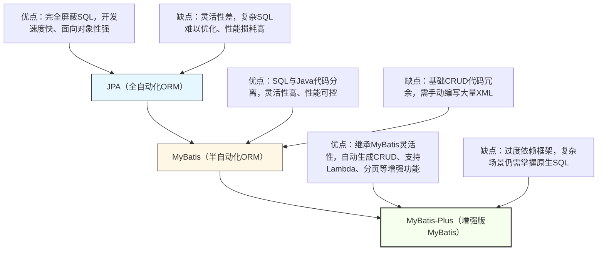

## 一、ORM技术迭代解析（JPA → MyBatis → MyBatis-Plus）

ORM技术的迭代，本质是「**平衡开发效率与灵活性**」的过程——从“完全屏蔽SQL”到“半自动化SQL”，再到“自动化+高灵活”，每一步都贴合企业级开发的实际需求，核心逻辑围绕“简化开发、提升效率、降低耦合”展开。

### 1. 迭代脉络可视化（清晰看懂演进逻辑）


### 2. 三代ORM技术详细对比（干练不冗余，抓核心差异）

|ORM框架|核心定位|核心特性|适用场景|核心编程思想|
|---|---|---|---|---|
|**JPA（Hibernate）**|全自动化ORM，面向对象优先|1. 基于注解/XML映射对象与表；2. 完全屏蔽SQL，通过API操作数据库；3. 支持级联查询、缓存机制|小型项目、快速原型开发，无需复杂SQL优化|面向对象思想、封装思想（屏蔽SQL细节）|
|**MyBatis**|半自动化ORM，SQL与Java分离|1. 接口+XML映射，SQL完全可控；2. 支持动态SQL、参数绑定；3. 轻量级，性能优于JPA|中大型项目，需要优化SQL、追求性能|分离思想（SQL与Java分离）、灵活适配思想|
|**MyBatis-Plus（MP）**|增强版MyBatis，自动化+高灵活|1. 继承MyBatis所有特性；2. 自动生成CRUD代码；3. 支持Lambda查询、分页、条件构造；4. 无侵入式增强|所有SpringBoot项目（主流选择），兼顾开发效率与灵活性|增强思想（不改变原有逻辑，补充实用功能）、约定优于配置、简化开发思想|
### 3. 迭代核心结论（必记）

✅ 迭代逻辑：**开发效率**（JPA最高）→ **灵活性+性能**（MyBatis最优）→ **效率+灵活+性能**（MyBatis-Plus均衡）；

✅ 企业级首选：MyBatis-Plus（无侵入式增强MyBatis，既保留SQL灵活性，又解决基础CRUD冗余问题）；

✅ 避坑点：不要盲目追求“完全屏蔽SQL”（JPA的短板），也不要重复编写基础CRUD（MyBatis的痛点），MP完美平衡二者。

## 二、MyBatis-Plus核心知识点（实战高频，必记必用）

MyBatis-Plus的核心是「**无侵入式增强**」——完全兼容MyBatis，无需修改原有MyBatis代码，仅通过简单配置和API，实现基础CRUD自动化、条件查询简化、分页便捷化，以下是实战中高频使用的知识点，干练不冗余。

### 1. 核心前置配置（SpringBoot整合MP）

MP整合SpringBoot极其简单，核心依赖+少量配置，即可快速上手（替代MyBatis的配置）。

#### （1）核心依赖（Maven）

```xml
<!-- MyBatis-Plus核心依赖 -->
<dependency>
    <groupId>com.baomidou</groupId>
    <artifactId>mybatis-plus-boot-starter</artifactId>
    <version>3.5.3.1</version>
</dependency>
<!-- 数据库驱动（MySQL） -->
<dependency>
    <groupId>com.mysql</groupId>
    <artifactId>mysql-connector-j</artifactId>
    <scope>runtime</scope>
</dependency>
<!-- 代码生成器（可选，推荐） -->
<dependency>
    <groupId>com.baomidou</groupId>
    <artifactId>mybatis-plus-generator</artifactId>
    <version>3.5.3.1</version>
</dependency>
```

#### （2）application.yml配置（核心3项）

```yaml
spring:
  datasource:
    driver-class-name: com.mysql.cj.jdbc.Driver
    url: jdbc:mysql://localhost:3306/demo?useUnicode=true&characterEncoding=utf-8&serverTimezone=Asia/Shanghai
    username: root
    password: 123456

mybatis-plus:
  mapper-locations: classpath:mapper/**/*.xml # 映射文件路径（与MyBatis一致）
  type-aliases-package: com.example.demo.entity # 实体类包路径（简化XML中的类名）
  configuration:
    map-underscore-to-camel-case: true # 下划线转驼峰（默认开启，无需手动配置）
```
#### （3）启动类注解

```java
@SpringBootApplication
@MapperScan("com.example.demo.mapper") // 扫描mapper接口（核心，否则MP无法识别）
public class DemoApplication {
    public static void main(String[] args) {
        SpringApplication.run(DemoApplication.class, args);
    }
}
```

### 2. 核心注解（实体类专用，必记）

MP的注解用于映射「实体类→数据库表」，替代MyBatis的XML映射（简单场景无需写XML），高频注解仅5个，拒绝冗余。

- **@TableName**：指定实体类对应数据库表名（解决“实体类名≠表名”问题）；
        
示例：`@TableName("sys_user")`（实体类User对应表sys_user）
     

- **@TableId**：指定主键字段，核心属性type（主键生成策略），常用2种：
        
- `type = IdType.AUTO`：自增（MySQL常用）；
        
- `type = IdType.ASSIGN_UUID`：UUID生成；
        
示例：`@TableId(type = IdType.AUTO) private Long id;`

- **@TableField**：指定实体类字段对应数据库列名（解决“字段名≠列名”“忽略字段”问题）；
       
示例：`@TableField("user_name") private String username;`（字段username对应列user_name）；
        
示例：`@TableField(exist = false) private String statusDesc;`（该字段不对应数据库列，仅用于前端展示）
      

- **@Version**：乐观锁注解，用于解决并发更新冲突（MP自动实现乐观锁逻辑）；
        
示例：`@Version private Integer version;`（数据库需新增version列，默认值0）
      

- **@TableLogic**：逻辑删除注解（软删除，不物理删除数据，仅修改删除标识）；
        
示例：`@TableLogic private Integer isDeleted;`（数据库需新增is_deleted列，0=未删除，1=已删除）
      

### 3. 核心API（BaseMapper + IService，简化CRUD）

MP最核心的优势的是「**自动生成基础CRUD代码**」，通过继承BaseMapper（持久层）和IService（服务层），无需编写任何SQL，即可实现增删改查，大幅提升开发效率。

#### （1）持久层：BaseMapper（必继承）

所有mapper接口继承BaseMapper<T>，即可获得MP提供的17种基础CRUD方法，无需编写任何XML或SQL。

```java
// 核心：继承BaseMapper，泛型为实体类
@Mapper
public interface UserMapper extends BaseMapper<User> {
    // 无需编写基础CRUD方法，MP自动提供
    // 复杂SQL可在此处写注解或在XML中编写
}
```

高频常用方法（干练总结，无需记全，重点记以下5种）：

- `selectById(Long id)`：根据主键查询（最常用）；

- `insert(User user)`：新增数据（自动填充主键）；

- `updateById(User user)`：根据主键更新（仅更新非null字段）；

- `deleteById(Long id)`：根据主键删除（物理删除，搭配@TableLogic实现软删除）；

- `selectList(QueryWrapper<User> queryWrapper)`：条件查询（搭配条件构造器）。

#### （2）服务层：IService + ServiceImpl（推荐使用）

IService是MP提供的服务层接口，封装了BaseMapper的方法，还新增了批量操作、分页查询等增强方法，推荐服务层继承使用，进一步简化代码。

```java
// 1. 服务层接口：继承IService
public interface UserService extends IService<User> {
    // 自定义业务方法（基础CRUD无需编写）
}

// 2. 服务层实现类：继承ServiceImpl，实现自定义接口
@Service
public class UserServiceImpl extends ServiceImpl<UserMapper, User> implements UserService {
    // 无需重写基础CRUD方法，MP自动实现
    // 示例：自定义业务方法
    public User getUserByUsername(String username) {
        // 搭配条件构造器实现查询
        return lambdaQuery().eq(User::getUsername, username).one();
    }
}
```

IService新增高频方法（补充BaseMapper不足）：

- `saveBatch(List<User> userList)`：批量新增；

- `updateBatchById(List<User> userList)`：批量更新；

- `page(Page<User> page, QueryWrapper<User> queryWrapper)`：分页查询；

- `lambdaQuery()`：Lambda条件查询（推荐，避免字符串硬编码）；

- `count(QueryWrapper<User> queryWrapper)`：条件统计数量。

### 4. 条件构造器（QueryWrapper / LambdaQueryWrapper，核心重点）

条件查询是实战中最常用的场景，MP提供QueryWrapper（字符串条件）和LambdaQueryWrapper（Lambda表达式），后者更安全、更简洁，推荐优先使用。

#### （1）LambdaQueryWrapper（推荐，无硬编码风险）

```java
// 示例1：查询用户名包含"张"、状态为正常（1）的用户列表
List<User> userList = userService.lambdaQuery()
        .like(User::getUsername, "张") // 模糊查询：username like %张%
        .eq(User::getStatus, 1) // 等于查询：status = 1
        .orderByDesc(User::getCreateTime) // 按创建时间降序
        .list();

// 示例2：查询id在[1,2,3]、手机号不为空的用户，分页查询（第1页，每页10条）
Page&lt;User&gt; page = new Page<>(1, 10);
Page<User> userPage = userService.lambdaQuery()
        .in(User::getId, 1, 2, 3) // in查询：id in (1,2,3)
        .isNotNull(User::getPhone) // 非空查询：phone is not null
        .page(page);

// 示例3：更新用户状态为禁用（0），条件：id=1且用户名=张三
boolean update = userService.lambdaUpdate()
        .eq(User::getId, 1)
        .eq(User::getUsername, "张三")
        .set(User::getStatus, 0) // 设置更新字段
        .update();
```

#### （2）核心条件方法（高频，记常用即可）

- eq：等于（=），例：`eq(User::getStatus, 1)`；

- ne：不等于（≠），例：`ne(User::getStatus, 0)`；

- like：模糊查询（%xxx%），例：`like(User::getUsername, "张")`；

- in：包含查询（in (xxx)），例：`in(User::getId, 1,2,3)`；

- isNull/isNotNull：空/非空查询；

- orderByAsc/orderByDesc：升序/降序排序；

- and/or：逻辑与/或（默认and，可手动指定）。

### 5. 分页插件（实战必备，简化分页逻辑）

MP内置分页插件，无需手动编写分页SQL，仅需简单配置，即可实现分页查询，搭配IService的page方法使用，极其便捷。

#### （1）分页插件配置类

```java
@Configuration
public class MyBatisPlusConfig {
    // 分页插件
    @Bean
    public MybatisPlusInterceptor mybatisPlusInterceptor() {
        MybatisPlusInterceptor interceptor = new MybatisPlusInterceptor();
        // 添加分页插件（MySQL）
        interceptor.addInnerInterceptor(new PaginationInnerInterceptor(DbType.MYSQL));
        return interceptor;
    }
}
```

#### （2）分页查询实战示例

```java
// 需求：分页查询所有状态为正常的用户，第2页，每页5条
@GetMapping("/page")
public Result<Page<UserVO>> getUserPage(
        @RequestParam(defaultValue = "2") Integer pageNum,
        @RequestParam(defaultValue = "5") Integer pageSize) {
    // 1. 创建分页对象（pageNum：页码，pageSize：每页条数）
    Page&lt;User&gt; page = new Page<>(pageNum, pageSize);
    // 2. 分页查询（条件：status=1）
    Page<User> userPage = userService.lambdaQuery()
            .eq(User::getStatus, 1)
            .page(page);
    // 3. 转换为VO（避免暴露数据库实体）
    Page<UserVO> voPage = userPage.convert(user -> {
        UserVO vo = new UserVO();
        BeanUtils.copyProperties(user, vo);
        vo.setStatusDesc(user.getStatus() == 1 ? "正常" : "禁用");
        return vo;
    });
    return Result.success(voPage);
}
```

分页结果说明：Page对象包含「总条数、总页数、当前页数据、页码、每页条数」，直接返回给前端，无需手动封装。

### 6. 自动填充（简化重复字段，开发创意）

实战中，几乎所有表都有「创建时间（createTime）、更新时间（updateTime）」字段，MP提供自动填充功能，无需手动set，自动赋值，减少重复代码。

#### （1）步骤1：实体类添加注解

```java
@Data
@TableName("sys_user")
public class User {
    @TableId(type = IdType.AUTO)
    private Long id;
    private String username;
    // 自动填充：创建时间（插入时填充）
    @TableField(fill = FieldFill.INSERT)
    private LocalDateTime createTime;
    // 自动填充：更新时间（插入、更新时填充）
    @TableField(fill = FieldFill.INSERT_UPDATE)
    private LocalDateTime updateTime;
}
```

#### （2）步骤2：实现自动填充处理器

```java
@Component
public class MyMetaObjectHandler implements MetaObjectHandler {
    // 插入时自动填充
    @Override
    public void insertFill(MetaObject metaObject) {
        // 填充createTime和updateTime为当前时间
        strictInsertFill(metaObject, "createTime", LocalDateTime.class, LocalDateTime.now());
        strictInsertFill(metaObject, "updateTime", LocalDateTime.class, LocalDateTime.now());
    }

    // 更新时自动填充
    @Override
    public void updateFill(MetaObject metaObject) {
        // 仅填充updateTime为当前时间
        strictUpdateFill(metaObject, "updateTime", LocalDateTime.class, LocalDateTime.now());
    }
}
```

效果：新增用户时，createTime和updateTime自动赋值为当前时间；更新用户时，updateTime自动更新为当前时间，无需手动set。

## 三、编程思想与开发创意（落地为王，提升效率）

结合MyBatis-Plus的特性，融入实用编程思想和开发创意，让代码更简洁、更易维护、更具扩展性，直接落地到项目中。

### 1. 核心编程思想（贯穿MP开发）

- **约定优于配置**：MP有默认规范（如下划线转驼峰、主键生成策略），无需手动配置，仅在特殊需求时修改，减少配置冗余；

- **无侵入式增强**：不改变MyBatis原有逻辑，仅在其基础上补充功能，既保留灵活性，又提升开发效率；

- **单一职责原则**：BaseMapper/IService负责基础CRUD，自定义Service负责业务逻辑，分离清晰，便于维护；

- **避免硬编码**：使用LambdaQueryWrapper替代QueryWrapper，避免字段名字符串硬编码，减少因字段名修改导致的bug。

### 2. 开发创意（实战优化，可直接落地）

创意1：自定义通用BaseEntity，封装公共字段（如id、createTime、updateTime、isDeleted），所有实体类继承BaseEntity，减少重复注解和字段；

创意2：封装通用分页请求DTO，统一分页参数（pageNum、pageSize），避免每个接口重复定义分页参数；

创意3：使用MP代码生成器，一键生成entity、mapper、service、controller基础代码，减少重复开发（重点：生成后按需修改，不要直接使用）；

创意4：自定义条件构造器工具类，封装高频查询条件（如“查询未删除数据”“查询正常状态数据”），避免重复编写条件；

创意5：结合LambdaQueryWrapper，实现“动态条件查询”（根据前端传递的参数，动态拼接查询条件），适配多条件筛选场景。

`@Data
public class BaseEntity {
    @TableId(type = IdType.AUTO)
    private Long id;
    @TableField(fill = FieldFill.INSERT)
    private LocalDateTime createTime;
    @TableField(fill = FieldFill.INSERT_UPDATE)
    private LocalDateTime updateTime;
    @TableLogic
    private Integer isDeleted = 0;
}

// 其他实体类继承即可
@Data
@TableName("sys_user")
public class User extends BaseEntity {
    private String username;
    private String password;
    private String phone;
    private Integer status;
}`

## 四、实战避坑指南（重点，少走弯路）

- ❌ 避坑1：忘记添加@MapperScan注解，导致MP无法扫描mapper接口，出现“找不到mapper”异常；

- ❌ 避坑2：实体类字段与数据库列名不一致，未使用@TableField注解，导致查询/更新时字段匹配失败；

- ❌ 避坑3：使用LambdaQueryWrapper时，字段名写错（如User::getUserame，少写一个s），编译时不会报错，运行时才会异常；

- ❌ 避坑4：分页查询时，未配置分页插件，导致分页失效（查询所有数据，不分页）；

- ❌ 避坑5：逻辑删除@TableLogic使用后，查询时未自动过滤已删除数据（需确保MP版本正确，默认会自动过滤）；

- ✅ 避坑技巧：开发时，优先使用LambdaQueryWrapper、自动填充、BaseEntity，减少手动编写代码，降低出错概率。

## 五、核心总结（干练收尾，必记重点）

1. ORM迭代：JPA（全自动化，灵活性差）→ MyBatis（半自动化，灵活但冗余）→ MyBatis-Plus（增强版，均衡效率与灵活），企业级首选MP；

2. MP核心：无侵入式增强MyBatis，核心是「BaseMapper+IService（自动CRUD）+ LambdaQueryWrapper（条件查询）+ 分页插件」；

3. 实战重点：掌握核心注解、条件构造器、分页插件、自动填充，结合开发创意（BaseEntity、通用工具类）提升效率；

4. 编程思想：约定优于配置、无侵入式增强、单一职责，避免硬编码，让代码更简洁、可维护；

5. 核心原则：MP是“工具”，不是“万能的”，简单CRUD用MP自动生成，复杂SQL仍需编写XML，兼顾效率与灵活性。

MyBatis-Plus的核心价值是“简化开发，不降低灵活性”，掌握以上知识点，能快速上手MP开发，大幅提升后端开发效率，同时写出规范、可维护的代码——好的工具，加上正确的使用方法，才能发挥最大价值。