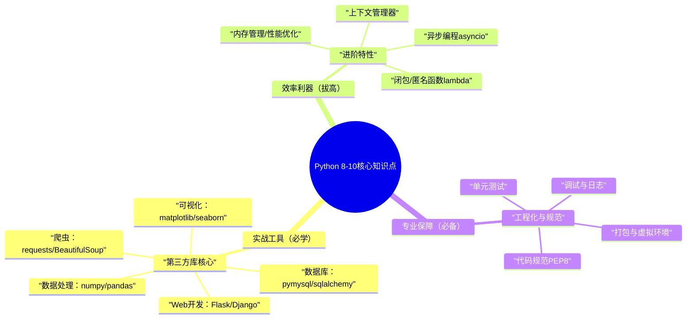

Python第8-10知识点，是从“基础入门”到“专业实战”的关键跨越——第三方库是实战工具，进阶特性是效率利器，工程化规范是团队协作与长期维护的保障，三者紧密关联、缺一不可，核心定位如下：



**核心学习逻辑**：先掌握「第三方库」（快速落地实战，解决实际问题），再突破「进阶特性」（提升代码效率与灵活性），最后吃透「工程化规范」（养成良好编码习惯，适配团队协作），三者循序渐进，贴合专业开发场景。

---

延续此前风格，每个知识点遵循「核心定义→核心重点→最简示例→编程思想→开发创意」，示例可直接复制运行，重点标注高频考点、避坑点，拒绝冗余，聚焦“有用、能用、好用”。

## 8. 第三方库核心（实战必备，重中之重）

### 核心定义

Python生态的核心优势，无需重复造轮子，通过`pip install`安装即可使用，覆盖「数据处理、可视化、爬虫、Web开发、数据库操作」等高频实战场景，是Python区别于其他语言的核心竞争力之一，**入门优先掌握“高频库+核心用法”**，无需死记所有API。

### 核心重点（干练版，直接记，优先掌握）

- **数据处理（必学）**：
  
- `numpy`：处理数值型数据，高效操作数组（矩阵运算、数值统计），是`pandas`的基础；
  
- `pandas`：处理表格型数据（Excel、CSV），核心是`DataFrame`，实现数据筛选、排序、分组、缺失值处理，实战高频。
      

- **可视化（必学）**：
  
- `matplotlib`：基础可视化库，绘制折线图、柱状图、饼图等，灵活度高；
  
- `seaborn`：基于`matplotlib`，语法更简洁，自动优化图表样式，适合快速出图。
  
- **爬虫（必学）**：

- `requests`：发送HTTP请求（GET/POST），获取网页数据，语法简洁，替代标准库`urllib`；
  
- `BeautifulSoup`：解析网页HTML/XML，提取指定数据（如标题、内容、链接），入门友好。

- **Web开发（二选一，入门优先）**：
  
- `Flask`：轻量级Web框架，灵活、上手快，适合小型项目、接口开发；
  
- `Django`：全能型Web框架，内置ORM、后台管理，适合大型项目。


- **数据库（必学）**：
- `pymysql`：操作MySQL数据库，原生SQL语法，入门友好；

- `sqlalchemy`：ORM框架，用Python对象操作数据库，无需编写原生SQL，提升开发效率。
      

### 最简示例（高频场景，可直接复用）

```python
import pandas as pd
df = pd.read_csv("data.csv")
df_filter = df[df["age"] > 18]
df_group = df.groupby("gender")["age"].mean()
df_fill = df.fillna(0)
df_filter.to_excel("filtered_data.xlsx", index=False)
import requests
from bs4 import BeautifulSoup
response = requests.get("https://www.example.com")
response.encoding = "utf-8"  # 解决乱码
soup = BeautifulSoup(response.text, "html.parser")
title = soup.title.text  # 提取标题
links = [a["href"] for a in soup.find_all("a", href=True)]  # 提取所有链接
print("网页标题：", title)
print("前5个链接：", links[:5])

import pymysql
conn = pymysql.connect(
    host="localhost",
    user="root",
    password="123456",
    database="test_db",
    charset="utf8"
)
cursor = conn.cursor()
cursor.execute("SELECT * FROM user LIMIT 5")
result = cursor.fetchall()  # 获取查询结果
for row in result:
    print(row)
cursor.close()
conn.close()
```
### 编程思想

- **工具化思想**：第三方库封装了复杂逻辑，无需重复编写，聚焦业务需求，提升开发效率（DRY原则）；

- **选型思想**：根据项目场景选型（如小型Web用Flask、大型Web用Django，简单数据处理用pandas），避免“大材小用”；

- **分层思想**：如爬虫中“请求（requests）+解析（BeautifulSoup）”分层，职责清晰，便于维护；

- **兼容性思想**：第三方库版本差异较大，需指定版本（如`pip install pandas==1.5.3`），避免版本冲突。

### 开发创意（实战可用）

封装「数据处理+爬虫通用工具」，整合高频操作，可在所有项目中复用：

```python
import pandas as pd
import requests
from bs4 import BeautifulSoup

class DataCrawlUtil:
    @staticmethod
    def read_excel(file_path, sheet_name=0):
        """读取Excel文件，返回DataFrame，处理常见异常"""
        try:
            return pd.read_excel(file_path, sheet_name=sheet_name)
        except Exception as e:
            print(f"读取Excel失败：{str(e)}")
            return pd.DataFrame()

    @staticmethod
    def crawl_page(url, encoding="utf-8"):
        """爬取网页内容，返回BeautifulSoup对象，处理请求异常"""
        try:
            response = requests.get(url, timeout=10)
            response.encoding = encoding
            return BeautifulSoup(response.text, "html.parser")
        except Exception as e:
            print(f"爬取网页失败：{str(e)}")
            return None

    @staticmethod
    def crawl_save_data(url, save_path):
        """爬取网页标题和链接，保存为Excel"""
        soup = DataCrawlUtil.crawl_page(url)
        if not soup:
            return
        data = {
            "title": [soup.title.text],
            "links": [a["href"] for a in soup.find_all("a", href=True)[:10]]  # 取前10个链接
        }
        df = pd.DataFrame(data)
        df.to_excel(save_path, index=False)
        print(f"数据已保存到：{save_path}")
df = DataCrawlUtil.read_excel("data.xlsx")
DataCrawlUtil.crawl_save_data("https://www.example.com", "crawl_data.xlsx")
```
## 9. 进阶特性（能力拔高，提升代码质感）

### 核心定义

Python进阶特性，是在基础知识点之上的“效率利器”，涵盖「闭包、上下文管理器、异步编程、内存管理、性能优化」，核心作用是**简化代码、提升效率、优化内存**，适合处理复杂场景、大数据量、高并发任务，是区分“新手”与“进阶开发者”的关键。

### 核心重点（干练版，直接记）

- **闭包**：嵌套函数，内部函数引用外部函数的变量，外部函数返回内部函数，实现“数据封装”，常用于装饰器、函数工厂；

- **匿名函数`lambda`**：简化函数定义，一行代码实现简单逻辑，常与`map()`/`filter()`等高阶函数搭配使用；

- **上下文管理器**：除了`with open()`，可自定义（实现`__enter__`/`__exit__`方法），用于自动管理资源（如数据库连接、锁）；

- **异步编程**：`asyncio`/`await`/`async`，处理IO密集型任务（如网络请求、文件读写），提升并发效率，避免阻塞；

- **内存管理**：Python自动垃圾回收（GC），重点掌握浅拷贝/深拷贝（`copy`/`deepcopy`），避免内存泄漏；

- **性能优化**：用列表推导式替代普通循环、用`timeit`/`cProfile`分析性能瓶颈、避免频繁创建对象。

### 最简示例（高频场景）

```python
def make_multiplier(n):
    def multiplier(x):
        return x * n
    return multiplier
double = make_multiplier(2)
triple = make_multiplier(3)
print(double(5))  # 10
print(triple(5))  # 15
import pymysql
class DBConnection:
    def __init__(self, host, user, password, database):
        self.host = host
        self.user = user
        self.password = password
        self.database = database

    def __enter__(self):
        self.conn = pymysql.connect(
            host=self.host, user=self.user, password=self.password, database=self.database, charset="utf8"
        )
        self.cursor = self.conn.cursor()
        return self.cursor
    def __exit__(self, exc_type, exc_val, exc_tb):
        self.cursor.close()
        self.conn.close()
        if exc_type:
            print(f"数据库操作异常：{exc_val}")
        return True  # 抑制异常传播
with DBConnection("localhost", "root", "123456", "test_db") as cursor:
    cursor.execute("SELECT * FROM user LIMIT 3")
    print(cursor.fetchall())
import asyncio
import aiohttp
async def fetch_url(url):
    async with aiohttp.ClientSession() as session:
        async with session.get(url) as response:
            return await response.text()[:100]  # 取前100个字符
async def main():
    urls = ["https://www.example.com", "https://www.baidu.com"]
    tasks = [fetch_url(url) for url in urls]
    results = await asyncio.gather(*tasks)
    for url, result in zip(urls, results):
        print(f"{url}：{result}")
asyncio.run(main())
import copy
a = [1, 2, [3, 4]]
b = copy.copy(a)  # 浅拷贝：只拷贝外层列表，内层列表共享
c = copy.deepcopy(a)  # 深拷贝：完全拷贝，内外层列表独立

a[2][0] = 99
print(b)  # [1, 2, [99, 4]]（受影响）
print(c)  # [1, 2, [3, 4]]（不受影响）
```

### 编程思想

- **封装思想**：闭包封装变量，上下文管理器封装资源管理逻辑，隐藏细节，提升代码可维护性；

- **异步思想**：IO密集型任务中，异步编程避免阻塞，提升并发效率，充分利用CPU资源；

- **内存优化思想**：深拷贝/浅拷贝按需使用，避免内存浪费；垃圾回收机制自动释放无用资源，减少内存泄漏；

- **效率优先思想**：性能优化聚焦“高频操作”（如循环、IO），用更高效的方式替代冗余代码，提升程序运行速度。

### 开发创意（实战可用）

封装「异步爬虫工具」，批量爬取多个网页，提升爬取效率（适用于IO密集型场景）：

```python
import asyncio
import aiohttp
from bs4 import BeautifulSoup

class AsyncCrawlUtil:
    @staticmethod
    async def fetch_page(session, url):
        """异步获取网页内容，解析标题"""
        try:
            async with session.get(url, timeout=10) as response:
                soup = BeautifulSoup(await response.text(), "html.parser")
                return {
                    "url": url,
                    "title": soup.title.text if soup.title else "无标题"
                }
        except Exception as e:
            return {
                "url": url,
                "title": f"爬取失败：{str(e)}"
            }

    @staticmethod
    async def batch_crawl(urls):
        """批量异步爬取多个网页"""
        async with aiohttp.ClientSession() as session:
            tasks = [AsyncCrawlUtil.fetch_page(session, url) for url in urls]
            return await asyncio.gather(*tasks)

if __name__ == "__main__":
    urls = [f"https://www.example.com?page={i}" for i in range(1, 11)]
    results = asyncio.run(AsyncCrawlUtil.batch_crawl(urls))
    for res in results:
        print(f"URL：{res['url']}，标题：{res['title']}")
```
## 10. 工程化与规范（专业必备，团队协作关键）

### 核心定义

Python工程化与规范，是“写出可维护、可复用、可协作”代码的基础，涵盖「代码规范、调试与日志、单元测试、打包与虚拟环境」，核心作用是**统一编码风格、降低维护成本、适配团队协作**，是专业开发者的必备素养。

### 核心重点（干练版，直接记）

- **代码规范**：遵循PEP8规范（Python官方推荐），核心是“缩进4个空格、变量命名小写+下划线、注释清晰、一行不超过79个字符”；

- **调试**：常用方式——`print()`（简单调试）、`pdb`（命令行调试）、`logging`（日志调试，推荐）；

- **单元测试**：`unittest`（标准库）、`pytest`（第三方库，更简洁），编写测试用例，验证函数/类的正确性，避免修改代码引入bug；

- **打包与虚拟环境**：
  
- 虚拟环境：`venv`（标准库）、`conda`（第三方），隔离不同项目的依赖，避免版本冲突；
  
- 打包发布：`setup.py`/`pyproject.toml`，将自己的代码打包为模块，便于复用和发布；

- 依赖管理：`requirements.txt`，记录项目依赖及版本，便于他人快速部署。
      

### 最简示例（高频场景）

```python
import logging
logging.basicConfig(
    level=logging.INFO,  # 日志级别：DEBUG < INFO < WARNING < ERROR < CRITICAL
    format="%(asctime)s - %(levelname)s - %(message)s",
    handlers=[
        logging.FileHandler("app.log"),  # 输出到文件
        logging.StreamHandler()  # 输出到控制台
    ]
)
logging.info("程序启动")
try:
    1 / 0
except ZeroDivisionError as e:
    logging.error(f"出现异常：{str(e)}")
logging.info("程序结束")
def add(a, b):
    return a + b
def test_add():
    assert add(1, 2) == 3  # 断言成功，测试通过
    assert add(0, 0) == 0
    assert add(-1, 1) == 0
from setuptools import setup, find_packages
setup(
    name="my_utils",  # 模块名
    version="1.0.0",  # 版本号
    packages=find_packages(),  # 自动找到所有包
    description="Python 通用工具模块",
    author="XXX",
    install_requires=[  # 依赖包
        "pandas>=1.5.0",
        "requests>=2.31.0"
    ]
)
```
### 编程思想

- **规范思想**：统一编码规范，让代码“可读性强、可维护性高”，适配团队协作，避免“一人一套风格”；

- **测试思想**：单元测试提前发现bug，避免修改代码引入新问题，保证代码正确性（防御性编程）；

- **隔离思想**：虚拟环境隔离不同项目的依赖，避免版本冲突，提升项目稳定性；

- **可复用思想**：打包自己的代码为模块，便于在不同项目中复用，提升开发效率（DRY原则）。

### 开发创意（实战可用）

搭建「标准项目结构」，整合规范、日志、测试、依赖管理，适配所有Python项目：

```python
my_project/
├── my_utils/          # 核心业务模块（自己的代码）
│   ├── __init__.py
│   ├── crawl.py       # 爬虫工具
│   └── data.py        # 数据处理工具
├── tests/             # 单元测试目录
│   ├── __init__.py
│   ├── test_crawl.py  # 爬虫工具测试
│   └── test_data.py   # 数据处理工具测试
├── logs/              # 日志目录
│   └── app.log        # 日志文件
├── requirements.txt   # 依赖管理
├── setup.py           # 打包配置
└── main.py            # 项目入口
import logging
from my_utils.crawl import DataCrawlUtil
logging.basicConfig(
    level=logging.INFO,
    format="%(asctime)s - %(levelname)s - %(message)s",
    handlers=[logging.FileHandler("logs/app.log"), logging.StreamHandler()]
)
if __name__ == "__main__":
    logging.info("项目启动：开始爬取数据")
    DataCrawlUtil.crawl_save_data("https://www.example.com", "data/crawl_data.xlsx")
    logging.info("项目结束：数据爬取完成")

pandas==1.5.3
requests==2.31.0
beautifulsoup4==4.12.2
pytest==7.4.3
aiohttp==3.8.6
```
---


1. **学习优先级**：第三方库核心 → 工程化与规范 → 进阶特性；

- 优先掌握第三方库（快速落地实战，建立信心）；
  
- 同步学习工程化规范（养成良好习惯，避免后期返工）；
  
- 最后突破进阶特性（按需学习，根据项目场景选择，不贪多）。
      

2. **学习技巧**：
        
- 第三方库：重点掌握“核心API+实战场景”，无需死记所有用法，用到再查文档；
  
- 进阶特性：先理解思想，再结合简单示例练习，避免陷入“语法细节”；
  
- 工程化规范：从项目初期就遵循，养成习惯（如写日志、写测试用例）。
      

3. **避坑点**：
        
- 第三方库：版本冲突（指定版本）、滥用库（简单需求无需引入复杂库）；
  
- 进阶特性：异步编程滥用（CPU密集型任务不适合异步）、深拷贝/浅拷贝使用不当；
  
- 工程化规范：不写日志、不做测试、不使用虚拟环境，导致后期维护困难。
      

4. **核心思想**：贯穿始终的DRY原则、封装思想、规范思想、效率思想，这些是提升代码质感、适配专业开发的关键。

掌握第8-10知识点，结合前7个基础知识点，就能轻松应对Python实战开发、团队协作、项目部署，成为一名专业的Python开发者。如果需要某知识点的进阶示例（如pytest复杂测试、asyncio实战、项目打包发布），欢迎留言交流！