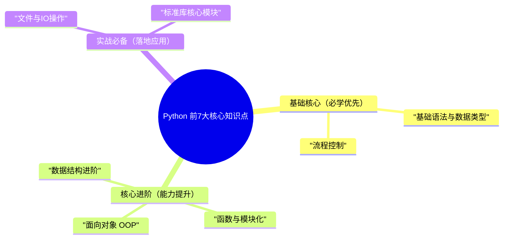

Python前7大核心知识点（基础语法与数据类型、流程控制、函数与模块化、面向对象、数据结构进阶、文件与IO、标准库核心），是Python入门到实战的“必经之路”，优先级从高到低，层层递进，核心关联如下：



**核心学习逻辑**：先掌握“基础语法+流程控制”（能写简单脚本），再突破“函数+面向对象”（提升代码复用性），接着掌握“数据结构进阶+IO操作”（处理数据与文件），最后吃透“标准库”（提升开发效率），循序渐进，不贪多、不踩坑。

---

每个知识点遵循「核心定义→最简示例→编程思想→开发创意」，示例可直接复制运行，重点标注高频考点、避坑点，拒绝冗余。

## 1. 基础语法与数据类型（Python入门基石）

### 核心定义

Python入门的基础，涵盖「变量、数据类型、运算符、输入输出」，是所有Python代码的“最小单元”，核心特点是**简洁、弱类型**（无需声明变量类型，自动推断）。

### 核心知识点（干练版，直接记）

- **变量与标识符**：命名规范（小写+下划线，如`user_name`），禁止使用关键字（`if`/`for`/`class`等），区分变量与常量（常量约定大写，如`PI = 3.14`）；

- **8大基本数据类型**：
        
- 数值型：`int`（整数）、`float`（浮点数）
        
- 字符串：`str`（单引号/双引号/三引号包裹，可切片）
        
- 布尔型：`bool`（`True`/`False`，本质是0和1）
        
- 容器型：`list`（列表，可修改、有序）、`tuple`（元组，不可修改、有序）、`dict`（字典，键值对、无序）、`set`（集合，不可重复、无序）
      

- **运算符**：算术（`+`/`-`/`*`/`/`/`//`/`%`/`**`）、比较（`==`/`!=`/`>`/`<`）、逻辑（`and`/`or`/`not`）、成员（`in`/`not in`）、身份（`is`/`is not`）；

- **输入输出**：`input()`（接收用户输入，默认字符串类型）、`print()`（打印输出），格式化输出优先用**f-string**（简洁高效）。

### 最简示例（高频场景）

```python
user_name = "张三"  # str
age = 20           # int
score = 95.5       # float
is_student = True  # bool
hobbies = ["篮球", "编程"]  # list
info = ("男", 175)  # tuple
user_dict = {"name": "张三", "age": 20}  # dict
tags = {"python", "java"}  # set
print(f"姓名：{user_name}，年龄：{age}，成绩：{score:.1f}")  # 格式化保留1位小数
print(age > 18 and is_student)  # 逻辑运算
print("篮球" in hobbies)  # 成员运算
age_input = int(input("请输入年龄："))  # 输入默认str，需转换为int
print(f"输入的年龄：{age_input}")
```
### 编程思想

- **弱类型思想**：无需声明变量类型，Python自动推断，简化代码，提升开发效率；

- **简洁性思想**：摒弃繁琐语法（如分号可省略、缩进代替大括号），聚焦核心逻辑；

- **类型适配思想**：不同数据类型可灵活转换（如`str→int`），但需避免类型错误（如字符串转数字失败）。

### 开发创意（实战可用）

封装「数据类型校验工具」，避免类型错误（体现严谨性，减少异常）：

```python
def type_check(data, target_type):
    """
    校验数据类型，返回True/False
    :param data: 待校验数据
    :param target_type: 目标类型（如int、str、list）
    """
    return isinstance(data, target_type)

age = input("请输入年龄：")
if type_check(age, str) and age.isdigit():  # 先判断是字符串，再判断是否可转数字
    age = int(age)
    print(f"年龄：{age}")
else:
    print("请输入正确的数字类型年龄")
```
## 2. 流程控制（代码逻辑的核心）

### 核心定义

控制代码的执行顺序，核心分为「条件判断」和「循环结构」，搭配「异常处理」，解决“代码如何根据不同场景执行”的问题，是编写复杂脚本的基础。

### 核心知识点（干练版，直接记）

- **条件判断**：`if-elif-else`，多条件判断用`elif`，避免嵌套过深（最多嵌套3层）；

- **循环结构**：

- `for`循环：遍历可迭代对象（list/tuple/dict/str/set），常用`for i in range()`；
        
- `while`循环：满足条件时持续执行，需避免死循环（必须有退出条件）；
        
- 循环辅助：`break`（终止循环）、`continue`（跳过当前循环）、`else`（循环正常结束后执行）；
      

- **异常处理**：`try-except-finally`，捕获异常（如`ValueError`/`FileNotFoundError`），避免程序崩溃；`raise`主动抛出异常，`else`（无异常时执行）。

### 最简示例（高频场景）

```python
score = 85
if score >= 90:
    print("优秀")
elif score >= 80:
    print("良好")
elif score >= 60:
    print("及格")
else:
    print("不及格")
hobbies = ["篮球", "编程", "跑步"]
for index, hobby in enumerate(hobbies, start=1):  # enumerate获取索引+值
    print(f"第{index}个爱好：{hobby}")
count = 0
while count < 5:
    print(f"计数：{count}")
    count += 1  # 退出条件：count >=5
try:
    age = int(input("请输入年龄："))
except ValueError:
    print("输入错误，请输入数字！")
else:
    print(f"年龄：{age}")
finally:
    print("输入操作结束")  # 无论是否异常，必执行
```
### 编程思想

- **逻辑分层思想**：条件判断按“从高到低”的优先级排列，循环按“重复逻辑”提取，代码逻辑清晰；

- **容错思想**：异常处理捕获可能出现的错误，避免程序崩溃，提升代码健壮性；

- **简洁性思想**：for循环优先于while循环（遍历场景），避免冗余的循环控制代码。

### 开发创意（实战可用）

封装「循环重试工具」，遇到异常自动重试（适用于网络请求、文件读取等场景）：

```python
def retry(max_retry=3):
    """装饰器：异常时自动重试，最多max_retry次"""
    def decorator(func):
        def wrapper(*args, **kwargs):
            retry_count = 0
            while retry_count < max_retry:
                try:
                    return func(*args, **kwargs)
                except Exception as e:
                    retry_count += 1
                    print(f"第{retry_count}次重试，异常：{str(e)}")
            raise Exception(f"超过{max_retry}次重试，仍失败")
        return wrapper
    return decorator

@retry(max_retry=2)
def read_file(file_path):
    with open(file_path, "r", encoding="utf-8") as f:
        return f.read()
try:
    read_file("test.txt")
except Exception as e:
    print(e)
```
## 3. 函数与模块化（代码复用的核心）

### 核心定义

将重复的代码块封装为「函数」，将相关函数整合为「模块/包」，核心是**代码复用、降低耦合**，遵循DRY原则（Don't Repeat Yourself），是提升代码可维护性的关键。

### 核心知识点（干练版，直接记）

- **函数定义**：用`def`关键字，格式：`def 函数名(参数): 函数体 return 返回值`；

- **参数类型**：位置参数（必须传）、关键字参数（可指定参数名传）、默认参数（有默认值，可省略）、可变长参数（`*args`接收元组，`**kwargs`接收字典）；

- **返回值**：`return`可返回单个值、多个值（本质是元组），无return则返回`None`；

- **高阶函数**：接收函数作为参数或返回函数（如`map()`/`filter()`/`reduce()`）；

- **装饰器**：不修改原函数代码，为函数添加额外功能（如日志、计时、权限校验）；

- **模块化**：`import 模块名`/`from 模块名 import 函数/类`，包需有`__init__.py`文件（Python3.3+可省略，但推荐保留）。

### 最简示例（高频场景）

```python
def calculate(a, b, op="add"):  # op是默认参数
    """计算两个数的加减乘除"""
    if op == "add":
        return a + b, "加法"
    elif op == "sub":
        return a - b, "减法"
    elif op == "mul":
        return a * b, "乘法"
    elif op == "div":
        return a / b, "除法"
result, op_name = calculate(10, 5, op="mul")
print(f"{op_name}结果：{result}")
nums = [1, 2, 3, 4, 5]
square_nums = list(map(lambda x: x**2, nums))
print(square_nums)  # [1,4,9,16,25]
import time
def timer(func):
    def wrapper(*args, **kwargs):
        start_time = time.time()
        result = func(*args, **kwargs)
        end_time = time.time()
        print(f"函数{func.__name__}执行时间：{end_time - start_time:.4f}秒")
        return result
    return wrapper
@timer  # 给calculate函数添加计时功能
def calculate(a, b):
    time.sleep(0.1)  # 模拟耗时操作
    return a + b

calculate(100, 200)
```

### 编程思想

- **代码复用思想（DRY原则）**：将重复逻辑封装为函数，避免重复编写，提升开发效率；

- **解耦思想**：模块化将代码拆分，不同模块负责不同功能，修改一个模块不影响其他模块；

- **开闭原则**：装饰器不修改原函数代码，即可添加新功能，拓展性强；

- **单一职责思想**：一个函数只做一件事，逻辑清晰，便于维护和调试。

### 开发创意（实战可用）

封装「通用工具模块」，整合常用函数（如计时、日志、数据校验），可在所有项目中复用：

```python
import time
import logging
def log(func):
    logging.basicConfig(level=logging.INFO, format="%(asctime)s - %(message)s")
    def wrapper(*args, **kwargs):
        logging.info(f"函数{func.__name__}开始执行，参数：{args}, {kwargs}")
        result = func(*args, **kwargs)
        logging.info(f"函数{func.__name__}执行结束，返回值：{result}")
        return result
    return wrapper
def timer(func):
    def wrapper(*args, **kwargs):
        start = time.time()
        res = func(*args, **kwargs)
        end = time.time()
        print(f"【{func.__name__}】耗时：{end - start:.4f}秒")
        return res
    return wrapper
def is_valid_num(num):
    return isinstance(num, (int, float))
from utils import log, timer, is_valid_num
@log
@timer
def add(a, b):
    if not is_valid_num(a) or not is_valid_num(b):
        raise ValueError("参数必须是数字")
    return a + b

add(10, 20)
```

## 4. 面向对象编程（OOP，复杂项目必备）

### 核心定义

将现实世界的事物抽象为「类」，通过「对象」实例化，核心是**封装、继承、多态**三大特性，解决“复杂项目代码混乱、难以维护”的问题，适合开发大型项目。

### 核心知识点（干练版，直接记）

- **类与对象**：`class 类名:` 定义类，`对象名 = 类名()` 实例化对象；

- **属性**：实例属性（对象独有）、类属性（所有对象共享）、私有属性（`__属性名`，外部无法直接访问，需通过方法访问）；

- **方法**：实例方法（`self`为第一个参数，操作实例属性）、类方法（`@classmethod`，`cls`为第一个参数，操作类属性）、静态方法（`@staticmethod`，无默认参数，与类和对象无关）；

- **三大特性**：

- 封装：隐藏对象内部细节，仅通过公共方法交互；
        
- 继承：子类继承父类的属性和方法，可重写父类方法，实现代码复用；
        
- 多态：同一方法，不同对象有不同实现，提升代码拓展性；
      

- **属性装饰器**：`@property`，将方法伪装为属性，简化访问；

- **魔术方法**：`__init__`（初始化对象）、`__str__`（打印对象时显示）、`__repr__`（调试时显示）、`__call__`（对象可像函数一样调用）。

### 最简示例（高频场景）

```python
class User:
    count = 0
    def __init__(self, name, age):
        self.name = name  # 实例属性
        self.__age = age  # 私有属性（外部无法直接访问）
        User.count += 1  # 类属性自增
    def say_hello(self):
        return f"Hello, 我是{self.name}"
    @property
    def age(self):
        return self.__age
    @age.setter
    def age(self, new_age):
        if new_age > 0 and new_age <= 120:
            self.__age = new_age
        else:
            raise ValueError("年龄必须在1-120之间")
    @classmethod
    def get_user_count(cls):
        return f"当前用户总数：{cls.count}"
    @staticmethod
    def is_adult(age):
        return age >= 18
user1 = User("张三", 20)
user2 = User("李四", 17)
print(user1.say_hello())  # Hello, 我是张三
print(user1.age)  # 20（通过@property访问私有属性）
user1.age = 21  # 通过@age.setter修改私有属性
print(User.get_user_count())  # 当前用户总数：2
print(User.is_adult(18))  # True
class Student(User):
    def say_hello(self):
        return f"Hello, 我是学生{self.name}"
student = Student("王五", 19)
print(student.say_hello())  # Hello, 我是学生王五（子类重写后的实现）
```

### 编程思想

- **封装思想**：隐藏私有属性，通过公共方法访问和修改，避免外部直接操作，保证数据安全性；

- **继承思想**：子类复用父类的共性代码，专注实现特有功能，减少重复开发（DRY原则）；

- **多态思想**：同一方法的不同实现，新增子类无需修改原有代码，提升拓展性（开闭原则）；

- **抽象思想**：将同类事物的共性抽象为类，聚焦核心特征，忽略无关细节。

### 开发创意（实战可用）

封装「通用基类」，统一处理共性功能（如初始化、日志、序列化），所有子类继承，减少重复代码：

```python
class BaseModel:
    """通用基类，所有模型类继承"""
    def __init__(self):
        self.create_time = time.time()  # 自动添加创建时间

    def to_dict(self):
        """将对象转换为字典（序列化），便于接口返回"""
        return {k: v for k, v in self.__dict__.items() if not k.startswith("__")}

    def __str__(self):
        """打印对象时，显示字典格式"""
        return str(self.to_dict())

class User(BaseModel):
    def __init__(self, name, age):
        super().__init__()  # 调用父类初始化方法
        self.name = name
        self.age = age
class Article(BaseModel):
    def __init__(self, title, content):
        super().__init__()
        self.title = title
        self.content = content

user = User("张三", 20)
print(user)  # {'create_time': 1710000000.0, 'name': '张三', 'age': 20}
print(user.to_dict())  # 序列化，可用于接口返回
```
## 5. 数据结构进阶（提升代码效率）

### 核心定义

基于基础数据类型，拓展出更高效的数据处理方式，核心包括「推导式、生成器、迭代器」，解决“大量数据处理效率低、代码冗余”的问题，是Python高效编程的关键。

### 核心知识点（干练版，直接记）

- **推导式**：简化列表、字典、集合的创建，语法简洁，效率高于普通循环：
        
- 列表推导式：`[表达式 for 变量 in 可迭代对象 if 条件]`；
        
- 字典推导式：`{键表达式: 值表达式 for 变量 in 可迭代对象 if 条件}`；
        
- 集合推导式：`{表达式 for 变量 in 可迭代对象 if 条件}`；
      

- **生成器**：用`yield`关键字定义，按需生成数据，节省内存（不一次性加载所有数据），生成器表达式：`(表达式 for 变量 in 可迭代对象 if 条件)`；

- **迭代器**：实现`__iter__`和`__next__`方法的对象，可通过`iter()`获取迭代器，`next()`获取下一个元素，遍历结束抛出`StopIteration`异常；

- **常用操作**：`sort()`（列表原地排序）、`sorted()`（返回新排序列表）、切片（`list[start:end:step]`）、反转（`reversed()`）。

### 最简示例（高频场景）

```python
even_nums = [x for x in range(1, 11) if x % 2 == 0]
print(even_nums)  # [2,4,6,8,10]
square_dict = {x: x**2 for x in range(1, 6)}
print(square_dict)  # {1:1, 2:4, 3:9, 4:16, 5:25}
def generator_nums(n):
    for x in range(n):
        yield x  # 暂停执行，返回当前值
gen = generator_nums(5)
print(next(gen))  # 0
print(next(gen))  # 1
for num in gen:
    print(num)  # 2,3,4
gen2 = (x for x in range(5))
print(list(gen2))  # [0,1,2,3,4]
nums = [1,2,3]
iter_nums = iter(nums)  # 获取迭代器
print(next(iter_nums))  # 1
print(next(iter_nums))  # 2
nums = [3,1,4,2,5]
nums.sort()  # 原地排序
print(nums)  # [1,2,3,4,5]
print(nums[1:4])  # 切片，获取索引1-3的元素：[2,3,4]
```
### 编程思想

- **高效性思想**：推导式比普通循环效率高，生成器按需生成数据，节省内存，适合大量数据处理；

- **简洁性思想**：推导式用一行代码替代多行循环，代码更简洁、易读；

- **迭代思想**：迭代器统一了可迭代对象的遍历方式，无需关注底层实现，提升代码一致性；

- **内存优化思想**：生成器不一次性加载所有数据，避免内存溢出，适合处理大数据量。

### 开发创意（实战可用）

用「生成器+推导式」处理大数据文件（如日志文件），避免一次性加载所有数据，提升效率：

```python
def read_large_file(file_path, chunk_size=1024):
    """生成器：分块读取大文件，避免内存溢出"""
    with open(file_path, "r", encoding="utf-8") as f:
        while True:
            chunk = f.read(chunk_size)  # 每次读取1024字节
            if not chunk:
                break
            yield chunk

error_lines = [
    line.strip() 
    for chunk in read_large_file("large_log.txt")
    for line in chunk.split("\n")
    if "error" in line.lower()
]
for line in error_lines:
    print(line)
```
## 6. 文件与IO操作（数据持久化核心）

### 核心定义

用于处理「文件读写、路径操作、数据序列化」，核心是「数据持久化」（将内存中的数据保存到磁盘，或从磁盘读取数据到内存），是实战中高频场景（如日志记录、配置读取、数据存储）。

### 核心知识点（干练版，直接记）

- **文件读写**：
        
- `open()`函数：`open(file_path, mode, encoding)`，mode（模式）：`r`（读）、`w`（写，覆盖）、`a`（追加）、`r+`（读写）、`wb`（二进制写，如图片/视频）；
        
- 上下文管理器：`with open(...) as f`，自动关闭文件，避免资源泄漏（优先使用）；
      

- **路径处理**：`os.path`模块（传统方式）、`pathlib`模块（Python3.4+，面向对象，更简洁）；

- **数据序列化**：将Python对象转换为可存储/传输的格式：
        
- `json`：适用于字符串、数字、列表、字典，跨语言兼容，不支持Python特有对象（如函数、类）；
        
- `pickle`：适用于所有Python对象，仅Python可用，支持序列化函数、类、对象；
      

- **文件夹操作**：`os`/`shutil`模块（创建文件夹、删除文件夹、复制文件/文件夹、移动文件）。

### 最简示例（高频场景）

```python
with open("test.txt", "w", encoding="utf-8") as f:
    f.write("Python 文件操作\n")
    f.write("Hello, World!")
with open("test.txt", "r", encoding="utf-8") as f:
    for line in f:
        print(line.strip())
from pathlib import Path
file_path = Path("test.txt")
print(file_path.exists())  # 判断文件是否存在
print(file_path.absolute())  # 获取绝对路径
print(file_path.parent)  # 获取父目录

import json
data = {"name": "张三", "age": 20, "hobbies": ["篮球", "编程"]}
json_str = json.dumps(data, ensure_ascii=False, indent=2)  # ensure_ascii=False显示中文
with open("data.json", "w", encoding="utf-8") as f:
    json.dump(data, f, ensure_ascii=False, indent=2)
with open("data.json", "r", encoding="utf-8") as f:
    json_data = json.load(f)
print(json_data["name"])  # 张三
import os
os.makedirs("test_dir", exist_ok=True)  # exist_ok=True避免文件夹已存在报错
shutil.copy("test.txt", "test_dir/test_copy.txt")
shutil.rmtree("test_dir", ignore_errors=True)
```
### 编程思想

- **资源管理思想**：上下文管理器`with open()`自动关闭文件，避免资源泄漏，体现严谨性；

- **简洁性思想**：`pathlib`比`os.path`更简洁，面向对象的方式处理路径，减少代码冗余；

- **兼容性思想**：`json`序列化跨语言兼容，`pickle`序列化适合Python内部使用，根据场景选型；

- **容错思想**：文件夹操作时，添加`exist_ok=True`、`ignore_errors=True`，避免程序崩溃。

### 开发创意（实战可用）

封装「文件操作工具类」，统一处理文件读写、路径判断、序列化，实战中直接复用：

```python
from pathlib import Path
import json
import shutil

class FileUtil:
    @staticmethod
    def read_file(file_path, encoding="utf-8"):
        """读取文本文件，返回文件内容"""
        path = Path(file_path)
        if not path.exists():
            raise FileNotFoundError(f"文件{file_path}不存在")
        with open(path, "r", encoding=encoding) as f:
            return f.read()

    @staticmethod
    def write_file(file_path, content, encoding="utf-8", mode="w"):
        """写入文本文件"""
        path = Path(file_path)
        path.parent.mkdir(parents=True, exist_ok=True)
        with open(path, mode, encoding=encoding) as f:
            f.write(content)
    @staticmethod
    def json_dump(file_path, data):
        """将数据写入json文件"""
        FileUtil.write_file(file_path, json.dumps(data, ensure_ascii=False, indent=2), mode="w")

    @staticmethod
    def json_load(file_path):
        """从json文件读取数据"""
        content = FileUtil.read_file(file_path)
        return json.loads(content)

FileUtil.write_file("test.txt", "Hello, Python!", mode="a")  # 追加写入
content = FileUtil.read_file("test.txt")
print(content)
data = {"name": "张三"}
FileUtil.json_dump("data.json", data)
json_data = FileUtil.json_load("data.json")
print(json_data)
```

## 7. 标准库核心模块（提升开发效率）

### 核心定义

Python内置的标准库，无需安装，直接导入使用，核心模块覆盖「数据处理、时间处理、正则表达式、网络请求、多进程/线程」，是实战中“避免重复造轮子”的关键。

### 核心模块（干练版，直接记）

- **collections**：数据结构扩展，高频使用：
        
- `Counter`：统计元素出现次数（如统计字符串中每个字符的次数）；
        
- `defaultdict`：默认值字典，避免`KeyError`（如字典值为列表，自动初始化）；
        
- `OrderedDict`：有序字典（Python3.7+普通字典已有序，仍可用于兼容旧版本）；
      

- **datetime**：时间处理，替代`time`模块（更简洁），处理日期、时间、时间差；

- **re**：正则表达式，处理字符串匹配、替换、分组（如手机号校验、邮箱校验）；

- **urllib/requests**：网络请求，`urllib`是标准库，`requests`是第三方库（必学，更简洁），用于请求接口、爬取网页；

- **multiprocessing/threading**：多进程/多线程，处理并发任务（如批量下载、多任务执行），`concurrent.futures`（Python3.2+）简化并发编程。

### 最简示例（高频场景）

```python
from collections import Counter, defaultdict
text = "abracadabra"
count = Counter(text)
print(count)  # Counter({'a': 5, 'b': 2, 'r': 2, 'c': 1, 'd': 1})
dd = defaultdict(list)  # 值默认是列表
dd["a"].append(1)
dd["b"].append(2)
print(dd)  # defaultdict(list, {'a': [1], 'b': [2]})
from datetime import datetime, timedelta
now = datetime.now()
print(now.strftime("%Y-%m-%d %H:%M:%S"))  # 格式化时间：2024-05-01 12:00:00
future = now + timedelta(days=3)
print(future.strftime("%Y-%m-%d"))
import re
phone_pattern = r"^1[3-9]\d{9}$"  # 手机号正则
phone = "13812345678"
if re.match(phone_pattern, phone):
    print("手机号格式正确")
else:
    print("手机号格式错误")

import requests
response = requests.get("https://www.baidu.com")
print(response.status_code)  # 200（请求成功）
print(response.text[:100])  # 打印前100个字符

from concurrent.futures import ThreadPoolExecutor
def task(num):
    return num * 2

with ThreadPoolExecutor(max_workers=5) as executor:
    results = executor.map(task, [1,2,3,4,5])
    print(list(results))  # [2,4,6,8,10]
```
### 编程思想

- **复用思想**：标准库封装了常用功能，无需重复编写，提升开发效率（DRY原则）；

- **简洁性思想**：优先使用更简洁的模块（如`datetime`替代`time`，`requests`替代`urllib`）；

- **并发思想**：多进程/多线程处理并发任务，提升程序执行效率，适合IO密集型任务（如网络请求、文件读写）；

- **精准匹配思想**：正则表达式精准处理字符串，避免繁琐的字符串操作，提升代码简洁性。

### 开发创意（实战可用）

封装「正则校验工具」，整合常用正则（手机号、邮箱、身份证），实战中直接复用：

```python
import re

class RegexUtil:
    PHONE_PATTERN = r"^1[3-9]\d{9}$"
    EMAIL_PATTERN = r"^[a-zA-Z0-9_-]+@[a-zA-Z0-9_-]+(\.[a-zA-Z0-9_-]+)+$"
    ID_CARD_PATTERN = r"^\d{17}[\dXx]$"
    @staticmethod
    def is_phone(phone):
        """校验手机号"""
        return bool(re.match(RegexUtil.PHONE_PATTERN, str(phone)))

    @staticmethod
    def is_email(email):
        """校验邮箱"""
        return bool(re.match(RegexUtil.EMAIL_PATTERN, str(email)))

    @staticmethod
    def is_id_card(id_card):
        """校验身份证号"""
        return bool(re.match(RegexUtil.ID_CARD_PATTERN, str(id_card)))

print(RegexUtil.is_phone("13812345678"))  # True
print(RegexUtil.is_email("test@163.com"))  # True
print(RegexUtil.is_id_card("110101199001011234"))  # True
```
---


1. **学习优先级**：基础语法与数据类型 → 流程控制 → 函数与模块化 → 面向对象 → 数据结构进阶 → 文件与IO → 标准库核心；

2. **学习技巧**：每个知识点先掌握“核心定义+最简示例”，再通过“开发创意”拓展实战场景，无需死记所有API，重点掌握“场景对应知识点”；

3. **避坑点**：
        
- 基础语法：变量命名不规范、数据类型转换错误；
        
- 流程控制：while循环死循环、异常捕获不全面；
        
- 函数：参数传递错误、装饰器使用不当；
        
- IO操作：忘记关闭文件、路径处理错误；
      

4. **核心思想**：贯穿始终的DRY原则（代码复用）、封装思想、解耦思想、简洁性思想，这些是提升代码质感和开发效率的关键。

掌握这7个核心知识点，就能轻松应对Python基础开发、脚本编写、简单项目实战，为后续学习第三方库（如pandas、requests）、进阶特性（如异步编程）打下坚实基础。

如果需要某知识点的进阶示例（如装饰器进阶、多线程实战、正则复杂匹配），欢迎留言交流！