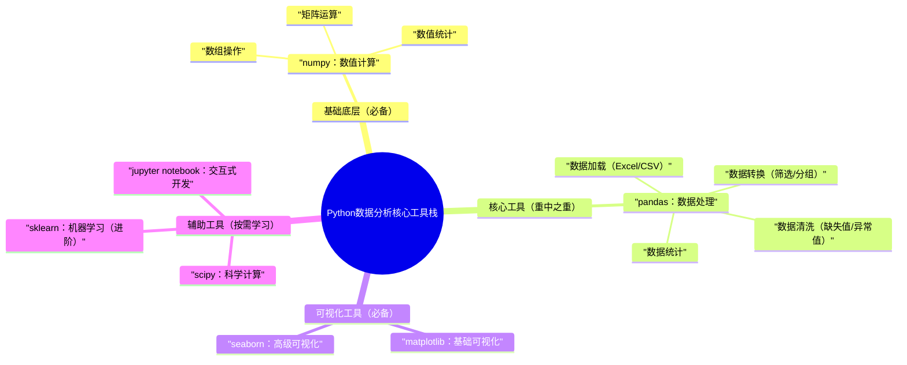
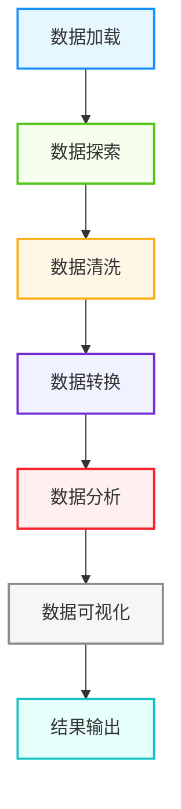

核心定位：Python数据分析的核心是「用代码解决数据问题」，而非死记API。本文全程围绕“实战”展开，每个知识点都搭配可复用示例，兼顾入门友好与进阶提升，适合新手入门、进阶者查漏补缺。

---

## 1. 核心定义

Python数据分析：利用Python工具（numpy、pandas等）对数据进行**加载、清洗、转换、分析、可视化**，挖掘数据背后的规律，为决策提供支撑，核心价值是“从数据中提取有效信息”。

## 2. 核心工具栈（必学，优先级排序）

数据分析工具无需贪多，掌握以下4个核心工具，即可应对90%以上的实战场景，工具栈关联如下：



## 3. 核心学习逻辑

**先掌握工具基础 → 再熟悉核心流程 → 最后实战优化**：

- 入门：numpy（打基础）→ pandas（核心，重点学）→ matplotlib/seaborn（可视化，刚需）；

- 进阶：数据清洗技巧 → 分组聚合分析 → 可视化优化 → 结合业务场景分析；

- 实战：用真实数据集（如电商数据、用户行为数据）完整走一遍分析流程，固化知识点。

---

每个工具遵循「核心定位→高频用法→最简示例→编程思想」，示例可直接复制运行，重点标注避坑点，拒绝冗余。

## 1. numpy（数值计算基础，pandas的底层支撑）

### 核心定位

处理**数值型数据**，提供高效的数组（ndarray）操作，支持矩阵运算、数值统计，解决Python原生列表运算效率低的问题，是数据分析的“底层基石”。

### 高频用法（直接记，够用）

- 数组创建：`np.array()`、`np.zeros()`、`np.ones()`、`np.arange()`；

- 数组操作：切片、重塑（`reshape()`）、拼接（`np.concatenate()`）；

- 数值运算：加减乘除、矩阵乘法（`np.dot()`）、广播机制；

- 统计功能：`np.mean()`（均值）、`np.median()`（中位数）、`np.std()`（标准差）、`np.max()`/`np.min()`（最值）。

### 最简示例（高频场景）

```python
import numpy as np

arr1 = np.array([1, 2, 3, 4, 5])  # 一维数组
arr2 = np.array([[1, 2], [3, 4], [5, 6]])  # 二维数组
print(arr1[1:4])  # 切片：[2 3 4]
print(arr2.reshape(2, 3))  # 重塑：[[1 2 3],[4 5 6]]
arr3 = np.array([10, 20, 30, 40, 50])
print(arr1 + arr3)  # [11 22 33 44 55]
print(np.mean(arr1))  # 3.0（均值）
print(np.std(arr1))   # 1.414（标准差）
print(np.max(arr2))   # 6（二维数组最值）
```
### 编程思想

- **效率优先思想**：numpy数组比Python原生列表运算效率高10-100倍，处理大数据量时优先使用；

- **向量化思想**：避免用for循环遍历数组，用numpy内置函数实现“向量化运算”，简化代码、提升效率；

- **底层支撑思想**：pandas的Series、DataFrame底层基于numpy实现，学好numpy能更好理解pandas的原理。

## 2. pandas（数据分析核心，重中之重）

### 核心定位

处理**表格型数据**（Excel、CSV、数据库等），核心是`Series`（一维数据）和`DataFrame`（二维表格），提供数据加载、清洗、转换、分组、统计等一站式功能，是数据分析的“核心工具”。

### 高频用法（直接记，实战高频）

- 数据加载：`pd.read_csv()`（CSV文件）、`pd.read_excel()`（Excel文件）；

- 数据查看：`df.head()`（前5行）、`df.info()`（数据信息）、`df.describe()`（统计描述）；

- 数据清洗：
  
- 缺失值：`df.dropna()`（删除）、`df.fillna()`（填充）；
  
- 异常值：`df[df["列名"] > 阈值]`（筛选）、`df.replace()`（替换）；
  
- 重复值：`df.drop_duplicates()`（删除重复行）；
      

- 数据转换：`df.loc[]`/`df.iloc[]`（筛选）、`df.groupby()`（分组）、`df.merge()`（合并）、`df.pivot_table()`（透视表）；

- 数据统计：`df.mean()`、`df.count()`、`df.value_counts()`（统计频次）。

### 最简示例（实战场景，可直接复用）

```python
import pandas as pd

df = pd.read_csv("user_data.csv")  # 读取CSV
print(df.head())  # 查看前5行
print(df.info())  # 查看数据类型、缺失值
print(df.describe())  # 查看数值列统计信息
df["age"].fillna(df["age"].mean(), inplace=True)
df = df[df["age"] <= 120]
df.drop_duplicates(inplace=True)
df_filter = df[(df["age"] > 18) & (df["gender"] == "男")]
df_group = df.groupby("gender").agg({
    "age": "mean",
    "user_id": "count"
}).rename(columns={"user_id": "count"})
df1 = df[["user_id", "name"]]
df2 = df[["user_id", "age"]]
df_merge = pd.merge(df1, df2, on="user_id", how="inner")
df_group.to_csv("gender_analysis.csv", index=False)
```
### 编程思想

- **一站式思想**：pandas整合了数据加载、清洗、分析的全流程功能，无需切换工具，提升开发效率；

- **面向数据思想**：以“数据”为核心，所有操作围绕表格展开，贴合数据分析的实际场景；

- **简洁性思想**：用一行代码实现复杂的数据操作（如分组统计、合并），避免冗余的for循环；

- **容错思想**：提供丰富的缺失值、异常值处理方法，保证数据质量，为后续分析奠定基础。

## 3. matplotlib/seaborn（数据可视化，让数据说话）

### 核心定位

将分析后的数据转化为**直观的图表**（折线图、柱状图、饼图、热力图等），让数据规律更易理解，核心价值是“可视化呈现，辅助决策”——matplotlib灵活度高，seaborn语法简洁、样式美观。

### 高频用法（直接记，刚需）

- matplotlib：`plt.plot()`（折线图）、`plt.bar()`（柱状图）、`plt.pie()`（饼图）、`plt.scatter()`（散点图）、`plt.show()`（显示图表）；

- seaborn：`sns.barplot()`（柱状图）、`sns.lineplot()`（折线图）、`sns.heatmap()`（热力图）、`sns.histplot()`（直方图）；

- 图表优化：设置标题（`plt.title()`）、坐标轴标签（`plt.xlabel()`/`plt.ylabel()`）、图例（`plt.legend()`）、颜色（`color`参数）。

### 最简示例（实战场景，美观易复用）

```python
import matplotlib.pyplot as plt
import seaborn as sns
import pandas as pd

df = pd.read_csv("user_data.csv")
plt.rcParams["font.sans-serif"] = ["SimHei"]
plt.rcParams["axes.unicode_minus"] = False
plt.figure(figsize=(8, 5))  # 设置图表大小
sns.barplot(x="gender", y="user_id", data=df, estimator="count", color="skyblue")
plt.title("不同性别的用户数量", fontsize=14)
plt.xlabel("性别", fontsize=12)
plt.ylabel("用户数量", fontsize=12)
plt.savefig("gender_count.png", dpi=300, bbox_inches="tight")  # 保存图表
plt.show()
df["age_group"] = pd.cut(df["age"], bins=[0, 18, 25, 35, 50, 120], labels=["未成年", "18-25", "26-35", "36-50", "50+"])
age_count = df["age_group"].value_counts().sort_index()
plt.figure(figsize=(10, 5))
plt.plot(age_count.index, age_count.values, marker="o", color="orange", linewidth=2)
plt.title("不同年龄段的用户数量", fontsize=14)
plt.xlabel("年龄段", fontsize=12)
plt.ylabel("用户数量", fontsize=12)
plt.grid(True, alpha=0.3)  # 添加网格
plt.show()

corr = df[["age", "consume_amount"]].corr()
plt.figure(figsize=(6, 4))
sns.heatmap(corr, annot=True, cmap="coolwarm", fmt=".2f")
plt.title("年龄与消费金额的相关性", fontsize=14)
plt.show()
```
### 编程思想

- **可视化思想**：“一图胜千言”，用图表替代枯燥的数字，让数据规律更直观，辅助决策；

- **选型思想**：简单图表用matplotlib（灵活），复杂图表、美观图表用seaborn（简洁）；

- **细节优化思想**：图表需设置标题、坐标轴标签、中文字体，提升可读性，避免“半成品图表”；

- **场景适配思想**：根据数据类型选型（如分类数据用柱状图、趋势数据用折线图、相关性数据用热力图）。

---

数据分析不是“零散操作”，而是有固定流程的闭环，掌握这个流程，可应对所有实战场景，流程如下：



## 分步骤详解（干练版，实战可复用）

### 1. 数据加载（Load）

核心：将外部数据（Excel、CSV、数据库）加载到pandas的DataFrame中，是数据分析的第一步。

**避坑点**：注意文件路径（相对路径/绝对路径）、编码格式（如utf-8、gbk）、缺失值识别（如“NA”“无”需手动指定）。

```python
import pandas as pd
df = pd.read_csv("data.csv", encoding="utf-8")
df = pd.read_excel("data.xlsx", sheet_name="Sheet1", engine="openpyxl")
import pymysql
conn = pymysql.connect(host="localhost", user="root", password="123456", database="test_db")
df = pd.read_sql("SELECT * FROM user_data", conn)
```
### 2. 数据探索（Explore）

核心：快速了解数据的基本情况，发现数据的初步规律，为后续清洗、分析做准备。

高频操作：`df.head()`、`df.info()`、`df.describe()`、`df.value_counts()`、`df.corr()`（相关性分析）。

### 3. 数据清洗（Clean）

核心：**处理“脏数据”**，保证数据质量，是数据分析最耗时、最关键的一步（占比60%-80%）。

核心操作：缺失值处理、异常值处理、重复值处理、数据类型转换（如字符串转数字）。

### 4. 数据转换（Transform）

核心：将清洗后的数据转换为“可分析的格式”，如筛选、分组、合并、透视表等。

高频操作：`df.loc[]`/`df.iloc[]`（筛选）、`df.groupby()`（分组）、`df.merge()`（合并）、`pd.cut()`（分箱）。

### 5. 数据分析（Analyze）

核心：挖掘数据背后的规律，结合业务场景进行分析（如用户画像分析、消费趋势分析）。

高频操作：统计分析（均值、中位数、频次）、相关性分析、分组聚合分析、透视表分析。

### 6. 数据可视化（Visualize）

核心：用图表呈现分析结果，让规律更直观，便于沟通和决策（重点：图表选型+细节优化）。

### 7. 结果输出（Output）

核心：将分析结果保存为文件（CSV、Excel、图片），或生成分析报告，供决策使用。

```python
df_group.to_csv("analysis_result.csv", index=False)
df_group.to_excel("analysis_result.xlsx", index=False, engine="openpyxl")
plt.savefig("analysis_chart.png", dpi=300, bbox_inches="tight")
print("=== 数据分析报告 ===")
print(f"1. 总用户数：{len(df)}")
print(f"2. 平均年龄：{df['age'].mean():.1f}岁")
print(f"3. 男性用户占比：{len(df[df['gender']=='男'])/len(df)*100:.1f}%")
```
---

掌握基础工具和流程后，用编程思想优化代码，用开发创意拓展实战场景，提升代码质感和开发效率。

## 1. 核心编程思想（贯穿全程）

- **DRY原则（代码复用）**：将高频操作（如数据加载、缺失值处理）封装为函数，避免重复编写；

- **模块化思想**：将数据分析流程拆分为“加载模块、清洗模块、可视化模块”，职责清晰，便于维护；

- **效率优化思想**：用向量化运算替代for循环，用pandas内置函数替代自定义逻辑，提升运行效率；

- **业务导向思想**：数据分析不是“炫技”，而是解决业务问题（如“如何提升用户消费”“如何降低流失率”），所有操作围绕业务展开。

## 2. 开发创意（实战可用，直接复用）

### 创意1：封装数据分析通用工具类

将高频操作（数据加载、清洗、可视化）封装为工具类，可在所有数据分析项目中复用，提升开发效率。

```python
import pandas as pd
import matplotlib.pyplot as plt
import seaborn as sns

class DataAnalysisUtil:
    @staticmethod
    def load_data(file_path, file_type="csv", encoding="utf-8"):
        """加载数据，支持CSV/Excel"""
        try:
            if file_type == "csv":
                return pd.read_csv(file_path, encoding=encoding)
            elif file_type == "excel":
                return pd.read_excel(file_path, engine="openpyxl")
            else:
                raise ValueError("文件类型仅支持csv和excel")
        except Exception as e:
            print(f"数据加载失败：{str(e)}")
            return pd.DataFrame()

    @staticmethod
    def clean_data(df):
        """通用数据清洗：处理缺失值、异常值、重复值"""
        for col in df.columns:
            if df[col].dtype in ["int64", "float64"]:
                df[col].fillna(df[col].mean(), inplace=True)
            else:
                df[col].fillna("未知", inplace=True)
        for col in df.select_dtypes(include=["int64", "float64"]).columns:
            mean = df[col].mean()
            std = df[col].std()
            df = df[(df[col] >= mean - 3*std) & (df[col] <= mean + 3*std)]
        df.drop_duplicates(inplace=True)
        return df
    @staticmethod
    def plot_bar(df, x_col, y_col, title, save_path=None):
        """通用柱状图绘制，避免重复编写"""
        plt.rcParams["font.sans-serif"] = ["SimHei"]
        plt.figure(figsize=(8, 5))
        sns.barplot(x=x_col, y=y_col, data=df, estimator="count", color="skyblue")
        plt.title(title, fontsize=14)
        plt.xlabel(x_col, fontsize=12)
        plt.ylabel("数量", fontsize=12)
        if save_path:
            plt.savefig(save_path, dpi=300, bbox_inches="tight")
        plt.show()

if __name__ == "__main__":
    df = DataAnalysisUtil.load_data("user_data.csv")
    df_clean = DataAnalysisUtil.clean_data(df)
    DataAnalysisUtil.plot_bar(df_clean, "gender", "user_id", "不同性别的用户数量", "gender_count.png")
```
### 创意2：自动化数据分析报告

结合工具类，实现“一键生成数据分析报告”，自动完成数据加载、清洗、分析、可视化、结果输出，适用于常规数据分析场景。

```python
def auto_analysis(file_path):
    """自动化数据分析报告"""
    df = DataAnalysisUtil.load_data(file_path)
    if df.empty:
        return
    df_clean = DataAnalysisUtil.clean_data(df)
    total_users = len(df_clean)
    avg_age = df_clean["age"].mean()
    male_ratio = len(df_clean[df_clean["gender"] == "男"]) / total_users * 100
    DataAnalysisUtil.plot_bar(df_clean, "gender", "user_id", "不同性别的用户数量", "gender_count.png")
    DataAnalysisUtil.plot_bar(df_clean, "age_group", "user_id", "不同年龄段的用户数量", "age_count.png")
    report = f"""
=== Python自动化数据分析报告 ===
1. 数据概况：
   - 总用户数：{total_users}
   - 平均年龄：{avg_age:.1f}岁
   - 男性用户占比：{male_ratio:.1f}%
   - 数据清洗后：删除重复值{len(df)-len(df_clean)}条，处理缺失值{df.isnull().sum().sum()}个
2. 核心结论：
   - 性别分布：需结合柱状图查看，若男性占比过高，可针对性优化女性用户运营；
   - 年龄分布：需结合柱状图查看，重点关注用户集中的年龄段，制定精准运营策略。

3. 输出文件：
   - 清洗后数据：cleaned_data.csv
   - 性别分布图表：gender_count.png
   - 年龄分布图表：age_count.png
    """
    df_clean.to_csv("cleaned_data.csv", index=False)
    with open("analysis_report.txt", "w", encoding="utf-8") as f:
        f.write(report)
    print(report)
auto_analysis("user_data.csv")
```
### 创意3：大数据量分析优化

处理大数据量（百万级、千万级）时，优化代码效率，避免内存溢出，核心技巧：分块读取、筛选后再操作、避免冗余计算。

```python
import pandas as pd

def big_data_analysis(file_path):
    """大数据量分析优化"""
    chunk_size = 100000  # 每块10万行
    chunks = pd.read_csv(file_path, chunksize=chunk_size, encoding="utf-8")
    total_users = 0
    male_count = 0
    age_sum = 0
    for chunk in chunks:
        chunk = DataAnalysisUtil.clean_data(chunk)
        total_users += len(chunk)
        male_count += len(chunk[chunk["gender"] == "男"])
        age_sum += chunk["age"].sum()
    avg_age = age_sum / total_users if total_users > 0 else 0
    male_ratio = male_count / total_users * 100 if total_users > 0 else 0
    print(f"大数据量分析结果：")
    print(f"总用户数：{total_users}")
    print(f"平均年龄：{avg_age:.1f}岁")
    print(f"男性用户占比：{male_ratio:.1f}%")
big_data_analysis("big_user_data.csv")
```
---

## 1. 新手避坑指南（高频踩坑点）

- **坑1：中文乱码**：加载数据时指定`encoding="utf-8"`，可视化时设置中文字体；

- **坑2：缺失值处理不当**：数值列用均值/中位数填充，字符串列用“未知”填充，避免直接删除大量数据；

- **坑3：用for循环遍历DataFrame**：优先用pandas内置函数、向量化运算，效率提升10倍以上；

- **坑4：图表样式粗糙**：必设标题、坐标轴标签，调整图表大小，保存时用`dpi=300`保证清晰度；

- **坑5：脱离业务分析**：数据分析的核心是解决业务问题，避免“为了分析而分析”。

## 2. 学习建议

- **优先级**：pandas（重点）→ matplotlib/seaborn（刚需）→ numpy（基础）→ 进阶工具（按需）；

- **练习方法**：用真实数据集练习（如Kaggle、阿里天池的公开数据），完整走一遍“加载→清洗→分析→可视化”流程；

- **技巧**：不用死记API，用到再查官方文档（pandas、matplotlib文档），重点记“场景对应方法”；

- **提升**：熟练基础后，学习scipy（科学计算）、sklearn（机器学习），实现“数据分析→数据建模”的进阶。

---


本文所有示例均可直接复制运行，工具类可直接复用，适合新手入门、进阶者查漏补缺。如果需要某类场景的详细示例（如电商数据分析、用户行为分析、大数据量处理），欢迎留言交流！