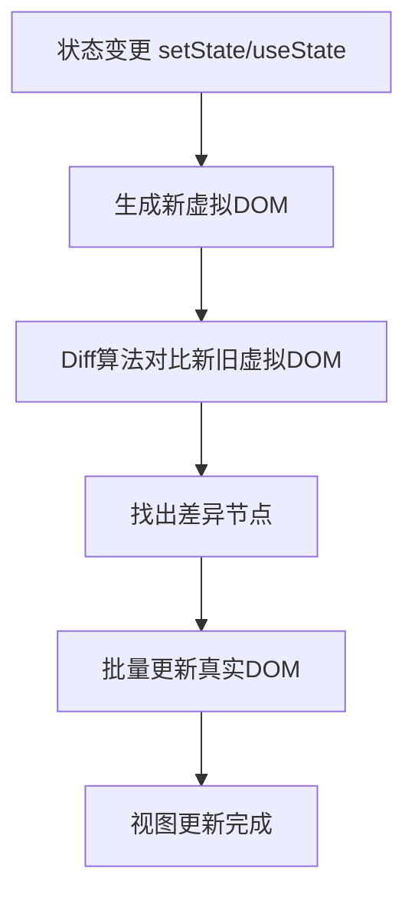
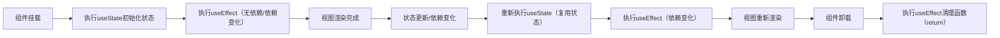

## 1.1 核心原理：虚拟DOM与Diff算法

React 核心优势是**高效更新视图**，底层依赖「虚拟DOM（Virtual DOM）」+「Diff算法」，核心逻辑：

1. 虚拟DOM：内存中的JavaScript对象，映射真实DOM，避免频繁操作真实DOM（性能瓶颈）；

2. Diff算法：React Diff（同层比较），只更新变化的节点，而非全量渲染，提升性能。

**关键结论**：虚拟DOM不是“更快”，而是“更可控”，通过批量更新、最小化操作，实现高效渲染。

**Mermaid 渲染流程图解**：



## 1.2 JSX：React 的模板语法（核心）

JSX 是「JavaScript XML」的缩写，不是模板语言，是**JavaScript 的语法扩展**，本质是 `React.createElement()` 的语法糖，优势：直观、简洁、可嵌入JS逻辑。

**核心规则（必记）**：

- 标签必须闭合（单标签用 `/>` 结束）；

- 类名用 `className` 替代 `class`（避免与JS关键字冲突）；

- 内联样式用对象形式（`style={{ color: 'red', fontSize: '16px' }}`）；

- JS表达式用 `{}` 嵌入（可放变量、函数调用、三元运算，不可放语句）。

**极简示例**：

```jsx
// JSX 写法（推荐）
function App() {
  const name = "React";
  return <h1 className="title" style={{ color: 'blue' }}>Hello, {name}!</h1>;
}

// 等价于 React.createElement（底层实现，无需手写）
React.createElement('h1', { className: 'title', style: { color: 'blue' } }, `Hello, ${name}!`);
```

## 1.3 Hooks：React 16.8+ 核心（函数组件的灵魂）

Hooks 解决了类组件“逻辑复用复杂”“生命周期混乱”的问题，核心思想：**将组件逻辑拆分为独立的可复用函数**，仅用于函数组件。

**常用 Hooks 速查（必掌握）**：

|Hooks|核心作用|极简示例|
|---|---|---|
|**useState**|管理组件内部状态（基础类型/引用类型）|`const [count, setCount] = useState(0);`|
|**useEffect**|处理副作用（请求、订阅、DOM操作），替代类组件生命周期|`useEffect(() => { /* 副作用逻辑 */ }, [依赖项]);`|
|**useContext**|跨组件通信（无需层层传递props）|`const theme = useContext(ThemeContext);`|
|**useRef**|获取DOM元素/保存可变值（不触发重新渲染）|`const inputRef = useRef(null);`|
|**useMemo/useCallback**|性能优化（缓存计算结果/函数，避免重复渲染）|`const sum = useMemo(() => a + b, [a, b]);`|
**关键提醒**：Hooks 必须在函数组件顶层调用（不能在if、for、函数嵌套中使用），遵循“ Hooks 规则”。

**Mermaid Hooks 生命周期图解**：



## 1.4 组件系统：组件化思想的落地

React 组件分为「函数组件」（推荐）和「类组件」（逐步淘汰），核心原则：**单一职责**（一个组件只做一件事）、**可复用**、**可测试**。

**组件通信方式（按场景选择，不冗余）**：

1. **父子通信**：父传子用 `props`，子传父用「父组件传递的回调函数」；

2. **跨层级通信**：`useContext + createContext`（简单场景）、Redux Toolkit（复杂场景）；

3. **兄弟通信**：通过共同父组件中转，或使用状态管理工具；

4. **无关联组件通信**：Redux Toolkit、EventBus（极少用）。

---

工程化的核心是「规范」和「效率」，以下是企业级 React 项目的标准目录结构（基于 Vite + React 18），遵循「模块化、分层架构」思想。

## 2.1 推荐项目目录结构（核心规范）

```bash
src/
├── api/              # API 接口层（统一管理请求，解耦视图与接口）
│   └── user.js       # 单个模块接口（如用户相关）
├── assets/           # 静态资源（图片、字体、样式变量）
│   ├── images/
│   ├── styles/
│   └── fonts/
├── components/       # 通用组件（可复用、无业务逻辑，如 Button、Input）
│   ├── Button/
│   │   ├── index.jsx # 组件入口
│   │   └── style.module.css # 样式隔离
├── features/         # 业务组件（按功能模块划分，含业务逻辑，如 UserList）
│   ├── user/         # 用户模块
│   │   ├── components/ # 该模块专属组件
│   │   ├── UserList.jsx
│   │   └── userApi.js  # 该模块专属接口（可选，复杂项目拆分）
├── hooks/            # 自定义 Hooks（复用组件逻辑，如 useRequest、useAuth）
│   └── useRequest.js
├── store/            # 状态管理（Redux Toolkit）
│   ├── slices/       # 切片（按模块划分状态）
│   │   └── userSlice.js
│   └── index.js      # store 配置
├── router/           # 路由配置（React Router 6）
│   └── index.jsx
├── utils/            # 工具函数（格式化、请求封装、常量定义）
│   ├── request.js    # axios 封装
│   └── format.js     # 时间/数字格式化
├── App.jsx           # 根组件
├── main.jsx          # 入口文件（渲染根组件、配置 store、路由）
└── index.css         # 全局样式
```

**设计思想**：

- **分层解耦**：API层、视图层、状态层、工具层分离，修改一个层不影响其他层；

- **模块化划分**：按“功能模块”（features）拆分，而非“文件类型”，便于团队协作和维护；

- **样式隔离**：使用 CSS Module 或 Styled Components，避免样式污染。

## 2.2 路由管理：React Router 6（最新版，必掌握）

React Router 是 React 官方路由库，核心思想：**声明式路由**，与 React 组件化思想一致，React Router 6 相比旧版更简洁、更灵活。

**核心功能与用法（干练版）**：

1. **路由配置**：用 `createBrowserRouter` 配置路由，替代旧版 `<Switch>`；

2. **嵌套路由**：实现布局复用（如侧边栏 + 内容区），用 `<Outlet>` 渲染子路由；

3. **动态路由**：用 `:param` 定义动态参数（如 `/user/:id`），通过 `useParams()` 获取；

4. **路由守卫**：用 `Navigate` 实现重定向，用 `useNavigate()` 实现编程式导航；

5. **权限控制**：封装私有路由组件（PrivateRoute），判断登录状态。

**核心代码示例**：

```jsx
// router/index.jsx
import { createBrowserRouter, RouterProvider } from 'react-router-dom';
import App from '../App';
import Home from '../features/home/Home';
import UserList from '../features/user/UserList';
import UserDetail from '../features/user/UserDetail';
import Login from '../features/login/Login';
import PrivateRoute from './PrivateRoute'; // 自定义私有路由

const router = createBrowserRouter([
  {
    path: '/',
    element: <App />,
    children: [
      { path: '', element: <Home /> },
      // 私有路由：必须登录才能访问
      { path: 'user', element: <PrivateRoute><UserList /></PrivateRoute> },
      { path: 'user/:id', element: <PrivateRoute><UserDetail /></PrivateRoute> },
    ]
  },
  { path: '/login', element: <Login /> },
]);

export default () => <RouterProvider router={router} />;
```

## 2.3 状态管理：Redux Toolkit（官方推荐，简化Redux）

Redux 用于管理全局状态（如用户信息、全局配置），Redux Toolkit（RTK）是官方封装的工具集，解决了原生 Redux 代码繁琐、配置复杂的问题，核心思想：**简化状态管理，规范写法**。

**核心概念（必记）**：

- **Slice**：切片，包含一个模块的 `state`、`reducers`（同步更新）、`extraReducers`（异步更新）；

- **Store**：全局状态容器，由 `configureStore` 创建，无需手动配置中间件；

- **useSelector**：获取全局状态；

- **useDispatch**：触发 action，更新状态。

**核心代码示例（用户模块）**：

```jsx
// store/slices/userSlice.js
import { createSlice, createAsyncThunk } from '@reduxjs/toolkit';
import { getUserInfo } from '../../api/user';

// 异步action（获取用户信息）
export const fetchUserInfo = createAsyncThunk(
  'user/fetchUserInfo',
  async (userId, { rejectWithValue }) => {
    try {
      const res = await getUserInfo(userId);
      return res.data;
    } catch (err) {
      return rejectWithValue(err.message);
    }
  }
);

// 切片配置
const userSlice = createSlice({
  name: 'user', // 切片名称（唯一）
  initialState: {
    info: {},
    loading: false,
    error: ''
  },
  reducers: {
    // 同步action（更新用户信息）
    updateUserInfo: (state, action) => {
      state.info = action.payload; // RTK 内置 Immer，可直接修改state（无需深拷贝）
    }
  },
  // 处理异步action
  extraReducers: (builder) => {
    builder
      .addCase(fetchUserInfo.pending, (state) => {
        state.loading = true;
      })
      .addCase(fetchUserInfo.fulfilled, (state, action) => {
        state.loading = false;
        state.info = action.payload;
      })
      .addCase(fetchUserInfo.rejected, (state, action) => {
        state.loading = false;
        state.error = action.payload;
      });
  }
});

// 导出同步action
export const { updateUserInfo } = userSlice.actions;
// 导出切片reducer
export default userSlice.reducer;
```

**Store 配置**：

```jsx
// store/index.js
import { configureStore } from '@reduxjs/toolkit';
import userReducer from './slices/userSlice';

export const store = configureStore({
  reducer: {
    user: userReducer, // 注册切片reducer
    // 其他模块切片...
  }
});
```

**组件中使用**：

```jsx
import { useSelector, useDispatch } from 'react-redux';
import { fetchUserInfo, updateUserInfo } from '../../store/slices/userSlice';

function UserDetail() {
  const dispatch = useDispatch();
  const { info, loading, error } = useSelector(state => state.user);

  useEffect(() => {
    dispatch(fetchUserInfo(123)); // 触发异步action
  }, [dispatch]);

  return (
    <div>
      {loading && <div>加载中...</div>}
      {error && <div>{error}</div>}
      <h3>{info.name}</h3>
      <button onClick={() => dispatch(updateUserInfo({ name: '新名称' }))}>
        更新名称
      </button>
    </div>
  );
}
```

## 2.4 构建工具与性能优化（实战必备）

### 2.4.1 构建工具：Vite（推荐）vs Create React App（CRA）

|工具|核心优势|适用场景|
|---|---|---|
|**Vite**|基于 ES Module，开发环境秒启动，热更新快，生产环境 Rollup 打包体积小|新项目、中大型项目（推荐）|
|CRA|配置简单，零配置上手，兼容性好|小型项目、快速原型开发|
### 2.4.2 性能优化技巧（干货，直接用）

1. **组件懒加载**：用 `React.lazy()` + `Suspense` 实现路由懒加载，减少首屏加载体积；`const UserList = React.lazy(() => import('../features/user/UserList'));
// 使用时包裹 Suspense
<Suspense fallback={<div>加载中...</div>}>
    <UserList />
</Suspense>`

2. **避免不必要的重渲染**：用 `useMemo` 缓存计算结果，`useCallback` 缓存函数，`React.memo` 包装组件；

3. **列表优化**：大数据列表用「虚拟列表」（如 `react-window`），避免渲染所有节点；

4. **图片优化**：使用 `img` 标签 `loading="lazy"` 原生懒加载，或使用 `next/image`（Next.js 项目）；

5. **请求优化**：接口请求防抖节流、缓存请求结果（如用 `useRequest` 封装）。

---

React 不仅是一个框架，更是一种「编程思想」的体现，以下是实战中能提升效率、优化代码的核心思想和创意技巧。

## 3.1 函数式编程思想（React 核心）

React 基于函数式编程思想，核心原则：**纯函数、无副作用、数据不可变**。

- **纯函数**：组件接收 `props` 作为输入，输出固定的 JSX，不修改外部状态，不产生副作用（如修改全局变量、直接操作DOM）；

- **数据不可变**：修改状态时，不直接修改原数据，而是返回新数据（RTK 内置 Immer 可简化此操作）；

- **好处**：代码可预测、可测试、易维护，减少 bug。

## 3.2 自定义 Hooks：逻辑复用的艺术（核心创意）

自定义 Hooks 是 React 最强大的特性之一，核心思想：**将组件中可复用的逻辑抽取为独立的 Hooks 函数**，实现“一次封装，多处复用”。

**实战创意示例（3个高频自定义 Hooks）**：

### 示例1：useRequest（请求 Hooks，复用请求逻辑）

```jsx
// hooks/useRequest.js
import { useState, useEffect } from 'react';
import request from '../utils/request';

export function useRequest(url, options = {}) {
  const [data, setData] = useState(null);
  const [loading, setLoading] = useState(false);
  const [error, setError] = useState('');

  const fetchData = async () => {
    setLoading(true);
    try {
      const res = await request(url, options);
      setData(res.data);
      setError('');
    } catch (err) {
      setError(err.message);
      setData(null);
    } finally {
      setLoading(false);
    }
  };

  // 初始化请求
  useEffect(() => {
    fetchData();
  }, [url, options]);

  // 暴露重新请求方法
  return { data, loading, error, refetch: fetchData };
}

// 组件中使用
function UserList() {
  const { data, loading, error, refetch } = useRequest('/api/user/list');
  // ...
}
```

### 示例2：useAuth（权限 Hooks，复用登录状态判断）

```jsx
// hooks/useAuth.js
import { useSelector, useDispatch } from 'react-redux';
import { useNavigate } from 'react-router-dom';
import { fetchUserInfo } from '../store/slices/userSlice';

export function useAuth() {
  const dispatch = useDispatch();
  const navigate = useNavigate();
  const { info, loading } = useSelector(state => state.user);

  // 判断是否登录
  const isLogin = !!info.id;

  // 未登录则跳转登录页
  const checkAuth = () => {
    if (!isLogin) {
      navigate('/login');
      return false;
    }
    return true;
  };

  // 退出登录
  const logout = () => {
    localStorage.removeItem('token');
    dispatch(fetchUserInfo(null));
    navigate('/login');
  };

  return { isLogin, loading, checkAuth, logout };
}
```

### 示例3：useWindowSize（监听窗口大小 Hooks）

```jsx
// hooks/useWindowSize.js
import { useState, useEffect } from 'react';

export function useWindowSize() {
  const [size, setSize] = useState({
    width: window.innerWidth,
    height: window.innerHeight
  });

  const handleResize = () => {
    setSize({
      width: window.innerWidth,
      height: window.innerHeight
    });
  };

  useEffect(() => {
    window.addEventListener('resize', handleResize);
    return () => window.removeEventListener('resize', handleResize);
  }, []);

  return size;
}

// 组件中使用（响应式布局）
function ResponsiveComponent() {
  const { width } = useWindowSize();
  const isMobile = width < 768;
  // ...
}
```

## 3.3 组件设计创意：高内聚、低耦合

1. **原子化组件设计**：将组件拆分为“原子级”（如 Button、Input）、“分子级”（如 FormItem）、“ organism 级”（如 LoginForm），层层组合，提升复用性；

2. **组件封装技巧**：用「高阶组件（HOC）」或「Render Props」封装通用逻辑（如权限控制、加载状态），但优先使用自定义 Hooks（更简洁）；

3. **样式解决方案**：复杂项目用 Styled Components（组件级样式，支持JS逻辑），简单项目用 CSS Module（样式隔离），避免全局样式污染；

4. **动态组件渲染**：通过配置文件动态渲染组件，实现“配置化开发”（如表单配置、菜单配置），减少硬编码。

## 3.4 开发创意：提升效率的小技巧

- **组件自动注册**：通过 `import.meta.glob` 自动注册全局通用组件，无需手动 import；

- **接口请求统一封装**：拦截器统一处理请求头（如 Token）、响应错误（如 401 跳转登录）；

- **环境变量配置**：区分开发、测试、生产环境，统一管理接口地址、密钥等配置；

- **微前端架构**：用 `qiankun` 将多个 React 应用整合为一个系统，实现“一套外壳，多个子应用”（大型项目适用）。

---

结合以上知识点，快速搭建一个极简后台管理系统，核心功能：登录、用户列表、用户详情，覆盖路由、状态管理、API 封装、自定义 Hooks。

## 4.1 核心目录结构（简化版）

```bash
src/
├── api/              # 接口封装
│   └── user.js
├── components/       # 通用组件（Button、Input）
├── features/         # 业务组件
│   ├── login/        # 登录模块
│   └── user/         # 用户模块
├── hooks/            # 自定义 Hooks（useRequest、useAuth）
├── store/            # 状态管理
│   └── slices/userSlice.js
├── router/           # 路由配置
├── utils/            # 工具函数（request.js）
├── App.jsx
└── main.jsx
```

## 4.2 关键代码（核心片段）

### 1. API 封装（utils/request.js）

```jsx
import axios from 'axios';

const request = axios.create({
  baseURL: import.meta.env.VITE_API_BASE_URL, // 环境变量
  timeout: 5000
});

// 请求拦截器：添加 Token
request.interceptors.request.use(
  (config) => {
    const token = localStorage.getItem('token');
    if (token) {
      config.headers.Authorization = `Bearer ${token}`;
    }
    return config;
  },
  (err) => Promise.reject(err)
);

// 响应拦截器：统一处理错误
request.interceptors.response.use(
  (res) => res.data,
  (err) => {
    // 401 未授权，跳转登录页
    if (err.response?.status === 401) {
      localStorage.removeItem('token');
      window.location.href = '/login';
    }
    return Promise.reject(err.message);
  }
);

export default request;
```

### 2. 登录组件（features/login/Login.jsx）

```jsx
import { useState } from 'react';
import { useNavigate } from 'react-router-dom';
import { useDispatch } from 'react-redux';
import { login } from '../../api/user';
import { updateUserInfo } from '../../store/slices/userSlice';
import Button from '../../components/Button';
import Input from '../../components/Input';

function Login() {
  const [form, setForm] = useState({ username: '', password: '' });
  const dispatch = useDispatch();
  const navigate = useNavigate();

  const handleSubmit = async (e) => {
    e.preventDefault();
    try {
      const res = await login(form);
      localStorage.setItem('token', res.token);
      dispatch(updateUserInfo(res.user));
      navigate('/user'); // 登录成功跳转用户列表
    } catch (err) {
      alert(err);
    }
  };

  return (
    <form onSubmit={handleSubmit} className="login-form">
      <Input
        placeholder="用户名"
        value={form.username}
        onChange={(e) => setForm({ ...form, username: e.target.value })}
      />
      <Input
        placeholder="密码"
        type="password"
        value={form.password}
        onChange={(e) => setForm({ ...form, password: e.target.value })}
      />
      <Button type="submit">登录</Button>
    </form>
  );
}
```

---


本文摒弃冗余理论，聚焦“实战有用”的知识点，从基础原理到工程化实践，再到编程思想和创意技巧，覆盖 React 开发的核心场景。记住：React 不是“死记硬背”，而是“理解思想 + 多练实战”，多封装、多复用、多优化，才能写出优雅、可维护的 React 代码。