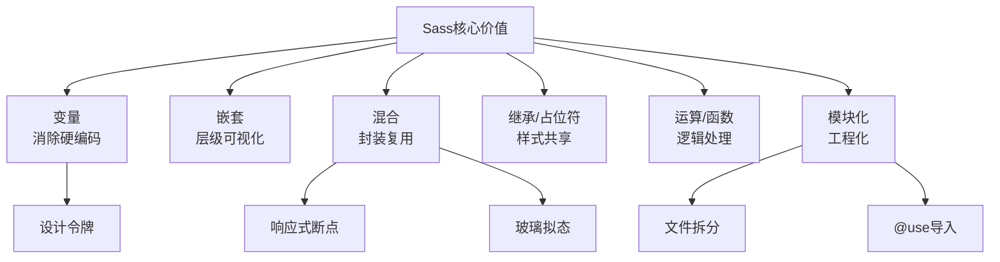
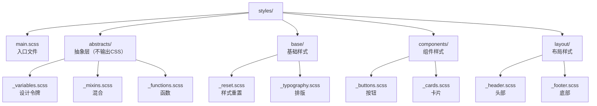

## 一、核心基础：语法与编译

### 1.1 两种语法：推荐SCSS

Sass有两种语法，**SCSS（Sassy CSS）** 是主流，因为它完全兼容CSS语法，学习成本为零：

- **SCSS**：文件后缀`.scss`，语法和CSS一致，支持`{}`和`;`，本文所有示例基于SCSS

- **缩进语法**：文件后缀`.sass`，靠缩进替代`{}`，省略`;`，类似Python，小众不推荐

### 1.2 编译方式：从简单到工程化

Sass需要编译成CSS才能被浏览器识别，常用3种方式：

1. **VS Code插件**：`Live Sass Compiler`，一键实时编译，适合小项目

2. **命令行**：`npm install -g sass`，执行`sass input.scss output.css --watch`

3. **工程化工具**：Vite/Webpack/Rollup，通过loader/plugin集成，适合大型项目

## 二、变量（Variables）：消除硬编码的第一步

编程思想：**约定优于配置** + **DRY（Don't Repeat Yourself）**。用变量定义“设计令牌”，统一管理颜色、间距、字体，修改一处全局生效。

### 2.1 基础用法

用`$`符号定义变量，编译时直接替换为对应值：

```scss

// _variables.scss - 设计令牌定义（推荐单独文件）
$primary-color: #007bff !default; // !default：允许外部覆盖默认值
$secondary-color: #6c757d !default;
$spacing-base: 16px !default;
$border-radius: 8px !default;
$font-family-base: 'Helvetica Neue', Arial, sans-serif !default;

// 使用变量
.btn {
  background-color: $primary-color;
  padding: $spacing-base $spacing-base * 2; // 支持简单运算
  border-radius: $border-radius;
  font-family: $font-family-base;
}
```

### 2.2 作用域

- **全局变量**：定义在任何选择器外，全局可用

- **局部变量**：定义在选择器内，仅当前块可用，用`!global`可提升为全局

## 三、嵌套（Nesting）：让层级结构可视化

编程思想：**结构与语义对应**。让CSS的层级和HTML的DOM结构保持一致，减少选择器重复书写。

### 3.1 核心用法

#### 1. 选择器嵌套

```scss

// SCSS嵌套
.nav {
  background: #fff;

  .nav-item {
    display: inline-block;

    .nav-link {
      color: $primary-color;
    }
  }
}

// 编译后CSS
.nav { background: #fff; }
.nav .nav-item { display: inline-block; }
.nav .nav-item .nav-link { color: #007bff; }
```

#### 2. 父选择器`&`：伪类与BEM的利器

`&`代表父选择器本身，是**伪类**、**BEM命名**的核心：

```scss

// BEM命名结合&
.card {
  background: #fff;

  // 元素（Element）：card__title
  &__title {
    font-size: 1.5rem;
    color: $primary-color;
  }

  // 修饰符（Modifier）：card--featured
  &--featured {
    border: 2px solid $primary-color;
  }

  // 伪类
  &:hover {
    box-shadow: 0 4px 12px rgba(0,0,0,0.1);
  }
}
```

### 3.2 避坑指南：过度嵌套是万恶之源

**嵌套层级禁止超过3层**，否则会导致：

- 选择器权重过高（`div ul li a`），后续难以覆盖

- 编译后的CSS冗余，性能下降

- 耦合HTML结构，DOM变动需同步改CSS

## 四、混合（Mixin）：封装可复用的“样式函数”

编程思想：**函数封装** + **参数化配置**。像写JS函数一样封装可复用的样式块，支持传入参数，是Sass最强大的特性之一。

### 4.1 基础用法

用`@mixin`定义，`@include`调用：

```scss

// 混合：清除浮动（经典场景）
@mixin clearfix {
  &::after {
    content: '';
    display: table;
    clear: both;
  }
}

// 调用
.container {
  @include clearfix;
}
```

### 4.2 参数与默认值

支持传入参数，可设置默认值：

```scss

// 混合：玻璃拟态（创意场景）
@mixin glassmorphism($blur: 10px, $bg-opacity: 0.1, $border-opacity: 0.2) {
  background: rgba(255, 255, 255, $bg-opacity);
  backdrop-filter: blur($blur);
  -webkit-backdrop-filter: blur($blur);
  border: 1px solid rgba(255, 255, 255, $border-opacity);
  border-radius: $border-radius;
}

// 调用：不传参用默认值，传参覆盖
.card-glass {
  @include glassmorphism; // 默认参数
  padding: $spacing-base;
}

.card-glass-strong {
  @include glassmorphism(20px, 0.2, 0.3); // 自定义参数
  padding: $spacing-base;
}
```

### 4.3 创意实战：响应式断点封装

结合`@content`插入调用时的内容，实现移动优先的响应式断点：

```scss

// _mixins.scss - 响应式断点定义
$breakpoints: (
  'sm': 576px,
  'md': 768px,
  'lg': 992px,
  'xl': 1200px
) !default;

// 混合：响应式断点（移动优先，min-width）
@mixin respond-to($breakpoint) {
  @if map-has-key($breakpoints, $breakpoint) {
    @media (min-width: map-get($breakpoints, $breakpoint)) {
      @content; // 插入调用时的样式块
    }
  } @else {
    @warn "断点 #{$breakpoint} 不存在！请检查 $breakpoints 配置";
  }
}

// 使用
.container {
  width: 100%;
  padding: $spacing-base;

  // 中屏以上（≥768px）
  @include respond-to('md') {
    max-width: 720px;
    margin: 0 auto;
  }

  // 大屏以上（≥992px）
  @include respond-to('lg') {
    max-width: 960px;
  }
}
```

## 五、继承（Extend）与占位符（Placeholder）：共享样式的优雅方式

编程思想：**继承复用** + **避免冗余**。共享通用样式，减少代码重复，占位符更是能避免编译出无用的CSS。

### 5.1 占位符`%`：最佳实践

占位符以`%`开头，**不会编译到CSS**，只有被`@extend`继承时才会输出，是最优雅的样式共享方式：

```scss

// 占位符：按钮基础样式（不编译到CSS）
%btn-base {
  display: inline-block;
  padding: $spacing-base $spacing-base * 2;
  border-radius: $border-radius;
  text-decoration: none;
  text-align: center;
  transition: background-color 0.3s;
}

// 主按钮：继承占位符
.btn-primary {
  @extend %btn-base;
  background-color: $primary-color;
  color: #fff;

  &:hover {
    background-color: darken($primary-color, 10%); // 颜色函数
  }
}

// 次要按钮：继承占位符
.btn-secondary {
  @extend %btn-base;
  background-color: $secondary-color;
  color: #fff;
}

// 编译后CSS（合并选择器，无冗余）
.btn-primary, .btn-secondary {
  display: inline-block;
  padding: 16px 32px;
  border-radius: 8px;
  /* ... 其他基础样式 */
}
.btn-primary { background-color: #007bff; /* ... */ }
.btn-secondary { background-color: #6c757d; /* ... */ }
```

### 5.2 Mixin vs Extend：如何选择？

|特性|Mixin|Extend（占位符）|
|---|---|---|
|**原理**|复制代码到调用处|合并选择器|
|**参数**|支持|不支持|
|**适用场景**|需要参数配置（如玻璃拟态、响应式）|纯样式共享（如按钮基础、卡片基础）|
|**编译后CSS**|可能有重复代码|代码更精简|
## 六、运算与函数：让CSS具备“逻辑能力”

编程思想：**逻辑抽象**。Sass提供数值运算、颜色运算、内置函数，还支持自定义函数，让样式不再是“静态描述”，而是“动态生成”。

### 6.1 核心运算与函数

#### 1. 数值运算

支持`+`、`-`、`*`、`/`，注意单位一致：

```scss

$spacing-base: 16px;
.container {
  padding: $spacing-base * 1.5; // 24px
  margin: $spacing-base / 2; // 8px
}
```

#### 2. 颜色函数

动态调整颜色，是生成色板的利器：

```scss

$primary-color: #007bff;
$primary-light: lighten($primary-color, 10%); // 浅10%
$primary-dark: darken($primary-color, 10%); // 深10%
$primary-transparent: rgba($primary-color, 0.1); // 透明10%
```

#### 3. 自定义函数

用`@function`定义，必须有`@return`：

```scss

// 自定义函数：px转rem（假设根字体16px）
@function px-to-rem($px, $base: 16px) {
  @if unitless($px) {
    $px: $px * 1px; // 无单位则补px
  }
  @return $px / $base * 1rem;
}

// 使用
body {
  font-size: px-to-rem(16px); // 1rem
  line-height: 1.6;
}

h1 {
  font-size: px-to-rem(32px); // 2rem
  margin-bottom: px-to-rem(24px); // 1.5rem
}
```

## 七、模块化（Partials）：拆分文件，工程化开发

编程思想：**模块化** + **单一职责**。将Sass拆分为多个小文件，每个文件只负责一个功能，像搭积木一样组织代码，是大型项目的必由之路。

### 7.1 核心概念

- **下划线文件**：文件名以`_`开头（如`_variables.scss`），不会被单独编译成CSS，仅用于被导入

- **现代导入语法**：`@use`（替代旧的`@import`，有命名空间，避免变量污染）

### 7.2 推荐文件结构


### 7.3 入口文件`main.scss`

用`@use`导入，`as *`表示无命名空间（直接用变量/混合）：

```scss

// main.scss - 唯一编译输出的文件
// 1. 先导入抽象层（变量、混合、函数，顺序不能乱）
@use 'abstracts/variables' as *;
@use 'abstracts/functions' as *;
@use 'abstracts/mixins' as *;

// 2. 再导入基础样式
@use 'base/reset';
@use 'base/typography';

// 3. 然后导入布局样式
@use 'layout/header';
@use 'layout/footer';

// 4. 最后导入组件样式
@use 'components/buttons';
@use 'components/cards';
```

## 八、最佳实践：用Sass构建设计系统

创意思想：**设计令牌（Design Tokens）**。将设计系统的颜色、间距、字体等抽象为Sass变量，实现“设计→代码”的一致性，是现代前端工程化的标准做法。

### 8.1 设计令牌示例

```scss

// abstracts/_design-tokens.scss
// 1. 颜色令牌（嵌套Map，支持多色调）
$colors: (
  'primary': (
    'base': #007bff,
    'light': lighten(#007bff, 10%),
    'dark': darken(#007bff, 10%),
    'transparent': rgba(#007bff, 0.1)
  ),
  'neutral': (
    '100': #f8f9fa,
    '200': #e9ecef,
    '300': #dee2e6,
    '400': #ced4da,
    '500': #adb5bd,
    '600': #6c757d,
    '700': #495057,
    '800': #343a40,
    '900': #212529
  )
);

// 2. 间距令牌（8px基准）
$spacing: (
  'xs': 4px,
  'sm': 8px,
  'md': 16px,
  'lg': 24px,
  'xl': 32px
);

// 3. 字体令牌
$fonts: (
  'base': 'Helvetica Neue, Arial, sans-serif',
  'mono': 'Consolas, Monaco, monospace'
);

// 辅助函数：快速获取设计令牌
@function color($key, $tone: 'base') {
  @return map-get(map-get($colors, $key), $tone);
}

@function spacing($key) {
  @return map-get($spacing, $key);
}
```

### 8.2 使用设计令牌

```scss

// components/_buttons.scss
.btn {
  @extend %btn-base;
  background-color: color('primary');
  color: color('neutral', '100');
  padding: spacing('sm') spacing('md');
  font-family: map-get($fonts, 'base');

  &:hover {
    background-color: color('primary', 'dark');
  }
}
```

## 结尾

Sass的核心价值不是“语法糖”，而是**用编程思想重构CSS开发流程**：从变量消除硬编码，到混合封装复用，再到模块化构建设计系统，每一步都是对“可维护性”和“开发效率”的提升。

建议你从一个小项目开始，尝试用本文的文件结构和设计令牌思想重构代码，在实践中体会Sass的魅力。

需要我帮你用这些思想生成一个完整的Sass项目模板吗？