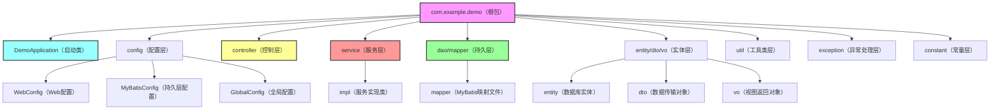

## 一、核心前置知识点（必懂，不绕弯）

先掌握基础核心，再谈工程结构和实战，避免踩入门坑，重点抓“是什么、有什么用、怎么用”。

### 1. SpringBoot核心特性（干练总结）

- **自动配置**：最核心特性，根据依赖自动配置Spring环境（无需手动写XML配置）；

- **起步依赖**：将常用依赖封装为starter（如spring-boot-starter-web），一键引入，避免依赖冲突；

- **内嵌容器**：默认内嵌Tomcat（可切换Jetty、Undertow），无需单独部署容器；

- **无XML配置**：全程注解驱动，简化开发，提升效率；

- **监控能力**：集成Actuator，轻松监控应用健康状态、接口调用情况。

### 2. 核心编程思想（贯穿全文，落地必备）

✅ 约定优于配置（Convention Over Configuration）：SpringBoot有默认规范，无需手动配置，仅在特殊需求时修改；

✅ 单一职责原则：每个类、每个方法只做一件事，降低耦合，便于维护和扩展；

✅ 面向接口编程：依赖抽象而非具体实现，提升代码灵活性和可测试性；

✅ 开闭原则：扩展功能时不修改原有代码，通过注解、配置实现扩展。

### 3. 常用环境与工具（实战必备）

- 开发工具：IntelliJ IDEA（首选，支持SpringBoot快速创建、自动提示）；

- 构建工具：Maven（主流）、Gradle（轻量，大型项目首选）；

- 环境配置：dev（开发）、test（测试）、prod（生产），区分环境避免线上风险；

- 核心依赖：spring-boot-starter-web（Web开发）、spring-boot-starter-data-jpa/mybatis（持久层）、spring-boot-starter-test（单元测试）。

## 二、SpringBoot工程结构化开发（规范为王，提升可维护性）

工程结构混乱是后期维护的“噩梦”，好的结构能让团队协作更高效、代码更易读，以下是**企业级规范结构**，适配大多数SpringBoot项目，同时融入开发创意优化。

### 1. 标准工程结构（分层清晰，职责明确）


### 2. 各层职责详解（干练不冗余，精准落地）

|层级|核心职责|开发规范与创意|
|---|---|---|
|启动类（DemoApplication）|项目入口，开启SpringBoot自动配置|1. 启动类放在根包下，确保Spring能扫描所有子包；2. 避免在启动类写业务逻辑，仅添加核心注解（如@SpringBootApplication）|
|config（配置层）|配置Bean、全局设置（如跨域、拦截器、持久层配置）|1. 每个配置类对应一个功能（如WebConfig专门处理Web相关配置）；2. 用@Configuration注解标识，避免配置分散|
|controller（控制层）|接收前端请求，返回响应，不处理业务逻辑|1. 用@RestController（前后端分离）/Controller（页面跳转）；2. 所有接口路径统一前缀（如/api/v1）；3. 入参用DTO接收，出参用VO返回，避免直接返回实体|
|service（服务层）|处理核心业务逻辑，调用持久层，封装业务方法|1. 接口+实现类分离（如UserService接口+UserServiceImpl实现）；2. 业务逻辑不跨层，仅调用dao层和其他service；3. 用@Service注解标识实现类|
|dao/mapper（持久层）|与数据库交互，执行CRUD操作|1. MyBatis用@Mapper注解，JPA用@Repository；2. 映射文件与接口同名，放在resources/mapper下；3. 避免在dao层写业务逻辑，仅做数据查询|
|entity/dto/vo（实体层）|封装数据，区分不同场景的数据传输|1. entity对应数据库表，用@Entity（JPA）/@TableName（MyBatis）；2. DTO用于前端入参（如新增用户的参数），VO用于前端出参（如用户列表展示）；3. 避免实体类冗余，用Lombok简化get/set方法|
|exception（异常处理层）|统一处理项目中所有异常，返回规范响应|1. 自定义异常类（如BusinessException）；2. 用@RestControllerAdvice+@ExceptionHandler全局捕获异常；3. 异常信息统一格式，便于前端处理|
|util（工具类层）|封装通用工具方法（如日期处理、加密、字符串工具）|1. 工具类用static修饰方法，无需实例化；2. 工具类命名规范（如DateUtil、EncryptUtil）；3. 避免工具类冗余，重复方法统一封装|
|constant（常量层）|存放全局常量（如接口状态码、配置key、枚举）|1. 常量用public static final修饰；2. 按功能分类（如StatusCodeConstant、ConfigConstant）；3. 避免魔法值（如直接写“200”，用常量替代）|
### 3. 开发创意（提升效率，规范落地）

- ✅ 统一包命名规范：所有包名小写，用“功能+层”命名（如com.example.demo.service.user，区分不同模块的服务）；

- ✅ 模块拆分：大型项目按业务模块拆分（如user模块、order模块），每个模块对应独立的controller、service、dao，避免单一层级过于臃肿；

- ✅ 配置文件优化：将配置按环境拆分（application-dev.yml、application-prod.yml），敏感配置（如数据库密码）用Nacos或配置中心管理，避免硬编码；

- ✅ 代码生成：用MyBatis Generator或EasyCode生成entity、mapper、service基础代码，减少重复开发。

## 三、SpringBoot常用核心注解（实战高频，必记）

注解是SpringBoot的核心，以下是**实战中高频使用**的注解，按“层级+功能”分类，标注核心作用和使用场景，搭配使用技巧，拒绝无用注解。

### 1. 启动类相关注解（仅用在启动类）

- **@SpringBootApplication**：核心注解，等同于@SpringBootConfiguration + @EnableAutoConfiguration + @ComponentScan，开启SpringBoot自动配置和组件扫描；

- **@ComponentScan**：手动指定扫描的包路径（默认扫描启动类所在包及子包，无需手动添加，特殊场景使用）；

- **@EnableAutoConfiguration**：开启自动配置（被@SpringBootApplication包含，无需单独添加）。

### 2. 控制层相关注解（controller层专用）

- **@RestController**：等同于@Controller + @ResponseBody，用于前后端分离项目，返回JSON格式响应（最常用）；

- **@Controller**：用于页面跳转（如SpringMVC项目，返回jsp/html，前后端分离项目不用）；

- **@RequestMapping**：指定接口路径，可用于类和方法上（类上指定前缀，方法上指定具体路径）；

- **@GetMapping/@PostMapping/@PutMapping/@DeleteMapping**：简化@RequestMapping，分别对应GET/POST/PUT/DELETE请求（推荐使用，语义更清晰）；

- **@RequestParam**：接收前端请求参数（拼接在URL上，如?name=xxx），可设置required（是否必填）、defaultValue（默认值）；

- **@PathVariable**：接收URL路径中的参数（如/api/user/{id}，获取id的值）；

- **@RequestBody**：接收前端JSON格式的请求体（如新增用户时，前端传递JSON对象，后端用DTO接收）；

- **@CrossOrigin**：解决跨域问题（可用于类上，允许所有跨域请求；也可自定义允许的域名、请求方式）。

### 3. 服务层相关注解（service层专用）

- **@Service**：标识服务层实现类，让Spring容器管理该Bean（必须添加，否则无法注入）；

- **@Autowired**：自动注入Bean（按类型注入，无需手动new对象），推荐搭配@Qualifier（按名称注入，解决同类型Bean冲突）；

- **@Resource**：与@Autowired类似，按名称注入（默认按名称，无匹配则按类型），无需搭配@Qualifier；

- **@Transactional**：开启事务管理，用于service方法上（如新增/修改/删除操作），可设置rollbackFor（指定异常回滚）、propagation（事务传播机制）。

### 4. 持久层相关注解（dao/mapper层专用）

- **@Mapper**：MyBatis专用，标识该接口是MyBatis映射接口，Spring会自动生成实现类（无需写XML也可通过注解写SQL）；

- **@Repository**：JPA专用，标识持久层接口，与@Mapper功能类似（MyBatis项目也可使用，主要用于标识层级）；

- **@Insert/@Select/@Update/@Delete**：MyBatis注解式SQL，无需写XML，直接在接口方法上写SQL（简单SQL推荐使用，复杂SQL仍用XML）；

- **@TableName**：MyBatis-Plus专用，指定entity对应数据库表名（解决entity名称与表名不一致问题）；

- **@Entity**：JPA专用，标识该类是数据库实体，对应数据库表。

### 5. 实体层相关注解（entity/dto/vo专用）

- **@Data**：Lombok注解，自动生成get/set/toString/equals/hashCode方法，简化实体类代码（最常用，避免冗余）；

- **@NoArgsConstructor/@AllArgsConstructor**：Lombok注解，分别生成无参构造和全参构造；

- **@TableId**：MyBatis-Plus专用，指定主键字段，可设置type（主键生成策略，如自增、UUID）；

- **@Column**：JPA专用，指定entity字段对应数据库列名（解决字段名与列名不一致问题）；

- **@NotBlank/@NotNull/@NotEmpty**：参数校验注解，用于DTO入参校验（如@NotBlank(message = "用户名不能为空")），需搭配@Valid使用。

### 6. 配置层相关注解（config层专用）

- **@Configuration**：标识该类是配置类，Spring会将其作为Bean管理，用于配置Bean、拦截器等；

- **@Bean**：在配置类中定义Bean，用于创建第三方组件（如RedisTemplate、RestTemplate），Spring会自动管理该Bean；

- **@Value**：读取配置文件中的值（如@Value("${server.port}")，读取端口号）；

- **@ConfigurationProperties**：将配置文件中的属性批量注入到实体类中（如将数据库配置注入到DataSourceProperties类），比@Value更高效。

### 7. 异常处理相关注解

- **@RestControllerAdvice**：全局异常处理类注解，用于捕获所有controller层的异常；

- **@ExceptionHandler**：指定捕获的异常类型（如@ExceptionHandler(BusinessException.class)，捕获自定义业务异常），在方法中处理异常并返回规范响应。

### 注解使用技巧（开发创意）

1. 避免注解滥用：如@Autowired可用于构造方法、字段、setter方法，优先用构造方法注入（便于单元测试）；

2. 组合注解：自定义组合注解（如@ApiController = @RestController + @CrossOrigin），减少重复注解；

3. 注解排序：同一类上的注解按“核心注解→辅助注解”排序（如@RestController放在最前面，再放@RequestMapping）；

4. 参数校验：用@Valid+校验注解（@NotBlank等）替代手动if判断，简化参数校验代码。

## 四、实战解析（落地为王，解决实际开发问题）

结合前面的知识点和注解，用2个高频实战场景，讲解如何运用SpringBoot进行开发，融入编程思想和开发创意，让读者能直接复制落地。

### 实战场景1：用户管理模块（基础CRUD，覆盖核心注解和工程结构）

#### 1. 工程结构（对应前面的规范）

com.example.demo → user模块（拆分模块，便于扩展）：

- controller：UserController（接收请求）；

- service：UserService（接口）、UserServiceImpl（实现类）；

- dao：UserMapper（MyBatis接口）；

- entity：User（数据库实体）；

- dto：UserAddDTO（新增用户入参）、UserUpdateDTO（修改用户入参）；

- vo：UserVO（用户列表/详情出参）；

- constant：UserConstant（用户相关常量）。

#### 2. 核心代码（关键部分，简化冗余）

```java
// 1. entity（User）
@Data
@TableName("sys_user") // MyBatis-Plus注解，指定表名
public class User {
    @TableId(type = IdType.AUTO) // 主键自增
    private Long id;
    private String username;
    private String password;
    private String phone;
    private Integer status; // 0-禁用，1-正常
    private LocalDateTime createTime;
}

// 2. DTO（UserAddDTO，入参校验）
@Data
public class UserAddDTO {
    @NotBlank(message = "用户名不能为空")
    private String username;
    @NotBlank(message = "密码不能为空")
    private String password;
    @Pattern(regexp = "^1[3-9]\\d{9}$", message = "手机号格式错误")
    private String phone;
}

// 3. VO（UserVO，出参封装）
@Data
public class UserVO {
    private Long id;
    private String username;
    private String phone;
    private String statusDesc; // 状态描述（0→禁用，1→正常）
    
    // 创意：通过setter方法转换状态码为描述，避免前端处理
    public void setStatus(Integer status) {
        this.statusDesc = status == 1 ? "正常" : "禁用";
    }
}

// 4. Mapper（UserMapper）
@Mapper
public interface UserMapper extends BaseMapper<User> { // 继承MyBatis-Plus BaseMapper，简化CRUD
    // 复杂SQL可在这里写注解或在XML中写
}

// 5. Service（UserService接口）
public interface UserService {
    // 新增用户
    void addUser(UserAddDTO dto);
    // 查询用户详情
    UserVO getUserById(Long id);
    // 分页查询用户列表
    Page<UserVO> getUserPage(Integer pageNum, Integer pageSize);
}

// 6. ServiceImpl（UserServiceImpl）
@Service
public class UserServiceImpl implements UserService {

    @Autowired
    private UserMapper userMapper;

    @Override
    @Transactional(rollbackFor = Exception.class) // 开启事务，异常回滚
    public void addUser(UserAddDTO dto) {
        // 编程思想：单一职责，仅处理新增业务
        User user = new User();
        BeanUtils.copyProperties(dto, user); // 工具类拷贝属性，避免手动set
        user.setStatus(1); // 默认正常状态
        user.setCreateTime(LocalDateTime.now());
        userMapper.insert(user);
    }

    @Override
    public UserVO getUserById(Long id) {
        User user = userMapper.selectById(id);
        if (user == null) {
            throw new BusinessException("用户不存在"); // 自定义异常
        }
        UserVO vo = new UserVO();
        BeanUtils.copyProperties(user, vo);
        vo.setStatus(user.getStatus()); // 触发状态描述转换
        return vo;
    }

    // 分页查询（省略，用MyBatis-Plus分页插件）
}

// 7. Controller（UserController）
@RestController
@RequestMapping("/api/v1/user") // 统一前缀
@CrossOrigin // 允许跨域
public class UserController {

    @Autowired
    private UserService userService;

    // 新增用户
    @PostMapping("/add")
    public Result<Void> addUser(@Valid @RequestBody UserAddDTO dto) {
        userService.addUser(dto);
        return Result.success(); // 统一响应结果
    }

    // 查询用户详情
    @GetMapping("/{id}")
    public Result<UserVO> getUserById(@PathVariable Long id) {
        UserVO vo = userService.getUserById(id);
        return Result.success(vo);
    }

    // 分页查询（省略）
}

// 8. 全局异常处理（GlobalExceptionHandler）
@RestControllerAdvice
public class GlobalExceptionHandler {

    // 捕获自定义业务异常
    @ExceptionHandler(BusinessException.class)
    public Result<Void> handleBusinessException(BusinessException e) {
        return Result.fail(e.getMessage());
    }

    // 捕获参数校验异常
    @ExceptionHandler(MethodArgumentNotValidException.class)
    public Result<Void> handleValidException(MethodArgumentNotValidException e) {
        String message = e.getBindingResult().getFieldError().getDefaultMessage();
        return Result.fail(message);
    }

    // 捕获全局异常
    @ExceptionHandler(Exception.class)
    public Result<Void> handleException(Exception e) {
        log.error("全局异常：", e);
        return Result.fail("系统异常，请联系管理员");
    }
}

```

#### 3. 实战亮点（编程思想+开发创意）

- 用Lombok的@Data简化实体类，减少get/set冗余；

- 入参用DTO+@Valid校验，出参用VO封装，避免直接暴露数据库实体；

- 自定义异常+全局异常处理，返回统一响应格式，便于前端处理；

- 事务管理@Transactional，确保数据一致性；

- VO中通过setter方法转换状态码为描述，减少前端逻辑，体现“后端适配前端”的开发思想。

### 实战场景2：全局配置与跨域处理（工程优化，提升可维护性）

#### 1. 配置文件拆分（application-dev.yml）

```yaml
server:
  port: 8080
  servlet:
    context-path: /demo

spring:
  datasource:
    driver-class-name: com.mysql.cj.jdbc.Driver
    url: jdbc:mysql://localhost:3306/demo?useUnicode=true&characterEncoding=utf-8&serverTimezone=Asia/Shanghai
    username: root
    password: 123456
  mybatis-plus:
    mapper-locations: classpath:mapper/**/*.xml
    type-aliases-package: com.example.demo.entity
    configuration:
      map-underscore-to-camel-case: true # 下划线转驼峰
demo:
  app-name: springboot-demo
  version: 1.0.0
```

#### 2. 配置类（WebConfig，跨域+拦截器）

```java
@Configuration
public class WebConfig implements WebMvcConfigurer {

    // 跨域配置（全局）
    @Override
    public void addCorsMappings(CorsRegistry registry) {
        registry.addMapping("/**") // 所有接口
                .allowedOrigins("*") // 允许所有域名（生产环境需指定具体域名）
                .allowedMethods("GET", "POST", "PUT", "DELETE") // 允许的请求方式
                .allowedHeaders("*") // 允许的请求头
                .maxAge(3600); // 预检请求缓存时间
    }

    // 拦截器配置（如登录拦截）
    @Bean
    public LoginInterceptor loginInterceptor() {
        return new LoginInterceptor();
    }

    @Override
    public void addInterceptors(InterceptorRegistry registry) {
        registry.addInterceptor(loginInterceptor())
                .addPathPatterns("/api/v1/**") // 拦截所有接口
                .excludePathPatterns("/api/v1/user/login"); // 排除登录接口
    }
}

// 自定义配置注入（读取demo相关配置）
@ConfigurationProperties(prefix = "demo")
@Data
@Component
public class DemoProperties {
    private String appName;
    private String version;
}

```

#### 3. 实战亮点（开发创意）

- 配置文件按环境拆分，不同环境用不同配置，避免线上线下配置冲突；

- 用@ConfigurationProperties批量注入自定义配置，比@Value更简洁、更易维护；

- 全局跨域配置，无需在每个controller上添加@CrossOrigin，减少重复代码；

- 拦截器统一拦截，实现登录校验等通用逻辑，体现“统一处理”思想。

## 五、核心知识点总结（干练收尾，必记重点）

1. 工程结构：分层清晰、职责单一，按“启动类→配置→控制→服务→持久→实体→工具→异常→常量”组织，大型项目按业务模块拆分；

2. 核心注解：重点掌握控制层、服务层、持久层高频注解，避免滥用，学会组合注解和参数校验；

3. 编程思想：约定优于配置、单一职责、面向接口、开闭原则，贯穿开发全过程；

4. 实战技巧：用Lombok简化代码、统一响应和异常处理、配置文件拆分、自定义配置注入，提升开发效率和可维护性；

5. 开发创意：DTO/VO分离、状态描述后端转换、自定义组合注解、拦截器统一处理，让代码更简洁、更易扩展。

SpringBoot开发的核心是“简化、规范、落地”，无需追求复杂的知识点，把基础知识点和工程规范掌握扎实，结合实战不断优化，就能高效开发出稳定、可维护的项目。记住：好的代码，不仅能实现功能，更能让别人看懂、便于维护。