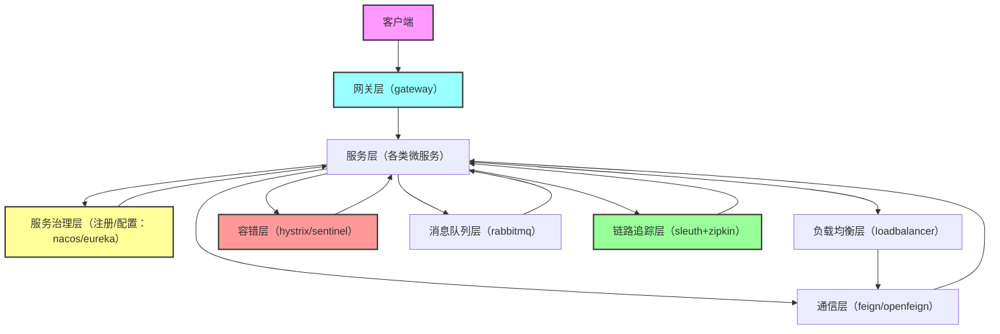

本文将聚焦SpringCloud核心组件（eureka、feign、openfeign、nacos、loadblanacer、rabbitmq、hystrix、sentinel、gateway、sleuth+zipkin），用最干练的语言讲清「体系构成+组件作用+时代迭代」，嵌入实用编程思想与开发创意，拒绝冗余，只给能直接落地的知识点。

## 一、微服务整体体系梳理（先懂全局，再拆细节）

微服务体系并非单一组件堆砌，而是一套“分工明确、协同工作”的生态，核心可分为5大层面，各组件对应不同层面的需求，迭代过程也是各层面技术的优化升级：

核心编程思想：**单一职责原则**（每个组件只解决一个核心问题）、**开闭原则**（组件迭代不影响现有服务）、**容错思想**（默认服务会故障，提前做好兜底）。

### 微服务体系架构图（清晰看懂组件分工）

5大核心层面说明（干练不冗余）：

1. 网关层：统一入口，拦截请求、路由转发、权限控制（对应组件：gateway）；

2. 服务层：业务核心，每个服务对应一个业务模块（自定义微服务，依赖其他组件协同）；

3. 服务治理层：服务“身份证管理”+“配置统一管理”（对应组件：eureka、nacos）；

4. 协同层：解决服务间通信、负载、容错、消息解耦、链路追踪（对应组件：feign/openfeign、loadbalancer、hystrix/sentinel、rabbitmq、sleuth+zipkin）；

5. 客户端层：发起请求的终端（Web端、APP端等）。

## 二、核心组件详解（作用+迭代+编程思想+开发创意）

重点：组件迭代遵循「“能简化开发”“能提升稳定性”“能适配高并发”」三大原则，淘汰的组件并非“没用”，而是有更优替代；所有组件的使用，都要围绕「降低耦合、提升可维护性」展开。

### （一）服务治理层：注册中心+配置中心（微服务的“导航与配置中枢”）

核心作用：让服务“知道彼此在哪里”（注册发现），让所有服务“共用一套配置”（配置管理），解决“服务地址混乱”“配置分散难维护”问题。

#### 1. Eureka（第一代注册中心，已淘汰）

- **核心作用**：服务注册（服务启动时注册到Eureka Server）、服务发现（服务通过Eureka Client获取其他服务地址）、心跳检测（检测服务是否存活，剔除宕机服务）。

- **核心特性**：AP架构（可用性优先），集群部署时，即使部分节点故障，仍能提供服务注册发现，牺牲部分一致性（极端情况下会出现服务列表不一致）。

- **时代迭代**：SpringCloud官方已停止维护（2020年停止更新），被Nacos替代——原因是Eureka功能单一（仅支持注册发现，不支持配置管理），集群部署复杂，不适合大规模微服务。

- **编程思想**：**去中心化思想**（每个Eureka节点都是平等的，无主从之分）、**心跳检测机制**（基于“故障预判”的容错思想）。

- **开发创意（遗留系统兼容）**：如果项目仍在使用Eureka，可封装“Eureka健康检查增强器”，将服务的自定义健康状态（如数据库连接、缓存状态）融入心跳检测，避免“服务存活但业务不可用”的问题。

#### 2. Nacos（当前主流，注册+配置二合一）

- **核心作用**：整合Eureka（注册发现）+ Config（配置管理），支持动态配置刷新（无需重启服务即可更新配置）、服务路由、服务熔断等扩展功能。

- **核心特性**：支持AP/CP架构切换（默认AP，满足注册发现；可切换为CP，满足配置管理的一致性需求），集群部署简单，支持跨机房部署，适配大规模微服务。

- **时代迭代**：替代Eureka+Config，成为SpringCloud Alibaba生态的核心组件——解决了Eureka功能单一、Config配置刷新繁琐的问题，同时支持更多企业级特性（如配置加密、权限控制）。

- **编程思想**：**单一组件多职责（但不耦合）**（注册+配置一体化，却可单独使用）、**动态可配置思想**（减少服务重启，提升可用性）。

- **开发创意（落地优化）**：将Nacos配置按“环境（dev/test/prod）+ 服务名 + 模块”分层，封装配置读取工具类，自动适配当前环境，避免配置混乱；同时利用Nacos的“配置监听”功能，实现服务动态扩容时的配置自动同步。

### （二）通信层：服务间调用（微服务的“对话工具”）

核心作用：解决微服务间的远程调用问题，替代传统的HttpClient，简化调用代码，提升可维护性。

#### 1. Feign（第一代服务调用组件，已淘汰）

- **核心作用**：基于接口注解的声明式调用，将远程调用封装为本地接口方法，无需编写HttpClient代码，简化服务间通信。

- **核心特性**：集成Ribbon（负载均衡），支持请求压缩、超时控制，但不支持SpringBoot 2.6+以上版本，功能简单，无降级、熔断集成能力。

- **时代迭代**：被OpenFeign替代——原因是Feign停止维护，不支持新的SpringCloud版本，且功能不足以满足企业级需求（如无统一的异常处理、不支持异步调用）。

- **编程思想**：**声明式编程思想**（关注“调用什么”，不关注“怎么调用”）、**面向接口编程**（降低服务间耦合）。

#### 2. OpenFeign（当前主流，Feign的增强版）

- **核心作用**：继承Feign的声明式调用特性，新增SpringMVC注解支持（如@RequestMapping、@GetMapping），集成负载均衡（Loadbalancer）、熔断（Sentinel/Hystrix），支持异步调用、请求拦截。

- **核心特性**：适配SpringBoot最新版本，可自定义拦截器（如添加请求头、日志打印），支持请求重试、超时控制，与SpringCloud生态无缝集成。

- **时代迭代**：替代Feign，成为服务间调用的标准组件——解决了Feign的兼容性问题，增强了扩展性，满足企业级微服务的调用需求。

- **编程思想**：**增强式设计**（在原有功能基础上，补充企业级所需特性，不破坏原有接口）、**拦截器思想**（统一处理请求前/请求后逻辑，降低重复代码）。

- **开发创意（落地优化）**：封装OpenFeign全局配置，统一设置超时时间、日志级别、请求重试策略；自定义“异常统一处理拦截器”，将远程调用的异常（如服务宕机、超时）转化为统一的返回格式，避免前端处理杂乱的异常信息。

### （三）负载均衡层：Loadbalancer（微服务的“流量分发器”）

- **核心作用**：当一个服务部署多个实例时，将请求均匀分发到各个实例，避免单个实例过载，提升服务可用性和并发能力。

- **核心特性**：SpringCloud官方推荐，替代Ribbon（已淘汰），支持多种负载均衡策略（默认轮询，可自定义权重、随机、最少连接等策略），轻量级、易扩展。

- **时代迭代**：替代Ribbon——原因是Ribbon停止维护，配置繁琐，Loadbalancer更轻量、更易集成，支持SpringCloud最新版本，且可与OpenFeign、Gateway无缝协同。

- **编程思想**：**分流思想**（将流量分散，降低单点压力）、**策略模式**（不同场景切换不同负载均衡策略，灵活适配需求）。

- **开发创意（落地优化）**：基于业务场景自定义负载均衡策略——比如“热点服务权重倾斜”（将80%流量分配给性能更好的实例）、“灰度发布策略”（将10%流量分配给新版本实例，验证无问题后全量切换）。

### （四）容错层：Hystrix（淘汰）+ Sentinel（当前主流）（微服务的“安全气囊”）

核心作用：解决“服务雪崩”问题——当一个服务故障时，避免故障扩散到其他服务，通过熔断、降级、限流，保证整个微服务体系的稳定性。

#### 1. Hystrix（第一代容错组件，已淘汰）

- **核心作用**：熔断（服务故障时，断开调用链路，避免无限重试）、降级（服务压力过大时，返回兜底数据，不影响核心业务）、隔离（线程池隔离，避免单个服务故障占用所有线程）。

- **核心特性**：基于线程池隔离，支持舱壁模式，但配置繁琐，监控能力弱，不支持动态规则调整，且停止维护（2018年停止更新）。

- **时代迭代**：被Sentinel替代——原因是Hystrix无法适配大规模微服务的动态配置、实时监控需求，且扩展能力弱，Sentinel更轻量、功能更全面。

- **编程思想**：**舱壁模式**（隔离故障，避免扩散）、**兜底思想**（接受“部分功能不可用”，保证核心功能正常）。

#### 2. Sentinel（当前主流，阿里开源）

- **核心作用**：整合Hystrix的熔断、降级功能，新增限流（控制请求QPS，避免服务过载）、热点防护（防止热点接口被高频调用）、系统自适应保护（根据系统负载动态调整限流规则），支持动态规则配置、实时监控、可视化控制台。

- **核心特性**：轻量级（无依赖，接入简单）、高可用（支持集群部署）、可扩展（自定义规则、自定义兜底逻辑），与SpringCloud Alibaba生态无缝集成。

- **时代迭代**：替代Hystrix，成为企业级微服务容错的首选——解决了Hystrix配置繁琐、监控弱、动态调整难的问题，适配高并发、大规模微服务场景。

- **编程思想**：**预防式容错**（限流+熔断，提前避免故障）、**动态可配置思想**（规则实时调整，无需重启服务）、**可视化监控思想**（实时掌握服务状态，快速定位问题）。

- **开发创意（落地优化）**：将Sentinel规则与Nacos结合，实现规则动态同步（无需登录控制台手动修改）；封装“全局兜底处理器”，针对不同类型的异常（如超时、熔断）返回不同的兜底数据，提升用户体验；利用Sentinel的热点防护，保护核心接口（如支付接口），避免被恶意请求击垮。

### （五）网关层：Gateway（微服务的“大门”）

- **核心作用**：统一入口（所有客户端请求都经过Gateway）、路由转发（根据请求路径转发到对应服务）、权限控制（拦截未登录请求）、限流熔断（集成Sentinel/Loadbalancer）、日志监控、跨域处理。

- **核心特性**：基于Netty（异步非阻塞），性能优于传统的Zuul网关（已淘汰），支持动态路由（无需重启网关即可更新路由规则），支持多种路由匹配规则（路径、参数、Header），与SpringCloud生态无缝集成。

- **时代迭代**：替代Zuul网关——原因是Zuul基于Servlet（同步阻塞），性能差，不支持异步，且停止维护，Gateway更适合高并发场景，功能更全面。

- **编程思想**：**统一入口思想**（集中处理所有请求的前置逻辑，降低服务冗余）、**过滤器思想**（链式处理请求，如权限校验、日志打印，可自定义扩展）。

- **开发创意（落地优化）**：封装“网关全局过滤器”，统一处理跨域、日志、权限校验，避免每个路由单独配置；利用Gateway的动态路由，实现“灰度发布”（将部分请求转发到新版本服务）；集成Sentinel限流，在网关层拦截过载请求，避免请求穿透到业务服务。

### （六）消息队列层：RabbitMQ（微服务的“异步通信桥梁”）

- **核心作用**：解耦服务（服务间通过消息通信，无需直接调用）、异步处理（非核心业务异步执行，提升主流程响应速度）、削峰填谷（高并发场景下，缓存请求，避免服务过载）、最终一致性（通过消息重试，保证数据一致性）。

- **核心特性**：支持多种交换机类型（Direct、Topic、Fanout），支持消息持久化、消息确认（生产者确认、消费者确认）、死信队列（处理失败消息），可靠性高，适配多种业务场景。

- **时代迭代**：始终是SpringCloud生态中主流的消息队列（无淘汰风险），相较于Kafka（高吞吐，适合大数据场景），RabbitMQ更适合微服务的“业务级消息通信”（可靠性优先），配置简单、易用性高。

- **编程思想**：**解耦思想**（服务间不直接依赖，降低耦合度）、**异步思想**（拆分同步流程，提升响应速度）、**最终一致性思想**（接受短暂不一致，通过重试保证最终一致）。

- **开发创意（落地优化）**：封装“RabbitMQ模板工具类”，统一处理消息发送、接收、重试、异常处理；利用“死信队列+延迟队列”，实现定时任务（如订单超时取消），避免使用传统的定时任务（如Quartz）占用服务资源；针对高并发场景，开启消息批量发送、批量消费，提升处理效率。

### （七）链路追踪层：Sleuth+Zipkin（微服务的“故障定位神器”）

- **核心作用**：追踪微服务间的调用链路（如“客户端→Gateway→服务A→服务B→数据库”），记录每个链路的耗时、状态，快速定位调用失败、耗时过长的环节，解决“微服务调用链路长，故障定位难”的问题。

- **核心特性**：Sleuth负责生成链路ID、收集链路信息，Zipkin负责存储、展示链路信息（可视化界面），支持链路筛选、耗时统计、异常标记，可与SpringCloud其他组件无缝集成。

- **时代迭代**：无淘汰风险，是大规模微服务必备组件——随着微服务数量增加，调用链路越来越复杂，链路追踪成为排查故障、优化性能的核心工具，后续可结合SkyWalking（更强大的APM工具）扩展，但Sleuth+Zipkin仍是入门首选、轻量级首选。

- **编程思想**：**链路追踪思想**（全程监控调用流程，可追溯、可排查）、**数据可视化思想**（将复杂的链路数据转化为直观的图表，降低排查成本）。

- **开发创意（落地优化）**：将链路ID融入日志（如SLF4J日志框架），通过链路ID快速关联所有相关日志，避免日志混乱；利用Zipkin的耗时统计，定位耗时最长的环节（如数据库查询、远程调用），针对性优化；集成告警功能，当链路耗时超过阈值、出现异常时，自动发送告警信息（如钉钉、邮件）。

## 三、组件迭代总结（一张表看懂核心迭代逻辑）

|组件类型|淘汰组件|当前主流组件|迭代核心原因|
|---|---|---|---|
|注册/配置中心|Eureka|Nacos|功能单一、停止维护、集群部署复杂|
|服务调用|Feign|OpenFeign|不支持新版本、无熔断集成、功能简单|
|负载均衡|Ribbon|Loadbalancer|停止维护、配置繁琐、轻量性不足|
|容错|Hystrix|Sentinel|监控弱、无动态规则、扩展能力差|
|网关|Zuul|Gateway|性能差、同步阻塞、停止维护|
|消息队列|无|RabbitMQ|可靠性高、易用性强，适配微服务业务场景|
|链路追踪|无|Sleuth+Zipkin|轻量、易用，满足入门及轻量级微服务需求|
## 四、核心编程思想与开发创意总结（重点必记）

### 1. 核心编程思想（落地微服务的底层逻辑）

- 单一职责：每个组件、每个服务只做一件事，降低耦合，便于维护；

- 容错思想：默认服务会故障，提前做好熔断、降级、兜底，避免雪崩；

- 解耦思想：通过消息队列、接口调用，减少服务间直接依赖；

- 声明式编程：关注“做什么”，不关注“怎么做”（如OpenFeign、Gateway）；

- 动态可配置：避免重启服务，提升服务可用性（如Nacos、Sentinel）。

### 2. 开发创意（可直接落地的优化点）

- 配置分层：Nacos按环境+服务名分层配置，封装工具类自动适配环境；

- 全局统一处理：OpenFeign统一异常、Gateway统一过滤器、Sentinel统一兜底；

- 自定义策略：Loadbalancer自定义权重策略、Sentinel自定义限流规则；

- 链路与日志联动：将链路ID融入日志，快速排查故障；

- 消息队列优化：死信队列实现定时任务，批量发送/消费提升效率。

## 五、最后总结（干练收尾）

SpringCloud组件的迭代，本质是“从简单到复杂、从单一到全面、从手动到自动”的进化，核心目标是「简化开发、提升稳定性、适配高并发」。

对于开发者而言，无需死记所有组件的细节，重点掌握「组件分工+迭代逻辑+核心编程思想」，结合实际业务场景选择合适的组件，再通过本文的开发创意优化落地，就能快速搭建稳定、可扩展的微服务体系。

记住：微服务不是“组件越多越好”，而是“按需选择、协同高效”——合适的组件，才是最好的组件。