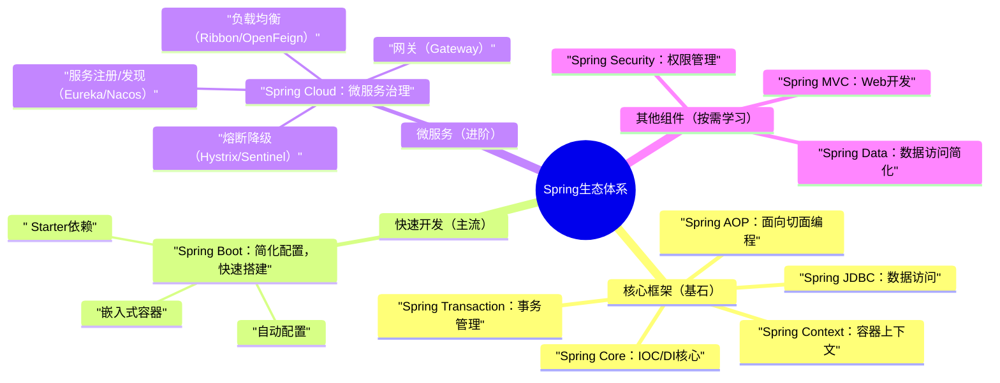
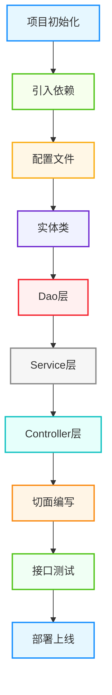

核心定位：Spring框架的核心是「简化Java开发」，通过**依赖注入（DI）**和**面向切面编程（AOP）**两大核心特性，降低代码耦合度、提升可维护性，是企业级Java开发的“基石”，Spring Boot、Spring Cloud均基于Spring框架衍生。

## 1. 核心定义

Spring是一个**轻量级、非侵入式、一站式**的Java开发框架，核心目标是“简化开发、解耦分层”，支持企业级应用的全流程开发，兼容各种第三方框架（MyBatis、Redis等），是Java后端开发的必备技能。

## 2. 核心优势（干练版，直接记）

- **轻量级**：核心包体积小，无强制依赖，可按需引入组件，不占用过多资源；

- **解耦**：通过IOC/DI实现对象依赖管理，避免硬编码，降低组件间耦合；

- **AOP支持**：面向切面编程，分离核心业务与非核心业务（如日志、事务），提升代码复用；

- **一站式**：提供数据访问、事务管理、Web开发等全套解决方案，无需切换框架；

- **生态完善**：衍生出Spring Boot（快速开发）、Spring Cloud（微服务），覆盖从单体到微服务的全场景。

## 3. Spring生态体系（必懂，清晰关联）

Spring生态并非单一框架，而是一套完整的解决方案，核心组件关联如下（Mermaid图解，符合规范）：



## 4. 学习逻辑（避免走弯路）

**先基础→再进阶→最后实战**，优先级明确：

1. 入门：Spring Core（IOC/DI）→ Spring AOP（核心特性，重中之重）；

2. 进阶：Spring Boot（主流开发模式）→ Spring MVC（Web开发）→ 事务管理；

3. 实战：整合MyBatis、Redis等第三方组件，开发单体项目→ 微服务入门（Spring Cloud）；

4. 拔高：权限管理（Spring Security）、性能优化、源码理解。

---

每个组件遵循「核心定位→核心用法→最简示例→编程思想」，示例聚焦企业级常用场景，可直接复用，重点标注避坑点，拒绝冗余理论。

## 1. Spring Core（核心中的核心：IOC与DI）

### 核心定位

Spring Core是Spring框架的基石，核心是**控制反转（IOC）**和**依赖注入（DI）**，解决“对象创建、依赖管理”的问题，将对象的创建权交给Spring容器，避免硬编码耦合。

**关键区别**：IOC是“思想”（反转对象创建权），DI是“IOC的实现方式”（通过构造器、setter方法注入依赖）。

### 高频用法（直接记，实战常用）

- IOC容器：Spring的核心容器（ApplicationContext），负责对象的创建、管理、销毁；

- Bean注册：将对象交给Spring管理，方式有3种：**注解式（@Component、@Service、@Controller、@Repository）**、XML配置、JavaConfig（@Configuration+@Bean）；

- 依赖注入：注入方式有3种：**构造器注入（推荐）**、setter注入、字段注入（@Autowired，简洁但不推荐）；

- Bean作用域：默认**单例（singleton）**，其他常用：原型（prototype）、请求（request）、会话（session）。

### 最简示例（企业级常用，注解式为主）

```java
// 1. 注册Bean（注解式，最常用）
// 数据访问层（@Repository：标识持久层Bean）
@Repository
public class UserDaoImpl implements UserDao {
    @Override
    public User getUserById(Long id) {
        // 模拟数据库查询
        return new User(id, "张三", 20);
    }
}

// 业务逻辑层（@Service：标识业务层Bean）
@Service
public class UserServiceImpl implements UserService {
    // 2. 依赖注入（构造器注入，推荐，避免空指针）
    private final UserDao userDao;

    // 构造器注入（Spring 4.3+ 可省略@Autowired）
    public UserServiceImpl(UserDao userDao) {
        this.userDao = userDao;
    }

    @Override
    public User getUserById(Long id) {
        return userDao.getUserById(id);
    }
}

// 3. 启动类（Spring Boot环境，自动扫描Bean）
@SpringBootApplication
public class SpringDemoApplication {
    public static void main(String[] args) {
        // 获取IOC容器
        ApplicationContext context = SpringApplication.run(SpringDemoApplication.class, args);
        // 从容器中获取Bean
        UserService userService = context.getBean(UserService.class);
        // 调用方法
        User user = userService.getUserById(1L);
        System.out.println(user);
    }
}

// 补充：JavaConfig方式注册Bean（适合第三方组件）
@Configuration
public class AppConfig {
    // @Bean：将方法返回值注册为Spring Bean
    @Bean
    public UserDao userDao() {
        return new UserDaoImpl();
    }
}
```

### 编程思想

- **解耦思想**：将对象创建、依赖管理交给Spring容器，避免硬编码，降低组件间耦合，便于维护和扩展；

- **单一职责思想**：每个Bean只负责自己的核心功能（如Dao层负责数据访问，Service层负责业务逻辑）；

- **依赖倒置思想**：依赖抽象（接口），不依赖具体实现，便于替换实现类（如将UserDaoImpl替换为OtherUserDaoImpl，无需修改Service层）；

- **容器思想**：Spring容器统一管理Bean的生命周期，减少手动创建、销毁对象的冗余代码。

## 2. Spring AOP（面向切面编程，企业级必备）

### 核心定位

AOP（Aspect-Oriented Programming）即面向切面编程，核心是「分离核心业务与非核心业务」，将日志、事务、权限校验等非核心业务抽取为“切面”，在不修改核心业务代码的前提下，动态植入到核心业务流程中，提升代码复用性和可维护性。

### 高频用法（直接记，实战常用）

- 核心概念：**切面（Aspect）**（非核心业务的集合）、**切入点（Pointcut）**（指定哪些方法需要植入切面）、**通知（Advice）**（切面的具体逻辑，如前置、后置、环绕通知）；

- 通知类型（5种）：

- 前置通知（@Before）：方法执行前执行；
- 后置通知（@After）：方法执行后执行（无论是否异常）；
  
- 返回通知（@AfterReturning）：方法正常返回后执行；
  
- 异常通知（@AfterThrowing）：方法抛出异常后执行；
  
- 环绕通知（@Around）：方法执行前后都执行（最灵活，可控制方法执行）；
      

- 实现方式：注解式（@Aspect+@Component，最常用）、XML配置。

### 最简示例（实战高频：日志切面+事务切面）

```java
// 1. 日志切面（非核心业务，抽取为切面）
@Aspect // 标识为切面
@Component // 注册为Spring Bean
public class LogAspect {
    // 切入点：匹配com.example.service包下所有方法
    @Pointcut("execution(* com.example.service.*.*(..))")
    public void servicePointcut() {}

    // 前置通知：方法执行前打印日志
    @Before("servicePointcut()")
    public void beforeAdvice(JoinPoint joinPoint) {
        String methodName = joinPoint.getSignature().getName();
        System.out.println("方法" + methodName + "开始执行...");
    }

    // 环绕通知：统计方法执行时间（最常用）
    @Around("servicePointcut()")
    public Object aroundAdvice(ProceedingJoinPoint joinPoint) throws Throwable {
        long start = System.currentTimeMillis();
        // 执行核心业务方法
        Object result = joinPoint.proceed();
        long end = System.currentTimeMillis();
        System.out.println("方法" + joinPoint.getSignature().getName() + "执行耗时：" + (end - start) + "ms");
        return result;
    }
}

// 2. 事务切面（Spring内置，注解式使用）
@Service
public class UserServiceImpl implements UserService {
    private final UserDao userDao;

    public UserServiceImpl(UserDao userDao) {
        this.userDao = userDao;
    }

    // @Transactional：事务注解，Spring自动管理事务（切面植入）
    @Transactional(rollbackFor = Exception.class) // 异常时回滚
    @Override
    public void addUser(User user) {
        // 模拟两个数据库操作，异常时回滚
        userDao.addUser(user);
        // 模拟异常
        // int i = 1 / 0;
    }
}
```

### 编程思想

- **分离关注点思想**：将核心业务（如用户增删改查）与非核心业务（如日志、事务）分离，专注核心业务开发；

- **代码复用思想**：非核心业务抽取为切面，可在多个方法、多个模块中复用，避免重复编写；

- **开闭原则**：新增非核心业务（如权限校验）时，无需修改核心业务代码，只需新增切面，拓展性强；

- **动态代理思想**：AOP底层基于动态代理（JDK动态代理、CGLIB动态代理），实现无侵入式的功能增强。

## 3. Spring Boot（主流开发模式，必学）

### 核心定位

Spring Boot是基于Spring框架的「快速开发工具」，核心是“约定优于配置”，简化Spring应用的配置、部署流程，无需手动配置XML，一键启动，快速搭建企业级应用，是当前Java后端开发的主流选择。

### 高频用法（直接记，实战常用）

- **核心特性**：自动配置（AutoConfiguration）、Starter依赖（简化依赖引入）、嵌入式容器（Tomcat，无需单独部署）、Actuator（应用监控）；

- **Starter依赖**：核心依赖，如`spring-boot-starter-web`（Web开发）、`spring-boot-starter-jdbc`（数据访问）、`spring-boot-starter-mybatis`（整合MyBatis）；

- **配置方式**：application.yml（推荐，简洁）、application.properties，可配置端口、数据库、日志等；

- **核心注解**：@SpringBootApplication（组合注解，包含@Configuration、@ComponentScan、@EnableAutoConfiguration）。

### 最简示例（Spring Boot整合MyBatis，实战模板）

```java
// 1. 引入Starter依赖（pom.xml）
<dependency>
    <groupId>org.springframework.boot</groupId>
    <artifactId>spring-boot-starter-web</artifactId>
</dependency>
<dependency>
    <groupId>org.mybatis.spring.boot</groupId>
    <artifactId>mybatis-spring-boot-starter</artifactId>
    <version>2.3.0</version>
</dependency>
<dependency>
    <groupId>mysql</groupId>
    <artifactId>mysql-connector-java</artifactId>
    <scope>runtime</scope>
</dependency>

// 2. 配置文件（application.yml）
server:
  port: 8080 # 端口
spring:
  datasource:
    url: jdbc:mysql://localhost:3306/test_db?useUnicode=true&characterEncoding=utf-8&serverTimezone=UTC
    username: root
    password: 123456
    driver-class-name: com.mysql.cj.jdbc.Driver
mybatis:
  mapper-locations: classpath:mapper/*.xml # MyBatis映射文件路径
  type-aliases-package: com.example.entity # 实体类包路径

// 3. 实体类
public class User {
    private Long id;
    private String name;
    private Integer age;
    // getter/setter/toString
}

// 4. Dao层（MyBatis）
@Mapper // 标识为MyBatis映射接口
public interface UserMapper {
    User selectById(Long id);
}

// 5. Service层
@Service
public class UserService {
    private final UserMapper userMapper;

    public UserService(UserMapper userMapper) {
        this.userMapper = userMapper;
    }

    public User getUserById(Long id) {
        return userMapper.selectById(id);
    }
}

// 6. Controller层（Web接口）
@RestController
@RequestMapping("/user")
public class UserController {
    private final UserService userService;

    public UserController(UserService userService) {
        this.userService = userService;
    }

    // 接口：GET /user/{id}
    @GetMapping("/{id}")
    public ResponseEntity<User> getUserById(@PathVariable Long id) {
        User user = userService.getUserById(id);
        return ResponseEntity.ok(user);
    }
}

// 7. 启动类
@SpringBootApplication
public class SpringBootMybatisApplication {
    public static void main(String[] args) {
        SpringApplication.run(SpringBootMybatisApplication.class, args);
    }
}
```

### 编程思想

- **约定优于配置思想**：Spring Boot预设合理的默认配置，无需手动配置，减少配置冗余，提升开发效率；

- **模块化思想**：Starter依赖将相关组件整合为一个模块，按需引入，简化依赖管理；

- **简化开发思想**：嵌入式容器、自动配置，降低项目搭建、部署的门槛，让开发者专注业务逻辑；

- **可拓展思想**：支持自定义配置，可覆盖默认配置，适配不同业务场景。

## 4. 其他核心组件（按需掌握，实战高频）

- **Spring MVC**：Spring的Web开发组件，基于MVC架构（Model-View-Controller），负责接收请求、处理请求、返回响应，核心是@RequestMapping、@Controller、@RestController；

- **Spring Transaction**：事务管理组件，支持声明式事务（@Transactional，最常用）和编程式事务，保证数据一致性；

- **Spring Security**：权限管理组件，实现用户认证、授权、加密等功能，适配企业级权限需求。

---

企业级Spring Boot项目的开发流程的固定闭环，掌握这个流程，可应对绝大多数单体项目开发场景，流程如下（Mermaid图解）：



## 核心注意点（避坑关键）

- 依赖管理：避免依赖冲突，Starter依赖无需指定版本（Spring Boot自动管理）；

- 配置文件：核心配置（数据库、端口）必须正确，敏感信息（密码）建议加密存储；

- 事务管理：@Transactional注解需指定rollbackFor=Exception.class，避免RuntimeException以外的异常不回滚；

- 接口测试：建议使用Swagger（自动生成接口文档），提升测试效率；

- 部署：Spring Boot项目可打包为Jar包，直接通过java -jar命令启动，无需单独部署Tomcat。

---

掌握基础组件和流程后，用编程思想优化代码，用开发创意拓展实战场景，提升代码质感和开发效率，贴合企业级开发规范。

## 1. 核心编程思想（贯穿Spring开发全程）

- **解耦思想**：通过IOC/DI、AOP降低组件间耦合，让代码可维护、可扩展；

- **单一职责思想**：分层开发（Controller→Service→Dao），每层只做一件事（Controller接收请求，Service处理业务，Dao操作数据）；

- **面向接口编程思想**：依赖抽象（接口），不依赖具体实现，便于替换实现类，提升代码灵活性；

- **异常统一处理思想**：全局异常处理，避免重复编写try-catch，提升代码整洁度；

- **复用思想**：将高频逻辑（如分页、异常处理、日志）抽取为公共组件，提升开发效率。

## 2. 开发创意（实战可用，直接复用）

### 创意1：全局异常统一处理（企业级必备）

抽取全局异常处理器，统一处理项目中所有异常，返回标准化响应，避免重复编写try-catch，提升代码整洁度。

```java
// 1. 标准化响应结果
@Data
public class Result<T> {
    private Integer code; // 状态码：200成功，400参数错误，500服务器错误
    private String message; // 提示信息
    private T data; // 响应数据

    // 静态方法，简化响应创建
    public static <T> Result<T> success(T data) {
        Result<T> result = new Result<>();
        result.setCode(200);
        result.setMessage("成功");
        result.setData(data);
        return result;
    }

    public static <T> Result<T> fail(Integer code, String message) {
        Result<T> result = new Result<>();
        result.setCode(code);
        result.setMessage(message);
        return result;
    }
}

// 2. 全局异常处理器
@RestControllerAdvice // 全局异常处理注解，作用于所有@RestController
public class GlobalExceptionHandler {
    // 处理参数校验异常
    @ExceptionHandler(IllegalArgumentException.class)
    public Result<Void> handleIllegalArgumentException(IllegalArgumentException e) {
        return Result.fail(400, e.getMessage());
    }

    // 处理业务异常（自定义异常）
    @ExceptionHandler(BusinessException.class)
    public Result<Void> handleBusinessException(BusinessException e) {
        return Result.fail(e.getCode(), e.getMessage());
    }

    // 处理全局异常（兜底）
    @ExceptionHandler(Exception.class)
    public Result<Void> handleException(Exception e) {
        // 打印异常日志（便于排查）
        e.printStackTrace();
        return Result.fail(500, "服务器内部错误，请联系管理员");
    }
}

// 3. 自定义业务异常
public class BusinessException extends RuntimeException {
    private Integer code;

    public BusinessException(Integer code, String message) {
        super(message);
        this.code = code;
    }

    // getter
}

// 4. 使用示例（Service层）
@Service
public class UserServiceImpl implements UserService {
    private final UserMapper userMapper;

    public UserServiceImpl(UserMapper userMapper) {
        this.userMapper = userMapper;
    }

    @Override
    public User getUserById(Long id) {
        if (id == null || id <= 0) {
            throw new IllegalArgumentException("用户ID非法");
        }
        User user = userMapper.selectById(id);
        if (user == null) {
            throw new BusinessException(404, "用户不存在");
        }
        return user;
    }
}
```

### 创意2：公共分页组件（高频复用）

抽取公共分页请求、分页响应组件，统一处理分页逻辑，避免在每个接口中重复编写分页代码。

```java
// 1. 分页请求参数
@Data
public class PageRequest {
    // 默认页码1，默认每页10条
    @Min(value = 1, message = "页码不能小于1")
    private Integer pageNum = 1;

    @Min(value = 1, message = "每页条数不能小于1")
    @Max(value = 100, message = "每页条数不能超过100")
    private Integer pageSize = 10;
}

// 2. 分页响应结果
@Data
public class PageResult<T> {
    private List<T> records; // 分页数据
    private Long total; // 总条数
    private Integer pageNum; // 当前页码
    private Integer pageSize; // 每页条数
    private Integer totalPages; // 总页数

    // 静态方法，快速创建分页结果
    public static <T> PageResult<T> build(List<T> records, Long total, Integer pageNum, Integer pageSize) {
        PageResult<T> pageResult = new PageResult<>();
        pageResult.setRecords(records);
        pageResult.setTotal(total);
        pageResult.setPageNum(pageNum);
        pageResult.setPageSize(pageSize);
        pageResult.setTotalPages((int) Math.ceil((double) total / pageSize));
        return pageResult;
    }
}

// 3. 使用示例（Controller+Service）
// Controller层
@RestController
@RequestMapping("/user")
public class UserController {
    private final UserService userService;

    public UserController(UserService userService) {
        this.userService = userService;
    }

    // 分页查询用户：GET /user/page
    @GetMapping("/page")
    public Result<PageResult<User>> getUserPage(PageRequest pageRequest) {
        PageResult<User> pageResult = userService.getUserPage(pageRequest);
        return Result.success(pageResult);
    }
}

// Service层
@Service
public class UserServiceImpl implements UserService {
    private final UserMapper userMapper;

    public UserServiceImpl(UserMapper userMapper) {
        this.userMapper = userMapper;
    }

    @Override
    public PageResult<User> getUserPage(PageRequest pageRequest) {
        // 计算分页起始位置
        int start = (pageRequest.getPageNum() - 1) * pageRequest.getPageSize();
        // 查询分页数据
        List<User> userList = userMapper.selectPage(start, pageRequest.getPageSize());
        // 查询总条数
        Long total = userMapper.selectTotal();
        // 构建分页结果
        return PageResult.build(userList, total, pageRequest.getPageNum(), pageRequest.getPageSize());
    }
}
```

### 创意3：Spring Boot整合Swagger（接口文档自动化）

整合Swagger，自动生成接口文档，支持接口调试，避免手动编写接口文档，提升团队协作效率（企业级常用）。

```java
// 1. 引入依赖（pom.xml）
<dependency>
    <groupId>io.springfox</groupId>
    <artifactId>springfox-boot-starter</artifactId>
    <version>3.0.0</version>
</dependency>

// 2. Swagger配置类
@Configuration
@EnableOpenApi // 开启Swagger
public class SwaggerConfig {
    @Bean
    public Docket createRestApi() {
        return new Docket(DocumentationType.OAS_30)
                .apiInfo(apiInfo())
                .select()
                // 扫描Controller包
                .apis(RequestHandlerSelectors.basePackage("com.example.controller"))
                .paths(PathSelectors.any())
                .build();
    }

    // 接口文档信息配置
    private ApiInfo apiInfo() {
        return new ApiInfoBuilder()
                .title("Spring Boot接口文档")
                .description("企业级Spring Boot项目接口文档，用于接口调试和协作")
                .version("1.0.0")
                .build();
    }
}

// 3. 在Controller中使用Swagger注解
@RestController
@RequestMapping("/user")
@Api(tags = "用户管理接口") // 接口分组
public class UserController {
    private final UserService userService;

    public UserController(UserService userService) {
        this.userService = userService;
    }

    @GetMapping("/{id}")
    @ApiOperation("根据ID查询用户") // 接口描述
    @ApiImplicitParam(name = "id", value = "用户ID", required = true, dataType = "Long") // 参数描述
    public Result<User> getUserById(@PathVariable Long id) {
        User user = userService.getUserById(id);
        return Result.success(user);
    }

    @GetMapping("/page")
    @ApiOperation("分页查询用户")
    public Result<PageResult<User>> getUserPage(PageRequest pageRequest) {
        PageResult<User> pageResult = userService.getUserPage(pageRequest);
        return Result.success(pageResult);
    }
}

// 4. 访问接口文档
// 启动项目后，访问：http://localhost:8080/swagger-ui/index.html
// 可查看接口文档、调试接口
```

---

## 1. 新手避坑指南（高频踩坑点）

- **坑1：依赖冲突**：避免手动指定Starter依赖版本，Spring Boot自动管理版本；若出现冲突，用mvn dependency:tree查看依赖树，排除冲突依赖；

- **坑2：事务不回滚**：@Transactional注解未指定rollbackFor=Exception.class，导致非RuntimeException（如IOException）不回滚；

- **坑3：Bean注入失败**：未给类添加@Component、@Service等注解，或包扫描路径错误（@SpringBootApplication默认扫描当前包及子包）；

- **坑4：接口参数接收错误**：混淆@PathVariable（路径参数）和@RequestParam（请求参数），或参数类型不匹配；

- **坑5：忽视异常处理**：未做全局异常处理，接口抛出异常时返回杂乱信息，影响前端对接。

## 2. 学习建议

- **优先级**：Spring Core（IOC/DI）→ Spring AOP → Spring Boot → Spring MVC → Spring Transaction → Spring Cloud；

- **练习方法**：先搭建简单Spring Boot项目，逐步整合MyBatis、Swagger等组件，完整走一遍实战流程；再尝试开发小型单体项目（如用户管理系统）；

- **技巧**：不用死记API，重点理解IOC、AOP的核心思想；遇到问题先查看Spring官方文档，或调试查看Bean的创建、依赖注入过程；

- **提升**：熟练基础后，学习Spring源码（重点看IOC容器初始化、AOP动态代理），了解Spring Boot自动配置原理，掌握Spring Cloud微服务相关组件。

---


本文所有示例均可直接复制运行，开发创意可直接复用，贴合企业级开发规范，适合新手入门、进阶者查漏补缺。学习Spring的关键不是死记API，而是理解其背后的编程思想，多实战、多调试，才能真正用好Spring框架，应对各类企业级开发需求。

如果需要某类场景的详细示例（如Spring Security权限管理、Spring Cloud微服务入门、Spring Boot性能优化），欢迎留言交流！