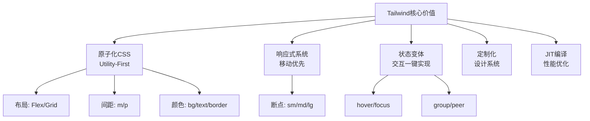
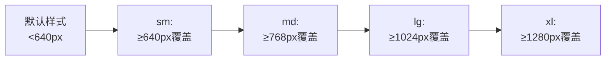

## 一、核心基础：原子化CSS与快速开始

### 1.1 什么是原子化CSS？

传统CSS是「**语义化类名优先**」（如`.btn-primary`），Tailwind是「**工具类优先**」——每个类只做一件事（如`bg-blue-500`只设置背景色），通过组合类名实现复杂样式。

**编程思想**：**关注点分离（但在HTML中聚合）**。将样式逻辑从CSS文件移到HTML，无需跳转文件即可理解元素样式，提升开发效率。

### 1.2 快速引入

#### 方式1：CDN（快速原型）

适合小项目或快速验证，直接在HTML中引入：

```html
<script src="https://cdn.tailwindcss.com"></script>
```

#### 方式2：工程化集成（推荐）

通过CLI或Vite/Webpack集成，支持完整定制和JIT编译：

```bash
npm install -D tailwindcss postcss autoprefixer
npx tailwindcss init -p
```
核心配置文件：

- `tailwind.config.js`：主题定制、内容路径配置

- `postcss.config.js`：PostCSS插件配置（Tailwind依赖）

## 二、原子类体系：从布局到细节的全覆盖

Tailwind的原子类覆盖开发99%的场景，核心分为**布局、间距、颜色、排版、边框、阴影**六大类。

### 2.1 布局系统：Flex + Grid，现代布局的利器

**编程思想**：**声明式布局**。直接在HTML中表达布局意图，无需写CSS布局代码。

#### Flex布局（一维）

核心类名：

- 容器：`flex`、`flex-row`（水平，默认）、`flex-col`（垂直）

- 对齐：`justify-center`（主轴居中）、`items-center`（交叉轴居中）、`justify-between`（两端对齐）

- 项目：`flex-1`（自动填充剩余空间）

**实战：垂直居中（3行代码搞定）**

```html
<div class="flex justify-center items-center h-screen">
  <div class="text-center">垂直居中内容</div>
</div>
```

#### Grid布局（二维）

核心类名：

- 容器：`grid`、`grid-cols-3`（3列）、`grid-rows-2`（2行）

- 间距：`gap-4`（网格间距）

- 跨列：`col-span-2`（跨2列）

**实战：响应式卡片列表**

```html

<div class="grid grid-cols-1 md:grid-cols-2 lg:grid-cols-3 gap-6">
  <div class="bg-white p-4 rounded-lg shadow">卡片1</div>
  <div class="bg-white p-4 rounded-lg shadow">卡片2</div>
  <div class="bg-white p-4 rounded-lg shadow">卡片3</div>
</div>
```

### 2.2 间距与尺寸：统一的设计令牌

**编程思想**：**设计令牌（Design Tokens）**。基于8px基准预设间距体系（`0`、`1`、`2`、`4`、`6`、`8`…对应`0px`、`4px`、`8px`、`16px`、`24px`、`32px`…），避免随意写数值，保持设计一致性。

#### 间距（Margin/Padding）

命名规则：`{属性}{方向}-{尺寸}`

- 属性：`m`（Margin）、`p`（Padding）

- 方向：`t`（上）、`b`（下）、`l`（左）、`r`（右）、`x`（左右）、`y`（上下）、（空，四个方向）

- 尺寸：`0`、`1`、`2`、`4`、`6`、`8`、`auto`（水平居中）

**示例**：

```html

<div class="m-4 p-6 mx-auto">
  外边距16px，内边距24px，水平居中
</div>
```

#### 尺寸

核心类名：

- 宽度：`w-full`（100%）、`w-1/2`（50%）、`max-w-7xl`（最大宽度1280px）

- 高度：`h-screen`（视口高度）、`h-full`（100%）

### 2.3 颜色与排版：快速构建视觉风格

#### 颜色

Tailwind预设了完整的色板（`50`、`100`…`900`，数字越大颜色越深），支持背景、文本、边框：

- 背景：`bg-blue-500`、`bg-gray-100`

- 文本：`text-gray-700`、`text-white`

- 边框：`border-red-400`

- 渐变：`bg-gradient-to-r from-blue-500 to-purple-600`（从左到右渐变）

#### 排版

核心类名：

- 字号：`text-sm`（14px）、`text-lg`（18px）、`text-2xl`（24px）

- 字重：`font-normal`（正常）、`font-bold`（粗体）

- 行高：`leading-relaxed`（1.625）

- 对齐：`text-center`（居中）、`text-right`（右对齐）

### 2.4 边框与阴影：细节提升质感

- 边框：`rounded-lg`（大圆角）、`border-2`（2px边框）、`border-gray-200`

- 阴影：`shadow-md`（中等阴影）、`shadow-lg`（大阴影）、`hover:shadow-xl`（悬浮大阴影）

## 三、响应式设计：移动优先的断点系统

**编程思想**：**移动优先（Mobile First）**。默认样式针对小屏幕（手机），通过断点前缀（`sm:`、`md:`、`lg:`）逐步适配大屏幕，符合渐进增强理念。

### 3.1 断点前缀

Tailwind预设5个核心断点，覆盖从手机到超大屏：

|断点前缀|屏幕宽度|设备类型|
|---|---|---|
|（默认）|<640px|竖屏手机|
|`sm:`|≥640px|横屏手机|
|`md:`|≥768px|平板|
|`lg:`|≥1024px|小屏笔记本|
|`xl:`|≥1280px|桌面显示器|
**断点应用逻辑**：


### 3.2 响应式实战

**场景：卡片列表从1列→2列→3列**

```html

<div class="grid grid-cols-1 md:grid-cols-2 lg:grid-cols-3 gap-6">
  <!-- 默认1列，平板2列，桌面3列 -->
  <div class="bg-white p-4 rounded-lg shadow">卡片</div>
  <div class="bg-white p-4 rounded-lg shadow">卡片</div>
  <div class="bg-white p-4 rounded-lg shadow">卡片</div>
</div>
```

## 四、状态变体：交互效果的一键实现

**编程思想**：**状态驱动样式**。无需写CSS伪类（`:hover`、`:focus`），通过状态前缀直接在HTML中实现交互。

### 4.1 基础状态

核心状态前缀：`hover:`（悬浮）、`focus:`（聚焦）、`active:`（点击）、`disabled:`（禁用）

**实战：悬浮变色按钮**

```html

<button class="bg-blue-500 hover:bg-blue-600 text-white px-6 py-2 rounded-lg transition-colors duration-300">
  悬浮变色
</button>
```

### 4.2 高级状态：group与peer

#### group：父状态影响子元素

给父元素加`group`，子元素用`group-hover:`、`group-focus:`，实现“父元素悬浮时子元素变化”。

**实战：卡片悬浮显示按钮**

```html

<div class="group bg-white p-4 rounded-lg shadow relative">
  <h3 class="text-lg font-bold">卡片标题</h3>
  <p class="text-gray-600">卡片内容</p>
  <!-- 默认隐藏，父元素悬浮时显示 -->
  <button class="absolute top-4 right-4 opacity-0 group-hover:opacity-100 transition-opacity">
    编辑
  </button>
</div>
```

#### peer：兄弟状态影响

给触发元素加`peer`，目标元素用`peer-checked:`、`peer-focus:`，实现“兄弟元素状态变化时目标元素变化”。

**实战：复选框选中改变文本样式**

```html

<input type="checkbox" id="agree" class="peer hidden">
<label for="agree" class="cursor-pointer">
  <span class="peer-checked:text-blue-500 peer-checked:font-bold">我已阅读协议</span>
</label>
```

## 五、定制化：打造专属设计系统

Tailwind的强大之处在于**完全可定制**，通过`tailwind.config.js`扩展主题，打造符合项目需求的设计系统。

### 5.1 核心配置：tailwind.config.js

```javascript

/** @type {import('tailwindcss').Config} */
export default {
  // 1. 配置内容路径（JIT编译必需，只编译用到的类）
  content: [
    "./index.html",
    "./src/**/*.{vue,js,ts,jsx,tsx}",
  ],
  theme: {
    // 2. 扩展主题（不覆盖默认，新增自定义）
    extend: {
      // 自定义颜色
      colors: {
        primary: '#6366f1', // 主色
        secondary: '#8b5cf6', // 次要色
      },
      // 自定义间距
      spacing: {
        '128': '32rem',
      },
      // 自定义字体
      fontFamily: {
        sans: ['Inter', 'sans-serif'],
      },
    },
  },
  plugins: [],
}
```

### 5.2 组件提取：@apply与框架组件

当类名过长或需要复用时，通过**组件提取**保持代码整洁：

#### 方式1：@apply（组合原子类）

在CSS中用`@apply`将原子类组合成自定义类：

```css

/* styles.css */
.btn {
  @apply bg-primary hover:bg-primary/90 text-white px-6 py-2 rounded-lg transition-colors;
}
```

#### 方式2：框架组件（推荐）

在React/Vue中封装组件，更灵活且支持Props：

```javascript

// Button.jsx
export default function Button({ children, variant = 'primary' }) {
  const baseClasses = 'px-6 py-2 rounded-lg transition-colors';
  const variantClasses = {
    primary: 'bg-primary hover:bg-primary/90 text-white',
    secondary: 'bg-secondary hover:bg-secondary/90 text-white',
  };

  return (
    <button className={`${baseClasses} ${variantClasses[variant]}`}>
      {children}
    </button>
  );
}
```

**最佳实践**：**避免过度使用@apply**。优先用原子类，仅当组件需要大量复用时才提取，保持Utility-First的优势。

## 六、最佳实践与避坑指南

### 6.1 开发效率提升

- **编辑器插件**：安装`Tailwind CSS IntelliSense`，支持自动补全、类名预览、语法高亮

- **类名顺序**：按照「布局→间距→颜色→排版→状态」的顺序组织类名，提升可读性（如`flex justify-center items-center m-4 bg-blue-500 text-white hover:bg-blue-600`）

### 6.2 性能优化：JIT编译

Tailwind v3内置**JIT（Just-In-Time）即时编译**，仅生成HTML中用到的类，生产环境CSS体积通常<10KB，无需手动配置PurgeCSS。

### 6.3 避坑指南

1. **类名过长**：用组件提取解决，不要强行堆砌类名

2. **权重问题**：Tailwind类权重一致，后面的类覆盖前面的；谨慎使用`!important`（可用`!`前缀，如`bg-blue-500!`）

3. **语义化担忧**：合理使用组件（如`<Button />`、`<Card />`），平衡Utility-First和语义化，HTML结构仍需保持语义（如用`<nav>`、`<article>`）

## 七、创意实战：用Tailwind实现炫酷效果

### 7.1 玻璃拟态卡片

```html
<div class="bg-white/10 backdrop-blur-lg border border-white/20 rounded-xl p-6 shadow-xl">
  <h3 class="text-white text-lg font-bold">玻璃拟态卡片</h3>
  <p class="text-white/80">背景半透明+模糊效果</p>
</div>
```

### 7.2 悬浮动画按钮

```html
<button class="bg-gradient-to-r from-pink-500 to-violet-500 text-white px-8 py-3 rounded-full shadow-lg transition-all duration-300 hover:-translate-y-1 hover:shadow-2xl">
  悬浮上浮
</button>
```

### 7.3 渐变文字

```html
<h1 class="text-4xl font-bold bg-clip-text text-transparent bg-gradient-to-r from-blue-500 via-purple-500 to-pink-500">
  渐变文字效果
</h1>
```

## 结尾

Tailwind CSS的核心不是“原子类”本身，而是**Utility-First的开发思想**——通过预设的设计令牌和工具类，让开发者无需纠结命名，直接在HTML中快速构建样式，同时保持高度的可定制性和性能。

建议你从一个小项目开始，尝试用Tailwind重构，结合编辑器插件和组件提取，在实践中体会原子化CSS的高效。