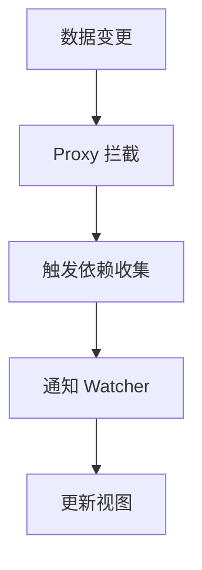
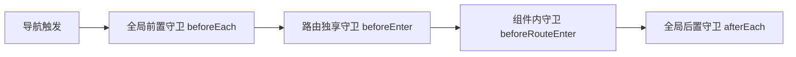

## 一、Vue 核心基础：从原理到应用

### 1.1 响应式原理（Vue 3 vs Vue 2）

Vue 的核心魅力在于**数据驱动视图**，其底层依赖响应式系统。

|版本|实现方式|优势|劣势|
|---|---|---|---|
|Vue 2|`Object.defineProperty`|兼容性好（IE9+）|无法监听对象新增/删除属性、数组下标变化|
|Vue 3|`Proxy`|支持监听对象/数组的全量变化、性能更优|兼容性稍差（现代浏览器）|
**Mermaid 响应式流程图**：


### 1.2 组合式 API（Composition API）

Vue 3 引入的**组合式 API** 是逻辑复用的革命，核心思想是**“按功能组织代码”**。

#### 核心 API 速查：

- **`ref`**：用于基本类型（数字、字符串），通过 `.value` 访问。

- **`reactive`**：用于对象/数组，直接访问属性。

- **`computed`**：计算属性，缓存结果，依赖变化时自动更新。

- **`watch`**：监听特定数据变化，支持获取旧值/新值。

- **`watchEffect`**：自动收集依赖，副作用函数立即执行。

**代码示例**：

```javascript

import { ref, computed, watch } from 'vue'

const count = ref(0)
const doubleCount = computed(() => count.value * 2)

watch(count, (newVal, oldVal) => {
  console.log(`count 从 ${oldVal} 变为 ${newVal}`)
})
```

### 1.3 组件系统：组件化思想的落地

组件是 Vue 的**基本构建块**，遵循**单一职责原则**——一个组件只做一件事。

#### 组件通信方式：

|场景|方式|代码示例|
|---|---|---|
|父子通信|`props` + `emit`|父传子：`<Child :msg="msg" />`；子传父：`this.$emit('update', val)`|
|跨层级通信|`provide` + `inject`|祖先：`provide('theme', 'dark')`；后代：`const theme = inject('theme')`|
|全局/复杂状态|Pinia（推荐）|见下文“状态管理”|
---

## 二、工程结构化开发：从“能跑”到“优雅”

### 2.1 推荐项目目录结构（模块化 + 分层）

```plain Text

src/
├── api/              # API 接口层（统一管理请求）
│   └── user.js
├── assets/           # 静态资源（图片、字体）
├── components/       # 通用组件（可复用）
│   └── Button.vue
├── views/            # 页面组件（路由对应）
│   └── Home.vue
├── store/            # 状态管理（Pinia）
│   └── user.js
├── router/           # 路由配置
│   └── index.js
├── utils/            # 工具函数（格式化、请求封装）
│   └── request.js
├── App.vue           # 根组件
└── main.js           # 入口文件
```

**设计思想**：

- **分层架构**：API 层、视图层、状态层分离，降低耦合。

- **模块化**：按功能拆分文件，便于维护和复用。

### 2.2 路由管理：Vue Router 4

Vue Router 是 Vue 的官方路由库，核心思想是**“声明式导航”**。

#### 核心功能：

1. **嵌套路由**：实现页面布局复用（如侧边栏 + 内容区）。

2. **路由守卫**：权限控制（如登录验证）。

3. **动态路由**：根据用户权限动态加载路由。

**Mermaid 路由守卫执行顺序**：


### 2.3 状态管理：Pinia（Vue 3 官方推荐）

Pinia 是新一代状态管理库，核心思想是**“简化、类型安全”**。

#### 核心概念：

- **State**：响应式数据（类似 `data`）。

- **Getters**：计算属性（类似 `computed`）。

- **Actions**：同步/异步方法（类似 `methods`）。

**代码示例**：

```javascript

// store/user.js
import { defineStore } from 'pinia'

export const useUserStore = defineStore('user', {
  state: () => ({ name: '张三', age: 25 }),
  getters: {
    doubleAge: (state) => state.age * 2
  },
  actions: {
    updateName(newName) {
      this.name = newName
    }
  }
})
```

### 2.4 构建工具与性能优化

#### Vite：新一代构建工具

Vite 基于 **ES Module**，开发环境秒启动，核心优势：

- 开发时无需打包，按需编译。

- 生产环境使用 Rollup 打包，体积更小。

#### 性能优化技巧：

1. **路由懒加载**：

    ```javascript
    const Home = () => import('./views/Home.vue')
    ```
    
2. **虚拟列表**：处理大数据量列表（如 `vue-virtual-scroller`）。

3. **图片懒加载**：使用 `v-lazy` 或原生 `loading="lazy"`。

4. **KeepAlive**：缓存组件状态，避免重复渲染。

---

## 三、编程思想与开发创意：让代码更有“灵魂”

### 3.1 自定义 Hooks：逻辑复用的艺术

Vue 3 的组合式 API 让**自定义 Hooks** 成为可能，思想是**“将逻辑抽取为可复用函数”**。

**示例：useMousePosition（获取鼠标位置）**

```javascript

import { ref, onMounted, onUnmounted } from 'vue'

export function useMousePosition() {
  const x = ref(0)
  const y = ref(0)

  const update = (e) => {
    x.value = e.clientX
    y.value = e.clientY
  }

  onMounted(() => window.addEventListener('mousemove', update))
  onUnmounted(() => window.removeEventListener('mousemove', update))

  return { x, y }
}
```

### 3.2 组件设计原则：高内聚、低耦合

- **单一职责**：一个组件只负责一个功能（如 `Button.vue` 只做按钮）。

- **可复用性**：通过 `props` 配置组件行为，避免硬编码。

- **可测试性**：逻辑与视图分离，便于单元测试。

### 3.3 开发创意：让开发更有趣

1. **组件自动注册**：通过 `import.meta.glob` 自动注册全局组件。

2. **动态主题切换**：结合 CSS 变量 + Pinia 实现一键换肤。

3. **微前端架构**：使用 `qiankun` 将多个 Vue 应用整合为一个系统。

---

## 四、实战案例：搭建一个极简后台管理系统

### 4.1 核心功能

- 登录页（路由守卫验证）。

- 首页（用户信息展示，Pinia 状态管理）。

- 用户列表（虚拟列表 + API 接口封装）。

### 4.2 关键代码

**API 封装（utils/request.js）**：

```javascript

import axios from 'axios'

const request = axios.create({
  baseURL: '/api',
  timeout: 5000
})

request.interceptors.response.use(
  (res) => res.data,
  (err) => Promise.reject(err)
)

export default request
```

---

## 结语

Vue 开发的精髓在于**“平衡”**——平衡开发效率与代码质量，平衡灵活性与规范性。希望本文能帮助你构建**可维护、可扩展、高性能**的 Vue 应用，在工程化的道路上越走越远！

如果你对某个知识点意犹未尽，或者想了解更多实战细节，欢迎告诉我，我可以为你**深入拆解**！