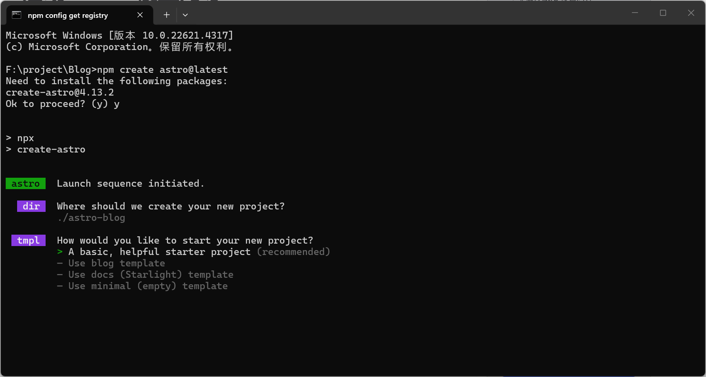
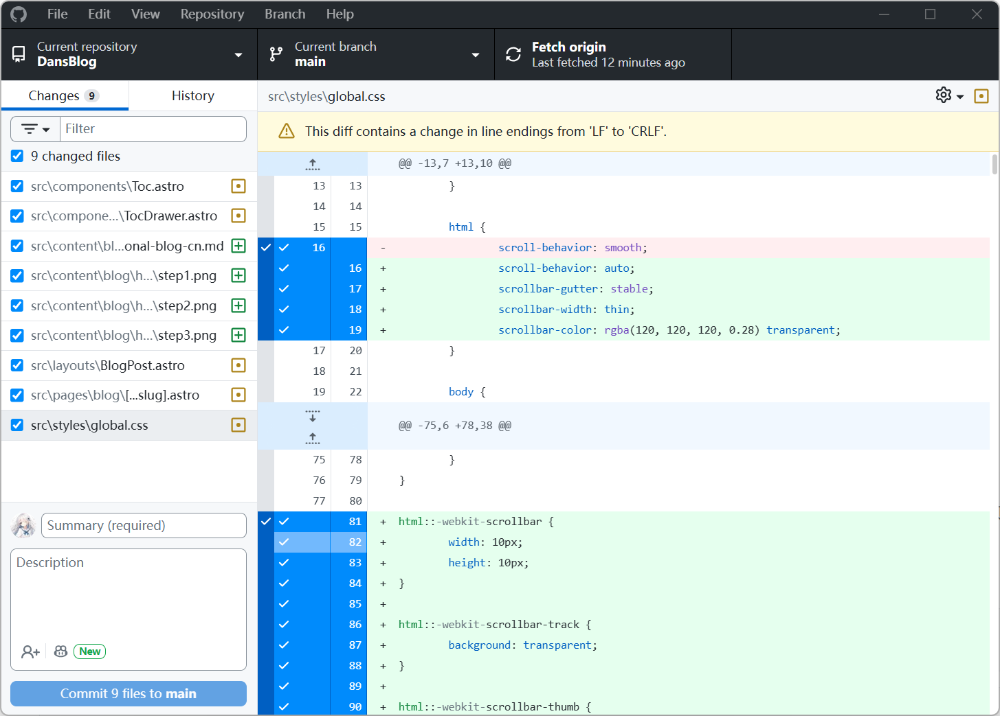
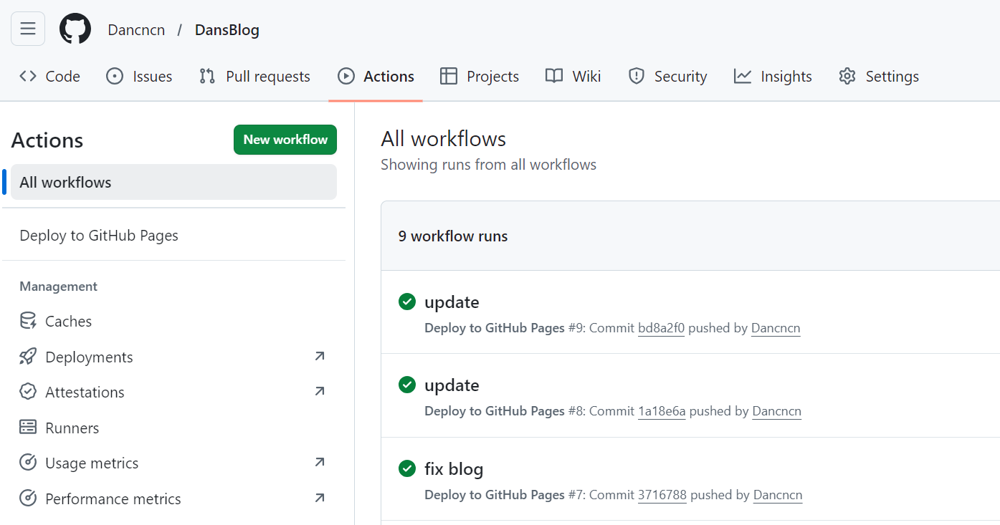

---

title: "How to Build a Personal Blog Website"
description: "Build a personal blog with Astro and Tailwind CSS, without dealing with your own server and domain setup from day one."
pubDate: 2026-02-12
tags: ["Astro", "blog", "github-pages", "guide", "EN"]
lang: "en"
group: "how-to-build-a-personal-blog"
important: true
importantOrder: 90
---

## Preface

When I realized I was remembering less and less of my technical ideas, I started writing things down in my phone notes during sleepless nights. But phone notes are limited, and I could not access everything smoothly across devices.

In January this year, during another late night, I thought: if I get some time, I should build a personal blog. I want to write down meaningful things for myself, for students I have taught, and maybe for students I will teach in the future.

The problem was: I was very busy. I had just returned from a business trip in Jiangsu. One night, still unable to sleep, I remembered this plan again. It was already very late, so I did not want to disturb friends who had built blogs before. I guessed the whole thing might take around a week.

The next morning, I asked my high school friend Herbert Skyper. His answer: around one week too. He hand-built his version with Vue (no mature blog framework, mostly for frontend fun). When I visited him later, we talked more. Domain cost is usually not expensive per year, but server/public IP/stability are often the annoying parts.

One of the biggest headaches of running a website is exactly this: domain name, reliable always-on machine (or server), public network accessibility, and so on. There are ways to solve all of these, but if you can avoid extra operations in the early stage, that is usually better.

Skyper mentioned some classmates using [Astro](https://docs.astro.build/), which is a mature framework. Later my friend licyk replied too; he writes with [Hexo](https://hexo.io/) and has a related tutorial: [How to Deploy a Blog with Hexo](https://licyk.github.io/2024/06/26/how-to-deploy-hexo/). He also said deployment on GitHub is not too time-consuming, and it avoids server/domain costs at the start.

------

## Requirements Analysis

### What exactly do I need?

I need something like a "pro memo" that I can read anytime, and others can read too, without costing too much time or money.

Content comes first, but I also want a little personality in the design. Something simple, rational, and restrained, but still gentle, with small colorful details that can make people smile.

### Technical Route

So why did I choose Astro?

I compared several blog frameworks first: their pros, cons, and which one fits me best. Since I have used ChatGPT for years, it has a decent idea of my technical level, and I organized its suggestions into the table below.

#### Blog Framework Comparison

| Framework                  | Tech Stack                              | Build Speed | Writing Experience               | Component/Interaction Power | Extensibility | GitHub Pages Fit               | Best For                           | Common Pitfalls                          |
| -------------------------- | --------------------------------------- | ----------- | -------------------------------- | --------------------------- | ------------- | ------------------------------ | ---------------------------------- | ---------------------------------------- |
| **Hexo**                   | Node.js                                 | Medium      | Easy to start, many themes       | Weaker (template-centric)   | Medium        | Mature and stable              | Pure writing, Chinese ecosystem    | Node dependencies may be annoying        |
| **Hugo**                   | Go                                      | Very fast   | Clear structure                  | Moderate (content-driven)   | Medium        | Very stable                    | Speed-focused, low maintenance     | Theme config can feel too engineering-ish |
| **Astro**                  | Modern frontend (React/Vue/Svelte)      | Fast        | Great Markdown/MDX experience    | Strong (component mixing)   | Strong        | Need to handle `base` carefully | Frontend developers                | High freedom means more decisions        |
| **Next.js / Nuxt**         | React / Vue full-stack                  | Medium      | Good                             | Very strong                 | Very strong   | Static export needs prefix care | People planning larger platforms   | Slightly heavy for pure blogs            |
| **VitePress / Docusaurus** | Vite / React                            | Fast        | Excellent for documentation      | Medium                      | Medium        | Very stable                    | Technical docs-style content       | Less "blog vibe"                        |
| **Jekyll**                 | Ruby                                    | Medium      | Traditional Markdown             | Weaker                      | Medium        | Native support                 | Minimal deployment overhead seekers | Less modern by today's standards         |

#### Decision-Oriented Summary

| Requirement Type                        | Recommended Option         | Why                                  |
| --------------------------------------- | -------------------------- | ------------------------------------ |
| Pure writing, mature theme ecosystem    | Hexo / Hugo               | Classic and stable                   |
| Lots of technical posts, fastest builds | Hugo                      | Extremely fast build speed           |
| Blog + project showcase + interactions  | **Astro**                 | Markdown + components is very strong |
| Might evolve into personal platform     | Next.js / Nuxt            | Strong full-stack capability         |
| More documentation-oriented             | VitePress / Docusaurus    | Great structure and TOC management   |

ChatGPT told me Astro's flexibility can feel like a pitfall because you need to make more choices yourself. For me, that is actually an advantage: I can choose the components and style I like.

At first I considered Cloudflare. But once I decided to push the project to GitHub anyway, GitHub Pages became super convenient: configure once, then update via `push`.

#### Deployment Cost Snapshot

| Item                | Reality                                                               |
| ------------------- | --------------------------------------------------------------------- |
| Server cost         | Usually 0 with GitHub Pages / Cloudflare Pages / Vercel              |
| Domain cost         | `username.github.io` is free; custom domains usually cost money      |
| Maintenance overhead| Almost 0 for static sites                                             |

Astro supports modern frontend component ecosystems, so which components should you choose?

**Your technical route shapes your blog's personality and tone.**

**One key mindset correction first**: this is Astro's strength, not a limitation.

> **Astro is not "a Vue-based blog framework". It is:**
> 
> 👉 **Astro = static-site framework + optional Vue components when needed**

ChatGPT recommended [Tailwind CSS](https://tailwindcss.com/plus/ui-blocks/marketing) and suggested a style that is timeless, professional, and easy to live with in the long term. I agree.

At this stage, I still prefer introducing only a small number of components to avoid complexity.

***Less is more.***

#### Development Environment

I use **VS Code** as my text editor, and I installed the Astro extension.

> [!NOTE]
>
> **Node.js** - `v18.20.8`, `v20.3.0`, `v22.0.0`, or higher (`v19` and `v21` are not supported).
>
> Astro is built with Vite. Vite targets modern JavaScript browsers by default. See the browser support list in Vite docs: [Browser Compatibility](https://cn.vite.dev/guide/build#browser-compatibility).
>
> **Terminal** - Astro is operated via CLI.

------

## Let AI Code Build the First Skeleton for You

Once your requirements and technical direction are clear, you can treat AI as a "scaffolding assistant" and let it create a runnable version first.

My habit is simple: let AI produce a quick first draft, then do a second refinement pass manually. This is much more efficient and helps you avoid getting stuck at step one.

### Prompt Set I Actually Use (Copy-Paste Ready)

You can paste this to AI tools like ChatGPT, Codex, or Cursor:

```text
You are a senior frontend engineer. Help me build an Astro personal blog project from 0 to 1.

Goals:
1) Tech stack: Astro + Tailwind CSS
2) Content: Markdown-based writing
3) Deployment: GitHub Pages
4) Requirements: beginner-friendly maintenance, clear project structure, clean and restrained style

Output format:
1) First, provide the project directory tree
2) Then provide commands to run (in order)
3) Then provide full content for key files (astro.config.mjs, package.json, basic pages, blog content dirs)
4) Explain "why" for every step
5) Finally provide a troubleshooting checklist (common errors + fixes)

Constraints:
- Do not skip steps
- Do not omit key configurations
- All commands must be directly runnable
- Prioritize stable solutions over fancy tricks
```

### Second-Round Prompt (Ask AI to Improve, Not Rewrite)

After the first version runs, give AI this:

```text
This is my current project state. Please make incremental changes on top of the existing structure. Do not rewrite from scratch.

Goals:
1) Keep existing routes unchanged
2) Improve homepage layout and blog list style
3) Add tags page
4) Ensure npm run build passes

Output requirements:
1) Only list files that need modification
2) For each file, provide minimal diff
3) Include verification commands after changes
```

This "incremental modification" style prompt is important. Otherwise AI may accidentally replace things you already wrote.

For example, this is the kind of effect I got when I locked requirements and asked Codex to scaffold it. It is great for getting started. If you feel stuck during debugging, ask AI to help write a precise prompt first. It is often more effective than saying "move this thing a bit left/right." AI code assistants are smart, but they cannot see your screen.


------

## Installation

### Install Node.js (Windows)

Node.js download page:
https://nodejs.org/en/download

The simplest way is opening that page and clicking **Windows Installer (.msi)**.

#### Steps

1. Double-click the installer.
2. Click `Next`.
3. Accept the license and click `Next`.
4. Default path is usually `C:\Program Files\nodejs\` (you can change it).
5. Click `Install`.
6. Click `Finish` when done.

> [!TIP]
>
> After installation, test Node/NPM in `cmd` or PowerShell.
> The fastest way to open `cmd`: `Win + R`, type `cmd`, press Enter.

```bash
node -v
npm -v
```

```text
# example
C:\Users\Dan>node -v
v24.13.0
```

#### If Network Is Slow (download/install timeout)

This is a very common beginner issue and not your fault.
Often the connection to the official npm registry is simply slow.

You can switch npm registry to a domestic mirror first:

```bash
# check current registry
npm config get registry

# switch to npmmirror
npm config set registry https://registry.npmmirror.com

# verify again
npm config get registry
```

Then run:

```bash
npm install
```

If you want to switch back to the official registry later:

```bash
npm config set registry https://registry.npmjs.org
```

------

### Install VS Code

Download from the official site (Stable recommended):

[https://code.visualstudio.com/](https://code.visualstudio.com/)

Quick Windows setup:

1. Click `Download for Windows`.
2. Run the installer and mostly `Next` all the way.
3. Recommended checkboxes:
`Add "Open with Code"`, `Add to PATH`, `Register Code as an editor`.
4. Open VS Code, then `File -> Open Folder` and choose your blog project folder.
5. Open terminal (`Ctrl + ~`) and run:

```bash
npm -v
node -v
```

If versions show up correctly, your environment is ready.

Extensions I personally use (minimal but effective):

- `Astro` (official syntax support)
- `Tailwind CSS IntelliSense` (class name suggestions)
- `Markdown All in One` (better Markdown writing flow)

If you are interested in learning programming from scratch, I will publish a future post called **"How to Start Programming"** with more detailed guidance.

------

### Install Astro

I recommend using the **CLI wizard**.

1. Open terminal in your target folder (for me: `F:\project\Blog`) and run:

```bash
# create a new Astro project
npm create astro@latest
```

Choose your project name and select **Use blog template**.



2. After project creation, when terminal is ready again (cursor blinking), continue.

```text
C:\Users\Dan>
```

3. Enter your project folder and install dependencies:

```bash
F:\project\Blog>cd astro-blog
F:\project\Blog\astro-blog>npm install
```

At this point, the local site should already run:

```bash
npm run dev
```

Open `http://localhost:4321/` in browser. If it looks normal, move on.

------

## Deploy to GitHub Pages

### Prepare Accounts and Tools First (Beginner-Friendly Order)

#### 1. Create a GitHub Account

1. Open [https://github.com/](https://github.com/).
2. Click `Sign up`.
3. Enter email, password, and username (username appears in your blog URL).
4. Finish verification and email confirmation.
5. Remember your username, you will use it in repo URL and Astro `site` config.

> [!TIP]
>
> If you plan long-term maintenance, enable 2FA in `Settings` for better account safety.

#### 2. Install Git (Windows)

1. Download from [https://git-scm.com/downloads](https://git-scm.com/downloads).
2. Run installer; default options are usually fine.
3. Verify in terminal:

```bash
git --version
```

Then configure identity (one-time):

```bash
git config --global user.name "Your Name"
git config --global user.email "your-email@example.com"
```

#### 3. Install GitHub Desktop (Optional, very beginner-friendly)

If you do not want to memorize many commands at first, GitHub Desktop is a great bridge.

1. Download: [https://desktop.github.com/](https://desktop.github.com/)
2. Sign in with your GitHub account.
3. `File -> Add local repository...`, choose your project folder.
4. After edits, review changes, write a `Summary`, click `Commit to main`.
5. Click `Push origin` to upload.

I still use CLI in daily work, but for beginners I often recommend Desktop first. No mental burden needed. Efficiency matters: commit, push, and move forward.

### Initialize Repository and First Push (CLI / Desktop)

If this is your first time, follow this flow (skip if repo already exists).

Create an empty repository on GitHub first, then replace the URL below.

#### Option A: CLI

```bash
git init
git add .
git commit -m "init astro blog"
git branch -M main
git remote add origin https://github.com/<your-github-username>/<your-repo-name>.git
git push -u origin main
```

#### Option B: GitHub Desktop (GUI)

1. In GitHub Desktop, `Add local repository`.
2. For first commit, use a message like `init astro blog`.
3. Click `Publish repository`.
4. Next updates are simply `Commit` + `Push origin`.

My recommendation: keep repository name simple and lowercase, which helps avoid mistakes when configuring `base` later.



### Use My Blog Project as a Reference: Clone First, Then Customize

If you want to learn from my current project structure directly, quickest way:

```bash
git clone https://github.com/Dancncn/DansBlog.git
cd DansBlog
npm install
npm run dev
```

After local startup, open `http://localhost:4321/`.

Project link:

[https://github.com/Dancncn/DansBlog](https://github.com/Dancncn/DansBlog)

If this tutorial or project helps you, I would really appreciate a `Star` on the repo.

Then convert it to your own repo:

1. Create a new empty repository in your own GitHub account (for example `my-blog`).
2. Update these fields in `astro.config.mjs`:
`site: 'https://<your-username>.github.io'`
`base: '/<your-repo-name>/'`
3. Replace remote URL:

```bash
git remote set-url origin https://github.com/<your-username>/<your-repo-name>.git
git push -u origin main
```

4. Go to `Settings -> Pages` and set Source to `GitHub Actions`.
5. Wait until Actions finishes, then visit:
`https://<your-username>.github.io/<your-repo-name>/`

### Configure `site` and `base` in Astro (Critical)

If you deploy as a project repo (for example `https://<username>.github.io/<repo>/`), you must configure `base`, otherwise static assets often return 404.

`astro.config.mjs` example:

```js
const REPO_BASE = '/<your-repo-name>/';

export default defineConfig({
  site: 'https://<your-github-username>.github.io',
  base: REPO_BASE,
  trailingSlash: 'always',
  output: 'static',
});
```

If you use a user-site repo (`<username>.github.io`), `base` is usually `/`.

### Auto Deploy with GitHub Actions

I personally prefer automation: one `push`, one deployment.

Create file: `.github/workflows/deploy.yml`

```yaml
name: Deploy to GitHub Pages

on:
  push:
    branches: [main]
  workflow_dispatch:

permissions:
  contents: read
  pages: write
  id-token: write

concurrency:
  group: pages
  cancel-in-progress: false

jobs:
  build:
    runs-on: ubuntu-latest
    steps:
      - uses: actions/checkout@v4
      - uses: actions/setup-node@v4
        with:
          node-version: 20
          cache: npm
      - uses: actions/configure-pages@v5
      - run: npm ci
      - run: npm run build
      - uses: actions/upload-pages-artifact@v3
        with:
          path: ./dist

  deploy:
    needs: build
    runs-on: ubuntu-latest
    environment:
      name: github-pages
      url: ${{ steps.deployment.outputs.page_url }}
    steps:
      - id: deployment
        uses: actions/deploy-pages@v4
```

If you started from Astro's blog template, this file may already exist. Check first before editing.

### Enable GitHub Pages

1. Open your repo, click `Settings`.
2. Find `Pages` in left sidebar.
3. Set `Source` to `GitHub Actions`.
4. Go back to `Actions` and wait for workflow success.

After that, your site is usually available at:



`https://<your-github-username>.github.io/<your-repo-name>/`

### Pitfalls I Personally Hit

1. Site opens but CSS is missing: `base` is wrong.
2. Images 404: wrong Markdown image path, prefer relative paths.
3. Action failed: most often dependency install or Node version issue.
4. Fresh deployment still 404: wait 1-2 minutes; Pages can lag.
5. Pushed code but site did not update: likely pushed to wrong branch (not `main`).
6. Works locally, white screen online: `site` + `base` combination is wrong.
7. Project path with Chinese chars/spaces: can trigger weird script issues on Windows.
8. `npm install` is very slow/stuck: check network first, then switch registry.
9. Changed config but no effect: some files (like `astro.config.mjs`) require dev server restart.
10. Random file-name case changes: Windows is case-insensitive, Linux (Pages) is not, causing online 404.
11. Editing config directly on GitHub web too often: easy to conflict with local changes.

------

## Deploying to Cloudflare Pages (Recommended: Stronger CDN & Less Maintenance)

If GitHub Pages is already working for you, this is a practical upgrade path worth trying. In real-world use, Cloudflare Pages usually gives you a smoother deployment loop and stronger global delivery out of the box.

### Why Consider Cloudflare Pages?

- Global CDN: static assets are distributed closer to visitors worldwide.
- Automatic HTTPS: certificate and TLS are managed for you.
- Automatic deployment from Git: push to branch, trigger build, ship.
- Performance and basic security benefits: caching, compression, and edge protection are easier to get right.
- Future scalability: you can extend with Pages Functions / Workers and pair with D1 / KV / R2 when needed.

For access quality, keep expectations realistic: international performance is usually excellent; mainland China is often more usable than GitHub Pages, but this is still not the same as a mainland CDN setup with ICP filing.

### Step-by-Step Deployment Guide

1. Create a Cloudflare account and enter the dashboard.
2. In the left menu, open `Workers & Pages`.
3. Choose `Pages`. In the newer UI, this entry may appear under `Looking to deploy Pages? Get started`.
4. Click `Import an existing Git repository`.
5. Connect your GitHub account and select your blog repository.
6. Configure build settings:
   - `Framework preset`: `Astro`
   - `Build command`: `npm run build`
   - `Build output directory`: `dist`
   - `Production branch`: `main`
7. Start deployment. After success, open the generated `*.pages.dev` URL.

My recommendation: validate everything on the default `pages.dev` domain first, then bind custom domain later.

### The Most Common Pitfall: Base Path Issues

This is the one that gets almost everyone once.

- GitHub Pages project sites usually live under a subpath like `/DansBlog/`.
- Cloudflare Pages usually serves your site from root path `/`.
- If `base` still points to `/DansBlog/`, your page loads as blue links / raw HTML with missing CSS/JS.

Use an environment-based `base` switch in `astro.config.mjs`:

```js
import { defineConfig } from 'astro/config';

const isCfPages = process.env.CF_PAGES === '1';
const isGithubProd = !isCfPages && process.env.NODE_ENV === 'production';

const base = isCfPages ? '/' : isGithubProd ? '/DansBlog/' : '/';

export default defineConfig({
  site: 'https://your-domain-or-pages-domain',
  base,
  trailingSlash: 'always',
  output: 'static',
});
```

Behavior of this setup:

- Cloudflare build: `base = "/"`
- GitHub Pages production build: `base = "/DansBlog/"`
- Local dev: `base = "/"`

Also avoid hardcoded `"/DansBlog"` in links/components. Prefer `import.meta.env.BASE_URL` or relative paths.

### How to Validate the Deployment

Local simulation first (Windows CMD):

```cmd
set CF_PAGES=1
npm run build
npx astro preview
```

Optional PowerShell equivalent:

```powershell
$env:CF_PAGES='1'
npm run build
npx astro preview
```

Online validation checklist:

1. Open your `pages.dev` URL.
2. Open DevTools -> `Network`, confirm 404 count is `0`.
3. View page source and search for `"/DansBlog"`; it should not appear in Cloudflare deployment output.
4. Test key routes: home page, article page, tag page, pagination.

### pages.dev Domain & Custom Domain

- `pages.dev` is the default free subdomain.
- Renaming the project usually changes the subdomain prefix.
- If you want your own domain, you usually need to purchase one first.
- Cloudflare Pages supports custom domain binding directly in project settings.

### Accessibility for International & Mainland China Users

Practical expectations:

- International visitors: usually very strong performance.
- Mainland China users: often more usable than GitHub Pages.
- Without ICP备案 and mainland CDN architecture, do not expect domestic-CDN-level stability everywhere.

Low-cost improvements that help a lot:

- Self-host fonts instead of relying on Google Fonts.
- Minimize third-party external scripts.
- Leverage static asset caching (hashed file names + long cache headers).

## Wrap-up

By now you already have a very practical workflow:
local writing -> `git push` -> GitHub auto build + deploy.

From here, keep writing and gradually polish your style.
Technology is the skeleton; content is the soul.
First make it run, then make it beautiful.

I hope you can use AI code tools without psychological pressure. They can significantly improve productivity. For example, this site reached a usable Home/Blog/About structure in about 4 hours on day one, then I spent day two and day three refining details and mobile adaptation.

But do not forget your original goal for building a blog:
reliable publishing and reading comes first.
Fancy features are optional personal fun. Add them if you want, skip them if you do not.
