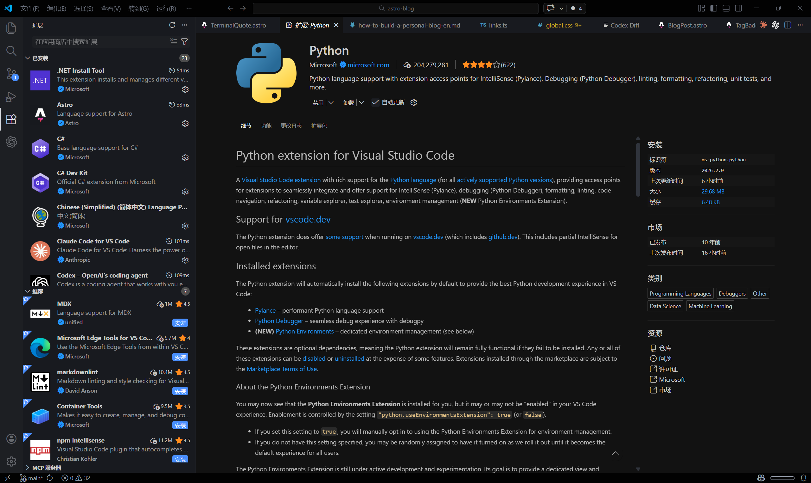
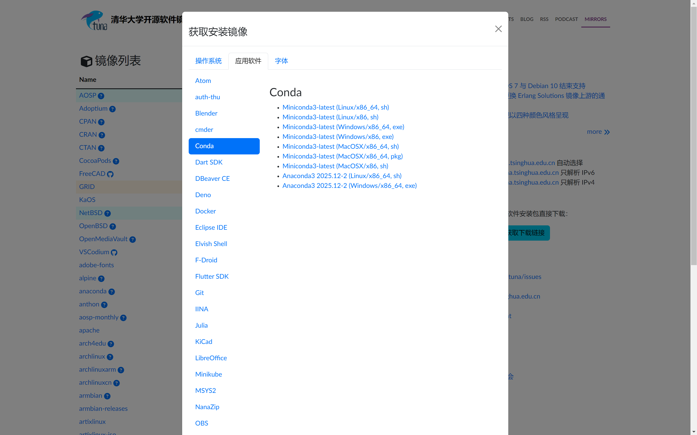
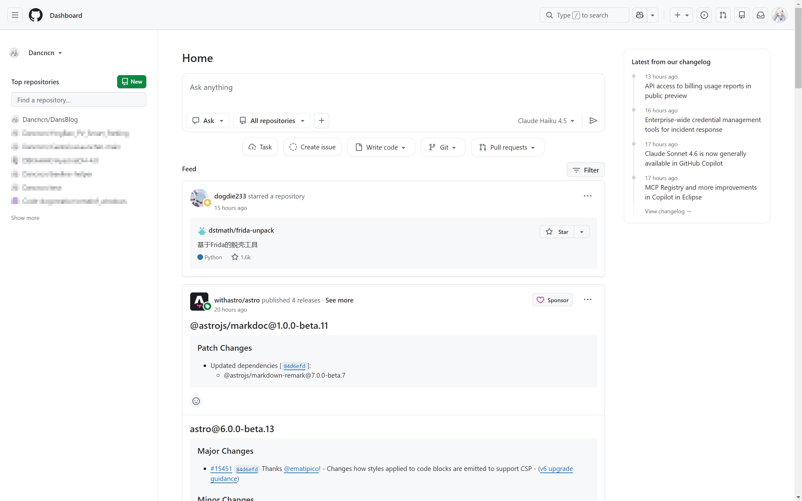
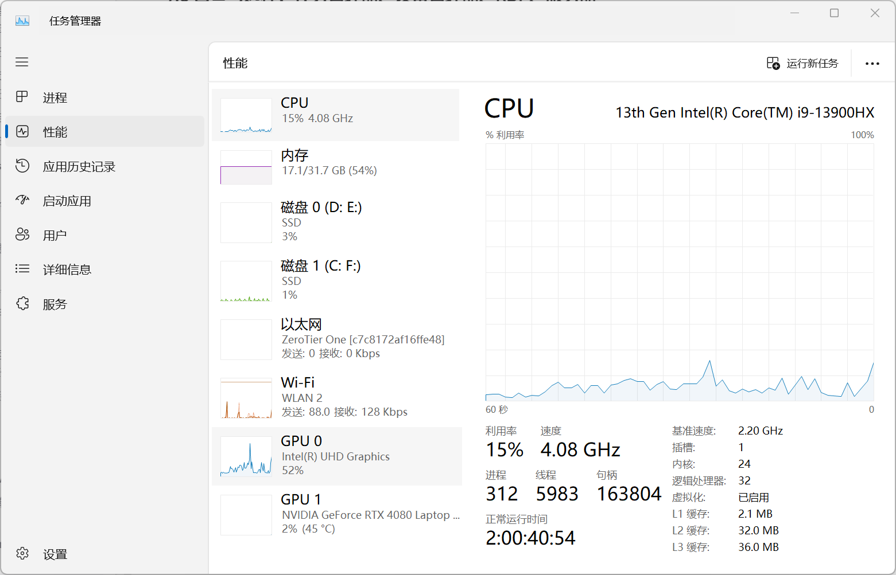

---
title: 如何上手编程：工具、Git 与工程思维
description: 从开发环境搭建到版本控制，再到语言选择与工程思维，本指南为初学者提供一条完整而清晰的入门路径。
pubDate: 2026-02-17
tags: ["code", "guide", "CN"]
lang: "cn"
group: "how-to-get-started-with-programming"
important: true
importantOrder: 90
typora-root-url: ./
heroImage: ""
draft: false
---

## 前言

我一直认为，人无法想象自己认知以外的事。尽管现在AI再这么强大，你或许还是没法用ai搓出一个满意的作品。你也有时候会焦虑，既然ai这么强大，那我学怎么编程还有意义？岂不是后面程序员都会被AI代替了？

我知道你有很多疑惑，但是在我看来，时代在变化答案每天都在改变，今天适用的法则未必适用于明天，明天适用的法则也不一定适用于今天。比起一切浑然不知云里雾里，我更希望你对一个事物有所了解，毕竟其实这世上也没有什么神秘的事情。如有必要，最好亲身接触一下，我一直很喜欢一句话：“实践是检验真理的唯一标准”。

学习一项技能是一个很光荣的事情，也会成为你一个终生的爱好。在我看来，无论看文章的你是个中学生，还是个刚上大学的大学生，都有必要学习如何使用计算机甚至写代码做项目。

在我看来，所有人其实都有某一方面的天赋，只是受其环境或者经历原因，未被发掘出来而已，也许我每天都与未来的天才擦肩而过，而他们对此浑然不知。我更希望，所有有希望的学生都在年少时被一个偶然的经历激发起了对一件事的兴趣，然后开始培养一个爱好。

对于我自己来说，我是浙江人，高中有门选考科目是技术，信息技术那块学的是Python。那会我们学校有个oj做题网站，大家都喜欢占着电脑做题，也在闲暇之余我们也研究过一些有趣的东西，殊不知这些东西也算是改变我们人生道路的一个开始。

无论你是做工程的人，还是学文科的人，我觉得都有必要知晓其概念，这样当你做决策的时候，我不能保证你不会再迷茫，或许知道更多你会更加迷茫了，但你的脑海内会出现一个大大的问号，你开始有方向的进行思考了。

---

## 1. 什么是编程

编程没那么神秘，它更像一种工程表达能力：把问题拆开，把步骤排好，再让机器稳定执行。

你不需要一开始就懂所有底层。先记住一件事：你写的不是炫技语法，而是一套能复现、能排错、能维护的流程。

### 1.1 计算机体系里编程在什么位置

你可以把这件事想成一条从下到上的链路。最下面是硬件，CPU、内存、硬盘都在这一层。CPU 还有自己的架构（x86、ARM），它决定了机器能听懂哪一套指令。

再往上是操作系统（Windows / Linux / macOS）。它负责把硬件管起来，再给程序一套统一入口。你写代码时调用文件、网络、窗口，背后都是系统在接住。

编程语言在中间扮演翻译层。你写的是 Python 或 C，机器最后执行的是更底层的指令。最上面才是应用程序，也就是你每天点开的浏览器、编辑器，或者你自己写的小工具。

**Windows 和 Linux 是什么？**

Windows 和 Linux 都是操作系统，不是编程语言。你可以这样理解：它们是“管家”，负责把硬件资源分配好，再把规则定清楚。

我见过很多新手一开始会把“会用 Windows”当成“会编程”，这很正常。操作系统更像是运行环境，它决定程序怎么访问文件、怎么申请内存、怎么跟设备打交道。

系统是舞台，程序是演员，语言是你写剧本的方式。把这三个角色分开，后面很多概念就不容易混。


### 1.2 路径与目录：Path、根目录、相对路径

路径你可以继续理解成地址和门牌号。程序去找文件，其实就是在问“它具体放哪儿了”。

比如 `C:\Users\Dan\Desktop\learning\hello.txt`，这是完整门牌号；你在终端里用 `cd`，就是先把自己走到正确楼层，再去拿文件。

这里有个很常见的小坑：路径里不是说中文一定不行，但在一些工具链、编码设置、老库或命令行组合里，中文目录名偶尔会出幺蛾子。为了少踩坑，平时尽量用英文路径名会更稳，比如 `test`、`folder`、`project`、`data`、`output` 这种短词就很好用。

**什么是根目录**

在 Windows 里，`C:\` 就是一个“根”。你可以把它想成省级入口，下面再分用户目录、项目目录、数据目录。路径一长，其实就是从这个入口一层层往下走。

**什么是相对路径**

相对路径是“相对于你当前所在目录”的写法。绝对路径像 `C:\Users\Dan\Desktop\learning\hello.txt`，一步到位；相对路径像 `.\hello.txt` 或 `data\input.txt`，默认从你当前站的位置出发。

相对路径报错最常见的原因，不是文件不存在，而是你站错目录了。你以为自己在 `learning`，其实终端还停在上一级，这时候路径当然会找不到。

**Windows 用户可跳过这一小段：**  
Mac 的根目录是 `/`，个人目录通常是 `/Users/你的用户名`。  
相对路径规则不变，常见写法还是 `./`、`../`。

### 1.3 架构差异：x86 vs ARM

x86 和 ARM 是两种主流 CPU 架构，可以当成两种不同的“机器方言”。传统 PC 长期以 x86 为主，手机和平板基本是 ARM，新款 Mac（Apple Silicon）也是 ARM。

你写的代码最终都要翻译成目标架构能执行的指令。慢慢你就会发现，同一份代码换到不同设备上，偶尔会遇到兼容性差异，这不是你写错了，很多时候只是底层平台不同。

**编程语言在这套体系中的位置**

这里最容易混淆。Python 不是系统，C 也不是 CPU。语言更像翻译层，把你的想法组织成机器能执行的形式。

把这个位置想明白后，你看“系统报错”“解释器版本”“架构兼容”这些词就不会混成一团。

### 1.4 编程基本概念：流程、脚本、变量、编码

举个很接地气的例子：把下载目录里的图片统一改名。你要先找到目标目录，再筛出 `.jpg` / `.png`，然后定好排序和命名规则，最后把失败项记下来重试。

你会发现，真正重要的是步骤设计，不是某个语法点背得多熟。这就是算法思维。语言只是工具，流程才是核心。

**什么是脚本？**

脚本（script）就是为具体任务写的小程序，重点是“省重复劳动”。

比如每天整理下载目录、批量改文件名、自动汇总文本，这些都很适合脚本。它未必复杂，但非常实用。

**什么是变量？**

变量就是给数据起名字。名字起得好，你过几天回来看还能一眼看懂；名字起得随便，代码就会很快变成谜语。

比如统计图片数量，用 `image_count` 基本不用解释；写成 `a1`，三天后你自己都要猜半天。我当年第一次写脚本时就吃过这个亏，代码能跑，但一个月后根本不想再碰。

变量看起来是小事，实际上它直接影响可读性，也影响你后面的排错速度。

**什么是编码？**

换个角度想，编码不是打字比赛，而是组织能力。你在做的是把一个想法拆成可执行的结构：变量怎么放、流程怎么走、函数怎么分、模块怎么拆。
这里说的“编码”，指的是写代码、把想法组织成程序，不是 UTF-8 这类字符编码。

结构清楚，后面改需求会轻松很多。结构混乱，功能越加越痛苦。你现在不懂也正常，先从“写完自己能看懂”这件事开始就行。

### 1.5 英文与报错阅读：重要但别焦虑

不用把这件事搞成压力竞赛。你不是先背完词典才能学编程。我不建议你因为学编程而现在开始准备学英语，而是边做边学。

但有一件事很现实：你迟早要看英文报错、英文文档、英文 issue。能不能读懂关键内容，会直接影响你的排错速度。

所以目标不是“英语满分”，而是“能看懂核心技术词，能读懂自己写的变量名和错误信息”。

### 1.6 新手误区与起步心态

我见过很多新手会卡在几个差不多的地方：只背语法不做项目，只看视频不动手，一报错就停，把 AI 当魔法不做验证，总想“再准备一下”结果一直不开工。首先对于ai来说，你啥也不知道就让他做个网站，有点像遇到不知具体需求的甲方了，大概率得到的结果不如你所愿。

这些都不是能力问题，更多是节奏问题。先做一个很小的可运行结果，再逐步加复杂度，心态会稳很多。

**先选路线，再装工具**

很多新手最容易卡在“环境要怎么装”，结果还没开始写代码就已经疲惫了。

我更建议你先把方向定下来：第一门语言先 Python，然后用最小路线跑通“写 -> 跑 -> 改”。

你先有“能跑起来”的体验，再回头看工具细节，心态和效率都会好很多。下面先讲语言选择，再讲环境搭建。

## 2. C 还是 Python？

这一节我给一个稳妥建议：第一门语言先学 Python。无论你是文科、理工、转行，还是在校生，先 Python 都更容易建立正反馈。

### 2.1 为什么先 Python

Python 最大的优势是反馈快。你写几行就能看到结果，这对新手特别重要，因为你会持续获得“我确实在前进”的感觉。当你在做一件事，如果能及时得到正反馈，你反而会越来越感兴趣进步的越来越快，我不是很希望一上来就整太难的人你收获满满的挫败感。

它的语法也比较直观，资料和社区都很成熟，遇到问题通常能查到可用答案。我见过很多新手不是因为难度放弃，而是因为长期没有正反馈。Python 在这件事上确实更友好。

### 2.2 Python 10 分钟入门（写到循环为止）

先说清楚范围：这一段只带你走到循环，够你跑出第一个小程序。后面的函数、列表、字典、文件先不展开。当前内容可以在后面配完开发环境后进行验证，你也可以直接跳过到2.4

变量这件事可以当成“给数据起名字”，名字清楚，代码就好读。

```python
name = "Dan"
age = 18
print(name, age)
```

运行后你应该看到一行输出，比如 `Dan 18`。

`print()` 是输出，`input()` 是输入。`input()` 拿到的是字符串，想做数字运算要先 `int()`。

```python
age = int(input("请输入你的年龄："))
print("明年你是", age + 1, "岁")
```

运行后你输入一个数字，会看到“明年你是 xx 岁”。

`if` 就是条件判断，满足条件才执行对应分支。

```python
score = 72
if score >= 60:
    print("及格")
else:
    print("再练练")
```

运行后你会看到 `及格`（因为示例分数是 72）。

`for` 常用于“按次数重复”。`range(5)` 是 0 到 4，`range(1, 6)` 是 1 到 5。

```python
for i in range(1, 6):
    print(i)
```

运行后会按行输出 1 到 5。

`while` 适合“满足条件就继续循环”。比如累计到 100 就停：

```python
total = 0
n = 1
while total < 100:
    total += n
    n += 1
print(total, n - 1)
```

运行后会输出累计结果和最后一次加到的数字（例如 `105 14` 这种形式）。

### 2.3 自学入口与小作业

到循环为止你就有了起步能力，后面的函数、列表、字典、文件、模块建议自己学。核心不是“背完”，而是会查资料、会读文档、会验证结果。

自学入口可以先用菜鸟教程：<https://www.runoob.com/>。遇到新语法别急着全记，先跑一个最小例子看它到底做了什么。

给你一道小作业，先做出结果，再慢慢优化：

1. **水仙花数**（也称为自恋数或阿姆斯壮数）是指一个 n 位数，其各个数字的 n 次方和等于该数本身。例如，三位数的水仙花数是指一个三位数的每个数字的立方和等于该数本身。计算方法如下：将三位数的每个数字提取出来，计算这三个数字的立方和，判断这个和是否等于原数。我需要你找出（100~999）的水仙花数  
  提示：拆成百位/十位/个位，算三次方后比较是否等于原数。

### 2.4 Python 的应用场景与语言对比

它的应用非常广。文科方向可以做文本分析、表格清洗和可视化；经济金融方向常见是指标计算和报表自动化；地理方向也能处理云图和空间数据。理工科这边也很好落地，比如实验数据清洗、批量画图、参数扫描、简单数值计算，很多重复步骤都能脚本化。再往工程一点走，自动化脚本、Web 后端、AI 数据预处理和训练脚本都很常见。你不需要一次全学会，先在自己最有感觉的场景里做出一个小结果，学习效率会高很多。

**Python vs C：看一个最小示例**

同样是打印 1 到 5：

Python：

```python
for i in range(1, 6):
    print(i)
```

C：

```c
#include <stdio.h>

int main() {
    for (int i = 1; i <= 5; i++) {
        printf("%d\n", i);
    }
    return 0;
}
```

这个例子不是为了说明谁“更高级”，只是让你直观看到入门阻力差异。

### 2.5 C 以后要不要学

要不要学，答案是：看方向。你先用 Python 建立编程直觉，后面如果要做底层、性能、系统方向，再补 C 会更顺。

**一条最小起步路线**

1. 先学 Python 基础（变量、分支、循环、函数）。
2. 写一个能跑的小脚本（比如批量改名）。
3. 遇到报错就查、就改、就复跑。

这条路线跑通一次，入门就稳了。

## 3. 开发环境搭建

### 3.1 编辑器与 IDE：为什么先用 VS Code

如果你刚开始学，我更倾向先用 Visual Studio Code。

先说一下 IDE 这个词。IDE（Integrated Development Environment，集成开发环境）可以理解成“工具全家桶”，里面通常包含编辑器、调试器、运行器、项目管理这些能力。像 PyCharm、Visual Studio 都属于这一类。

我不建议新手一上来就用重型 IDE，不是因为它们不好，而是功能太多时你容易被界面带着走，反而看不清“代码到底怎么跑起来”。入门阶段更重要的是把这条底层流程先摸熟。

VS Code 的好处是，它介于纯编辑器和重型 IDE 之间：默认轻量，按需扩展，够用但不过度。这个平衡对新手很友好。

原因很实际：跨语言、插件生态成熟、内置终端够用、Git 集成也顺手。新手阶段工具越统一，心智负担越小。

我当年第一次装环境也卡过，界面里一堆选项看得人头大。这很正常，先把工具链跑通，后面再慢慢调习惯。

官网地址在这：<https://code.visualstudio.com/>。

先装最少插件，够用就行：

- `Python`（`ms-python.python`）
- `Pylance`（`ms-python.vscode-pylance`）
- `Markdown All in One`（`yzhang.markdown-all-in-one`）
- `GitLens`（`eamodio.gitlens`，可选）

### 3.2 Python 插件与解释器：VS Code 里到底做什么

这个问题新手很容易混淆。`Python` 和 `Pylance` 插件主要做的是编辑器能力：语法高亮、补全、跳转、类型提示、调试入口这些。

它会让你写代码更顺手，但它本身不是 Python 解释器。那句最关键的话是：**VS Code 里装了 Python 插件，不代表电脑里装了 Python。**

再补一句更本质的话：VS Code 主要是“写代码和组织工程”的工作台，不是运行时本体。它可以调用你电脑里的终端、解释器和 Git，但它不会替你装好 Python 本体。你在 VS Code 里能不能跑 `python`，最终还是取决于你系统里有没有可用解释器，以及路径有没有配对。

你在 VS Code 里看到的“Select Interpreter（选择解释器）”，本质上也是在告诉编辑器：这次项目要调用你电脑上的哪一个 Python。

你可以直接这样操作一遍：打开 VS Code，按 `Ctrl + Shift + P`，输入 `Python: Select Interpreter`，然后选择你刚创建的 `learn` 环境。如果这里选错，VS Code 可能运行的就不是你刚安装的那套 Python。

选对之后，状态栏通常会显示当前 Python 环境或版本（不同主题位置会有点差异），这是你是否切换成功的一个直观信号。



### 3.3 VS Code 安装、中文语言包与插件

先按最稳流程走一遍，别一上来改太多选项。

1. 去 VS Code 官网下载 Windows 安装包。  
   你应该看到明显的 `Download for Windows` 按钮。
2. 安装时建议勾选：
   - `Add to PATH`
   - `Open with Code`
   - （可选）`Register Code as an editor for supported file types`
3. 安装完成后启动 VS Code。  
   你应该能看到左侧活动栏（Explorer/Search/Source Control/Run/Extensions）。
4. 打开扩展市场（左侧方块图标 `Extensions`），搜索并安装简体中文语言包：  
   `Chinese (Simplified) Language Pack for Visual Studio Code`（Microsoft 官方）。
5. 安装后按提示重启 VS Code。  
   重启后界面会切到中文（如果没自动切，可在命令面板手动切换显示语言）。
6. 如果你习惯繁体，也有对应语言包可装：  
   `Chinese (Traditional) Language Pack for Visual Studio Code`。
7. 第一次打开后再做三件事：
   - 语言切到你习惯的界面。
   - 安装上面的最少插件清单。
   - 按 `Ctrl + ~` 打开终端，确认可以正常输入命令。

**Windows 用户可跳过这一小段：**  
VS Code 官网同样提供 macOS 版本：<https://code.visualstudio.com/>。  
装好后直接打开即可，插件安装和解释器选择逻辑与 Windows 基本一致。

**什么是开发环境？**

开发环境可以理解成你的“编程工作台”。编辑器负责写代码，解释器或编译器负责把代码变成可运行结果，终端是你下命令和跑程序的入口。

包管理器（比如 `pip`、`conda`）用来装和管理依赖，运行时则决定代码真正执行时依赖的条件。你不需要一次全部吃透，先知道这些部件是在配合工作就够了。

### 3.4 终端与 Win+R：先把命令行跑通

CMD，powershell，vscode里的终端，他们都又是什么呢？

刚开始你可能觉得黑框很可怕，但它只是一个输入命令的地方。

它们本质都是命令行入口。CMD 更直接，适合先上手；PowerShell 功能更丰富；VS Code Terminal 本质上是把这两者放进编辑器里，少切几个窗口。

先固定一个就够，我建议先用 CMD。

先记住几条最常用的就够：`cd` 切目录，`dir` 看文件，`mkdir` 建目录，`rmdir` 删空目录，`echo` 输出文本，`cls` 清屏。

做个 3 分钟练习（可直接复制）：

```cmd
mkdir "%USERPROFILE%\Desktop\learning"  # 创建 learning 文件夹
cd /d "%USERPROFILE%\Desktop\learning"  # 进入 learning 文件夹（/d 支持切换盘符）
echo Hello Programming > hello.txt      # 创建并写入 hello.txt
dir                                     # 查看当前目录内容
type hello.txt                          # 查看文件内容
mkdir temp                              # 创建 temp 子文件夹
rmdir temp                              # 删除空的 temp 子文件夹
cls                                     # 清空终端屏幕
```

你大概率会看到：执行 `dir` 之后列表里有 `hello.txt`，执行 `type hello.txt` 会输出 `Hello Programming`。

常见坑也就两个：一是忘了 `cd /d`，盘符没切过去；二是没进 `learning` 就建文件，结果文件跑到别的目录里。

如果你能看懂每条命令在做什么，终端这关就过了第一步。

**怎么打开系统命令行（Win + R）**

如果你不在 VS Code 里，也可以直接开系统命令行。按 `Win + R`，输入 `cmd`，回车，就会打开 Windows 的命令提示符。

打开后你通常会看到类似 `C:\Users\你的用户名>` 的提示符，这就是你当前所在目录。

如果你不小心开成了 PowerShell 也不用慌，大多数基础命令照样能跑，先把流程走通最重要。

VS Code 底部那个终端，本质上也是在调用这套命令行环境，只是它被放在编辑器里了。你在两边输入的很多命令是同一套逻辑。

**Mac 用户可跳过 Windows 这段：**  
Mac 上打开“终端 Terminal”即可，Spotlight 搜索 `Terminal` 很快能找到。  
命令大多相同，只是 Windows 常见 `cmd`，Mac 常见 `bash/zsh`。

### 3.5 Python 本体、Miniconda 与安装路线

我推荐Miniconda，其实可能 Anaconda会更好但是我还是希望你能熟悉一下终端操作。

我依旧推荐 Miniconda，原因是轻量、可控、环境隔离体验好。

Miniconda 官方下载页：<https://docs.conda.io/en/latest/miniconda.html>。

先记三个词：Python 版本（比如 3.10、3.11）、包（比如 `requests` 这种第三方库）、虚拟环境（每个项目各用各的依赖，互不干扰）。

**Python 到底装在哪？**

Python 有两种常见安装方式。第一种是直接去 Python 官网下载并安装：<https://www.python.org/>。第二种是装 Miniconda，它本身也会带一套 Python。

两种方式都能用，选一个就可以。新手我更建议先走 Miniconda，后面做环境隔离会省很多麻烦。

再强调一次最容易误会的点：**VS Code 里装了 Python 插件，不代表电脑里装了 Python。**

**怎么确认 Python 真的装好了**

装完后你可以先做这个最小检查：

```cmd
python --version      # 查看 Python 版本
where python          # 查看 python 执行路径
```

正常你会看到类似：`Python 3.11.x`，以及一条指向 Miniconda 目录的 `python.exe` 路径。

如果 `python --version` 没反应或提示找不到，通常是 PATH 没生效，或者终端还没刷新；如果 `where python` 指向了非 Miniconda 路径，多半是系统里有多套 Python 或 PATH 顺序靠前的不是你想用的那套。

改完 PATH 之后，记得把终端全关掉再开一次。

如果能看到版本号和明确路径，基本就说明本体已经可用了。看不到也别慌，很多时候只是环境变量或终端会话没刷新，关掉终端再开一次通常就能确认。

**使用清华镜像加速（强烈建议国内用户配置）**

清华开源镜像站：<https://mirrors.tuna.tsinghua.edu.cn/>。你可以把“清华源”理解成官方仓库在国内的同步副本，所以叫镜像。它不是魔改版，内容来源还是官方，只是访问路径换成了更稳定的国内节点。

如果你在国内装过 `pandas`、`numpy`，大概率见过“命令敲了很久没动静”的时刻。很多时候不是你写错了，而是默认源连接不稳定。把源切到镜像后，下载过程通常会顺很多。

想自己确认路径也不难：打开镜像站首页，搜 `anaconda`，进入目录就能看到常见通道。`pkgs/main` 是常用基础包，`pkgs/free` 偏历史包，`cloud/conda-forge` 对应社区维护、更新更快的 conda-forge。

`channel` 可以理解成 conda 查找包时依次访问的仓库列表。以下命令请在 **Miniconda Prompt** 中执行，而不是普通 CMD：

```cmd
conda config --add channels https://mirrors.tuna.tsinghua.edu.cn/anaconda/pkgs/main/         # 添加主仓库镜像（常用基础包）
conda config --add channels https://mirrors.tuna.tsinghua.edu.cn/anaconda/pkgs/free/         # 添加历史仓库镜像（兼容旧依赖）
conda config --add channels https://mirrors.tuna.tsinghua.edu.cn/anaconda/cloud/conda-forge/ # 添加 conda-forge 镜像（社区包更全）
conda config --set show_channel_urls yes                                                      # 显示包来源通道，排错时更容易定位
```

`pip` 默认访问官方 PyPI，国内网络下也可能慢。设置 `index-url` 后会长期生效：

```cmd
pip config set global.index-url https://pypi.tuna.tsinghua.edu.cn/simple  # 设置 pip 默认镜像（持久生效）
pip config list                                                            # 查看配置是否生效
```

如果后面要回退到默认源，执行：

```cmd
pip config unset global.index-url  # 取消自定义镜像，恢复默认 PyPI
```
### 3.6 Miniconda 安装与验证闭环

这一段我按“国内下载”和“国际下载”分开写，你照着走就能闭环。

**国内用户（清华镜像）下载流程**

1. 打开 <https://mirrors.tuna.tsinghua.edu.cn/>。
2. 进入首页后，看右侧的“下载链接”模块。
3. 点击蓝色按钮“获取下载链接”。
4. 在弹窗里切到“应用软件（或应用程序）”选项卡，左侧选择 `Conda`，右侧选择 `Miniconda3-latest (Windows/x86_64, exe)`。
5. `x86_64` 就是 64 位 Windows，大多数电脑都是这个；不要选 Linux 的 `.sh`，也不要选 macOS 的 `.pkg`。
6. 下载后的文件名通常类似：`Miniconda3-latest-Windows-x86_64.exe`，看到这种格式基本就是对的。
7. 下载 `.exe` 安装包到英文目录（比如 `Downloads`）。



**国际用户（官网）下载流程**

1. 打开 <https://docs.conda.io/en/latest/miniconda.html>。
2. 找到 `Windows 64-bit Installer`。
3. 下载对应的 `.exe` 安装包。

**Windows 用户可跳过这一小段：**  
Mac 用户也可以在同一页面下载 macOS 版本（Apple Silicon / Intel 按机型选）。  
安装完成后在 Terminal 里先执行 `conda --version` 做最小验证。

下载好之后，安装步骤按这个走：

1. 双击安装包。
2. 用户范围建议选 `Just Me`（个人电脑更省心，也不容易碰权限问题）。
3. 安装路径建议用 `C:\Miniconda3`，尽量避免中文路径和空格。
4. `Add Miniconda to PATH`：如果你是第一次安装，建议勾选，这样可以直接在 CMD 中使用 `python` 和 `conda`；如果后面要管理多个 Python 版本，再学习更规范的环境隔离方式。
5. `Register Miniconda as default Python` 建议勾选，这样常见工具会优先识别这套 Python；如果你已经有固定项目绑定其他 Python，再按实际情况决定。
6. 安装完成后，在开始菜单搜索并打开 `Miniconda Prompt`。

如果你不想改系统 PATH，也可以不勾选；但新手为了少踩坑，勾上更省事。后面我也会教你怎么验证和手动处理。
**装完立刻验证**

安装完成后，先在 `Miniconda Prompt` 里跑一遍这三条：

```cmd
conda --version              # 确认 conda 可用
python --version             # 确认 Python 可用（来自 Miniconda）
where python                 # 确认 python 路径指向 Miniconda 目录
```

- `conda --version` 正常会显示类似：`conda 24.x.x`
- `python --version` 正常会显示类似：`Python 3.11.x`
- `where python` 第一条路径通常应指向：`C:\Miniconda3\python.exe`（或你自己的 Miniconda 安装目录）
- `where python` 有时会输出多行，第一行就是当前优先命中的 Python。
### 3.7 PATH 环境变量：不勾选时怎么手动处理

这个步骤听起来有点“系统设置味”，但实际做一遍就熟了。你可以按下面这条路走：

1. 右键桌面或资源管理器里的“此电脑”。
2. 点击“属性”。
3. 点击“高级系统设置”。
4. 在弹出的窗口里点击“环境变量”。
5. 在“系统变量”区域找到 `Path`。
6. 点击“编辑”。
7. 点击“新建”。
8. 添加 Miniconda 安装目录，例如 `C:\Miniconda3`。
9. 再点击一次“新建”，添加 `C:\Miniconda3\Scripts`。
10. 一路点击“确定”保存。
11. 关闭所有已经打开的终端窗口，再重新打开。

你可以把 `PATH` 理解成系统查找可执行文件的“目录列表”。你在 `cmd` 里输入 `python`，系统就会按这张列表从上到下去找 `python.exe`。如果目录没加进去，命令行就会表现成“找不到 python”。

至于为什么要“关掉终端再开”，原因也不复杂：终端启动时会读取一份当时的环境变量快照。你后面改了 PATH，老窗口不会自动刷新，新开的窗口才会拿到最新配置。

**怎么验证 PATH 已经生效**

配完后建议马上检查一次：

```cmd
where python   # 查看 python 实际命中路径
echo %PATH%    # 打印当前 PATH 列表，确认是否包含 Miniconda 目录
```

如果 `where python` 能看到你刚配置的路径，基本就说明已经生效了。

### 3.8 创建 learn 环境与常见坑

在 Miniconda Prompt 里执行：

```cmd
conda create -n learn python=3.11  # 创建名为 learn 的 Python 3.11 环境
conda activate learn               # 激活 learn 环境
python --version                   # 检查当前 Python 版本
pip install requests               # 在当前环境安装 requests 包
conda deactivate                   # 退出当前环境
```

`conda activate learn` 成功后，提示符左侧通常会出现 `(learn)`，这是最直观的激活信号。

第一次执行 `conda create -n learn python=3.11` 时，通常会看到：

`Proceed ([y]/n)?`

输入 `y` 然后回车继续即可。

如果 `pip install requests` 报超时或下载很慢，优先回到上面的清华镜像小节检查配置是否生效。

还有一个很常见的小坑：没激活环境就直接装包，包装到了 `base` 或系统环境里，后面切到别的环境运行时就会冒 `ModuleNotFoundError`。

跑通这一组命令，你就完成了第一个可用开发环境。

**如果遇到这些情况：**

1. `python 不是内部或外部命令`  
   这通常是 PATH 没配置好，或者你改完 PATH 后终端没重开。最短排查：`where python`，然后重开终端。
2. `where python` 指向了别的路径  
   说明系统里可能有多套 Python，当前命中的不是你想用的那套。最短修复：调整 PATH 顺序，或先明确用 `C:\Miniconda3\python.exe`。
3. `conda` 不是命令  
   你大概率没在 Miniconda Prompt 里执行。最短修复：先切到 Miniconda Prompt，再试一次。
4. `ModuleNotFoundError`  
   先确认 VS Code 解释器和当前环境一致，再在当前环境里执行 `pip install`。

**你会踩的坑**

最常见的几个问题你大概率都会遇到：`python 不是内部或外部命令`、电脑里装了多个 Python 但不知道当前到底调用了哪个、`pip` 把包装进了系统环境而不是项目环境。

很多新手都会经历这个阶段。你可能在终端里敲了 `conda activate learn`，结果像“没反应”一样，既不报错也没明显变化。这通常不是命令坏了，而是终端没加载 conda，或者你开的不是 Miniconda Prompt。

我当年也踩过这个坑。最后回头看，问题基本都在路径和环境没对齐。先用下面两个命令把现状看清楚：

```cmd
conda info --envs  # 查看所有 conda 环境，以及当前激活环境
where python       # 查看当前 python 命令实际指向的可执行路径
```

`conda info --envs` 用来确认当前激活的是哪个环境；`where python` 用来确认当前调用的 python 路径。

如果你看着这些输出有点懵也正常，先确认两件事：  
第一，你是不是在 `learn` 环境里；第二，`where python` 第一条路径是不是你预期的那一个。

## 4. 版本管理

### 4.1 为什么要做版本管理

你大概率见过这种场景：桌面里有 `final.py`、`final_final.py`、`final_final_v3.py`，过几天自己都分不清哪个能跑。版本管理的价值就在这里：它把每次改动记录成时间线，能回看、能回退、也方便协作。

**Git 是什么（用一句话说清楚）**

Git 就是一套本地版本控制工具，负责记录代码历史和变更。

### 4.2 Git 安装与基础配置（Windows 主线 + Mac 支线）

先打开 Git 官网：<https://git-scm.com/>。Windows 用户点 `Download for Windows`（或等价入口），下载完成后双击安装包（文件名通常类似 `Git-2.xx.x-64-bit.exe`）。

安装器里你会看到不少页面，下面按“新手最关键选项”走一遍：

1. `License`：直接 `Next`。  
   这页主要是许可说明，不需要额外改动。
2. `Select Destination Location`：建议默认。  
   如果你要改路径，尽量英文目录，例如 `D:\Git` 或 `C:\Program Files\Git`。
3. `Select Components`：大体默认即可，关键项看这几个。  
   `Git Bash Here` 建议勾选（右键能快速开 Bash）；`Git GUI Here` 可选；`Git LFS` 建议勾选；`Associate .git* configuration files with the default text editor` 建议保留；`Associate .sh files to be run with Bash` 可选；`Add a Git Bash Profile to Windows Terminal` 可选。
4. `Start Menu Folder`：默认 `Next`。  
   新手不用在这页折腾。
5. `Choosing the default editor used by Git`：  
   如果你已经装了 VS Code，推荐 `Use Visual Studio Code as Git's default editor`；没装就先保持默认也能继续，后面可以再改。
6. `Adjusting the name of the initial branch in new repositories`：  
   推荐选 `Override the default branch name for new repositories` 并填 `main`，和主流仓库默认值保持一致。
7. `Adjusting your PATH environment`：  
   新手推荐 `Git from the command line and also from 3rd-party software`，这样在 CMD / PowerShell / VS Code 终端都能直接用 git。
8. `Choosing the SSH executable` 与 `Choosing HTTPS transport backend`：  
   都保持默认就行（通常是 `Use bundled OpenSSH` / `Use the OpenSSL library`）。
9. `Configuring the line ending conversions`：  
   推荐 `Checkout Windows-style, commit Unix-style line endings`，跨平台时更不容易出现整文件换行变更。
10. `Configuring the terminal emulator to use with Git Bash`：  
    保持默认 `Use MinTTY` 即可；你平时在 VS Code 内置终端使用也不冲突。
11. `Choosing the default behavior of 'git pull'`、`credential helper`、`extra/experimental options`：  
    这几页先保持默认（`Git Credential Manager` 也建议保留），先把主流程跑通。

安装完成后，先把所有终端窗口关掉再打开。然后在 CMD（`Win + R` 输入 `cmd`）里执行：

```cmd
git --version    # 正常会看到：git version 2.xx.x
```

如果提示 `git` 不是命令，先重开一次终端；还不行就重装一遍，并确认 PATH 那页选的是“from the command line and also from 3rd-party software”。

Mac 支线（Windows 用户可跳过）：在 Terminal 输入 `git --version`，通常会提示安装命令行工具，按向导完成即可。装完后重开 Terminal 再执行一次确认。

**第一次 Git 基础配置（user.name / user.email）**

这一步是给提交记录写“署名信息”，不是账号密码。只要配置一次，后面提交会稳定很多。

```cmd
git config --global user.name "你的名字"          # 设置提交显示名
git config --global user.email "you@example.com" # 设置提交邮箱
git config --global --list                        # 验证配置
```

你大概率会看到 `user.name=` 和 `user.email=` 这两行，说明配置已经生效。

### 4.3 GitHub 注册与账号准备

Git 是本地版本工具，GitHub 是远程托管与协作平台。一个负责记录版本，一个负责把版本放到线上并支持协作。

GitHub 官网：<https://github.com/>。

对初学者来说，GitHub 最大的意义是“学习过程可见”。你做过哪些项目、怎么改进，都会留下记录；别人能看，你自己也能回看。它还很适合学习他人的仓库结构、README 写法和 issue 提问方式，长期看非常实用。

### 4.4 GitHub 网页端入门：界面、建仓库、第一次提交

GitHub 默认是英文界面，这很正常，别紧张。新手先把常见按钮认熟，后面会越来越顺。  
登录 <https://github.com/> 后，你通常会到 `Dashboard` / `Home`。

你大概率会先看到三个东西：顶部搜索框、右上角头像和 `+` 菜单、左侧仓库区域。界面偶尔会小改，但核心入口基本不变：头像、`+`、`Repositories`、`Settings`。

先认这几个区域就够用：

- 左侧仓库区（`Top repositories` / `Repositories`）：看你常用仓库入口。
- 中间 Feed：先知道有这块就行，不用深挖。
- 右上角 `+` 菜单：最常用是 `New repository`。
- Dashboard 左侧绿色 `New`：也能直接创建仓库。

再看右上角头像菜单，点开后常用项是：

- `Your profile` / `Profile`：看个人主页。
- `Your repositories` / `Repositories`：看自己的仓库列表。
- `Settings`：账号设置（邮箱、密码、安全项都在这里）。
- `Sign out`：退出登录。  

第一次先把这几个入口认熟，就够你开始做项目了。



**GitHub 注册（一步一步来）**

GitHub 基本是英文界面。我不建议一上来就完全依赖翻译器，但你真的卡住时可以临时用一下，先把流程走通。后面慢慢养成“看英文按钮、看英文报错”的习惯就好。

注册流程按页面走：

1. 打开 <https://github.com/>，右上角点 `Sign up`。
2. 按顺序填写 `Email address`、`Password`、`Username`。
3. 按提示完成 `Verify your account`（人机验证）和邮箱验证码。
4. 完成后进入首页，通常会看到右上角头像或 `+` 菜单。

常见卡点：

- `Username` 被占用：换一个名字。
- 邮箱收不到验证：先看垃圾箱，稍等几分钟，不行换邮箱。
- 页面加载慢：先刷新或稍后再试；如果经常卡加载，后面有可选方案。

**GitHub 注册邮箱建议**

国内用户用 QQ 邮箱、163 邮箱都可以。  
如果你更习惯国际服务，Gmail、Outlook 也不错。  
邮箱没有高下之分，能长期稳定使用、能收验证码、你自己顺手最重要。  
同样地，英文界面也不用焦虑，先把常见按钮认熟；实在卡住再临时翻译一下即可。

**网页端新建一个仓库（一步一步来）**

Step 0：先确认你已登录成功。  
你应该在右上角看到头像，这是后面操作的起点。

Step 1：进入创建页。  
入口 1：右上角 `+` -> `New repository`；入口 2：Dashboard 左侧绿色 `New`。  
你应该会进入 `Create a new repository` 页面。

Step 2：填写 `Repository name`。  
建议用英文和短横线，比如 `project-hello`。  
名称合法时通常会出现绿色通过提示；如果报错就改短一点、只用字母数字短横线。

Step 3：决定 `Public` / `Private`。  
`Public` 更适合学习展示，别人能直接看；`Private` 更像个人草稿本。  
你应该看到被选中的那一项高亮。

Step 4：`Add a README file` 建议勾选。  
原因很实际：不空仓库，创建后直接能看到一个可读入口，结构更好理解。  
勾选后创建页会显示该选项已启用。

Step 5：`.gitignore` 与 `License`。  
`.gitignore` 可以先不选；如果你明确是 Python 项目，也可以选 Python 模板。  
`Choose a license` 不懂就先不选，后面随时可补。

Step 6：点 `Create repository`。  
创建后会进入仓库页面，默认在 `Code` 标签；如果你勾选了 README，会看到 `README.md` 出现在文件列表。

常见坑：

- 仓库名重复或不合法：换一个名字（字母/数字/短横线最稳）。
- 邮箱未验证：部分功能会受限，先去邮箱完成验证再回来。
- 页面加载慢：如果经常卡在创建页或加载页，再看后面的可选方案。

**网页端做第一次提交（不装任何工具也能完成）**

如果你现在还不想装任何工具，网页端也可以先跑通一次提交，先建立“我能把改动提交上去”的手感。

路线 1：`Add file -> Create new file`

1. 进入仓库的 `Code` 页面，点 `Add file` -> `Create new file`。
2. 文件名建议英文，比如 `notes.md` 或 `hello.txt`。
3. 在编辑框写一点内容。
4. 往下滚到 `Commit changes`，在 `Commit message` 填一句说明，比如 `add notes`。
5. 点 `Commit changes` 提交。

你应该看到：新文件出现在列表里，`Commits` 计数会 +1。

路线 2：`Add file -> Upload files`

1. 在 `Code` 页面点 `Add file` -> `Upload files`。
2. 把本地的 `main.py` 拖进去（或点按钮选择文件）。
3. 等上传进度完成后，往下到 `Commit changes`。
4. 写 `Commit message`（例如 `upload main.py`），点 `Commit changes`。

你应该看到：`main.py` 出现在文件列表，提交历史新增一条记录。

网页端很适合这种小改动和临时补文件。长期开发还是更建议本地开发 + Desktop，效率会更稳。

**仓库页面怎么读（Code 页面最常用区块）**

第一次进仓库页，不用全看，先逛这几个区域：

- 顶部 Tab：`Code` / `Issues` / `Pull requests` / `Actions` / `Settings`。  
  新手先用 `Code`；`Issues` 用来提问题；`Actions` 后面再学。
- `Branch` 下拉（通常是 `main`）：切分支入口。
- 绿色 `Code` 按钮：里面常用 `HTTPS` / `SSH` / `Download ZIP`。
- `Go to file`：文件多的时候，快速跳到目标文件。
- `Add file`：新增文件或上传文件入口。
- 文件列表（如 `src/`、`README.md`）：项目内容主入口。
- 页面下方会渲染 `README`，这是项目说明的第一入口。
- `Commits`：改动历史入口，能看到时间线和每次提交内容。

### 4.5 Git 工作流与最小词汇

先记这五个词：`commit`、`push`、`pull`、`branch`、`merge`。日常就是本地改完先 `commit`，再 `push`；需要同步时 `pull`；并行开发用 `branch`，最后 `merge`。遇到冲突别慌，先看清两边改动再决定保留哪部分。

**VS Code 里的 Git 功能（简版）**

VS Code 左侧 `Source Control`（源代码管理）面板可以看 diff、暂存文件、写 commit message、提交。日常小改动很顺手。

但对新手来说，`push/publish` 阶段用 GitHub Desktop 往往更稳，状态也更直观。先用 GUI 跑通 `commit/push/pull`，命令行后面再补不迟。

### 4.6 国内访问慢时的可选处理

国内网络环境下，GitHub 偶尔会出现加载慢、登录慢、Release 下载慢。先用不依赖工具的方式：换时间段、优先用 GitHub Desktop 完成同步。

如果你经常卡在注册验证页、登录页，或者 Desktop 的网页授权回调慢，再考虑下面这个可选方案。

如果你需要可选的网络优化工具，可以了解 **Watt 工具箱（Steam++）**：<https://steampp.net/>。这里只是提供一个备选思路，不做效果承诺。工具只是手段，不要为了工具偏离学习目标。

### 4.7 GitHub Desktop 工作流：登录授权到 Publish

GitHub Desktop 下载地址：<https://desktop.github.com/>。

先把第一次登录/授权走完，后面步骤会顺很多：

1. 打开 GitHub Desktop。
2. Windows 一般在 `File -> Options -> Accounts`，macOS 一般在 `GitHub Desktop -> Settings -> Accounts`。
3. 点 `Sign in`，按提示打开浏览器授权（通常会看到 `Authorize GitHub Desktop` 或类似按钮）。
4. 授权完成后回到 Desktop，应该能看到已登录账号（头像或用户名）。
5. 如果网页授权加载慢，先换时间段或重试一次；还是经常卡再看上面的可选方案。

你应该看到的结果是：左上角 `File` 菜单可用；完成一次 commit 后，`Publish repository` 会出现。


确保你已经在 Desktop 里登录了 GitHub 账号（上一步做过）。

1. 在桌面新建项目文件夹 `project-hello`。
2. 用 VS Code 打开它，创建 `main.py`，写一行：`print("Hello from my first repo")`。
3. 打开 GitHub Desktop：
   - 如果本地还不是仓库，用 `File -> New repository...`。
   - 如果已经是仓库，用 `File -> Add local repository...`。
4. 在左下角填 `Summary`，点击 `Commit to main`。
5. 点击 `Publish repository`。
6. 回到 GitHub 网页确认仓库已创建，并能看到 `main.py`。

每一步你应该看到的状态：

- 新建仓库后，左侧会显示文件改动。
- Commit 后改动列表会清空。
- Publish 后网页仓库可访问。

如果你卡住了：

- `Commit` 按钮是灰色：通常是没有保存文件或没有改动。
- `Publish` 没出现：先确认是否已经登录 GitHub。
- 网页打不开或加载慢：先用 Desktop 完成流程；必要时再考虑上面的可选工具。

**最小 Git 词汇表**

`repo` 是仓库，`commit` 是快照，`branch` 是并行开发线，`merge` 是合并分支，`push/pull` 是和远端同步，`clone` 是把远端仓库拉到本地。
## 5. AI 时代你可以不写代码，但不能没有工程思维

AI 让写代码更快了，这件事没问题。真正没变的是：项目要落地，还是要有人把问题拆清楚、把结果做扎实。

我现在更在意的不是你记了多少语法，而是你能不能把一件事从“看起来会”变成“稳定可复现”。工程能力就在这个过程里。

真实场景通常很朴素。你复制一段代码，一跑就报 `ModuleNotFoundError`。先查解释器，`where python` 看路径，再把依赖装到当前环境。继续跑，又遇到 `FileNotFoundError`，再回头看路径。问题是一层层剥开的，不是一次性被“神答案”解决的。

我最想保留这句话：**“你不理解的代码，AI 写得再漂亮也是负债。”**

AI 能做很多事：给模板、给思路、解释报错、提优化建议。它做不了的，是替你理解需求、替你承担后果、替你做长期架构取舍。

工具选择也不用神化。初学者用豆包、DeepSeek 完全够起步；如果你对质量和上下文有更高要求，再试试 ChatGPT、Gemini、Claude。

在 VS Code 里配 Codex 这类插件也很实用，补全和解释都能提速。它可以当副驾驶，但方向盘还是你自己握着。

最后就收在一句话：你真正要练的，是把混乱变清晰。工具会换，方法会变，方向盘始终在你手里。

我希望你能掌握一种这个时代值得掌握的能力，发现问题与思考解决问题。当你遇到问题的第一反应不应该是放弃，而是我应该怎么去解决，大脑有一定概念了就去尝试。如果这个软件没有我还能去哪里获取下载资源？我现在做的东西有没有人也曾经和我遇到一样的问题？他们有没有留下解决方案？如果有我可以抄到答案吗？

成大事者不应该对工具的使用产生负担，工具只是你的手段，实现你的目的你不应该纠结你的手段够不够优雅完美。我一直很喜欢一句话："***真正的大师通常保持着一颗学徒的心***"。我希望你在探索解决工程问题的时候，多多善用社区资源以及搜索引擎。这个世界很大，大到任何你生活中遇到的可能性或许已经被记录下来了。

## 6. 调试与工程习惯（可选进阶）

### 6.1 报错与定位：怎么读 Traceback，怎么缩小问题

新手怕报错很正常，我当年也会看到红字就紧张。后来才发现，报错更像导航：它在告诉你问题大概在哪。

先记住这四个问题：

1. 我运行的到底是哪一个 Python/程序？先看 `where python`，再看 VS Code 解释器是不是同一个环境。  
2. 报错发生在哪一行？traceback 最后一段通常已经给了文件名和行号。  
3. 这行依赖什么外部东西？常见就是包、文件路径、权限、网络。  
4. 我改完怎么验证？做最小复现，一次只改一处再重跑。  

`ModuleNotFoundError: No module named 'xxx'`  
常见原因是缺包，或者包装到别的环境。  
你可以这样做：先确认解释器；在当前环境装包；重跑同一段代码。  
修好后你会看到：这个报错消失，程序继续执行。  

`FileNotFoundError: ...`  
多数是路径写错，或者启动目录不对。  
你可以这样做：先确认当前工作目录；用绝对路径先跑通；再改回相对路径。  
修好后你会看到：文件能被读取，后续逻辑开始跑。  

`SyntaxError`  
最常见的是少冒号、括号没闭合、缩进错。  
你可以这样做：跳到报错行并看上一行；补符号并对齐缩进；重跑最小代码。  
修好后你会看到：解释器不再第一时间中断。  

### 6.2 断点调试：用 VS Code 看见变量与流程

1. 打开要运行的 `.py` 文件。  
2. 在行号左侧点红点，设断点。  
3. 点左侧 `Run and Debug`，或按 `F5`。  
4. 第一次会让你选环境，选 `Python`；提示建 `launch.json` 就点确定。  
5. 程序停在断点后，看 `Variables` 面板里的变量值。  
6. `F10` 单步，`F11` 进入函数，`Shift+F11` 跳出函数。  

你应该看到：程序停在断点，变量区会刷新，你可以逐行观察。

```python
total = 0
for i in range(1, 6):
    total += i
    if total >= 10:
        print("hit", total)
        break
print("done", total)
```

把断点打在 `total += i` 这行，你会看到 `total` 每轮怎么变化。调试不是炫技，是省时间。

### 6.3 工程习惯：目录结构、Markdown、文件类型、提交

```text
project-hello/
  src/
  data/
  output/
  README.md
  .gitignore
```

`src/` 放代码，`data/` 放输入，`output/` 放结果，`README.md` 讲怎么跑，`.gitignore` 管不该进仓库的文件。结构清楚后，排错会轻松很多。

路径和文件名尽量用英文，不是为了好看，而是减少跨工具时的奇怪兼容问题。

最小 README 可以先写这几行：

```text
# project-hello
项目作用：xxx
运行方式：python src/main.py
依赖：xxx
输入在 data/，输出在 output/
```

你可以把 Markdown 理解成“纯文本 + 轻量标记”。它不是 Word 那种二进制格式，所以很适合放进 Git 做版本管理，也更容易跨平台打开。

工程里它出现频率很高：`README`、项目文档、issue 记录、博客、学习笔记，基本都能用它。你学会最小写法后，很多地方都能直接复用。

工具上，VS Code 直接就能写，建议装一个 Markdown 增强插件，比如 `Markdown All in One`。它的预览只是显示方式，不会改变你文件本身。  
如果你更喜欢所见即所得，Typora 也很好用。我自己写长文时会用它，节奏会更顺。

最小写法先记这几个就够：

```markdown
# 一级标题
## 二级标题
- 列表项
```python
print("hello")
```
```

链接写法我这篇文章里更推荐尖括号 `<https://...>`，统一、直观，拷贝后也不容易出格式问题。（`[text](url)` 也可用，看你习惯。）

你照抄就能用的迷你 README 模板：

```markdown
# project-hello
这个项目是做什么的
## 运行方式
python src/main.py
## 输入输出
输入在 data/，输出在 output/
```

常见坑就三个：列表缩进不一致、代码块三反引号没闭合、把中文标点写进代码里。中文标点对 Markdown 正文影响不大，但放进代码会直接出错。

先记高频就够用：`.py/.md/.txt` 是代码和文本，编辑器直接开；`.json/.csv/.xlsx` 是常见数据，前两者编辑器可读，表格类可用 Excel；`.yaml/.yml/.toml` 常做配置，改时注意缩进和键名；`.zip/.7z` 先解压再处理；`.exe/.msi` 是安装程序，不是数据文件。

扩展名不等于内容本质，但它能帮你快速判断该用什么工具。

习惯 1：小步提交，一件事一个 commit。  
习惯 2：提交信息写人话，用 `verb + object`，比如 `add notes`、`fix path`。  

你可能会遇到一次“改崩了”的时刻。那时如果历史里每条提交都清楚，你不会慌，回退也很快。这个习惯看起来小，真出事时最值钱。

## 7. 硬件常识：看懂你的电脑在做什么

### 7.1 硬件四件套：CPU、GPU、内存、存储

先把四个词分开，后面看配置就不会晕。CPU 像指挥中心，擅长通用计算和复杂逻辑分支，所以单线程表现常常很关键。GPU 更像一群小工人一起干活，擅长并行任务，比如图形渲染、深度学习里的矩阵计算。

RAM 是“工作台”，程序运行时的数据临时放这里；台面越大，同时摊开的东西越多。ROM 这个词在手机圈常被说成“存储”，但在 PC 语境里，大家口头说的“ROM/存储”通常是 SSD/HDD 这类持久化存储，不是严格意义的只读 ROM。

再补一层很实用的理解：RAM 是易失的临时空间。你开着程序时，变量和缓存都在这块“工作台”上；程序一退出、电脑一重启，或者直接断电，这些内容就会清空。你在断点调试里看到的变量值，本质也在 RAM 里，停掉进程后就没了。这也是为什么有时你重新打开程序，之前算到一半的中间结果会消失，它本来就没写进硬盘。

最常见误区就一句：内存（RAM）不等于硬盘（SSD/HDD）。一个管“运行时临时空间”，一个管“长期保存文件”，作用完全不同。

很多笔记本会同时出现核显和独显，这是正常设计。核显（iGPU）在 CPU 里，省电、发热低，写代码、看文档、日常开发都够用。独显（dGPU）是单独芯片，图形和并行计算更强，适合游戏、3D 渲染、视频导出、模型训练。

你会看到“自动切换”，本质是系统在做省电和性能平衡：轻任务走核显，重任务再调独显。对编程新手很实用的一点是，学编程本身不依赖独显；但如果你准备走深度学习，NVIDIA 的 CUDA 生态会更常见，没独显也能学，只是训练速度会慢不少。

### 7.2 存储与接口：HDD/SSD，SATA/M.2/NVMe

一句话先记住：HDD 和 SSD 都是“长期存东西”的地方，不是内存。HDD（机械硬盘）像老仓库，容量大、价格友好，但速度慢、会有噪音，也更怕震动；SSD（固态硬盘）像新仓库，快、安静、抗震，系统启动、装包、打开项目都会更利落。

新手最容易混的是三个词：外形、接口、协议。`2.5 寸 SATA` 常见为线缆连接；`M.2` 是小卡片形态；`NVMe` 是协议，通常跑在 PCIe 上。你会看到“长得像 M.2，但速度差很多”，多数就是协议不同，不是你看错。

装之前可以按三步看规格，不容易踩坑：

1. 先看主板或笔记本规格页：确认支持 `SATA` 还是 `M.2`，别先买再猜。  
2. 再看细节：M.2 的长度规格（比如 `2280`）和插槽协议（SATA/NVMe）要对上。  
3. 最后看资源占用：有些 M.2 插槽会占用 SATA 通道；笔记本还要确认是否可扩展。  

还有一个口语细节：很多人说“手机 256G 内存不够”，大多是在说存储空间快满了。你只要听懂对方在说“空间不够”就行，不必在术语上较劲。

### 7.3 内存条与频率：DDR4/DDR5 与速度指标

按“浏览器 + VS Code + Python + 表格”这种真实场景看，8GB 可以跑，但多开标签页后容易顶满；16GB 是现在最稳的甜点位，学习和中度开发都舒服；32GB 更像进阶余量，开虚拟机、数据处理、剪视频会更从容。

SSD 建议至少 512GB。原因很现实：开发环境、包缓存、项目文件、数据集都会慢慢吃空间，256GB 很快就紧张。看配置时别只盯 CPU，CPU 很强但内存很小，体验一样会被拖住。

DDR4 和 DDR5 本质是内存代际。它们不是随便混插的，能不能用由主板和 CPU 平台决定，所以先看兼容，再看参数。别把“新一代”理解成“所有机器都能直接升级”。

频率这块，商家有时写 `MHz`，有时写 `MT/s`，偶尔也会口语写成 `Hz`。你把它当“速度档位”理解就够了。频率高会有帮助，但体感不一定翻倍，因为瓶颈也可能在 CPU、磁盘，或者程序本身写得慢。

给新手一个可执行顺序：

1. 先看兼容：主板和 CPU 支持 DDR4 还是 DDR5。  
2. 再看容量：先保证 `16GB` 起步，必要时上 `32GB`。  
3. 最后看频率：在预算允许时再抬一档，双通道（两条同规格）通常更稳。  

真实开发里，浏览器 + VS Code + Python + 表格更容易先吃满容量，所以大多数时候“容量够不够”比“频率冲多高”更影响体验。

### 7.4 型号速读：Intel / AMD / NVIDIA

先说一个总原则：型号命名会随年份微调，后缀也会更新。遇到新后缀别硬猜，以官网说明为准。

Intel CPU 先看三件事：系列、代际、后缀。`i3/i5/i7/i9` 是大致定位，但同是 i7，12 代和 14 代差别可能很大。像 `i5-12400`、`i7-13700K`、`i7-13620H`、`i5-1340P`，先看前面的代数，再看后缀：`K` 常见为可超频，`F` 常见为无核显，笔记本里 `H/HX` 偏性能，`U` 偏低功耗，`P` 在中间档。

AMD CPU 也类似，先看 `Ryzen 3/5/7/9` 定位，再看代际数字。比如 `Ryzen 5 5600`、`Ryzen 7 7700X`、`Ryzen 7 7840HS`、`Ryzen 5 7530U`，数字大体反映代际和定位；笔记本后缀常见 `H/HS/U`。另外 APU（带较强核显）值得知道一下，轻度图形处理和轻剪辑会更舒服。

NVIDIA GPU 最容易看错的点是：数字大不一定更强，要先看“代”。`GTX` 多是更早一代，`RTX` 通常带更完整的新特性。比如 `RTX 3060` 和 `RTX 4060`，先分清代际，再看同代内 `60/70/80/90` 的定位；`Ti/SUPER` 一般是同代增强款。再提醒一句，`Laptop GPU` 同名不等于桌面版性能。做 AI 时，显存（VRAM）很关键，8GB 能入门，12GB 会宽松很多，16GB 以上在大模型和大图任务里更从容。

### 7.5 自查与远程：任务管理器、设备管理器、RDP、服务器

- 先看内存和硬盘：`16GB RAM + 512GB SSD` 作为起步更稳。  
- 再看 CPU 的代际和定位：别只看 `i7/i9` 这几个字。  
- 你要做 AI、游戏、渲染，再重点看独显；NVIDIA 生态通常更省事。  
- 你更在意便携和续航，核显本也完全能学编程。  
- 最后再看屏幕、接口、重量：学生党看便携，桌面党看扩展，按使用场景选。  

你现在手里的电脑，大概率已经够你开始学习了，不用等一台“完美机器”才开工。

你前面学了 CPU、GPU、内存、硬盘这些概念，下一步就是在自己电脑里把它们对上号。入口不复杂，记住这三条路就够。

A) 任务管理器 -> 性能（最常用）

1. 打开方式一：右键开始菜单，点“任务管理器”。  
2. 打开方式二：`Win + R`，输入 `taskmgr` 回车。  
3. 如果只看到简版窗口，先点“更多详细信息”。  
4. 进入“性能（Performance）”，依次点 `CPU / 内存 / 磁盘 / GPU`。  
5. 你会看到：CPU 名称与基础频率、内存总容量、磁盘型号与活动时间、GPU 名称与显存占用。  



B) 设备管理器（看硬件列表与驱动状态）

1. 打开方式一：`Win + X` 菜单，点“设备管理器”。  
2. 打开方式二：`Win + R`，输入 `devmgmt.msc` 回车。  
3. 展开 `Display adapters / Processors / Disk drives / Network adapters`。  
4. 你会看到设备名称列表；如果有异常，通常会有黄色感叹号。  

C) 第三方工具：图吧工具箱（可选）

如果你想一眼看汇总信息，可以把它当补充工具。下载地址：<https://www.tbtool.cn/>。  

1. 打开方式一：浏览器直接访问上面的官网地址下载。  
2. 打开方式二：`Win + R`，直接输入 `https://www.tbtool.cn/` 回车。  
3. 打开工具后看“硬件总览/传感器”一类页面，核对 CPU、内存、磁盘、GPU。  
4. 如果和任务管理器显示略有差异，先以系统入口为准，再交叉确认。  

不同品牌电脑的显示项会有小差异，但入口基本一致：先看性能页，再看设备列表，最后用第三方做补充核对。

第一件事是会打开。三种方式任选一种：

1. `Ctrl + Shift + Esc`。  
2. 右键任务栏，点“任务管理器”。  
3. `Win + R` 输入 `taskmgr` 回车。  

第二件事是知道看哪几个标签页：

- `进程（Processes）`：按 CPU/内存排序，找谁在吃资源。  
- `性能（Performance）`：看 CPU、内存、磁盘、GPU 的实时占用。  
- `启动应用（Startup）`：看开机自启项（不同版本可能显示为“启动”或“启动应用”）。  

第三件事是会正确结束卡死程序：

1. 先确认是你认识且卡住的程序（比如浏览器、编辑器）。  
2. 点选该进程。  
3. 点“结束任务（End task）”。  
4. 你应该看到程序窗口消失，CPU/内存占用回落。  

补一条安全线：别随便结束你不认识的系统进程，比如 `System`、`Service Host`、`Windows Explorer`。不确定就先搜进程名或截图记录。进程本质上就是“正在运行的程序实例”。
不确定是不是系统进程时，先别结束；把进程名复制去搜一下，通常 30 秒就能判断。

一个常见场景：电脑突然很卡，你先去“进程”按 CPU 排序，发现某程序长期 90% 以上。先保存手头工作，再结束它，通常就能把机器拉回可用状态。

它的作用不是“装驱动神器”，而是先帮你判断硬件状态对不对。

1. 打开方式一：`Win + X` -> “设备管理器”。  
2. 打开方式二：`Win + R` 输入 `devmgmt.msc` 回车。  
3. 重点看四类：`Display adapters`（显卡）、`Processors`（CPU）、`Disk drives`（硬盘）、`Network adapters`（网卡）。  
4. 如果看到黄色感叹号：右键设备 -> `Properties/属性` -> `Device status/设备状态`，先看系统给的原因。  

更新驱动时的新手顺序也很简单：

1. 先去硬件官网或整机厂商官网找对应型号驱动。  
2. 不要乱装来路不明的驱动包。  
3. Windows 更新有时会带驱动，但可能不是最新版本。  

如果你看到两个显卡（核显 + 独显），大多数情况下是正常现象，这和前面讲的自动切换逻辑是一致的。

一句话说清楚：远程桌面就是“把别的电脑当成你的电脑来用”，屏幕、键盘、鼠标都像在本地操作。  
你会用到它的场景通常就这几类：远程到家里或公司的电脑拿文件、远程到实验室机器跑任务、远程到云服务器做部署和维护。

Windows 里最常见的连接步骤可以直接照做：

1. 按 `Win + R`。  
2. 输入 `mstsc`，回车打开“远程桌面连接”。  
3. 在 `Computer` 里填目标机器的 IP 或机器名。  
4. 点 `Show Options`（可选）填用户名，避免每次重输。  
5. 点 `Connect` 开始连接。  
6. 输入密码，并按提示确认首次证书窗口。  

你应该看到的是：屏幕会弹出一个新窗口，窗口里是另一台电脑的桌面，你可以像本地一样打开程序和文件。

常见坑先记四个：

- 对方电脑没开机或进了睡眠，连接会直接失败。  
- 目标机没启用远程桌面，需要在“设置 -> 系统 -> 远程桌面”里打开允许远程连接。  
- 网络不通时会超时，公网场景可能要内网穿透或端口转发。  
- 账号权限不够也会被拒绝，而且不是所有 Windows 版本都适合当被远程主机。  

安全上保持克制就行：别把密码到处保存，能用强密码就用强密码。

你可以把服务器理解成“24 小时开着的工作机器”。它优先考虑的是稳定、持续运行、可远程维护，而不是你坐在前面直接操作的体验。

新手最容易误解的一点是：服务器并不神秘，它本质上也是 CPU、内存、硬盘组成的一台电脑。区别主要在用途和运行方式。你的笔记本更像个人工作台，服务器更像长期值守的生产机。

很多服务器没有显示器和键盘，不是它不能接，而是日常没必要。管理员通常通过 SSH 或 RDP 远程进去做配置、部署、看日志。

把流程串起来你就很清楚了：你在本机写代码 -> push 到 GitHub -> 部署到服务器，本质就是把程序从“你的开发电脑”搬到“另一台长期运行的机器”。

台式机的关键词是扩展性、散热和性价比。适合长期固定开发、多屏办公、后续慢慢升级配件。  
笔记本强调便携，性能和续航是折中关系。适合学习、出门上课、移动办公。  
手机多数是 ARM 平台，适合“使用服务”而不是“开发主力”。它更像辅助终端，可以配合远程控制或云服务。  
工作站面向渲染、仿真、AI 这类专业负载，稳定性和扩展空间更重要。别被“工作站”这个名字吓到，还是看你实际任务。  
服务器核心是长期在线、远程管理、稳定运行。很多场景会用 Linux，而且常见无 GUI 或只保留最小图形环境。

给新手的判断框架，先按这个来就够：

- 先问自己：我是学习编程，还是已经有重度渲染/训练任务？  
- 学习和日常项目优先保证可用性：`16GB` 内存 + 足够 SSD，通常比追极限型号更重要。  
- 需要固定工位和多屏就偏台式机；经常移动就偏笔记本。  
- 只有在任务明确需要时，再考虑工作站或服务器。  
- 大多数情况下，你现在手里的电脑已经能开始做项目。  


## 结语

如果你能把这篇文章从头到尾照着走一遍——哪怕只是跑通一次：装好环境、能在终端里跑起 `python`、能在 VS Code 里写一段循环、能在 GitHub 上创建仓库并成功提交——那你其实已经完成了“入门”的核心。

很多人以为编程入门是“背语法”，但我更愿意把它理解成一种生活化的能力：你能不能把一个问题拆开，找到资料，尝试验证，遇到报错不慌，最后把结果复现出来。你会发现，真正让人拉开差距的往往不是聪明，而是这套流程是否稳定。

最后还是那句话：工具只是手段。你用 Python、用 VS Code、用 GitHub，甚至用 AI 插件，都没问题。重点不是“我用了什么”，而是“我有没有把问题搞清楚，并且能把它做出来”。

为了让你不能有太大心里负担，我必须告诉你。本博客网站和你现在阅读的这篇文章我用了不少AI辅助，Chatgpt帮我写了不少，很好用。我为了节省了大量时间可以做别的事而高兴，很直观的提升了我的效率。
