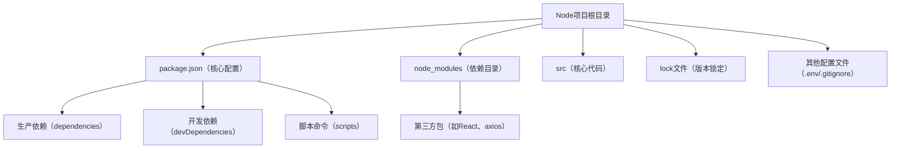
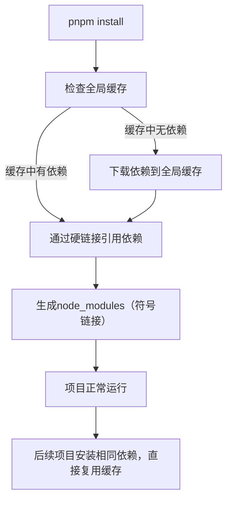

很多前端开发者天天用Node项目开发React、Vue，但未必清楚其本质——先理清Node项目的核心，才能更好理解包管理工具的作用，避免“只会用，不会懂”。

## 1.1 Node项目的来源

Node项目基于**Node.js runtime**（JavaScript运行环境），最初设计用于**后端开发**（替代PHP、Java等），核心目标是“让JavaScript脱离浏览器，在服务器端运行”。

随着前端工程化的兴起（需要打包、构建、依赖管理、脚本运行），Node.js的**模块化规范**（CommonJS/ES Module）和**npm生态**逐渐成为前端项目的“载体”——我们开发的React、Vue项目，本质是“基于Node环境的前端工程化项目”，通过Node环境运行打包（如vite build）、启动开发服务（如vite dev）等操作。

## 1.2 Node项目解决的核心问题

Node项目的出现，核心是解决JavaScript在“非浏览器环境”下的运行和开发痛点，具体分为4点：

- **统一运行环境**：解决JavaScript在不同设备、不同场景下的运行差异，确保代码在本地、测试、生产环境表现一致；

- **模块化开发**：支持CommonJS（require/module.exports）和ES Module（import/export）规范，实现代码拆分与复用，避免全局变量污染；

- **依赖管理**：自动处理第三方包（如React、axios、vite）的安装、更新与版本兼容，无需手动下载和管理；

- **工程化脚本**：通过包管理工具（npm/pnpm）的脚本命令，统一执行打包、启动、测试、部署等操作，提升开发效率。

## 1.3 Node项目的核心结构（必记）

任何Node项目（包括React、Vue项目）的核心标识是**package.json**文件，完整基础结构如下（结合前端工程化补充）：

```bash
src/            # 项目核心代码（React组件、业务逻辑等）
package.json    # 核心配置文件（依赖、脚本、项目信息，灵魂文件）
package-lock.json/pnpm-lock.yaml # 依赖版本锁定文件（确保团队依赖一致）
node_modules/   # 第三方依赖安装目录（由包管理工具自动生成，无需手动修改）
.env            # 环境变量配置（开发/测试/生产环境区分）
.gitignore      # 忽略文件（如node_modules、dist，避免提交到Git）
dist/           # 工程化构建产物（打包后输出目录，用于部署）
```

**关键文件详解（重点）**：

1. `package.json`：核心中的核心，包含项目名称、版本、作者、依赖（生产依赖/开发依赖）、脚本命令等，包管理工具的所有操作都围绕它展开；

2. `node_modules`：第三方依赖的安装目录，存储所有通过npm/pnpm安装的包，体积较大，通常加入.gitignore；

3. `lock文件`：npm对应package-lock.json，pnpm对应pnpm-lock.yaml，用于锁定依赖的具体版本，避免“不同人安装的依赖版本不一致”导致的bug。

**Mermaid 项目结构流程图解**：



---

npm（Node Package Manager）是Node.js内置的包管理工具，无需额外安装，随Node.js一起部署，生态最完善，是前端开发者入门的首选工具。

## 2.1 核心作用

npm的核心作用是**管理依赖**和**运行脚本**，具体包括：安装/卸载/更新第三方包、管理项目依赖版本、执行工程化脚本（如启动服务、打包）。

## 2.2 常用命令（干练版，直接复制使用）

```bash
npm init -y  # -y 表示默认接受所有配置，无需手动输入
npm install  # 缩写 npm i，安装package.json中所有依赖
npm install 包名  # 安装指定包（默认安装到生产依赖dependencies）
npm install 包名 --save-dev  # 缩写 -D，安装到开发依赖devDependencies（如vite、eslint）
npm install 包名@版本号  # 安装指定版本的包（如npm i react@18.2.0）
npm uninstall 包名  # 卸载指定包，并从package.json中移除
npm update 包名  # 更新指定包到最新兼容版本
npm update  # 更新所有依赖到最新兼容版本
npm run 脚本名  # 如npm run dev（启动开发服务）、npm run build（打包）
npm list  # 查看当前项目所有依赖的树形结构
npm info 包名  # 查看指定包的详细信息（版本、依赖、作者等）
```
## 2.3 核心注意点（避坑重点）

- **生产依赖 vs 开发依赖**：生产依赖（dependencies）是项目运行时必须的（如react、axios），开发依赖（devDependencies）是开发时需要的（如打包工具、代码检查工具），上线时无需打包开发依赖；

- **版本号规则**：package.json中依赖版本号格式为「主版本.次版本.修订号」（如18.2.0），^表示兼容次版本更新，~表示兼容修订号更新；

- **package-lock.json**：不要手动修改，它会自动同步npm install/uninstall/update的操作，确保团队成员安装的依赖版本完全一致。

---

pnpm（Performant npm）是新一代包管理工具，核心优势是**速度快、节省空间、严格的依赖管理**，解决了npm的诸多痛点（如依赖冗余、安装速度慢），目前已成为企业级项目的首选。

## 3.1 为什么选择pnpm？（对比npm的核心优势）

|对比维度|npm|pnpm|
|---|---|---|
|**安装速度**|较慢，依赖重复下载|极快，采用“硬链接+符号链接”，依赖只下载一次|
|**空间占用**|较大，不同项目重复存储相同依赖|极小，所有项目共享相同依赖，节省90%空间|
|**依赖管理**|宽松，允许非法依赖访问（扁平化依赖）|严格，只允许访问package.json中声明的依赖，避免隐式依赖|
|**兼容性**|完全兼容Node.js，无额外配置|兼容npm命令，无需修改脚本，只需替换npm为pnpm|
## 3.2 安装与常用命令（与npm兼容，易上手）

### 3.2.1 安装pnpm

```bash
npm install -g pnpm
```
### 3.2.2 常用命令（与npm基本一致，重点记差异）

```bash
pnpm init -y
pnpm install  # 缩写 pnpm i，安装所有依赖
pnpm install 包名  # 安装到生产依赖
pnpm install 包名 --save-dev  # 缩写 -D，安装到开发依赖
pnpm install 包名@版本号  # 安装指定版本
pnpm uninstall 包名
pnpm update 包名
pnpm update
pnpm run 脚本名  # 如pnpm run dev、pnpm run build
pnpm add 包名  # 等价于pnpm install 包名（更简洁）
pnpm remove 包名  # 等价于pnpm uninstall 包名
pnpm list  # 查看依赖树形结构（比npm更清晰）
pnpm store prune  # 清理pnpm缓存，释放空间
```
## 3.3 核心特性解析（关键优势）

1. **硬链接+符号链接**：pnpm将所有依赖下载到全局缓存中，不同项目通过硬链接引用，避免重复下载，极大节省空间和安装时间；

2. **严格的依赖隔离**：pnpm不允许项目访问未在package.json中声明的依赖，避免隐式依赖导致的“本地能跑，线上报错”问题；

3. **兼容npm生态**：无需修改项目配置和脚本，只需将npm命令替换为pnpm，即可无缝迁移，学习成本极低；

4. **内置monorepo支持**：对多包项目（monorepo）支持更友好，可高效管理多个子项目的依赖，适合大型项目。

**Mermaid pnpm依赖管理流程图解**：



---

## 4.1 项目迁移：从npm切换到pnpm（无缝迁移）

```bash
npm install -g pnpm
rm -rf node_modules package-lock.json  # mac/linux
rd /s/q node_modules package-lock.json  # windows
pnpm install
pnpm run dev  # 启动开发服务
pnpm run build  # 打包
```
## 4.2 常见问题解决（避坑指南）

- **依赖安装失败**：清除缓存（npm cache clean --force / pnpm store prune），重新安装；若仍失败，检查网络或镜像源；

- **版本不一致**：删除lock文件和node_modules，重新安装，确保所有人使用相同的包管理工具（统一npm或pnpm）；

- **pnpm安装后报错**：检查Node.js版本（pnpm要求Node.js ≥ 14.19.0），升级Node.js后重新安装。

## 4.3 镜像源配置（提升下载速度）

默认镜像源在国外，下载速度较慢，可配置国内镜像源（如淘宝镜像）：

```bash
npm config set registry https://registry.npm.taobao.org/
pnpm config set registry https://registry.npm.taobao.org/
npm config get registry
pnpm config get registry
```
---


本文摒弃冗余理论，聚焦“实战有用”，从Node项目核心解析，到npm与pnpm的用法、差异、实战技巧，覆盖了前端开发中包管理的所有核心场景。记住：包管理的核心是“版本可控、依赖清晰”，无论使用哪种工具，都要遵循规范，避免依赖混乱。

如果需要具体项目的包管理配置示例（如React项目的package.json配置、pnpm monorepo配置），欢迎留言交流！