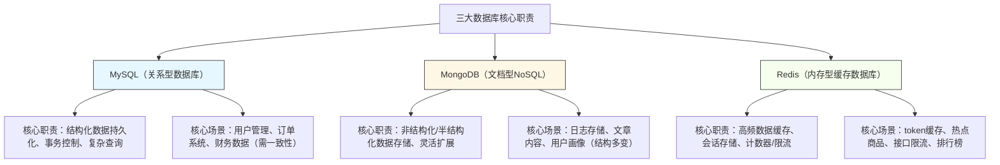

## 一、三大数据库核心定位与开发职责（先分清，再使用）

核心原则：**各司其职、合理搭配**，避免“用错数据库”导致的性能瓶颈或开发冗余。三者的职责边界的清晰，一句话总结：
✅ MySQL：存结构化数据（如用户、订单），负责数据持久化、事务一致性；
✅ MongoDB：存非结构化数据（如日志、文章），负责灵活存储、快速迭代；
✅ Redis：存高频访问数据（如token、热点商品），负责缓存加速、减轻数据库压力。

### 1. 职责对比可视化（一目了然）


### 2. 核心职责详细对比（干练不冗余）

|数据库|核心定位|开发职责|核心优势|核心短板|
|---|---|---|---|---|
|**MySQL**|关系型数据库，结构化存储核心|1. 设计数据表、维护数据关系；2. 实现CRUD及复杂查询；3. 控制事务一致性；4. 优化SQL与索引|事务ACID、结构化查询、数据一致性强、成熟稳定|非结构化数据存储差、高并发下性能瓶颈明显、扩展灵活度低|
|**MongoDB**|文档型NoSQL，非结构化存储核心|1. 设计文档结构、灵活存储多变数据；2. 实现文档的增删改查；3. 优化查询效率、实现分片扩展|结构灵活、易扩展、适合大数据量、查询便捷|事务支持弱（新版本已优化）、复杂关联查询差、数据一致性弱于MySQL|
|**Redis**|内存型缓存数据库，高频数据加速|1. 缓存高频访问数据；2. 实现会话存储、计数器、限流；3. 维护缓存一致性；4. 优化内存使用|读写速度极快、支持多种数据结构、支持分布式、轻量级|内存有限、数据持久化有损耗、不适合大量数据持久化存储|
✅ 核心编程思想：**合适的场景用合适的数据库**，避免“一刀切”——比如用MySQL存日志（冗余且低效）、用Redis存订单（数据易丢失）、用MongoDB存财务数据（一致性不足），都是典型的使用误区。

## 二、三大数据库常用知识点（实战高频，必记必用）

重点抓“实战常用”，剔除冷门知识点，每个数据库只记“能直接落地”的核心内容，搭配使用技巧，拒绝死记硬背。

### （一）MySQL（关系型数据库，核心重点）

#### 1. 核心基础知识点

- **数据类型（高频）**：
        
- 字符串：varchar（可变长度，推荐，如用户名、手机号）、char（固定长度，如身份证号）；
       
- 数值：int（整数，如ID）、bigint（长整数，如订单号）、decimal（小数，如金额，避免float/double精度丢失）；

- 时间：datetime（年月日时分秒，如创建时间）、timestamp（自动更新时间戳）。
      

- **核心约束**：主键（primary key，唯一标识，如id）、外键（foreign key，关联表关系）、非空（not null，必填字段）、唯一（unique，不可重复，如手机号）。

- **索引（性能优化核心）**：
        
- 作用：加速查询，减少全表扫描；
        
- 高频索引：主键索引（默认，最快）、普通索引（单字段，如username）、联合索引（多字段，如user_id+order_time，遵循“最左前缀原则”）；
        
- 避坑：不要过度建索引（插入/更新会变慢），不要给小表、高频更新字段建索引。


- **事务（ACID）**：
        
- 核心：原子性（要么全成，要么全败）、一致性、隔离性、持久性；
        
- 常用隔离级别：RR（Repeatable Read，MySQL默认，避免脏读、不可重复读）。


#### 2. 实战高频SQL（直接复制使用）

```sql
-- 1. 建表（用户表，含索引、约束）
CREATE TABLE sys_user (
    id BIGINT PRIMARY KEY AUTO_INCREMENT COMMENT '主键ID',
    username VARCHAR(50) NOT NULL UNIQUE COMMENT '用户名',
    phone VARCHAR(11) NOT NULL UNIQUE COMMENT '手机号',
    password VARCHAR(100) NOT NULL COMMENT '密码（加密存储）',
    status TINYINT DEFAULT 1 COMMENT '状态：1正常，0禁用',
    create_time DATETIME DEFAULT CURRENT_TIMESTAMP COMMENT '创建时间',
    INDEX idx_username (username) -- 普通索引
) ENGINE=InnoDB DEFAULT CHARSET=utf8mb4 COMMENT='系统用户表';

-- 2. 高频查询（分页+条件，最常用）
SELECT id, username, phone, status FROM sys_user 
WHERE status = 1 
ORDER BY create_time DESC 
LIMIT 10 OFFSET 0; -- 第1页，每页10条

-- 3. 事务示例（新增用户+新增用户角色关联，原子性）
START TRANSACTION;
INSERT INTO sys_user (username, phone, password) VALUES ('test', '13800138000', '123456');
INSERT INTO sys_user_role (user_id, role_id) VALUES (LAST_INSERT_ID(), 1);
COMMIT; -- 提交事务
-- ROLLBACK; -- 异常时回滚

-- 4. 索引优化查询（避免全表扫描）
EXPLAIN SELECT * FROM sys_user WHERE username = 'test'; -- 查看执行计划，确保用到idx_username索引
```

#### 3. 开发创意与避坑

- ✅ 创意1：密码存储用**加密+盐值**（如BCrypt加密），避免明文存储，示例：`BCrypt.hashpw(password, BCrypt.gensalt())`；

- ✅ 创意2：大表分表（如订单表按时间分表：order_202401、order_202402），避免单表数据量过大导致查询缓慢；

- ❌ 避坑1：不要用select * （冗余字段，增加IO压力），明确查询需要的字段；

- ❌ 避坑2：避免在where条件中使用函数（如where DATE(create_time) = '2024-01-01'），会导致索引失效；

- ❌ 避坑3：金额字段用decimal(10,2)，不要用float/double（会出现0.01精度丢失问题）。

### （二）MongoDB（文档型NoSQL，灵活高效）

#### 1. 核心基础知识点

- **核心概念**：数据库（database）→ 集合（collection，类似MySQL的表）→ 文档（document，类似MySQL的行，JSON格式）；

- **数据类型（高频）**：String（字符串）、Number（数值）、Date（时间）、Array（数组，如用户标签）、ObjectId（主键，自动生成）；

- **核心特性**：
        
- 无固定 schema（结构灵活，可随时新增字段，无需修改集合结构）；
- 支持嵌入式文档（如用户文档中嵌入地址信息，无需关联表）；
        
- 支持分片（横向扩展，应对大数据量）。
      

- **索引**：主键索引（ObjectId，默认）、普通索引（单字段）、复合索引（多字段）、数组索引（针对数组字段）。

#### 2. 实战高频操作（MongoDB Shell / Java API）

```javascript
// 1. 连接数据库，创建集合（文档：文章表）
use blog; // 切换到blog数据库（不存在则自动创建）
db.createCollection("article"); // 创建article集合

// 2. 新增文档（插入一篇文章，结构灵活，可随时新增字段）
db.article.insertOne({
    title: "三大数据库实战总结",
    content: "MySQL、MongoDB、Redis实战技巧...",
    author: "test",
    tags: ["MySQL", "MongoDB", "Redis"], // 数组类型
    createTime: new Date(),
    readCount: 0,
    status: 1 // 1-发布，0-草稿
});

// 3. 高频查询（条件+分页，最常用）
// 查询标签包含MySQL、状态为发布的文章，分页（第1页，每页10条）
db.article.find({
    tags: "MySQL",
    status: 1
}).skip(0).limit(10).sort({createTime: -1}); // -1降序，1升序

// 4. 更新文档（更新阅读量，自增1）
db.article.updateOne(
    {_id: ObjectId("661a7f8b9c8d7e6f5a4b3c2d")}, // 条件：根据主键
    {$inc: {readCount: 1}} // 自增操作
);

// 5. 删除文档（逻辑删除，推荐，避免物理删除）
db.article.updateOne(
    {_id: ObjectId("661a7f8b9c8d7e6f5a4b3c2d")},
    {$set: {status: 0}}
);
```

Java API核心示例（Spring Data MongoDB）：

```java
// 1. 实体类（无需固定字段，灵活扩展）
@Document(collection = "article")
@Data
public class Article {
    @Id
    private ObjectId id;
    private String title;
    private String content;
    private String author;
    private List<String> tags;
    private Date createTime;
    private Integer readCount;
    private Integer status;
    // 可随时新增字段，无需修改集合结构
}

// 2. Repository（简化CRUD）
public interface ArticleRepository extends MongoRepository<Article, ObjectId> {
    // 自定义查询：根据标签和状态查询，分页
    Page<Article> findByTagsContainingAndStatus(String tag, Integer status, Pageable pageable);
}
```

#### 3. 开发创意与避坑

- ✅ 创意1：嵌入式文档替代关联表（如用户文档嵌入地址、联系方式），减少关联查询，提升效率；

- ✅ 创意2：日志存储用MongoDB，按日期分集合（如log_202405、log_202406），便于清理和查询；

- ❌ 避坑1：不要用MongoDB存储需要强事务、强一致性的数据（如财务数据）；

- ❌ 避坑2：不要过度使用嵌入式文档（如嵌套过深，会导致查询和更新繁琐）；

- ❌ 避坑3：大数据量场景下，必须创建索引（否则查询会全集合扫描，效率极低）。

### （三）Redis（内存型缓存，高频加速）

#### 1. 核心基础知识点

- **核心特性**：内存存储（读写速度极快，10万+ QPS）、支持多种数据结构、支持持久化、支持分布式、支持过期时间；

- **高频数据结构（必记，实战核心）**：
        
- String（字符串）：存储token、热点商品信息、计数器（最常用）；
        
- Hash（哈希）：存储对象（如用户信息，key=userId，value=哈希表，避免String序列化）；
        
- List（列表）：存储消息队列、最新消息列表；
        
- Set（集合）：存储不重复数据（如用户标签、好友列表）；
        
- Sorted Set（有序集合）：存储排行榜、计分排名（如商品销量排行）。
      

- **持久化（避免数据丢失）**：
        
- RDB（快照）：定时备份全量数据，恢复快，适合备份；
        
- AOF（日志）：记录所有写操作，实时备份，数据丢失少，推荐生产环境开启。
      

- **过期策略**：支持给key设置过期时间（如token过期1小时），过期后自动删除，避免内存溢出。

#### 2. 实战高频操作（Redis Shell / Java API）

```bash
SET user:token:123 "eyJhbGciOiJIUzI1NiIsInR5cCI6IkpXVCJ9..." EX 3600
GET user:token:123 # 获取token
DEL user:token:123 # 删除token
INCR article:readCount:1 # 计数器自增（文章阅读量）
HSET user:info:1 username "test" phone "13800138000" status 1
HGET user:info:1 username # 获取用户名
HGETALL user:info:1 # 获取所有用户信息
ZADD goods:sales 100 1001 # 商品1001销量100
ZADD goods:sales 200 1002 # 商品1002销量200
ZRANGE goods:sales 0 9 WITHSCORES # 获取前10名，带销量
EXPIRE user:info:1 86400 # 设置key过期时间为1天
TTL user:info:1 # 查看剩余过期时间（-2表示已过期）
```
Java API核心示例（Spring Data Redis）：

```java
// 1. String类型操作（token存储）
@Autowired
private StringRedisTemplate redisTemplate;

// 存储token，过期1小时
redisTemplate.opsForValue().set("user:token:123", "eyJhbGciOiJIUzI1NiIsInR5cCI6IkpXVCJ9...", 1, TimeUnit.HOURS);

// 获取token
String token = redisTemplate.opsForValue().get("user:token:123");

// 2. Hash类型操作（用户信息存储）
HashOperations<String, String, Object> hashOps = redisTemplate.opsForHash();
hashOps.put("user:info:1", "username", "test");
hashOps.put("user:info:1", "phone", "13800138000");
// 获取所有用户信息
Map<String, Object> userInfo = hashOps.entries("user:info:1");
```

#### 3. 开发创意与避坑

- ✅ 创意1：缓存穿透防护（缓存不存在的key，设置短期过期时间，避免频繁查询MySQL）；

- ✅ 创意2：热点商品缓存（将高频访问的商品信息缓存到Redis，设置过期时间，定期更新，减轻MySQL压力）；

- ✅ 创意3：接口限流（用Redis的计数器+过期时间，限制单个IP每秒请求次数，如INCR ip:limit:192.168.1.1，超过阈值拒绝请求）；

- ❌ 避坑1：不要用Redis存储大量数据（内存有限，成本高），仅存储高频访问数据；

- ❌ 避坑2：缓存一致性（修改MySQL数据后，同步更新Redis，避免缓存与数据库数据不一致）；

- ❌ 避坑3：不要设置过长的过期时间（会导致内存溢出），根据业务场景合理设置（如token1小时，热点商品10分钟）。

## 三、三大数据库实战搭配（企业级常用，直接落地）

实战中，三者并非孤立使用，而是**协同搭配**，发挥各自优势，以下是企业级项目中最常用的搭配场景，融入编程思想，让代码更高效、更可维护。

### 1. 搭配场景1：用户系统（MySQL+Redis）

- MySQL：存储用户基本信息（sys_user表）、角色权限（sys_role表），负责事务一致性（如用户注册、权限分配）；

- Redis：缓存用户token（String类型）、用户权限信息（Hash类型），减少MySQL查询压力；

- 流程：用户登录 → 验证账号密码（MySQL） → 生成token → 缓存token和用户权限（Redis） → 后续请求验证token（Redis）。

### 2. 搭配场景2：文章博客系统（MySQL+MongoDB+Redis）

- MySQL：存储用户信息、文章分类、评论关联（结构化数据，需一致性）；

- MongoDB：存储文章内容、用户评论（非结构化/半结构化，结构多变，便于扩展）；

- Redis：缓存热点文章、文章阅读量计数器、用户会话（高频访问数据，加速访问）；

- 流程：用户发布文章 → 基本信息存MySQL，内容存MongoDB → 缓存文章到Redis → 阅读文章时，Redis计数器自增，优先从Redis获取文章。

### 3. 搭配场景3：电商系统（MySQL+Redis）

- MySQL：存储商品基本信息、订单数据、用户地址（结构化数据，需事务一致性）；

- Redis：缓存热点商品、购物车、订单状态、接口限流（高频访问数据，加速访问）；

- 流程：用户浏览商品 → 优先从Redis获取热点商品 → 加入购物车（Redis） → 下单（MySQL事务） → 更新Redis购物车和订单状态。

### 核心编程思想：缓存分层+数据分类

1. 缓存分层：Redis（一级缓存，内存，最快）→ MySQL（二级缓存，磁盘，持久化），优先从Redis获取数据，未命中再查MySQL，查询后同步缓存到Redis；

2. 数据分类：结构化、需一致性的数据存MySQL，非结构化、多变的数据存MongoDB，高频访问、无需持久化（或可恢复）的数据存Redis；

3. 高可用设计：MySQL主从复制（读写分离）、Redis集群（避免单点故障）、MongoDB分片（应对大数据量）。

## 四、核心总结（干练收尾，必记重点）

1. 职责区分：MySQL管结构化+事务，MongoDB管非结构化+灵活，Redis管高频+缓存，三者协同，各司其职；

2. 核心重点：MySQL记索引、事务、SQL优化；MongoDB记文档结构、灵活操作；Redis记数据结构、缓存策略；

3. 实战搭配：根据数据类型和访问频率选择数据库，高频数据用Redis缓存，结构化数据用MySQL，非结构化用MongoDB；

4. 开发创意：加密存储、分表分集合、缓存防护、接口限流，这些技巧能直接提升项目性能和安全性；

5. 避坑核心：不要用错数据库场景，不要忽视缓存一致性，不要过度使用某一种数据库，平衡性能与稳定性。

三大数据库是后端开发的“基石”，掌握它们的核心知识点和实战搭配，能应对绝大多数业务场景，提升开发效率和项目性能——好的技术选型+正确的使用方法，才能让项目更稳定、更高效。