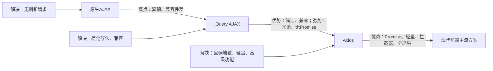

在AJAX出现之前，前端与后端的交互只能通过“页面刷新”实现——用户提交表单、请求数据，都会触发整个页面重新加载，体验极差。AJAX的诞生，彻底改变了这一现状，开启了“无刷新交互”的时代。

## 1.1 技术来源

AJAX（Asynchronous JavaScript and XML），即“异步JavaScript和XML”，由Jesse James Garrett在2005年提出，并非一门新语言，而是一种**前端请求技术方案**。其核心依托于浏览器内置的 `XMLHttpRequest` 对象（后续新增 `Fetch API`），实现“异步请求数据、局部更新页面”，无需刷新整个页面。

最初AJAX主要用于传输XML格式数据（因此命名），后来随着JSON的兴起，逐渐替代XML成为主流数据格式，但“AJAX”这一名称被沿用至今。

## 1.2 核心解决的问题

- **解决页面刷新痛点**：打破“请求数据必须刷新页面”的局限，实现局部更新（如百度搜索联想、淘宝商品筛选），提升用户体验；

- **实现异步通信**：请求数据时，浏览器无需等待后端响应，可继续执行其他JS逻辑，避免页面“卡死”；

- **减少网络传输压力**：仅请求需要的数据，而非整个页面的HTML，降低网络开销，提升请求速度。

## 1.3 核心用法（原生写法，凸显繁琐）

原生AJAX依赖 `XMLHttpRequest` 对象，配置繁琐、代码冗余，这也是后续jQuery出现的核心原因，示例如下：

```javascript
// 原生AJAX GET请求
const xhr = new XMLHttpRequest();
// 配置请求（请求方式、请求地址、是否异步）
xhr.open('GET', 'https://api.example.com/data', true);
// 监听请求状态变化
xhr.onreadystatechange = function() {
  // readyState === 4 表示请求完成，status === 200 表示请求成功
  if (xhr.readyState === 4 && xhr.status === 200) {
    // 解析响应数据（最初为XML，后来常用JSON）
    const data = JSON.parse(xhr.responseText);
    console.log('请求成功：', data);
  } else if (xhr.readyState === 4) {
    console.log('请求失败：', xhr.status);
  }
};
// 发送请求
xhr.send();
```

**核心痛点**：配置繁琐（需手动处理请求状态、错误、数据解析）、兼容性差（不同浏览器对XMLHttpRequest的支持有差异）、代码复用性低。

---

jQuery诞生于2006年，核心定位是“简化前端开发”——解决原生JS（包括AJAX）的繁琐写法、浏览器兼容性问题。在前端框架（Vue、React）出现之前，jQuery几乎垄断了前端开发，而其AJAX封装，更是成为当时的“标配”。但随着前端工程化的发展，jQuery逐渐被淘汰，成为前端人心中的“时代眼泪”。

## 2.1 技术来源

jQuery由John Resig开发，核心理念是“Write Less, Do More”（写更少的代码，做更多的事）。其AJAX模块，本质是**对原生XMLHttpRequest的封装**，简化了请求配置、状态监听、错误处理、数据解析等流程，同时解决了不同浏览器的兼容性问题，让开发者无需关注底层实现，只需调用简单的API即可完成请求。

## 2.2 核心解决的问题

- **简化AJAX写法**：用简洁的API（如 `$.ajax()`、`$.get()`、`$.post()`）替代原生AJAX的繁琐配置，大幅提升开发效率；

- **解决浏览器兼容性**：统一处理不同浏览器（如IE、Chrome、Firefox）对XMLHttpRequest的差异，开发者无需手动兼容；

- **整合DOM操作与请求**：jQuery同时封装了DOM操作、事件绑定等功能，可实现“请求数据+更新DOM”的一站式开发（如请求成功后直接渲染页面）。

## 2.3 核心用法（简洁封装，当年的“神器”）

```javascript
// jQuery AJAX GET请求（最简写法）
$.get('https://api.example.com/data', function(data) {
  // 自动解析JSON数据，无需手动JSON.parse()
  console.log('请求成功：', data);
}).fail(function(err) {
  // 统一错误处理
  console.log('请求失败：', err);
});

// 完整配置写法（支持更多参数）
$.ajax({
  url: 'https://api.example.com/data',
  type: 'GET', // 请求方式
  dataType: 'json', // 预期响应数据类型
  success: function(data) {
    console.log('请求成功：', data);
  },
  error: function(err) {
    console.log('请求失败：', err);
  }
});
```

## 2.4 为什么成“时代眼泪”？（核心取舍）

jQuery的衰落，并非自身不好，而是**适配不了现代前端工程化的发展**，核心原因有3点：

1. **功能冗余**：jQuery整合了AJAX、DOM操作、事件绑定等所有功能，而现代前端框架（Vue、React）已内置DOM操作、状态管理，仅需“请求功能”，引入jQuery会造成代码冗余、体积过大；

2. **不支持Promise**：jQuery的AJAX基于回调函数，在处理多接口联动（如先请求A接口，再用A的结果请求B接口）时，会出现“回调地狱”，而现代前端更倾向于用Promise、async/await解决异步问题；

3. **适配性不足**：无法很好地适配现代前端工程化（如Webpack打包、TS类型支持），也不支持拦截器、请求取消等高级功能，满足不了中大型项目的需求。

**总结**：jQuery是特定时代的“最优解”，解决了原生AJAX的痛点，但随着前端工程化和框架的兴起，其“大而全”的特点反而成为劣势，最终被更轻量、更现代的Axios替代。

---

Axios诞生于2014年，由Matt Zabriskie开发，是一款基于Promise的HTTP客户端，可在浏览器和Node.js中使用。它既保留了jQuery AJAX的简洁性，又解决了其痛点，适配现代前端工程化，成为当前Vue、React等框架的“标配请求工具”。

## 3.1 技术来源

Axios的核心是**基于原生XMLHttpRequest封装**（浏览器端）和Node.js的 `http` 模块（服务端），同时融入了现代前端的异步解决方案——Promise，弥补了jQuery AJAX回调函数的缺陷。其设计理念是“轻量、高效、可扩展”，专注于请求功能，不冗余其他无关功能，适配现代前端工程化的需求。

## 3.2 核心解决的问题

- **解决回调地狱**：基于Promise，支持async/await语法，可优雅处理多接口联动，代码更简洁、易维护；

- **轻量无冗余**：仅专注于HTTP请求功能，体积小（约10KB），无需引入多余的DOM操作、事件绑定等功能，适配现代框架；

- **支持高级功能**：内置请求/响应拦截器、请求取消、超时处理、请求重试等功能，满足中大型项目的复杂需求；

- **全环境适配**：同时支持浏览器端和Node.js端，可实现“前后端请求逻辑复用”，无需单独适配；

- **类型友好**：支持TypeScript，可提供完整的类型提示，减少开发中的类型错误。

## 3.3 核心用法（现代简洁，直接复用）

```javascript
// 1. 安装Axios（Node项目中）
// npm install axios / pnpm install axios

// 2. 基础GET请求
import axios from 'axios';

axios.get('https://api.example.com/data')
  .then(response => {
    // 响应数据自动解析，可直接获取response.data
    console.log('请求成功：', response.data);
  })
  .catch(error => {
    console.log('请求失败：', error);
  });

// 3. 用async/await优化（推荐，更简洁）
async function fetchData() {
  try {
    const response = await axios.get('https://api.example.com/data');
    console.log('请求成功：', response.data);
  } catch (error) {
    console.log('请求失败：', error);
  }
}

// 4. 核心高级功能：请求拦截器（统一添加Token）
axios.interceptors.request.use(
  config => {
    // 所有请求统一添加Authorization请求头
    const token = localStorage.getItem('token');
    if (token) {
      config.headers.Authorization = `Bearer ${token}`;
    }
    return config;
  },
  error => Promise.reject(error)
);
```

## 3.4 核心优势（对比AJAX、jQuery）

**Mermaid 三者演进与对比流程图解**：



|对比维度|原生AJAX|jQuery AJAX|Axios|
|---|---|---|---|
|**写法简洁度**|繁琐（需手动配置所有步骤）|简洁（API封装）|极简洁（Promise+async/await）|
|**异步处理**|回调函数（易出回调地狱）|回调函数（部分支持Promise）|Promise+async/await（优雅解决异步）|
|**高级功能**|无（需手动实现）|基础（无拦截器、取消请求）|完善（拦截器、取消、超时、重试）|
|**体积**|无额外体积（原生API）|较大（需引入整个jQuery）|轻量（约10KB，仅请求功能）|
|**现代适配**|差（不支持TS、工程化）|差（冗余、无TS支持）|好（支持TS、工程化、框架适配）|
---


1. 原生AJAX：解决“无刷新请求”的核心痛点，奠定前端异步交互的基础，但写法繁琐、兼容性差；

2. jQuery AJAX：解决原生AJAX的繁琐和兼容性问题，成为早期前端的“神器”，但随着工程化发展，冗余、无Promise的缺陷凸显；

3. Axios：吸收前两者的优势，解决回调地狱、冗余等痛点，适配现代前端框架和工程化需求，成为当前主流。

没有“最好”的技术，只有“最适配”的技术——原生AJAX适合理解底层原理，jQuery适合 legacy 老项目维护，Axios适合现代前端开发。理解三者的来源和解决的问题，才能在实际开发中做出正确选择，避免盲目跟风。

如果需要Axios实战配置示例（如全局封装、请求重试、取消请求），或老项目jQuery AJAX迁移到Axios的方案，欢迎留言交流！