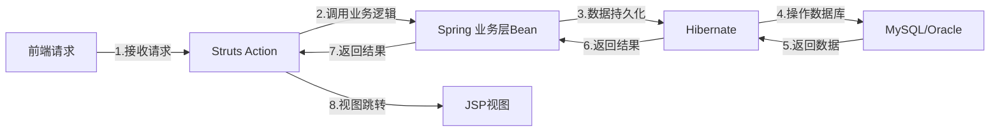
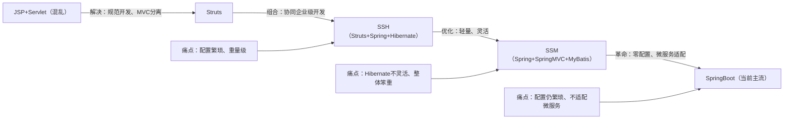

在Struts出现之前，Java Web开发处于“混乱无序”的状态——开发者用JSP+Servlet混合开发，视图与业务逻辑、请求处理代码混杂在一起，代码冗余、维护困难、可扩展性差。Struts的诞生，首次将MVC设计模式标准化落地到Java Web开发中，成为早期Java Web项目的“标配框架”，但随着技术发展，其繁琐、笨重的缺陷逐渐凸显，最终被更优秀的框架替代，成为Java开发者心中的“时代眼泪”。

## 1.1 时代背景与技术来源

2000年前后，Java Web开始在企业级开发中普及，但彼时没有统一的开发规范，JSP与Servlet的混合开发模式导致项目维护成本极高：Servlet负责接收请求、处理业务逻辑，JSP负责渲染视图，但开发者常常在JSP中嵌入大量Java代码，或在Servlet中编写视图渲染逻辑，代码耦合度极高。

Struts应运而生，它由Apache软件基金会开发，基于**MVC（Model-View-Controller）设计模式**，本质是“对JSP+Servlet的封装与规范”，核心灵感来源于当时的JavaServer Faces（JSF）草案，目的是“分离视图、控制、模型”，让Java Web开发更规范、更易维护。

Struts先后推出两个主要版本：Struts 1（2001年）和Struts 2（2007年），Struts 2基于WebWork框架重构，解决了Struts 1的线程安全、配置繁琐等部分痛点，但核心设计理念未发生本质变化。

## 1.2 核心解决的问题

Struts的核心价值，是**将MVC设计模式标准化**，解决JSP+Servlet开发的混乱问题，具体分为3点：

- **解耦视图与逻辑**：将视图（JSP）、请求控制（Action）、业务模型（Model）分离，JSP仅负责渲染视图，Action负责接收请求、调用业务逻辑，Model负责封装数据，避免代码混杂；

- **统一请求处理**：通过配置文件（struts.xml）统一管理请求映射，无需在Servlet中手动编写请求路径映射，简化请求处理流程；

- **提供基础功能封装**：内置表单验证、拦截器、国际化等基础功能，开发者无需重复开发，提升开发效率（如表单数据自动封装到JavaBean）。

## 1.3 核心用法（凸显当时的优势与后来的繁琐）

Struts的核心依赖配置文件（struts.xml）和Action类，以下是Struts 2的最简示例，感受其配置风格：

```xml
// 1. struts.xml 配置文件（核心配置，请求映射、视图跳转）
<?xml version="1.0" encoding="UTF-8"?>
<!DOCTYPE struts PUBLIC
        "-//Apache Software Foundation//DTD Struts Configuration 2.5//EN"
        "http://struts.apache.org/dtds/struts-2.5.dtd">
<struts>
    <package name="user" namespace="/user" extends="struts-default">
        // 请求映射：/user/login 对应 LoginAction
        <action name="login" class="com.example.action.LoginAction" method="login">
            // 登录成功跳转视图
            <result name="success">/success.jsp</result>
            // 登录失败跳转视图
            <result name="error">/error.jsp</result>
        </action>
    </package>
</struts>
```

```java
// 2. LoginAction 类（处理请求、调用业务逻辑）
public class LoginAction extends ActionSupport {
    // 表单数据自动封装（与JSP表单name对应）
    private String username;
    private String password;

    // 业务逻辑方法（与struts.xml中method对应）
    public String login() {
        // 调用业务层逻辑
        UserService userService = new UserService();
        boolean flag = userService.login(username, password);
        // 返回结果，对应struts.xml中的result
        return flag ? SUCCESS : ERROR;
    }

    // getter/setter 方法（必须，否则无法封装表单数据）
    public String getUsername() { return username; }
    public void setUsername(String username) { this.username = username; }
    public String getPassword() { return password; }
    public void setPassword(String password) { this.password = password; }
}
```

## 1.4 为什么成“时代眼泪”？（核心缺陷）

Struts的衰落，并非自身毫无价值，而是**适配不了企业级开发的升级需求**，核心缺陷有4点，也是被SpringMVC替代的关键：

1. **配置繁琐冗余**：核心依赖struts.xml、web.xml等多个配置文件，请求映射、视图跳转、拦截器等都需要手动配置，项目越大，配置文件越复杂，维护成本极高；

2. **重量级设计**：Struts依赖大量第三方jar包，配置复杂，启动速度慢，占用资源多，适配不了轻量级项目的需求；

3. **灵活性差**：Action类必须继承ActionSupport，请求处理逻辑被框架束缚，自定义扩展难度大，无法适配复杂业务场景；

4. **安全与性能问题**：Struts 2曾出现多个严重安全漏洞（如OGNL表达式注入），且底层设计老旧，性能不如后来的SpringMVC，跟不上现代Java Web的发展节奏。

---

在Struts盛行的时代，企业级Java Web项目需要解决“请求处理、业务逻辑、数据持久化”三大核心问题，因此形成了经典的**SSH框架组合**——Struts（请求控制）+ Spring（依赖注入、事务管理）+ Hibernate（数据持久化），成为2010-2015年企业级开发的“黄金组合”。但随着技术演进，SSH的“重量级、不灵活”缺陷凸显，最终被更轻量、更灵活的**SSM组合**（Spring + SpringMVC + MyBatis）替代。

## 2.1 SSH组合的技术逻辑与核心价值

SSH组合的核心是“各司其职、协同工作”，三者分工明确，解决了企业级项目的核心痛点：

- **Struts**：负责请求接收、视图跳转，作为MVC中的Controller层，统一处理前端请求；

- **Spring**：负责依赖注入（DI）、面向切面编程（AOP）、事务管理，解耦业务组件，简化代码，提升可维护性；

- **Hibernate**：负责数据持久化，是一款全ORM（对象关系映射）框架，无需编写SQL，通过JavaBean与数据库表映射，简化数据库操作。

**Mermaid SSH组合工作流程图解**：



## 2.2 SSH组合的核心痛点（被SSM替代的原因）

SSH组合虽然解决了企业级项目的协同开发问题，但随着项目复杂度提升，其缺陷逐渐暴露，核心痛点有2点：

1. **Hibernate灵活性不足**：全ORM框架虽然简化了基础CRUD操作，但对于复杂SQL（如多表关联、复杂查询），自定义难度大，性能优化困难，无法满足企业级复杂业务的需求；

2. **整体重量级**：Struts + Spring + Hibernate三者都需要大量配置文件，项目启动慢、占用资源多，开发和维护成本极高，适配不了轻量级项目和快速迭代的需求。

## 2.3 SSM组合：SSH的“优化版”，过渡性主流

SSM组合（Spring + SpringMVC + MyBatis）的出现，核心是“优化SSH的痛点”，保留Spring的核心优势，用更轻量、更灵活的框架替代Struts和Hibernate：

- **SpringMVC 替代 Struts**：SpringMVC是Spring框架的一部分，无需额外引入大量jar包，配置更简洁（支持注解配置），灵活性更高，性能更优，完美解决Struts的配置繁琐、重量级问题；

- **MyBatis 替代 Hibernate**：MyBatis是一款“半ORM框架”，支持SQL自定义，既保留了ORM的便捷性（JavaBean与数据库映射），又具备SQL的灵活性，便于复杂查询和性能优化，解决了Hibernate的灵活性不足问题；

- **Spring 核心不变**：继续承担依赖注入、事务管理、AOP等核心功能，保证框架的稳定性和可扩展性。

**核心优势**：轻量、灵活、配置简洁、性能优异，既解决了SSH的痛点，又保留了企业级开发的核心能力，成为2015-2020年Java Web开发的主流组合。

---

SSM组合虽然解决了SSH的痛点，但依然存在“配置繁琐”的问题——即使使用注解配置，依然需要配置Spring、SpringMVC、MyBatis的核心参数，对于新手不友好，且项目搭建效率低。SpringBoot的诞生，彻底解决了“配置繁琐”的痛点，实现“零配置启动”，不仅替代了Struts，更逐步替代了SSM组合，成为当前Java Web开发的绝对主流。

## 3.1 技术来源与核心理念

SpringBoot由Pivotal团队（后被VMware收购）于2014年推出，核心是“**约定优于配置（Convention Over Configuration）**”，本质是“对Spring、SpringMVC、MyBatis等框架的自动封装”，无需手动配置大量参数，通过内置默认配置，实现“一键搭建项目、零配置启动”。

SpringBoot的核心优势的是“简化开发、快速迭代”，它整合了Java Web开发的所有常用组件（如Spring、SpringMVC、MyBatis、Tomcat），内置内嵌容器，无需手动部署，大幅提升开发和部署效率。

## 3.2 核心解决的问题（替代Struts、SSM的关键）

- **解决配置繁琐痛点**：内置默认配置，无需手动配置Spring、SpringMVC、MyBatis等框架的核心参数，通过注解即可完成配置，新手也能快速搭建项目；

- **简化项目搭建与部署**：内置内嵌Tomcat容器，无需手动部署到外部容器，直接运行jar包即可启动项目，部署效率大幅提升；

- **整合生态，降低学习成本**：整合了Java Web开发的所有常用组件（如数据库连接池、缓存、日志），无需手动引入依赖，统一版本管理，避免版本冲突；

- **适配微服务架构**：SpringBoot轻量、可独立部署的特性，完美适配微服务架构（当前企业级开发的主流架构），而Struts、SSM均无法很好地适配微服务。

## 3.3 核心用法（对比Struts，凸显简洁）

SpringBoot的核心是“零配置”，以下是一个简单的接口开发示例，对比Struts的繁琐配置，感受其优势：

```java
// 1. 启动类（一键启动，无需配置web.xml）
@SpringBootApplication
public class SpringBootDemoApplication {
    public static void main(String[] args) {
        SpringApplication.run(SpringBootDemoApplication.class, args);
    }
}

// 2. 接口开发（替代Struts的Action，无需配置struts.xml）
@RestController
@RequestMapping("/user")
public class UserController {
    // 注入业务层Bean（Spring自动依赖注入，无需手动new）
    @Autowired
    private UserService userService;

    // 请求映射（注解配置，替代struts.xml的请求映射）
    @PostMapping("/login")
    public Result login(@RequestParam String username, @RequestParam String password) {
        boolean flag = userService.login(username, password);
        return flag ? Result.success("登录成功") : Result.error("登录失败");
    }
}
```

## 3.4 框架演进对比（Struts→SSH→SSM→SpringBoot）

**Mermaid 框架演进流程图解**：



|对比维度|Struts|SSH|SSM|SpringBoot|
|---|---|---|---|---|
|**配置复杂度**|极高（多配置文件）|极高（三者均需配置）|中等（注解+少量配置）|极低（零配置，约定优于配置）|
|**灵活性**|差（被框架束缚）|中等（Hibernate不灵活）|高（MyBatis支持自定义SQL）|极高（可自定义配置，适配各类场景）|
|**重量级**|重量级（依赖多、启动慢）|极重量级（三者依赖叠加）|轻量级（依赖简洁）|轻量级（内置容器、依赖自动管理）|
|**现代适配**|差（不支持微服务、安全漏洞多）|差（笨重、不适配微服务）|中等（适配传统项目，微服务需额外配置）|好（完美适配微服务、云原生）|
|**当前应用场景**|legacy老项目维护|老旧企业级项目维护|传统Java Web项目（少量使用）|企业级开发、微服务（绝对主流）|
---


1. Struts：解决JSP+Servlet的混乱问题，将MVC设计模式标准化，是Java Web MVC的“开拓者”，但配置繁琐、重量级，最终成为时代眼泪；

2. SSH：解决企业级项目的协同开发问题，成为早期企业级标配，但Hibernate不灵活、整体笨重，被SSM替代；

3. SSM：优化SSH的痛点，轻量、灵活，适配传统企业级项目，但仍存在配置繁琐问题，是过渡性主流；

4. SpringBoot：解决所有框架的“配置痛点”，实现零配置、快速部署，适配微服务架构，成为当前绝对主流。

没有“过时”的技术，只有“不适配”的场景——Struts、SSH、SSM虽然不再是主流，但仍有大量老项目在使用，理解它们的技术逻辑和痛点，才能更好地掌握当前的SpringBoot，也能更高效地维护老项目。