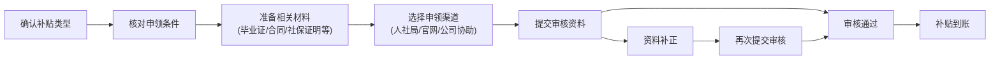

## 一、优质求职渠道大盘点，央企国企/优质企业任你选

求职的第一步是找对渠道，不同平台定位不同，针对性投递能大幅提升成功率，尤其想进**央企、国企**的同学，重点锁定以下官方/专业平台：

### 1. 官方权威就业平台

- **中国公共招聘网**：<[http://job.mohrss.gov.cn/>](http://job.mohrss.gov.cn/%3E)

覆盖**央企、国企、外企**全类型企业，岗位涵盖实习、教师、会计、工程技术、医疗等多个领域，同时更新全国各省市招聘会、事业单位公开招聘信息，吉林地区的招聘信息也可在此查询。

- **国家大学生就业服务平台**：<[https://vy.ncss.cn/>](https://vy.ncss.cn/%3E)

24365大学生就业服务平台核心入口，有中国银行、招商银行等名企校招信息，标注清晰的工作地点、学历要求、薪资范围，还有热门企业专栏，涵盖国企、上市公司、民营企业等不同类型。

- **国聘行动**：<[https://www.iguopin.com/>](https://www.iguopin.com/%3E)

主打**国聘高端**岗位，配套招聘日历、求职服务、国聘公考等功能，是瞄准国企、优质企业的重要渠道。

### 2. 精准细分求职入口

- **应届生职位汇（小程序）**：微信端专属，聚焦**央企、国企**岗位，适配应届生求职需求，随时随地可刷岗投递。

- **吉林本地招聘查询**：微信搜索**吉林 8 月份 招聘**，可获取吉林本地最新、最精准的招聘信息，贴合地域求职需求。

### 3. 企业名单参考，瞄准优质雇主

求职时可先锁定吉林本地优质企业，精准投递：

- **吉林省专精特新中小企业名单**：这类企业具备创新能力和发展潜力，岗位稳定性和发展空间俱佳；

- **吉林省100强企业名单**：吉林本地头部企业，涵盖各行业龙头，福利待遇、企业规模更有保障。

### 4. 行业资讯平台，把握求职趋势

想了解行业动态、优质企业融资/发展信息，可关注**360氪**、**IT橘子**，提前了解目标行业和企业的发展前景，让求职更有方向。

## 二、应届生专属现金补贴，六笔钱别错过！

应届生有专属的各类现金补贴，总额可达五位数，只要满足条件就能申领，错过真的亏！以下是核心补贴的申领条件和要点，**基层就业补贴**/**租房补贴**/**人才补贴**为重点申领项，务必记牢！

### 1. 基层就业补贴

**核心要点**：<u>大专及以上学历</u>，毕业两年内就业，入职**中小微企业/基层单位**，签订**一年以上劳动合同**且**社保缴纳满6个月**，**机关单位/编制内人员不可申领**。

**补贴金额**：3000元左右

**申领渠道**：当地人社局（线上办理/线下携带身份证、毕业证、劳动合同、社保缴纳证明办理）。

### 2. 租房补贴

**核心要点**：新一线城市（杭州、深圳、南京、成都、武汉、合肥等）有政策，应届生在当地就业并签订劳动合同，**租房后3个月内提交审核资料**。

**补贴金额**：以杭州为例，每年10000元，可连续领取3年，各地标准不同。

**申领渠道**：当地人社局/住建局官网，也可交由公司协助申请。

### 3. 人才补贴

**核心要点**：应届生在当地就业，签订**一年以上劳动合同**且**社保缴纳满6个月**，学历达标即可一次性申领。

**补贴金额**：以深圳为例，本科15000元、硕士25000元、博士30000元（西安、长沙、合肥等城市有类似政策）。

**申领渠道**：对应城市**人力资源和社会保障局官网**查询政策并申领。

### 4. 资格证书补贴

**核心要点**：取得特定职业资格/技能等级证书的毕业生可申领，常见证书如育婴师、电工、营养师、初级会计师、心理咨询师均在名单内。

**补贴金额**：1000-2000元/证

**申领渠道**：当地公共就业服务机构（线下）/政务服务平台（线上）。

### 5. 创业补贴

**核心要点**：毕业5年内注册公司，取得营业执照并担任法人代表，即使开网店/工作室也可申请。

**补贴金额**：最高十几万，含一次性创业启动资金（5000-20000元）、租金补贴、社保补贴、创业带动就业奖励等。

**申领渠道**：当地人力资源和社会保障局官网（广州、深圳、成都、青岛等城市政策完善）。

### 6. 面试补贴

**核心要点**：外省应届生前往当地面试即可申领，**无需面试通过**，部分城市还提供免费人才驿站。

**补贴金额**：500-2000元不等

**福利升级**：苏州、武汉、合肥等城市提供**免费人才驿站**，最长可住14天。

### 补贴申领流程梳理

## 三、求职避坑指南，这些公司千万绕着走！

应届生求职容易踩坑，尤其是面对初创公司时，一定要核查企业基本信息，以下五类公司直接避坑，避免入职后权益受损：

1. **成立时间小于一年的初创公司**：企业发展尚未稳定，存在经营风险；

2. **注册资金小于100万**：企业资金实力薄弱，福利待遇、岗位稳定性无保障；

3. **实缴资本低于30万**：实缴资本直接反映企业实际投入资金，过低说明企业抗风险能力差；

4. **参保人数为0**：正常经营的企业会为员工缴纳社保，参保人数为0大概率是不正规企业；

5. **股东频繁变更的公司**：企业内部管理不稳定，可能存在经营规划混乱等问题。

### 企业背景核查小贴士

求职前可通过企业信用信息公示系统、企查查、天眼查等平台，查询企业的成立时间、注册资金、实缴资本、参保人数、股东变更记录等信息，**核查无误后再投递简历、签订劳动合同**。

## 四、吉林应届生求职额外提醒

1. 关注**8月份吉林本地招聘**：微信搜索相关关键词，及时获取本地岗位信息，适配地域求职需求；

2. 结合吉林本地企业名单：参考**吉林省专精特新中小企业名单**和**吉林省100强企业名单**，锁定优质本地雇主，提升求职匹配度；

3. 申领补贴时关注吉林本地政策：各类补贴的地方政策存在差异，可通过吉林省人力资源和社会保障局官网查询本地专属补贴规则。

## 写在最后

应届生求职，找对渠道是基础，申领补贴是福利，避开坑点是保障。希望这份攻略能帮助各位应届生理清求职思路，无论是想进央企国企、扎根吉林本地，还是想创业、去新一线城市发展，都能找准方向、稳拿福利，顺利找到心仪的工作！