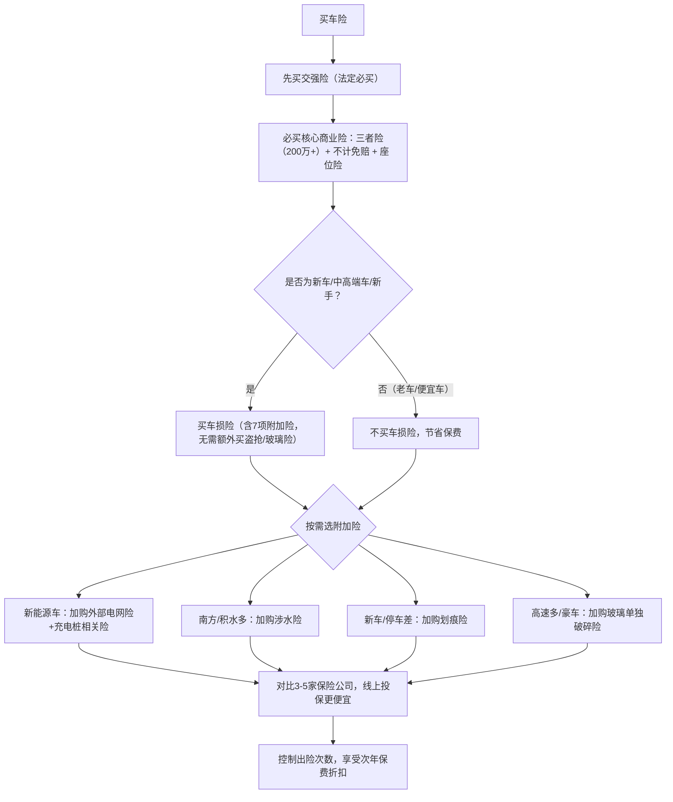

## 一、先分清：必买险种 vs 可选险种（省钱的第一步，不买多余的）

买车险的核心逻辑是：**必买险种不缺位，可选险种不盲目**。很多人花冤枉钱，就是因为分不清“刚需”和“鸡肋”，把所有险种都打包拿下，最后用不上反而亏了。

### 1. 必买险种（缺一不可，少买必亏）

- **交强险**：*法定强制险，不买不能上路*，核心保障第三方人员伤亡和财产损失。但额度较低（有责时死亡伤残18万、医疗费用1.8万、财产损失2000元），只能作为基础保障，无法覆盖大额风险，必须搭配商业险补充。

- **第三者责任险（三者险）**：**商业险核心，必买中的必买**！补充交强险的不足，赔偿第三方的人身伤亡和财产损失，是规避“撞豪车、出重伤人”巨额赔偿风险的关键。2026年市场数据显示，200万保额已成为家用车标配，一线城市或豪车建议直接拉满300万，保费差价仅100-200元，用一顿饭的钱撬动额外100万保障，性价比极高。

- **不计免赔险**：建议搭配车损险和三者险购买，花小钱省大钱。它能覆盖保险公司的免赔比例（通常20%），避免事故后自己还要掏腰包承担部分费用。注意：它不是“全赔险”，仍有绝对免赔额（通常1000元），需提前了解条款。

- **车上人员责任险（座位险）**：容易被忽略的刚需险。车损险和三者险都不覆盖本车人员伤亡，经常载家人、朋友的车主必买，建议每个座位保额不低于10万，保费不高，能应对突发的人员受伤风险。

### 2. 可选险种（按需取舍，不盲目跟风）

这类险种不是刚需，需结合自身车况、停车环境、驾驶场景判断，盲目购买只会浪费钱：

- **车损险**：新车、中高端车、新手建议买！2023年车险改革后，车损险已整合盗抢、自燃、涉水、玻璃单独破碎等7项原附加险，无需额外付费即可获得全面保障。但车龄超过6年、车价低于5万的老车，可考虑不买——自己修车的成本可能比每年的保费还低。

- **划痕险**：新车、停车环境差（路边停车、小区无监控）可考虑，保费通常几百元；老车没必要，小划痕自己修复更划算，频繁走划痕险还会导致次年保费上浮。

- **涉水险**：南方多雨、经常走积水路段建议买；北方干燥地区可忽略。重点提醒：**涉水后二次启动，保险公司不予赔偿**，遇到积水路段熄火后，务必等待救援，不要强行点火。

- **玻璃单独破碎险**：经常跑高速、国道，或车辆玻璃昂贵（豪车）可买；普通家用车没必要，飞石击碎玻璃的概率低，修复费用也不高，且车损险已覆盖“非单独破碎”的玻璃损失。

- **新能源车专属附加险**：电车车主重点关注！包括附加外部电网故障损失险（充电时电网故障致车辆损坏）、自用充电桩损失险、自用充电桩责任险，按需选择，避免传统车险无法覆盖的充电风险。

## 二、2026最新省钱技巧：这6点，每年能省几百上千

选对险种只是基础，掌握这些技巧，能在保障不缩水的前提下，进一步压缩保费，新手必看！

### 1. 多对比报价，不盲目跟风（最直接的省钱方法）

同一台车、同一套投保方案，不同保险公司报价差异可达几百元。建议：

- 锁定同一投保方案（比如“交强险+200万三者险+不计免赔+座位险”），对比3-5家主流保险公司（平安、人保、太平洋），避免因险种差异导致报价对比无意义。

- 优先选择线上渠道（保险公司官网、APP、小程序）投保，比线下4S店、中介便宜15%-30%，且无强制捆绑消费（比如4S店常强制捆绑保养、装潢）。

- 避开“车辆统筹”陷阱：近期市场上出现的“车辆安全统筹”不是保险，不受《保险法》保护，一旦对方无法赔付，车主可能面临理赔无门的风险，务必通过正规保险公司投保。

### 2. 控制出险次数，享受保费折扣（长期省钱关键）

车险保费与出险次数直接挂钩，不出险的“优质车主”能享受大幅折扣：

- 交强险：连续3年及以上未出险，部分地区可享最低6.5折优惠（6座以下家用车基础保费950元，折后仅617.5元）；出险1次恢复原价，出险2次及以上保费上浮。

- 商业险：连续1年不出险，保费可打8-9折；连续2年不出险，打7折左右；频繁出险（3次及以上），保费会大幅上浮，甚至被保险公司拒保。

- 小贴士：小刮小蹭（比如几百元能修好）尽量自己处理，不要出险，避免因小失大，导致次年保费上涨。

### 3. 选择合适保额，不买“超额保障”

保额越高，保费越贵，但不是越高越好，按需选择最划算：

- 三者险：农村/普通家用车（10万以内），100万保额足够；二三线城市，200万保额为基础；一线城市、中高端车、高频跑长途，建议300万+保额，避免出大事不够赔。

- 车损险：保额按车辆实际价值计算，不要按新车价算，避免多交保费（比如车龄3年、实际价值10万的车，按10万保额买即可）。

### 4. 利用优惠政策，薅保险公司“羊毛”

很多保险公司的优惠的政策，不主动问就会错过，重点关注这几点：

- 交强险+商业险一起买，多数保险公司会给商业险8折左右的折扣，还可能赠送加油卡、保养券等福利。

- 特殊人群/场景优惠：30-50岁、无不良驾驶记录的车主，保费更低；家庭多车投保、安装防盗设备（行车记录仪），可额外享受5%-20%的返点。

- 把握投保时间：车险到期前25-30天询价，这个时间段报价最低、活动最多，还能避免临时出错导致脱保。

### 5. 老车合理“减保”，避免浪费

车龄超过6年、车价低于5万的老车，可大幅精简险种：

推荐组合：**交强险+200万三者险+不计免赔+基础座位险**，取消车损险、划痕险等可选险种，每年能省几百元，保障核心风险不缺位。

### 6. 补充小额附加险，性价比拉满

有两个小额附加险，每年仅需几十元，却能避免大额损失，建议搭配购买：

- **医保外用药责任险**：覆盖超出医保目录的医疗费用，避免与第三方因高额医疗费产生纠纷，几十元就能撬动高额保障。

- **新能源车外部电网险**：电车车主专属，覆盖充电时因外部电网故障导致的车辆损坏，几十元就能规避充电风险。

## 三、常见误区：这4个坑千万别踩（踩了多花冤枉钱）

## 四、险种选择流程图（一看就懂，新手直接抄）

## 五、结尾总结

买车险的核心不是“买得越多越好”，也不是“买得越便宜越好”，而是**“按需搭配、合理取舍、对比报价”**。

对于大多数家用车车主，2026年最省钱、最实用的组合是：**交强险+200万三者险+不计免赔+基础座位险+医保外用药责任险**；新车/中高端车加买车损险；新能源车加购专属附加险。

记住以上技巧，既能获得足够的保障，又能每年省下几百上千元保费，再也不用为买车险犯愁！最后提醒大家，行车安全才是最根本的“省钱技巧”，不出险，才是真的省～