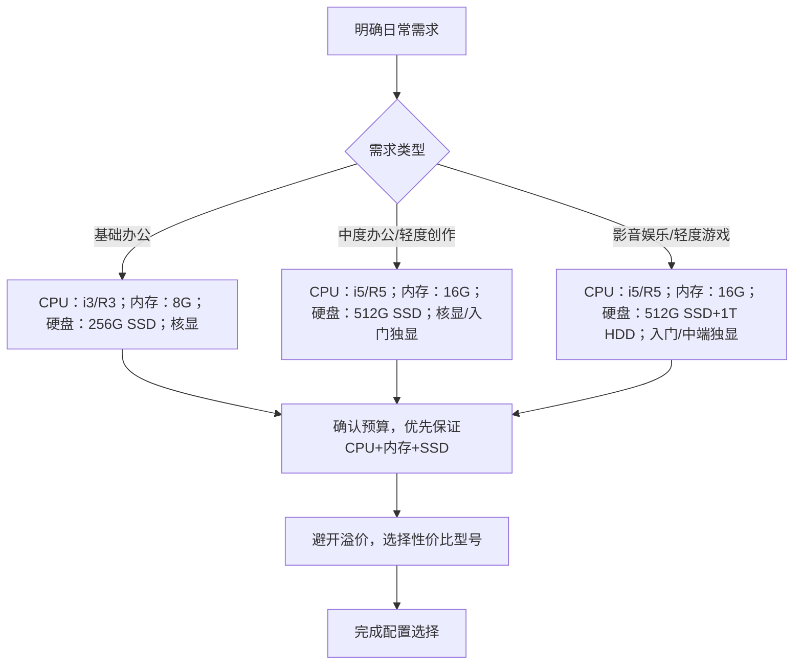

## 一、先明确：你的“日常需求”到底是什么？

选配置的第一步，不是看参数，而是先想清楚自己用电脑做什么——不同需求，对硬件的优先级完全不同。先给大家分个类，对号入座：

核心原则：**需求决定配置优先级**，办公党优先看CPU、内存；影音党优先看显示器、硬盘；轻度娱乐党再考虑显卡。

- **基础办公党**：主要用途是Word、Excel、PPT、浏览器、微信/QQ，偶尔看视频，无任何游戏需求（比如学生党、职场文职）。

- **中度办公党**：需要同时开多个网页、多个办公软件（比如做设计、写代码、做数据分析），偶尔剪辑短视频（10分钟内）。

- **影音娱乐党**：主要用电脑看4K视频、追剧、听音乐，偶尔玩轻度小游戏（比如《原神》低画质、《英雄联盟》）。

- **轻度创作党**：简单的图片修图（PS）、短视频剪辑（剪映），不做专业建模、不渲染大型视频。

明确需求后，我们再逐个拆解核心硬件——CPU、内存、硬盘、显卡、显示器，每个硬件都告诉你“日常需求该怎么选”。

## 二、核心硬件拆解：日常需求对应的配置选择

电脑的核心硬件就像“团队成员”，各自负责不同的工作，配合默契才能流畅运行。下面逐个讲清楚，小白也能快速get重点。

### 1. CPU：电脑的“大脑”，决定运行流畅度（最核心）

CPU（中央处理器）是电脑的核心，负责处理所有指令，日常办公、多任务运行的流畅度，全靠它。对于日常需求来说，**无需追求最新旗舰，中端型号完全够用**。

|需求类型|CPU选择建议（Intel/AMD）|核心要点|
|---|---|---|
|基础办公党|Intel i3、AMD R3（最新代）|4核8线程，足够应对基础办公、影音|
|中度办公/轻度创作|Intel i5、AMD R5（最新代）|6核12线程及以上，多任务无压力，支持轻度剪辑、修图|
|影音娱乐/重度轻度创作|Intel i7、AMD R7（最新代）|8核16线程，应对复杂多任务、高清剪辑更轻松|
补充：如果是笔记本，优先选“低压U”（后缀带U，比如i5-1340U），续航更长；台式机可以选“标压U”（后缀带F，比如i5-13400F），性能更强。

### 2. 内存：电脑的“工作台”，决定多任务能力

内存（RAM）相当于电脑的“临时工作台”，你打开的网页、办公软件、游戏，都会暂时存放在这里。内存越小，“工作台”越挤，多任务运行就会卡顿。

**日常需求的内存选择，记住两个数字：8G保底，16G够用**，具体看需求：

- **基础办公党**：8G内存（足够开3-5个网页+办公软件，无压力）；如果经常开多个网页，建议直接上16G。

- **中度办公/影音娱乐/轻度创作**：16G内存（必选），能同时开10+网页、多个办公软件，甚至能流畅运行轻度游戏、剪映基础剪辑。

- **重度轻度创作（比如多轨道剪辑、PS大文件）**：32G内存（可选），避免处理大文件时卡顿。

避坑提醒：内存分为“DDR4”和“DDR5”，DDR5比DDR4更快，但日常使用中差距不明显，预算有限的话，DDR4完全够用，不用强行追求DDR5。

### 3. 硬盘：电脑的“仓库”，决定存储速度和容量

硬盘负责存储你的文件、软件、系统，分为两种：**SSD（固态硬盘）**和**HDD（机械硬盘）**，日常使用优先选SSD，体验差距巨大。

简单说：SSD速度快，开机、打开软件、加载文件秒开；HDD速度慢，但容量大、价格便宜，适合存大量视频、文件。

|需求类型|硬盘选择建议|核心要点|
|---|---|---|
|基础办公党|256G SSD（保底）|足够装系统、办公软件、少量文件，开机10秒内|
|中度办公/轻度创作|512G SSD（必选）|能装更多软件、缓存视频、存放设计/剪辑文件|
|影音娱乐/重度存储|512G SSD + 1T HDD|SSD装系统和常用软件，HDD存大量视频、游戏安装包|
### 4. 显卡：电脑的“图形处理器”，按需选择即可

显卡负责处理图像、视频，日常需求中，大部分人不需要独立显卡（核显足够），只有涉及游戏、专业设计时，才需要单独考虑。

- **基础办公/影音党**：**核显**（CPU自带，无需独立显卡），足够看视频、办公、开网页，甚至能应对简单的PS修图。

- **轻度娱乐党**：入门级独立显卡（比如NVIDIA MX550、AMD R5 M550），能流畅运行《英雄联盟》《原神》低-中画质。

- **轻度创作党**：中端独立显卡（比如NVIDIA RTX 3050、AMD RX 6500 XT），支持PS加速、剪映渲染，应对短视频剪辑无压力。

### 5. 显示器：视觉体验的关键，细节别忽略

显示器的体验直接影响日常使用感受，尤其是经常看视频、做设计的人，别只看尺寸，还要关注这两个参数：

- **分辨率**：日常办公/影音，1080P（1920×1080）足够；做设计、看4K视频，建议选2K（2560×1440），画面更清晰。

- **刷新率**：普通办公/影音，60Hz足够；轻度游戏、追求流畅体验，建议选144Hz，画面无拖影。

补充：笔记本屏幕建议选14英寸（便携）或15.6英寸（视野舒适）；台式机可根据桌面空间选择24-27英寸。

## 三、配置选择流程图：小白直接对号入座

怕记不住？给大家整理了一个简单的流程图，跟着走，就能快速确定自己的配置需求：

## 四、小白避坑指南：这3个错误别犯

很多小白买电脑，容易被商家忽悠，花了冤枉钱，记住这3个避坑点：

1. **不盲目追求“顶配”**：日常使用中，i5/R5+16G+512G SSD的组合，已经能满足90%的人的需求，顶配不仅贵，还用不上。

2. **不忽视“兼容性”**：台式机组装时，注意CPU和主板的接口匹配（比如Intel CPU配Intel主板，AMD CPU配AMD主板），避免买错装不上。

3. **不被“噱头”迷惑**：商家宣传的“游戏本”“设计本”，可能配置一般但价格偏高，重点看核心参数（CPU、内存、硬盘、显卡），而非宣传话术。

## 五、总结：日常需求配置推荐（2026年参考）

最后给大家整理了不同需求的配置推荐，预算从3000-6000元，覆盖大部分人的日常使用，可直接参考：

- **基础办公（3000-4000元）**：CPU i3-14100F/R3-7320U，内存8G DDR4，硬盘256G SSD，核显，1080P 60Hz显示器（笔记本/台式机均可）。

- **中度办公/轻度创作（4000-5000元）**：CPU i5-14400F/R5-7535U，内存16G DDR4，硬盘512G SSD，核显/MX550独显，1080P 60Hz显示器。

- **影音娱乐/轻度游戏（5000-6000元）**：CPU i5-14500F/R5-7600，内存16G DDR5，硬盘512G SSD+1T HDD，RTX 3050独显，144Hz 1080P显示器。

其实选电脑配置，核心就是“按需匹配”——你不需要用办公本的预算买游戏本，也不需要用游戏本的配置只用来办公。抓住CPU、内存、硬盘这三个核心，再根据自己的需求补充显卡、显示器，就能选到一台性价比高、用着流畅的电脑。

如果还是不确定自己该选什么配置，评论区留下你的需求（用途+预算），帮你精准推荐～