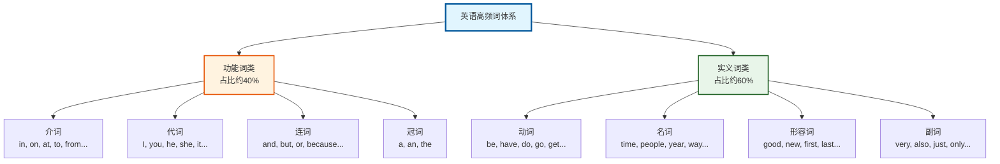
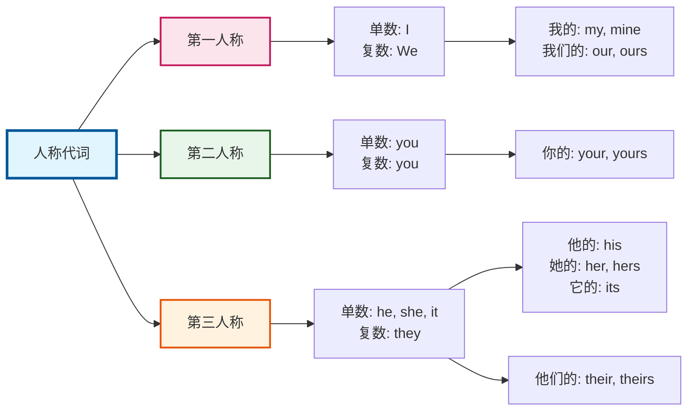
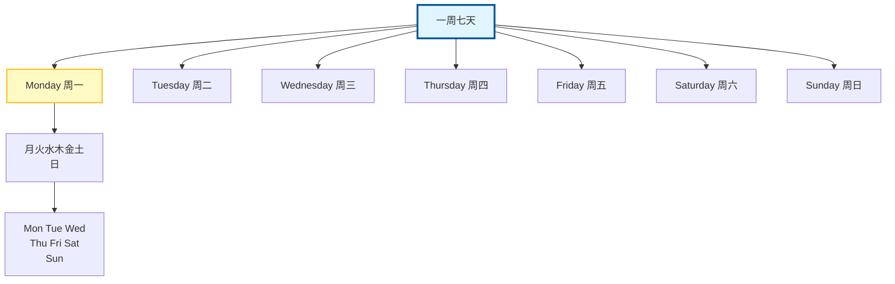
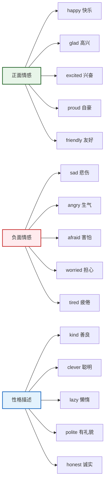
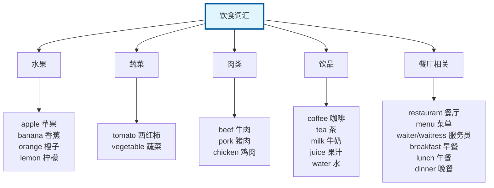
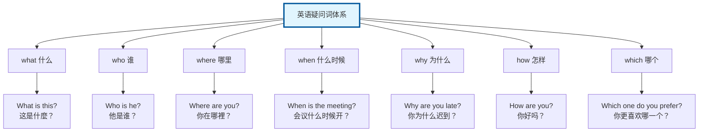

## 一、什么是高频词？为什么必须掌握它们？

你有没有想过：**为什么有些人英语说得那么溜，而你背了那么多单词却还是开不了口？** 答案很可能就在于——你背的单词不够“接地气”。

### 1.1 高频词的核心概念

**高频词**（High-frequency Words）指的是在日常生活、工作、学习中使用频率最高的词汇。根据语言学研究，**掌握1000个最常用的英语单词，就能覆盖约80%-85%的日常对话内容**。这意味着什么？意味着你不需要背完整本词典，只需要搞定这1000个词，就能基本实现英语自由交流！

### 1.2 高频词的分布规律

这1000个高频词有一个非常有意思的特点：**它们大多是“简单词”**。没错，就是那些你一眼看上去觉得“太简单了”的词——**the、is、and、to、have、I、you、it** 等等。这些词虽然简单，但它们是英语的“骨架”，支撑着整个语言体系的运转。




## 二、高频词词性分类速查表

在正式开始学习之前，我们先来了解一下英语的词性分类。这样你在遇到陌生单词时，就能快速判断它的“身份”，理解起来也更轻松。

| 词性 | 缩写 | 中文名称 | 核心功能 | 常见 examples |
|:---:|:---:|:---:|:---|:---|
| **noun** | n. | 名词 | 表示人、事物、地点或概念 | apple, happiness, China |
| **adjective** | adj. | 形容词 | 描述名词的特征 | beautiful, happy, difficult |
| **verb** | v. | 动词 | 表示动作或状态 | go, think, become |
| **adverb** | adv. | 副词 | 修饰动词、形容词或其他副词 | very, always, quickly |
| **preposition** | prep. | 介词 | 表示词与词之间的关系 | in, on, at, with |
| **conjunction** | conj. | 连词 | 连接词、短语或句子 | and, but, or, because |
| **pronoun** | pron. | 代词 | 替代名词 | I, you, he, them |

## 三、核心高频词分类详解与学习策略

接下来，我将这1000个高频词按照使用场景和功能进行分类，帮助你**系统化、结构化**地记忆。每个类别都会附上学习技巧和记忆方法，建议先通读一遍，再根据自己薄弱的部分重点突破。

### 3.1 社交与日常交流词汇——让你“会说不会慌”

**这一类词是日常对话的基石**，包括问候、介绍、表达感情等场景的核心词汇。

**核心词汇表**：

| 单词 | 词性 | 含义 | 记忆技巧 |
|:---|:---:|:---|:---|
| **hello** | int. | 嗨、喂 | 最常用的打招呼用语 |
| **hi** | int. | 嗨 | 比hello更随意 |
| **goodbye** | int. | 再见 | good + bye |
| **please** | vt. | 请 | 请求时的magic word |
| **thank you** | phr. | 谢谢 | 必备礼貌用语 |
| **sorry** | adj. | 抱歉的 | 道歉时必备 |
| **welcome** | vt./adj. | 欢迎 | You're welcome! |
| **excuse me** | phr. | 打扰一下 | 引起注意的礼貌表达 |
| **congratulations** | n. | 祝贺 | 恭喜别人时使用 |

**学习策略**：这些词的特点是——**短小、使用频率极高、几乎没有难度**。但正因为简单，很多人容易忽视它们的**地道用法**。比如 “Excuse me" 和 "Sorry” 的使用场景是不同的：excuse me 用于引起注意，sorry 用于道歉。


### 3.2 人称代词与关系词汇——搞定“人”的表达

**代词**是英语中替代名词的神器，用得好能让你的表达更加简洁流畅。

**人称代词体系**：



**家庭关系词汇**：

| 单词 | 含义 | 扩展词汇 |
|:---|:---|:---|
| **family** | 家庭 | - |
| **father / dad** | 父亲 | grandfather 祖父 |
| **mother / mom** | 母亲 | grandmother 祖母 |
| **brother** | 兄弟 | sister 姐妹 |
| **son / daughter** | 儿子/女儿 | - |
| **husband / wife** | 丈夫/妻子 | - |
| **uncle / aunt** | 叔舅/姑姨 | cousin 表/堂兄弟姐妹 |


### 3.3 时间与数字——时间管理必备词汇

时间类词汇和数字是**不管学什么语言都必须掌握的基础**。英语的时间表达方式与中文有较大差异，需要特别注意。

**时间相关词汇**：

| 单词 | 含义 | 补充 |
|:---|:---|:---|
| **today** | 今天 | tonight 今晚 |
| **yesterday** | 昨天 | - |
| **tomorrow** | 明天 | - |
| **morning** | 早晨/上午 | - |
| **afternoon** | 下午 | - |
| **evening** | 傍晚 | - |
| **night** | 夜晚 | - |
| **week** | 周 | weekend 周末 |
| **month** | 月 | - |
| **year** | 年 | birthday 生日 |
| **hour** | 小时 | o'clock 点钟 |

**星期几**：



**月份词汇**：

| 单词 | 含义 | 缩写 |
|:---|:---|:---|
| **January** | 一月 | Jan. |
| **February** | 二月 | Feb. |
| **March** | 三月 | Mar. |
| **April** | 四月 | Apr. |
| **May** | 五月 | - |
| **June** | 六月 | Jun. |
| **July** | 七月 | Jul. |
| **August** | 八月 | Aug. |
| **September** | 九月 | Sep. |
| **October** | 十月 | Oct. |
| **November** | 十一月 | Nov. |
| **December** | 十二月 | Dec. |

**基数词（1-20）**：

```
1 one / 2 two / 3 three / 4 four / 5 five
6 six / 7 seven / 8 eight / 9 nine / 10 ten
11 eleven / 12 twelve / 13 thirteen / 14 fourteen / 15 fifteen
16 sixteen / 17 seventeen / 18 eighteen / 19 nineteen / 20 twenty
```

**序数词**：

```
1st first / 2nd second / 3rd third / 4th fourth / 5th fifth
6th sixth / 7th seventh / 8th eighth / 9th ninth / 10th tenth
```


### 3.4 动词——英语句子的“发动机”

**动词是句子的核心**，一个句子可以没有形容词、没有副词，但绝对不能没有动词。英语中的高频动词数量不多，但它们往往有**多种用法**，需要重点攻破。

**最核心的20个高频动词**：

| 单词 | 基本含义 | 核心用法 |
|:---|:---|:---|
| **be** | 是/存在 | is, am, are, was, were, been |
| **have** | 有 | have/has/had |
| **do** | 做 | 动作动词，也用于疑问句 |
| **go** | 去 | 去往某地，也用于进行时 |
| **get** | 得到/到达 | 超级百搭词！ |
| **make** | 制作/使得 | make + 宾语 + 补语 |
| **say** | 说 | say something |
| **take** | 拿/采取 | take a photo |
| **come** | 来 | come from |
| **see** | 看见 | see a movie |
| **know** | 知道 | know the truth |
| **think** | 想/认为 | I think so |
| **give** | 给 | give a gift |
| **tell** | 告诉 | tell a story |
| **become** | 成为 | become a doctor |
| **leave** | 离开 | leave for |
| **put** | 放 | put on |
| **keep** | 保持 | keep quiet |
| **let** | 让 | let me see |
| **begin** | 开始 | begin to do |

**高频动词词组（Phrasal Verbs）**：

```mermaid
graph TD
    A["get系列动词短语"] --> A1["get up 起床"]
    A --> A2["get on 上车"]
    A --> A3["get off 下车"]
    A --> A4["get along 相处"]
    A --> A5["get ready 准备"]
    A --> A6["get lost 迷路"]

    B["put系列动词短语"] --> B1["put on 穿上"]
    B --> B2["put off 推迟"]
    B --> B3["put away 收好"]
    B --> B4["put out 熄灭"]

    C["come系列动词短语"] --> C1["come from 来自"]
    C --> C2["come in 进入"]
    C --> C3["come back 回来"]
    C --> C4["come true 实现"]

    style A fill:#e1f5fe,stroke:#01579b,stroke-width:3px
    style B fill:#fce4ec,stroke:#c2185b,stroke-width:2px
    style C fill:#e8f5e9,stroke:#1b5e20,stroke-width:2px
```




### 3.5 形容词——让表达更“精准”

形容词的作用是**修饰名词，让描述更具体、更生动**。英语中有很多“颜值”很高的形容词，学会了它们，你的英语表达立刻会上一个台阶。

**描述外观与感受**：

| 单词 | 含义 | 记忆法 |
|:---|:---|:---|
| **beautiful** | 美丽的 | 音译“碧欧忒肤”→美丽的 |
| **ugly** | 丑陋的 | 对比 beautiful |
| **pretty** | 漂亮的 | 女生说pretty |
| **handsome** | 英俊的 | 男生说handsome |
| **good** | 好的 | 基础词 |
| **bad** | 坏的 | 基础词 |
| **nice** | 美好的 | 友好的 |
| **wonderful** | 精彩的 | won+der+ful |
| **great** | 伟大的 | 口语常用 |
| **excellent** | 卓越的 | 赞美极高水平 |

**描述大小与数量**：

| 单词 | 含义 | 记忆法 |
|:---|:---|:---|
| **big / large** | 大的 | big更口语，large更正式 |
| **small / little** | 小的 | small指尺寸，little带感情色彩 |
| **huge** | 巨大的 | 比big更大 |
| **tiny** | 微小的 | 极小的 |
| **old** | 老的/旧的 | 反义词是 new |
| **young** | 年轻的 | 反义词是 old |
| **long** | 长的 | 反义词是 short |
| **wide** | 宽的 | 反义词是 narrow |
| **high** | 高的 | 反义词是 low |
| **deep** | 深的 | 反义词是 shallow |

**描述性格与情感**：



### 3.6 介词——英语的“黏合剂”

**介词是英语中最难掌握的一类词**，因为它们的用法非常灵活，往往不能一对一翻译。英语母语者使用介词靠的是**语感和大量输入**，但对于我们学习者，还是有一些规律可循的。

**最核心的介词及其用法**：

| 介词 | 核心含义 | 典型搭配 |
|:---|:---|:---|
| **in** | 在...里面 | in the room, in China, in the morning |
| **on** | 在...上面 | on the table, on the wall, on Monday |
| **at** | 在...（小地点） | at school, at home, at 7 o'clock |
| **to** | 到、向 | go to school, give to |
| **from** | 从... | come from China |
| **of** | ...的 | a book of mine |
| **for** | 为了... | for you, for example |
| **with** | 和...一起 | with me, with a smile |
| **without** | 没有... | without you |
| **about** | 关于... | think about |
| **into** | 进入... | come into |
| **out of** | 从...出来 | go out of |

**介词思维 vs 中文思维**：


- ❌ 错误：I am in the school.（除非你在学校里面）
- ✅ 正确：I am at school.（表示“上学”或“在学校”）

- ❌ 错误：I will call you in the phone.
- ✅ 正确：I will call you **on** the phone.

- ❌ 错误：I arrived at Shanghai yesterday.
- ✅ 正确：I arrived **in** Shanghai yesterday.（大城市用in）


### 3.7 常见场景词汇——出门在外的“ survival kit”

**出行、购物、吃饭、运动**——这些生活场景的词汇，你不需要背太多，但每一个都必须是**高频、实用**的。

**交通出行**：

| 单词 | 含义 | 补充 |
|:---|:---|:---|
| **car** | 汽车 | bus 公交车 |
| **taxi** | 出租车 | - |
| **train** | 火车 | railway 铁路 |
| **plane / airplane** | 飞机 | airport 机场 |
| **ship** | 船 | - |
| **bike / bicycle** | 自行车 | - |
| **road** | 公路 | street 街道 |
| **way** | 路/方式 | on the way 在路上 |

**购物与金钱**：

| 单词 | 含义 | 记忆法 |
|:---|:---|:---|
| **shop / store** | 商店 | shop英式，store美式 |
| **buy** | 买 | 反义词 sell |
| **sell** | 卖 | - |
| **price** | 价格 | - |
| **money** | 钱 | dollar 美元 |
| **cheap** | 便宜的 | expensive 贵的 |
| **pay** | 支付 | payment 付款 |
| **cost** | 花费 | It costs... |

**食物与餐厅**：



**运动与休闲**：

| 单词 | 含义 | 场景 |
|:---|:---|:---|
| **sport** | 运动 | football, basketball |
| **game** | 游戏/比赛 | - |
| **play** | 玩/打（球） | play basketball |
| **swim** | 游泳 | go swimming |
| **dance** | 跳舞 | - |
| **music** | 音乐 | listen to music |
| **movie** | 电影 | go to movies |
| **book** | 书 | read a book |

### 3.8 方位与空间词汇——搞定“在哪里”

方位词是描述**位置和方向**的词汇，在日常对话中使用频率极高。

**基本方位词**：

| 单词 | 含义 | 记忆法 |
|:---|:---|:---|
| **up** | 向上 | 往高处 |
| **down** | 向下 | 往低处 |
| **in** | 里面 | 在内部 |
| **out** | 外面 | 在外部 |
| **front** | 前面 | in front of |
| **back** | 后面 | at the back |
| **left** | 左边 | left side |
| **right** | 右边 | right side |
| **near** | 附近 | 距离近 |
| **far** | 远 | 距离远 |

**方位介词组合**：

```
in front of 在...前面
behind 在...后面
next to / beside 在...旁边
between 在...之间（两者）
among 在...之间（多者）
around 在...周围
above 在...上方
below 在...下方
```


### 3.9 疑问词——打开话匣子的钥匙

**疑问词**是提出问题、获取信息的关键。英语的疑问词系统非常清晰，学会它们，你就能**问遍天下无敌手**。



**how 的组合拳**：

| 组合 | 含义 | 例句 |
|:---|:---|:---|
| **how many** | 多少（可数） | How many books do you have? |
| **how much** | 多少（不可数） | How much money do you have? |
| **how old** | 几岁 | How old are you? |
| **how long** | 多长/多久 | How long have you been here? |
| **how often** | 频率 | How often do you exercise? |
| **how far** | 多远 | How far is it from here? |

### 3.10 常用连词——让句子“粘”在一起

**连词**的作用是**连接单词、短语或句子**，让表达更流畅、逻辑更清晰。

**并列连词**：

| 连词 | 含义 | 用法 |
|:---|:---|:---|
| **and** | 和/而且 | 连接并列成分 |
| **but** | 但是 | 表转折 |
| **or** | 或者 | 表选择 |
| **so** | 所以 | 表结果 |
| **yet** | 然而 | 表转折 |

**从属连词**：

| 连词 | 含义 | 例句 |
|:---|:---|:---|
| **because** | 因为 | I didn't go out because it rained. |
| **although / though** | 虽然 | Although it rained, I went out. |
| **if** | 如果 | If you need help, call me. |
| **when** | 当...时候 | Call me when you arrive. |
| **before** | 在...之前 | Finish it before you leave. |
| **after** | 在...之后 | Call me after you finish. |
| **since** | 自从 | I have lived here since 2020. |
| **until** | 直到 | Wait until I come back. |


## 四、高频词学习路线图——30天突破计划

光看不练假把式！下面给大家一个**系统化的学习方案**，帮助你在30天内搞定这1000个高频词。

### 第一阶段：Week 1-2 词汇扫盲（每日50词）

**目标**：快速过完第一遍，混个“脸熟”

**方法**：
1. **每天50个词**，快速浏览中英文含义
2. **只记核心意思**，不深究用法
3. **配合音频**，形成语音记忆
4. **遮住中文说英文**，遮住英文说中文

**重点词汇**：**be, have, do, go, get, make, say, take, come, see, know, think, give, tell, find, tell** ——这15个动词是**必须倒背如流**的！

### 第二阶段：Week 3 词性归类（按类别记忆）

**方法**：把词汇按照**名词、动词、形容词、介词**分类记忆

**技巧**：**名词记“物品”，动词记“动作”，形容词记“特征”，介词记“关系”**

### 第三阶段：Week 4 场景实战（场景化学习）

| 场景 | 核心词汇 |
|:---|:---|
| **自我介绍** | I, am, from, name, years old |
| **日常作息** | wake up, have breakfast, go to school, lunch, dinner, sleep |
| **购物** | buy, price, money, cheap, expensive, size |
| **问路** | where, near, far, left, right, turn |
| **打电话** | call, phone, number, speak, hold on |
| **餐厅点餐** | menu, order, bill, delicious, waiter |

## 五、常见问题与解决方案

### Q1: 背了又忘怎么办？

**这是正常的！** 遗忘是记忆的必然过程。解决方法：

- **间隔重复**：使用Anki等间隔复习软件
- **语境记忆**：把单词放在句子中记忆
- **多次见面**：一个单词至少在不同场景见7次才能记住

### Q2: 单词认识了但说不出来怎么办？

**问题在于**：你只进行了**被动记忆**，没有进行**主动输出**。

**解决方法**：
- **跟读音频**：shadowing（影子跟读法）
- **自言自语**：用英语描述自己正在做的事情
- **写日记**：每天用英语写3-5句话

### Q3: 发音不标准怎么办？

**解决方法**：
- **先听后说**：多听native speaker的发音
- **查词典**：看音标，注意重音
- **对比听**：把自己的发音录下来对比

## 六、总结与行动建议

### 核心要点回顾


### 行动清单

- [ ] 收藏本文，每天复习一个类别
- [ ] 下载一个背单词App，设定每日目标
- [ ] 开始用英语描述你的一天
- [ ] 找到一个英语学习伙伴，互相监督
- [ ] 30天后回来检验成果！

---

**学习是一个输入+输出的循环过程**。背单词只是第一步，真正掌握它们需要**大量的听说读写练习**。希望这篇文章能成为你英语学习路上的一个小帮手。

**最后送大家一句话**：


**现在开始，永远不晚。加油！** 🚀

---

*本文基于「1000个高频英语单词」整理*